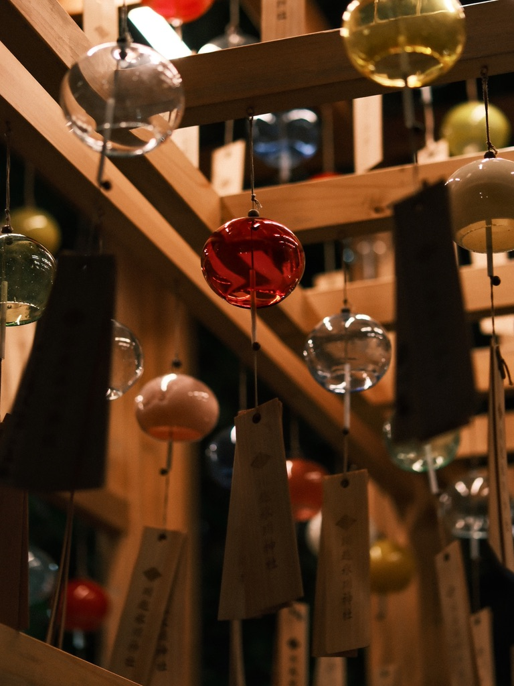

<i>Photo by <a href="https://glass.photo/nitaking">Satoshi Nitawaki</a> on <a href="https://glass.photo/nitaking/3WXz2eDN8v7nlixY4quSiU">Glass</a></i>

昔から記録することが好きでした。印象的な思い出は、10歳くらいのときに実家にあるデジタルカメラで、夜ふかし後の朝日を撮ったことです。はじめて見た景色を残せることに興奮したことを覚えています。

それからというもの、携帯電話のカメラを使いながらすべての瞬間を記録することに夢中になりました。

「記録」が僕にとっての中心だったので、うまく撮る知識や素晴らしい機材を求めていませんでした。
とはいえ、ガジェットは好きだったので、2022年頃に Sony α6400 を買ったりしていました。なぜこの機種を買ったのかは覚えていませんが、RAW+JPEGで撮影しつつも、あまりいい撮影体験を得ていませんでした。いい道具を持っているが、活用方法を知らず、持ち運ぶ機会が少なく、結局のところ、「撮りたいタイミングでカメラを持っていない」ことが多く、ミラーレスカメラを一度挫折しました。

2023年頃、フォローしているInstagramの [yuzuko.jp](https://www.instagram.com/yuzuco.jp/) さんが[[GR IIIx]]を使っているのを見て、購入。常にカバンに入れておけるカメラを手に入れてから、一番最初に楽しいと感じた撮影体験を取り戻したのか、カメラ片手に友達とフォトウォークに行くことも増えてきました。

そうするとカメラガチ勢の友人と撮るわけで、本格的なカメラが欲しくなり、[[X-H2]]の購入をしたのが2024年。今度は挫折することなく、おもちゃであり、インプットの楽しみがあり、アウトプットの楽しみがあるPhotographyを楽しむ毎日を過ごしています。

妻と猫（テト）、友人たち、そして撮る自分、みんなの瞬間を残していけたらな、と思っています。

---

- [Glass](https://glass.photo/nitaking): 大好きなサービス
- [Unsplash](https://unsplash.com/ja/@sa_nitawaki): これから投稿していきたい
- [Instagram](https://www.instagram.com/nitastagram_photo/) 