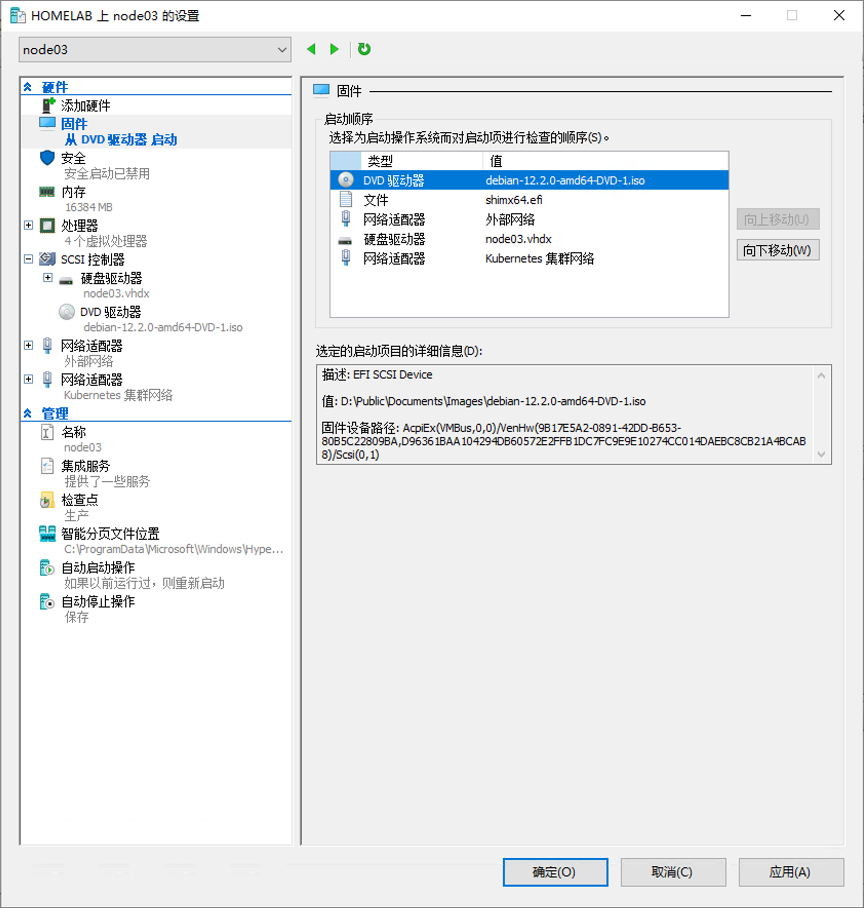
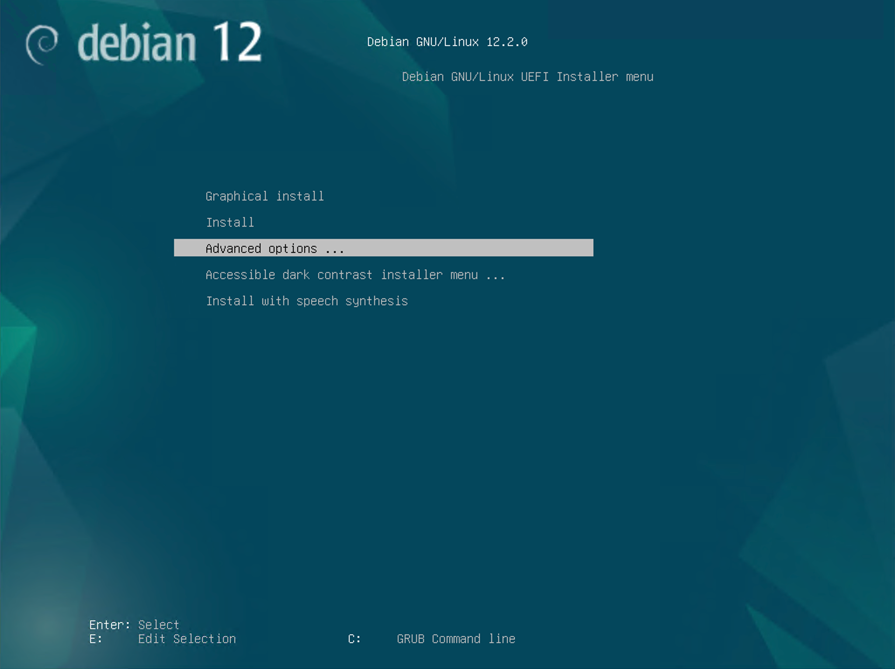
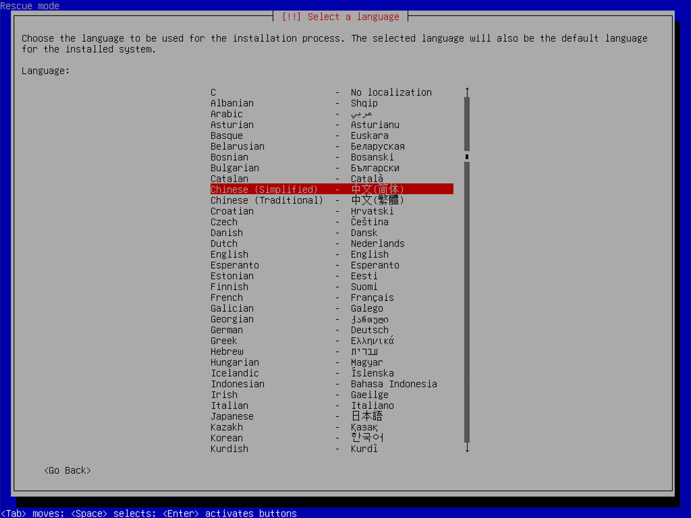
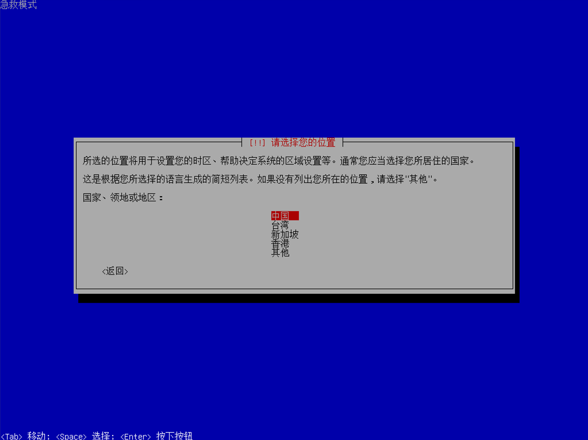
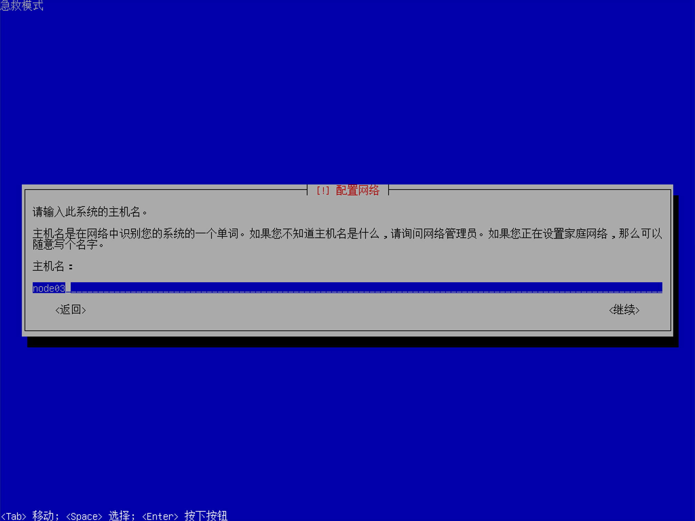
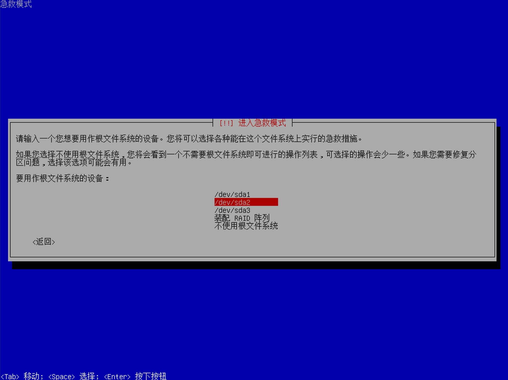
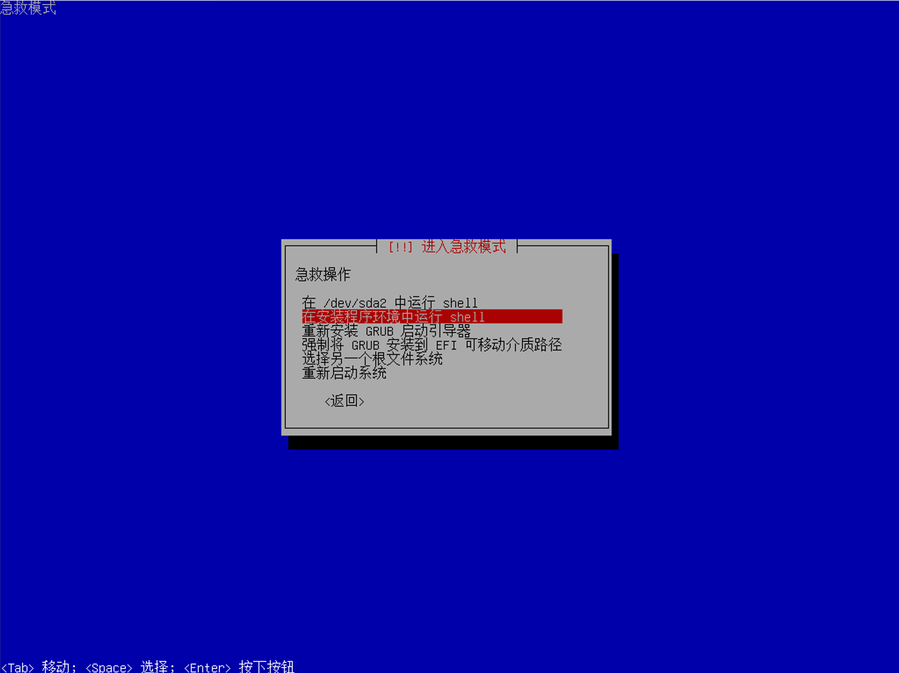
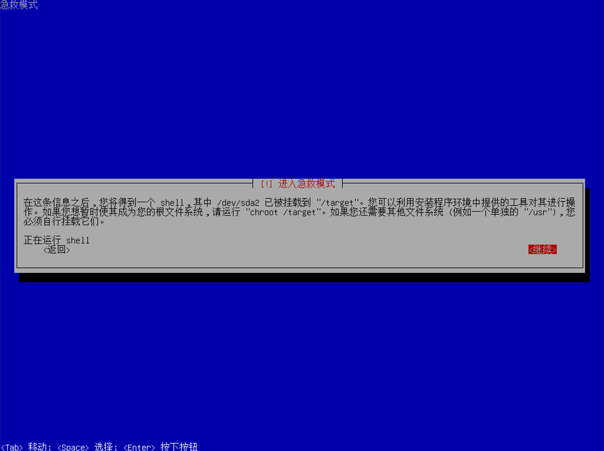
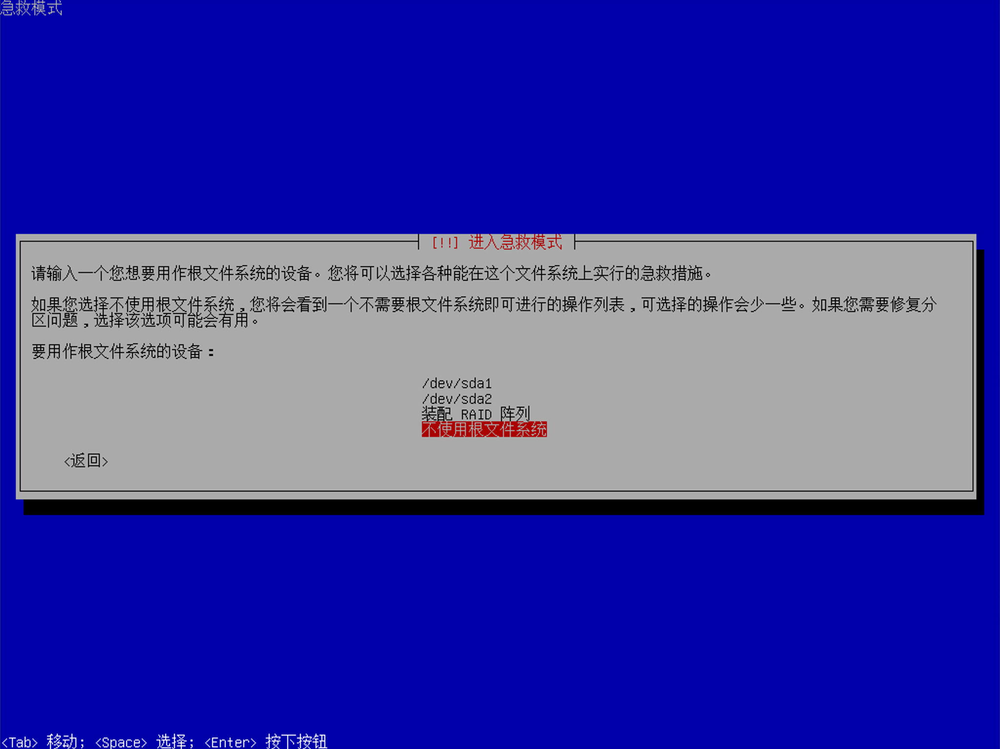
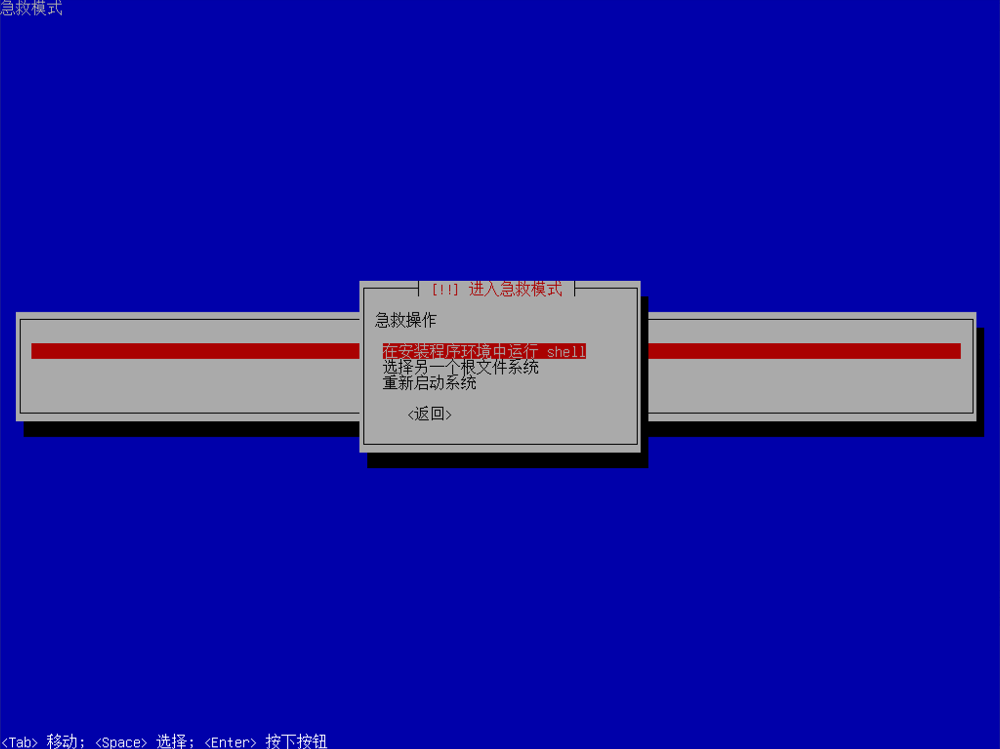

---
tags:
  - 软件/虚拟机/Hyper-V
  - 操作系统/Windows
  - 操作系统/Windows-Server
  - 操作系统/Debian/Debian-12
  - 操作系统/Debian
  - 操作系统/BIOS
  - 操作系统/BIOS/引导
  - 软件/虚拟机
  - 操作系统/文件系统
  - 运维/内核
  - 操作系统/LiveCD
---
# 通过 Hyper-V 进入 Debian 12 LiveCD 自带的 Rescue Mode（急救模式）

## 配置 Hyper-V

1. 前往 Hyper-V 的控制面板，添加一个新的 DVD 驱动器设备，选择期望启动的 LiveCD 的 `iso` 文件。
2. 在 Hyper-V 虚拟机设置的左侧面板中，选定「固件」来配置 BIOS 引导顺序。将 LiveCD 置于最优先的位置。

3. 点击确认保存，然后启动虚拟机。
## 进入 Rescue Mode（急救模式）

启动之后，可以看到这样的界面。

由于我们不进行安装操作，此处通过 <kbd data-keyboard-key="up-arrow">上</kbd> 和 <kbd data-keyboard-key="down-arrow">下</kbd> 导航直接前往「Advanced options...（高级选项...）」菜单中，然后用 <kbd data-keyboard-key="enter">Enter</kbd> 或者 <kbd data-keyboard-key="enter">回车</kbd> 键，或者 <kbd data-keyboard-key="right-arrow">右</kbd> 进行「确认」操作：

接下来通过 <kbd data-keyboard-key="up-arrow">上</kbd> 和 <kbd data-keyboard-key="down-arrow">下</kbd> 导航直接前往「... Rescue mode（急救模式）」选项，然后用 <kbd data-keyboard-key="enter">Enter</kbd> 或者 <kbd data-keyboard-key="enter">回车</kbd> 键，或者 <kbd data-keyboard-key="right-arrow">右</kbd> 进行「确认」操作：

> [!TIP]
>
> 如果不喜欢用下面章节的截图中通过命令行绘制的 UI 去配置 Rescue Mode（急救模式），可以通过 <kbd data-keyboard-key="up-arrow">上</kbd> 和 <kbd data-keyboard-key="down-arrow">下</kbd> 导航直接前往「... Graphical Rescue mode（图形化急救模式）」选项，然后用 <kbd data-keyboard-key="enter">Enter</kbd> 或者 <kbd data-keyboard-key="enter">回车</kbd> 键，或者 <kbd data-keyboard-key="right-arrow">右</kbd> 进行「确认」以进入到「Graphical Rescue mode（图形化急救模式）」中，在图形化界面中，可以使用鼠标进行操作和导航，对于小白用户而言体验会好很多。

## 配置 Rescue Mode（急救模式）

和以往安装操作系统一样，我们需要配置一下语言，地区，时区，因为我居住在上海，这里需要选择「Chinese (Simplified) - 中文（简体）」才可以配置中国时区，所以通过 <kbd data-keyboard-key="up-arrow">上</kbd> 和 <kbd data-keyboard-key="down-arrow">下</kbd> 导航选择「Chinese (Simplified) - 中文（简体）」用 <kbd data-keyboard-key="enter">Enter</kbd> 或者 <kbd data-keyboard-key="enter">回车</kbd> 键进行「确认」操作。

选择「中国」：

选择「汉语」

我在 Hyper-V 中给这台设备配置了两个网卡，所以这里会出现额外的网络配置选项，可以选择有网络的接口作为主要的接口，这里我选择 `eth0`：

然后会提示输入主机名称：

然后会提示输入域名，一般情况下，直接填写 `lan` 就好了：

接下来，因为我们需要对硬盘进行配置，因此我们不希望使用任何的根文件系统，选择「不使用根文件系统」即可：

> [!TIP] 什么情况下我会需要根文件系统？
>
> 比如需要直接操作硬盘中的文件的时候，假设自己错误配置了 `/etc/fstab` ，或者是错误配置了 `grub` ，甚至是内核相关的参数，都可以通过挂载硬盘作为「根文件系统」的形式去操作。

挂载之后，你依然可以选择使用 LiveCD 中的内核和环境作为主要的 shell 环境，而非选定的硬盘内装载的系统。避免造成环境污染。

一般而言，挂载硬盘设备之后，可以选择将目标硬盘挂载为 `/target` 目录，然后依然使用 LiveCD 中的内核和环境去进行操作 `/target` 目录中的文件，这样就不用担心会出现完全没有救援措施的情况了。

然后选择「在安装程序环境中运行 shell」就可以启动了：

最后确认一下即可：

