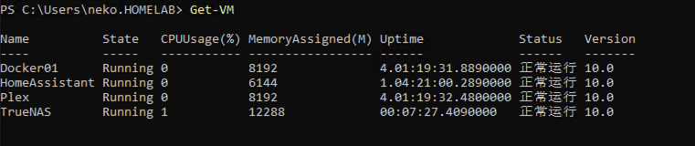

---
tags:
  - 操作系统/Windows
  - 软件/虚拟机/Hyper-V
  - 命令行/Powershell
  - 操作系统/Windows-Server
  - 计算机/计算机科学/CS/虚拟化
---

# Hyper-V 激活嵌套虚拟化

### 文档兼容性

| 主体 | 版本号 | 文档地址（如果有） |
| -- | -- | -- |
| Windows Server | 2022 Datacenter |  |
| Hyper-V | v10 |  |

## 说明

### 获取虚拟机列表

```powershell
Get-VM
```



### 停止需要更新的虚拟机

```powershell
Stop-VM -Name '<虚拟机名称>'
```

### 如果不是最新版本的 Hyper-V 虚拟机版本，则更新虚拟机版本

```powershell
Update-VMVersion -Name '<虚拟机名称>'
```

### 设定虚拟机处理器的虚拟化拓展

```powershell
Set-VMProcessor -VMName '<虚拟机名称>' -ExposeVirtualizationExtensions $True
```

### 开启完成更新的虚拟机

```powershell
Start-VM -Name '<虚拟机名称>'
```

### 验证是否完成配置

```powershell
(Get-VM '<虚拟机名称>' | Get-VMProcessor ).ExposeVirtualizationExtensions
```

## 延伸阅读

 [How to Enable Nested Virtualization in Hyper-V - Petri IT Knowledgebase](https://petri.com/how-to-enable-nested-virtualization-in-hyper-v/)
 [Virtualization not supported? : truenas](https://www.reddit.com/r/truenas/comments/rz48uq/virtualization_not_supported/)
