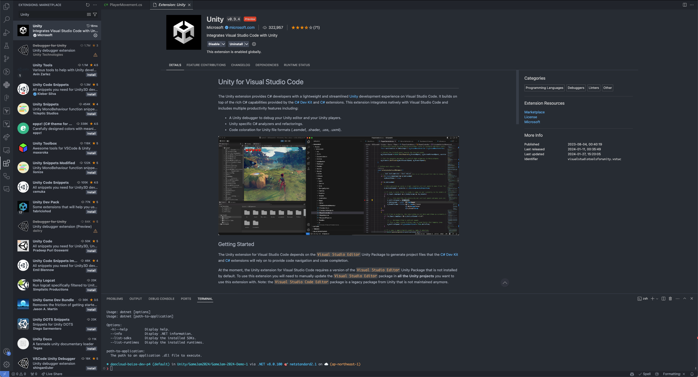
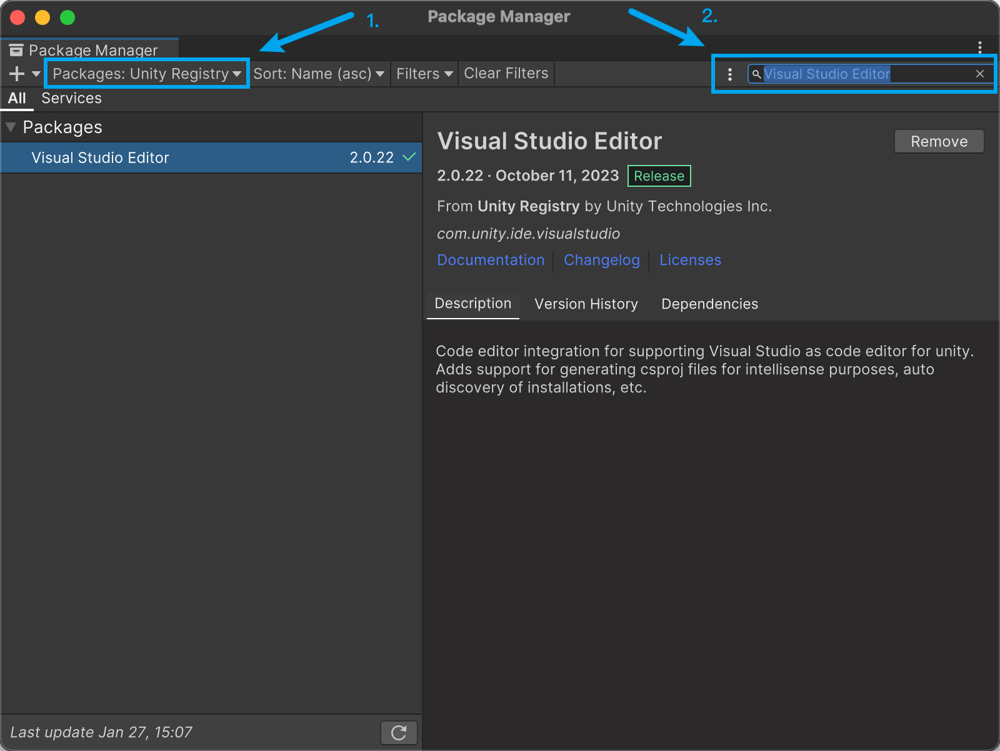
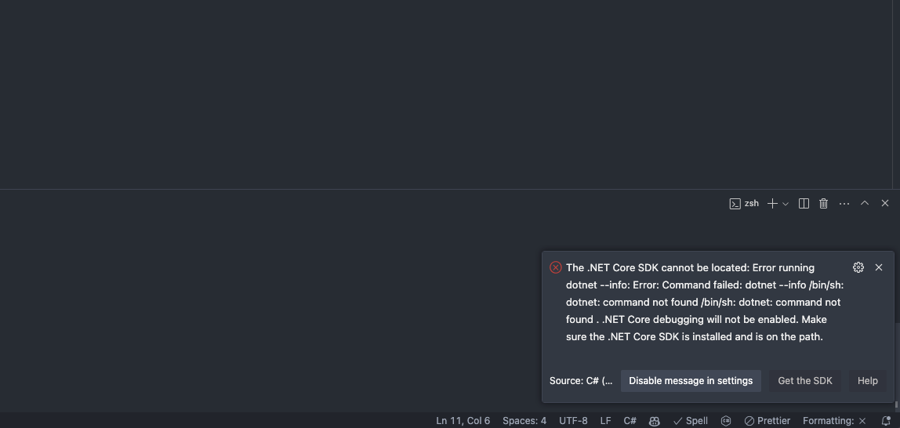
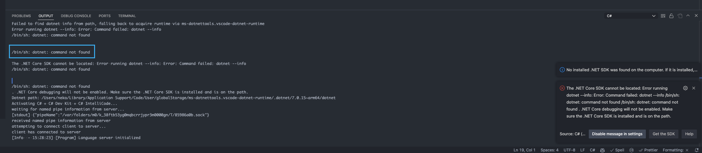
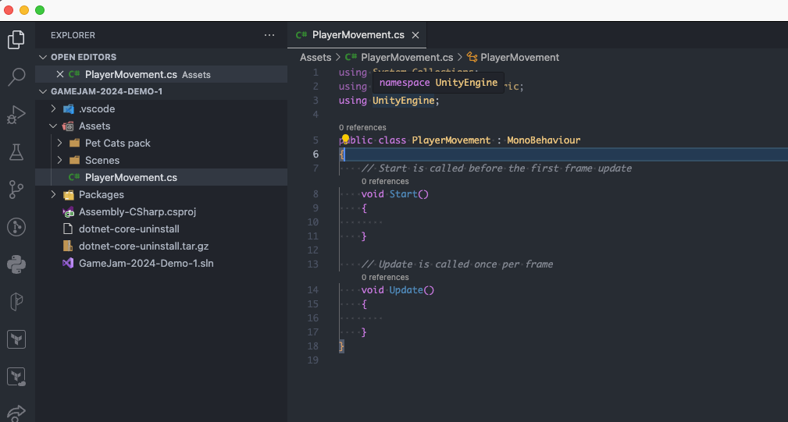

---
tags:
  - 开发/CSharp
  - 操作系统/macOS
  - 软件/Visual-Studio-Code/vscode
  - 软件/Visual-Studio-Code
  - 开发/游戏/Unity
---
# 配置 macOS 上的 VSCode 来编辑 Unity 的 C Sharp 代码

## 配置 VSCode

### 安装 Unity 插件

需要先安装 Unity 在 VSCode 的插件：[Unity - Visual Studio Marketplace](https://marketplace.visualstudio.com/items?itemName=visualstudiotoolsforunity.vstuc)



然后额外确认一下 C# Dev Kit 插件也安装上了（应该是会自动提示询问是否要安装的），如果没有安装，可以在这里安装 [C# Dev Kit - Visual Studio Marketplace](https://marketplace.visualstudio.com/items?itemName=ms-dotnettools.csdevkit)


## 配置 Unity

我们需要在 Unity 的 Package Manager 中确认 Visual Studio Editor 的 Unity 插件包是激活状态。

要在 macOS 上检查 Package Manager 的设定，需要前往左上角「Window」-「Package Manager」来打开 Package Manager：


在新打开的窗口中，在左上角的 Packages 下拉菜单中选择「Unity Registry」作为 Package 数据源；然后在右侧的输入框中输入查找 Visual Studio Editor



理论上应该是会出现一个显示有「Remove」按钮的插件。

按照 VSCode 官方对 Unity 的文档 [Visual Studio Code and Unity](https://code.visualstudio.com/docs/other/unity) 所述，为了能使用 VSCode，我们还需要额外保证这个安装之后的 Visual Studio Editor Unity Package 的版本高于 `2.0.20` ，否则会出现兼容性问题。

## 故障排查

### `The .NET Core SDK cannot be located: Error running dotnet --info: Error: Command failed: dotnet --info /bin/sh: dotnet: command not found`

可能会在安装完 [C# Dev Kit](https://marketplace.visualstudio.com/items?itemName=ms-dotnettools.csdevkit) 的 VSCode 插件之后出现下图这样的报错：



出现这样的报错的时候如果我们观察在 VSCode 中的 C# 的 Output（输出）的时候可以发现是因为通过 `/bin/sh` 运行 `dotnet` 的时候出现了问题：



然而如果我通过命令行直接尝试的时候发现是能调用到 `dotnet` 的，命令行也反馈说能找到 .NET 8


查了一番资料[^1]之后发现是因为 .NET 的支持与兼容性在 .NET 8 的时候有问题导致的，需要降级到 .NET 7 才行。

#### 卸载原先的 .NET 8

对于 macOS 和 Windows 设备，建议通过 Microsoft 官方的 [Uninstall Tool](https://learn.microsoft.com/en-us/dotnet/core/additional-tools/uninstall-tool?tabs=windows) 来在系统上自动发现和卸载 .NET 相关的依赖。

相关的卸载工具可以在 [Releases · dotnet/cli-lab](https://github.com/dotnet/cli-lab/releases) 这个页面找到，找到希望下载的文件之后复制链接下载即可：

```shell
wget https://github.com/dotnet/cli-lab/releases/download/1.6.0/dotnet-core-uninstall.tar.gz
```

卸载之后解压缩然后执行即可：

```shell
tar -zxvf ./dotnet-core-uninstall.tar.gz
chmod +x ./dotnet-core-uninstall
./dotnet-core-uninstall
```

如果是之前使用 `brew` 安装的 .NET SDK，也可以通过 `brew` 卸载试试看：

```shell
brew uninstall dotnet
```

#### 安装兼容的 .NET 7

似乎 `brew` 上下载不到 .NET 7，可以通过官方的渠道下载安装：

对于 macOS Arm64（Apple Silicon M 系列芯片）可以在这里下载：[下载 .NET 7.0 SDK (v7.0.405) - macOS Arm64 Installer](https://dotnet.microsoft.com/zh-cn/download/dotnet/thank-you/sdk-7.0.405-macos-arm64-installer)

下载之后安装：


安装好之后需要配置一下 `PATH`，用自己喜欢的编辑器打开

- 如果使用 bash：`~/.bashrc`
- 如果使用 zsh 的话：`~/.zshrc`
- 如果你不清楚这是什么：`~/.zshrc`

然后在末尾追加下面的几行环境变量的配置来让 `bash` 和 `zsh` 能找到 .NET SDK：

```shell
# Dotnet official installation
export PATH="$PATH:/usr/local/share/dotnet"
export PATH="$PATH:$HOME/.dotnet/tools"
export DOTNET_ROOT="/usr/local/share/dotnet"
```

然后更新一下自己的终端：

- 可以通过重新打开终端或者 iTerm2 实现
- 可以通过 `source ~/.bashrc` 或者 `source ~/.zshrc` （取决于上一步的配置）来实现

最后就可以看到这样的信息啦：

```shell
 $ dotnet --info
.NET SDK:
 Version:   7.0.405
 Commit:    b563db86f8

运行时环境:
 OS Name:     Mac OS X
 OS Version:  14.2
 OS Platform: Darwin
 RID:         osx-arm64
 Base Path:   /usr/local/share/dotnet/sdk/7.0.405/

Host:
  Version:      7.0.15
  Architecture: arm64
  Commit:       8f4568cdaa

.NET SDKs installed:
  7.0.405 [/usr/local/share/dotnet/sdk]

.NET runtimes installed:
  Microsoft.AspNetCore.App 7.0.15 [/usr/local/share/dotnet/shared/Microsoft.AspNetCore.App]
  Microsoft.NETCore.App 7.0.15 [/usr/local/share/dotnet/shared/Microsoft.NETCore.App]
```

也可以用

```shell
dotnet --list-runtimes
```

命令来查看一下多个 .NET SDK 的安装情况，确保能找到刚刚安装的 .NET 7：

```shell
$ dotnet --list-runtimes
Microsoft.AspNetCore.App 7.0.15 [/usr/local/share/dotnet/shared/Microsoft.AspNetCore.App]
Microsoft.NETCore.App 7.0.15 [/usr/local/share/dotnet/shared/Microsoft.NETCore.App]
```

这个时候重启整个 VSCode，再次重新打开就能看到不会报错，也能正常显示相关的补全和提示了：




## 参考资料
- [can use dotnet in command but cannot be located in vscode on mac os · Issue #6631 · dotnet/sdk](https://github.com/dotnet/sdk/issues/6631)
- [Visual Studio Code not working with Unity? - Unity Forum](https://forum.unity.com/threads/visual-studio-code-not-working-with-unity.699716/)
- [Visual Studio Code and Unity](https://code.visualstudio.com/docs/other/unity)

[^1]: 在 [macOS: C# Dev Kit vs C#, doesn't use the correct dotnet · Issue #1592 · dotnet/vscode-dotnet-runtime](https://github.com/dotnet/vscode-dotnet-runtime/issues/1592) 这篇 Issue 中首次见到相关讨论，然后在 [c# - How to install multiple dotnet versions using brew? - Stack Overflow](https://stackoverflow.com/questions/76706036/how-to-install-multiple-dotnet-versions-using-brew/76707203#76707203) 这篇回答中找到了具体的解决方法。
