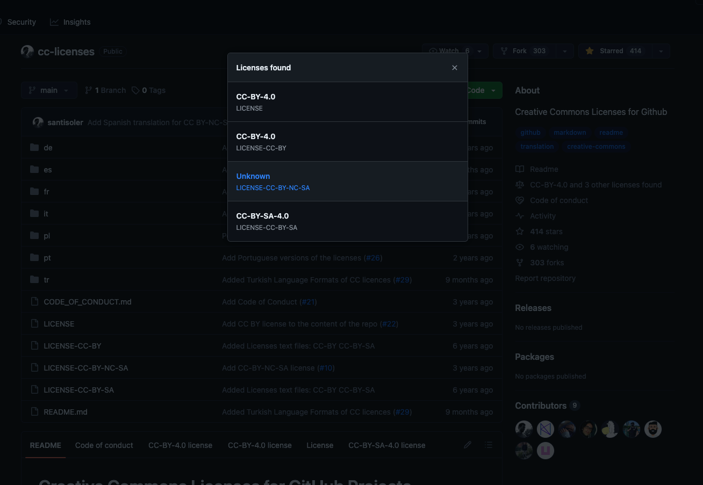
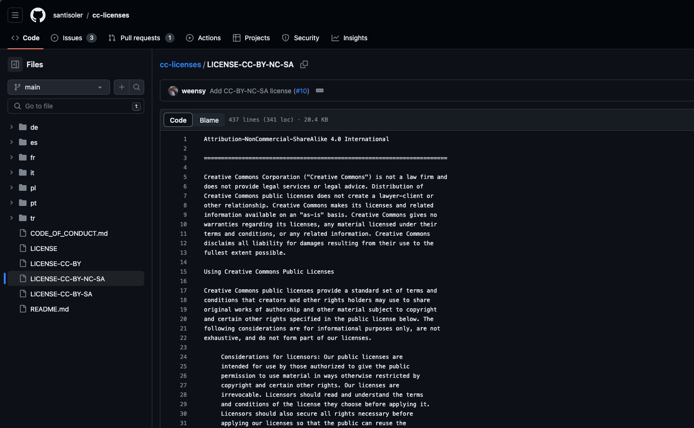

# 为什么 Nólëbase 从 Creative Commons 协议的 BY-NC-SA 切换到了 BY-SA？

## 一直以来我们都在用 CC BY-NC-SA 协议

其实一直以来如果直接前往 [nolebase/nolebase](https://github.com/nolebase/nolebase) 的仓库的话，可以看到右侧的开源协议是会提示 Unknown 的：

如果你阅读过我们的 README 文件，或者直接前往过 [Nolebase](https://nolebase.ayaka.io) 阅读笔记的话，会看到我们自从 2022 年开源 Nolebase 以来，就一直是在使用的 [Creative Commons 的 BY-NC-SA 协议](https://github.com/nolebase/nolebase/blob/0545bce5bf9d012442e4c97f05cece2112768af7/LICENSE-CC-BY-NC-SA)。

> Creative Commons BY-NC-SA 的含义
>
> BY：By 署名
> NC：No commercial 非商业化使用
> SA：Share alike 以相同方式分享

但是这与我们所使用的 CC 协议文本无关，因为我们是直接从 [santisoler/cc-licenses: Creative Commons Licenses for Github](https://github.com/santisoler/cc-licenses) 复制过来的 CC 协议原文，如果这个时候去他们的仓库查看协议，可以发现他们的 CC 开源协议也是无法被识别的，会被识别为 Unknown，但是其他的 CC 协议就能正常被识别出来：

但是如果点击查看正常能识别的 CC 协议，可以发现 GitHub 不仅能识别，还能在文件内容上方给出提示说这是一个 Creative Commons 的协议：

如果我们在我们所复制出来的 CC 协议来源的 Repository [santisoler/cc-licenses: Creative Commons Licenses for Github](https://github.com/santisoler/cc-licenses) 中搜索，是可以看到有别人提出过类似的问题的：

> It's entirely possible this is a GitHub limitation. I have yet to find a plaintext version of `CC-BY-NC-SA` that GitHub understands, but it would be great if we could find one and correct this repo.
>
> 译文：这完全有可能是 GitHub 的限制。我还没有找到一个 GitHub 可以理解的 `CC-BY-NC-SA` 明文版本，但如果我们能找到一个并纠正这个 repo，那就再好不过了。
>
> 来源： [`LICENSE-CC-BY-NC-SA` does not parse correctly · Issue #28](https://github.com/santisoler/cc-licenses/issues/28)

## 哪里出了问题？

> 那 CC BY-NC-SA 难道是不被 GitHub 支持的吗？难道没有人提出过别的问题吗？

这个时候在 [`LICENSE-CC-BY-NC-SA` does not parse correctly · Issue #28](https://github.com/santisoler/cc-licenses/issues/28) 中 [santisoler/cc-licenses](https://github.com/santisoler/cc-licenses) 就有其他贡献者回复并且给出了答案：

是有人提出过的，但是 GitHub 官方的 [github/choosealicense.com](https://github.com/github/choosealicense.com) 贡献者在提出希望创建和加入 CC BY-NC-SA [Create the cc-by-nc-sa-4.0 license by guiscaranse · Pull Request #471](https://github.com/github/choosealicense.com/pull/471) 的 Pull Request 回绝了合并请求，给出的理由是这样的。

能加入到 GitHub 官方的 [github/choosealicense.com](https://github.com/github/choosealicense.com) 中的开源协议都必须遵循下面的规范：

> 1. The license must have [an SPDX identifier](https://spdx.org/licenses/). If your license isn't registered with SPDX, please [request that it be added](https://spdx.org/spdx-license-list/request-new-license-or-exception).
> 2. The license must be listed on one of the following approved lists of licenses:
>    - [List of OSI approved licenses](https://opensource.org/licenses/alphabetical)
 >   - [GNU's list of free licenses](https://www.gnu.org/licenses/license-list.en.html) (_note: the license must be listed in one of the three "free" categories_)
 >   - [Open Definition's list of conformant licenses](http://opendefinition.org/licenses/) (non-code)
> 3. A [GitHub code search](https://github.com/search?q=MIT+filename%3ALICENSE&type=Code) must reveal at least _1,000_ public repositories using the license
>
> 来源： [choosealicense.com/CONTRIBUTING.md at 4b39f96c2aa06edcefee5e06f09a1678ed7a40fd · github/choosealicense.com](https://github.com/github/choosealicense.com/blob/4b39f96c2aa06edcefee5e06f09a1678ed7a40fd/CONTRIBUTING.md#adding-a-license)

## 与 Open Definition 相悖的存在

在规范中的第二条中叙述：

> 2. 协议必须列在以下经批准的协议清单中：
>	- [Open Definition 接受的协议清单](http://opendefinition.org/licenses/)

什么是 Open Definition？Open Definition 是开源数据，开源知识，以及开源社区的事实标准，根据标准列出的不接受的协议 [Non-Conformant Licenses - Open Definition](https://opendefinition.org/licenses/nonconformant/) 所述，

> Creative Commons NonCommercial licenses (by-nc-*) do not support the OD 1.1#8., “No Discrimination Against Fields of Endeavor”, as they exclude usage in commercial activities.
> 由于 Creative Commons 带有 NC（非商业性使用）变体的协议都与 Open Definition 第 1.1 款第 8 条的「对任何领域内的利用不得有差别待遇」相违背，任何的商业活动都会被排除。
>
> Creative Commons licenses with the non-commercial stipulation include:
> 具有非商业性规定的知识共享许可协议包括：
>
> - Attribution-Noncommercial (by-nc)
> - Attribution-NonCommercial-ShareAlike (by-nc-sa)
> - Attribution-NonCommercial-NoDerivs (by-nc-nd)

而又因为 Open Definition 还约束了

> 开源协议不得限制任何人在特定领域中使用程序[^2][^3]。这意味着开源软件可以被任何人，任何组织，任何行业自由地使用，包括商业用途。

这意味着开源协议允许商业使用和衍生作品[^1]，**并且希望协议授权任何人自由地使用、修改和分发托管在 GitHub 这样遵守 Open Definition 的开源项目**，然而 CC 带有 NC（非商业性使用）的变体协议将会对商业使用有限制，

或者说得更直接一些：

> CC NC（非商业性使用）对商业领域利用的差别待遇与开源精神冲突。

所以如果我们的知识库 [nolebase/nolebase](https://github.com/nolebase/nolebase) 要继续在 GitHub 上开源，并且在内容上希望获得开源社区的贡献和遵守 Open Definition 的支持的话，在遵守开源数据，开源知识，以及开源社区的事实标准 Open Definition 和开源精神的前提下，我们理应跟随社区和对应的协议规范，通过切换到 CC BY-SA，而不是使用一个有悖于社区和支持的 CC BY-NC-SA 协议。

这就是为什么我们要切换到 BY-SA 的原因。

> [!NOTE] 必定会有矛盾吗？
>
> 当然，可以通过分离知识库并且把那些不支持商业使用的页面和笔记单独放到一个仓库，在构建和发布为单独的静态页面（制品）之后单独在静态页面（制品）中声明 CC BY-NC-SA 协议，或者直接私有化页面就可以解决这样的冲突和矛盾了。

## 延伸阅读

- [vitorsr/cc: Creative Commons copyright license files](https://github.com/vitorsr/cc)
- [Revert "Re-license" CC BY-SA 4.0 to CC BY-NC-SA 4.0. by vorburger · Pull Request #3 · www-learn-study/saraswati.learn.study](https://github.com/www-learn-study/saraswati.learn.study/pull/3)
- [GitHub-Templates/License-Templates/CC-BY-NC-ND-4.0/LICENSE-CC-BY-NC-ND-4.0.md at master · Gibberlings3/GitHub-Templates](https://github.com/Gibberlings3/GitHub-Templates/blob/master/License-Templates/CC-BY-NC-ND-4.0/LICENSE-CC-BY-NC-ND-4.0.md)

[^1]: https://www.oshwa.org/2014/05/21/cc-oshw/
[^2]: https://opensource.org/osd/
[^3]: https://opendefinition.org/od/2.1/en/
