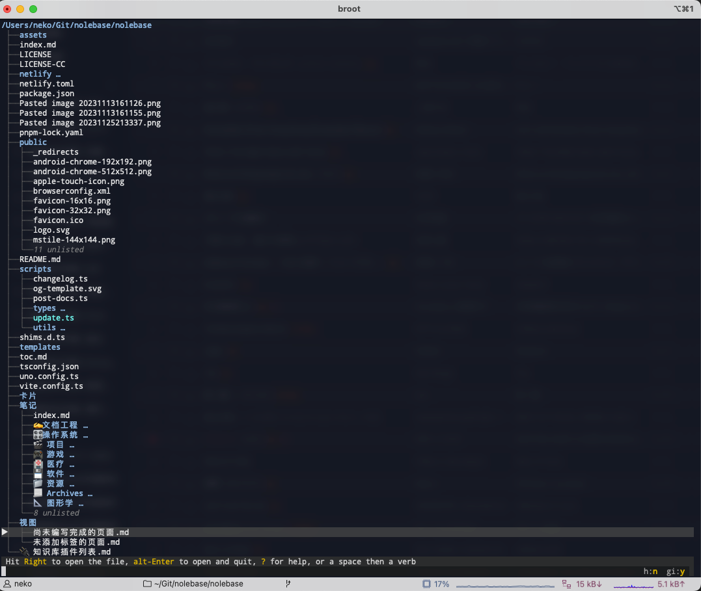

---
tags:
  - 命令行/终端
  - 命令行/broot
  - 命令行/tree
  - 操作系统/Unix
  - 操作系统/Linux
  - 计算机/操作系统/Linux/命令行
  - 计算机/操作系统/Linux
  - 命令行/brew
  - 操作系统/macOS
  - 开源/软件/zsh
  - 开源/软件/bash
  - 开源/软件/fish
  - 开源/软件/broot
---
# 使用 `broot` 替代 `tree`

之前有幸看到 [ibraheemdev/modern-unix: A collection of modern/faster/saner alternatives to common unix commands.](https://github.com/ibraheemdev/modern-unix) GitHub Repo 介绍了一些替代默认 UNIX 命令的现代 CLI 工具来完成很多工作。

其中就有 `broot` 命令可以替代 `tree` 并且得到更好的目录观察和管理的效果。

可以通过 `brew` 来安装：

```shell
brew install broot
```

其他安装的方法可以参见作者的文档 [Install broot - Broot (dystroy.org)](https://dystroy.org/broot/install/)。

安装之后在终端中就可以使用了：

```shell
❯ broot

Broot should be launched using a shell function.
This function most notably makes it possible to cd from inside broot
(see https://dystroy.org/broot/install-br/ for explanations).

Can I install it now? [Y/n]
Y
Writing br shell function in /Users/neko/Library/Application Support/org.dystroy.broot/launcher/bash/1.
Creating link from /Users/neko/.config/broot/launcher/bash/br to /Users/neko/Library/Application Support/org.dystroy.broot/launcher/bash/1.
/Users/neko/.bashrc successfully patched, you can make the function immediately available with source /Users/neko/.bashrc
/Users/neko/.bash_profile successfully patched, you can make the function immediately available with source /Users/neko/.bash_profile
/Users/neko/.zshrc successfully patched, you can make the function immediately available with exec zsh
/Users/neko/.zshrc already patched, no change made.
Writing br shell function in /Users/neko/Library/Application Support/org.dystroy.broot/launcher/fish/br.fish.
Creating link from /Users/neko/.config/fish/functions/br.fish to /Users/neko/Library/Application Support/org.dystroy.broot/launcher/fish/br.fish.

The br function has been successfully installed.
You may have to restart your shell or source your shell init files.
Afterwards, you should start broot with br in order to use its full power.
```

首次使用的时候会请求安装 `br` 函数来方便 `broot` 在交互式导航的时候能够来回导航并且 `cd` 到不同的目录下进行导航和操作，在看到

> Can I install it now? [Y/n]

的时候就可以输入 `Y` 来接受安装请求，就像上面那样，在接受安装之后，它将会

### 如果你使用 bash

1. 在 `$XDG_CONFIG_HOME/org.dystroy.broot/launcher/bash/1` 写入 Bash 使用的 Shell 函数
2. 将 `$XDG_CONFIG_HOME/org.dystroy.broot/launcher/bash/1` 软链接到 `$HOME/.config/broot/launcher/bash/br`
3. 修改 `$HOME/.bashrc` 新增一条 `br` 函数相关的引用
4. 修改 `$HOME/.bash_profile` 新增一条 `br` 函数相关的引用

```shell
source /Users/neko/.config/broot/launcher/bash/br # [!code ++]
```

### 如果你使用 zsh

1. 修改 `$HOME/.zshrc` 并新增一条 `br` 函数相关的引用

```shell
source /Users/neko/.config/broot/launcher/bash/br # [!code ++]
```

### 如果你使用 fish

1. 在 `$XDG_CONFIG_HOME/org.dystroy.broot/launcher/fish/br.fish` 写入 fish 使用的 Shell 函数
2. 将 `$XDG_CONFIG_HOME/org.dystroy.broot/launcher/fish/br.fish` 软链接到 `$HOME/.config/fish/functions/br.fish`

首次使用的时候就可以进入到交互式导航 CLI TUI 了：



退出的时候它将会提示说写入了配置文件到 `$HOME/.config/broot`：

```shell
❯ br
New Configuration files written in "/Users/neko/.config/broot".
You should have a look at them: their comments will help you configure broot.
You should especially set up your favourite editor in verbs.hjson.
```
