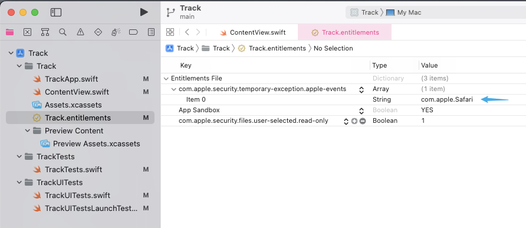

应用程序未在运行
错误：

```txt
{
	NSAppleScriptErrorAppName = "Google Chrome";
    NSAppleScriptErrorBriefMessage = "Application isn\U2019t running.";
    NSAppleScriptErrorMessage = "Google Chrome got an error: Application isn\U2019t running.";
    NSAppleScriptErrorNumber = "-600";
    NSAppleScriptErrorRange = "NSRange: {40, 3}";
}
```

出现这个错误，是由两个系统级限制导致的：

1. App 当前运行在沙盒模式下（暂时不清楚具体原理）[^3] [^4]
2. 需要配置和设定 `NSAppleEventsUsageDescription` [^2]

此处相关需要注意的属性和字段是：`NSAppleEventsUsageDescription` （[Apple 开发者官方文档](https://developer.apple.com/documentation/bundleresources/information_property_list/nsappleeventsusagedescription)）

1. 可以通过临时添加权限许可来处理[^1]：

```xml
<key>com.apple.security.temporary-exception.apple-events</key>
<array>
    <string>com.apple.Mail</string>
</array>
```

在 `<项目名称>.entitlements` 文件中添加字段 `com.apple.security.temporary-exception.apple-events`，Type（类型）设定为 `Array`（数组）：


创建好之后在点一下字段名左手边箭头以展开编辑，然后在每一行的 `Value`（值）中填写需要获取的 App 权限的 `appID`（比如 Safari 是 `com.apple.Safari`）



添加许可以后重新运行，发现新的错误：

```txt
{
    NSAppleScriptErrorAppName = "Google Chrome";
    NSAppleScriptErrorBriefMessage = "Not authorized to send Apple events to Google Chrome.";
    NSAppleScriptErrorMessage = "Not authorized to send Apple events to Google Chrome.";
    NSAppleScriptErrorNumber = "-1743";
    NSAppleScriptErrorRange = "NSRange: {43, 3}";
}
```

[c# - ScriptError: Visual Studio 2017 macOS 版本运行代码时提示：发送 Apple Events 到 Terminal 未授权 - Stack Overflow](https://stackoverflow.com/questions/54349237/scripterror-not-authorized-to-send-apple-events-to-terminal-when-running-code-o)

[xcode - 尝试在 Swift mac os App 中集成 Apple Script 以获取 macOS 上应用程序的 gui 元素 - Stack Overflow](https://stackoverflow.com/questions/62668336/trying-to-integrate-apple-script-in-swift-mac-os-app-to-get-the-gui-elements-of)

[激活 App 沙盒](https://developer.apple.com/library/archive/documentation/Miscellaneous/Reference/EntitlementKeyReference/Chapters/EnablingAppSandbox.html#//apple_ref/doc/uid/TP40011195-CH4-SW25)

具体可以参考一下这篇文章：[
Executing AppleScript in a Mac app on macOS Mojave and dealing with AppleEvent sandboxing](https://www.jessesquires.com/blog/2018/11/17/executing-applescript-in-mac-app-on-macos-mojave/)

[^1]: [applescript - Apple Script 在基于 Swift 的 macOS 应用程序上运行时失败 - Stack Overflow](https://stackoverflow.com/questions/52432402/apple-script-fails-when-run-from-within-a-macos-swift-based-application)
[^2]: [xcode - 在 Swift 中执行 AppleScript 得到 "Application isn’t running. (error -600)（应用程序未在运行）" 错误 - Stack Overflow](https://stackoverflow.com/questions/60449827/got-application-isn-t-running-error-600-when-executing-applescript-in-swif)
[^3]: [macos - 无法在 Swift 中运行 AppleScript - Stack Overflow](https://stackoverflow.com/questions/52601414/running-applescript-from-swift-not-working)
[^4]: [技术性 Q&A QA1888: OS X 的沙盒模式和自动化脚本](https://developer.apple.com/library/archive/qa/qa1888/_index.html)
