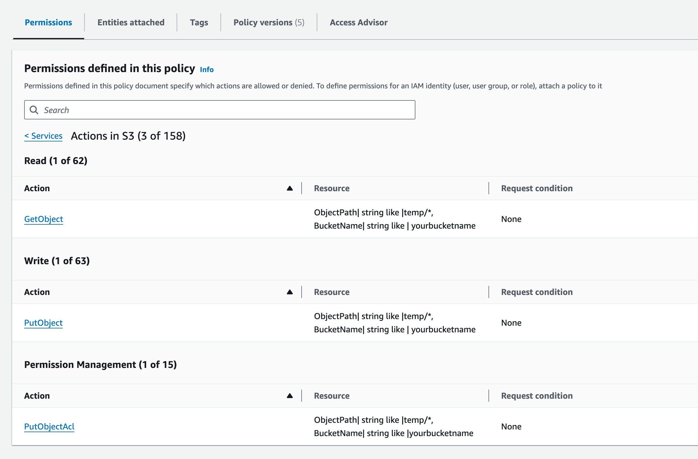
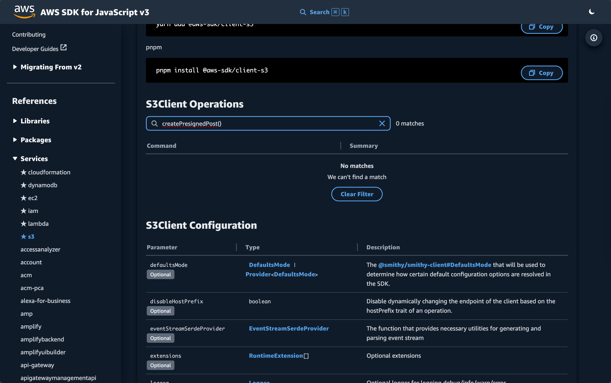
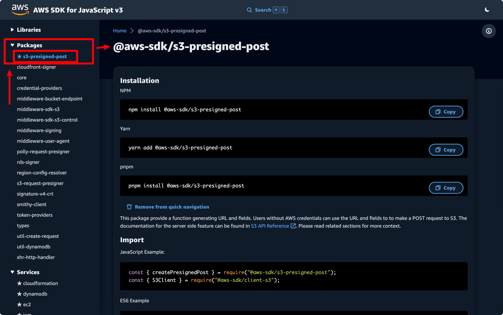

---
tags:
  - 基础设施/云服务商/亚马逊云
  - 基础设施/云服务商/亚马逊云/AWS
  - 基础设施/存储/对象存储/亚马逊云/AWS/S3
  - 开发/后端
  - 开发/前端
  - 计算机/信息技术/安全
  - 开发/Nodejs
  - 开发/Nodejs/pnpm
---
# 通过后端预签署的 Policy 在前端直接与 Amazon S3 交互并上传文件

这种技术也被称之为「服务端签名直传」、「客户端直传」、「Web 端直传」、「前端直传」，在阿里云 OSS 中也有支持[^1]。

## IAM 的权限配置

没有文档可以参考具体权限是如何配置的，但是我自己实践了一下基本的权限配置，你可以复制粘贴下面的这个策略配置 JSON 来作为 Presigned Post Policy 的其中一部分授权给相关的 IAM 用户：

```json
{
    "Version": "2012-10-17",
    "Statement": [
        {
            "Sid": "PresignedPostPolicy",
            "Effect": "Allow",
            "Action": [
                "s3:PutObject",
                "s3:GetObject",
                "s3:PutObjectAcl"
            ],
            "Resource": "arn:aws:s3:::yourbucketname/temp/*"
        }
    ]
}
```

注意这里 `Resource` 背后的 `arn:aws:s3:::yourbucketname/temp/*` 代表了授权该 Policy 的 IAM 用户可以签署 Post Policy 并在之后允许直接对 Bucket 接入点进行 POST 操作下面的资源：

- `yourbucketname` 的存储桶
- 存储桶下方目录为 `temp/` 开头的任意文件

```json
{
    "Version": "2012-10-17",
    "Statement": [
        {
            "Sid": "PresignedPostPolicy",
            "Effect": "Allow",
            "Action": [
                "s3:PutObject",
                "s3:GetObject",
                "s3:PutObjectAcl"
            ],
            "Resource": "arn:aws:s3:::yourbucketname/temp/*" // [!code hl]
        }
    ]
}
```

当然，这里只是对 IAM 用户做一层限制，实际的 `temp/*` 目录下的权限可以根据具体的业务需求再去通过 Policy 去限制一次。

最终看起来大概是这样的



## Node.js 服务端

其实很简单，首先在本地 Node.js 服务端项目中安装 `@aws-sdk/s3-presigned-post`

```shell
pnpm i @aws-sdk/s3-presigned-post
```

如果你用 `@antfu/ni` 的话也可以用下面的命令来安装

```shell
ni @aws-sdk/s3-presigned-post
```

安装之后用下面的代码就可以导入用于创建上传的时候使用的预签署 Policy 的函数 `createPresignedPost` 了：

```typescript
import { createPresignedPost } from '@aws-sdk/s3-presigned-post';
```

用法的话，我一般会这么封装：

```typescript
import { createPresignedPost } from '@aws-sdk/s3-presigned-post';

export enum UploadingPolicyContentType {
  Image = 'image/',
}

export async getSignedUploadPolicy(
  dir: string,
  contentType: UploadingPolicyContentType,
): Promise<{
  url: string;
  fields: Record<string, string>;
}> {
  new S3Client({ region: '<AWS S3 地区>' })

  let normalizedDir = dir;
  if (dir.endsWith('/')) {
    normalizedDir = dir.slice(0, -1);
  }

  return await createPresignedPost(this.s3Client, {
    Bucket: '<AWS S3 >', // [!code hl]
    // 使用 ${filename} 结尾可以让前端或者用户自行决定文件名，或者上传 N 个文件 [!code hl]
    // 这对于需要自定义文件名的业务很重要 [!code hl]
    Key: normalizedDir + '/${filename}', // [!code hl]
    Conditions: [ // [!code hl]
      // 限制上传路径中必须以「传入的目录」这个参数作为开头 // [!code hl]
      ['starts-with', '$key', dir], // [!code hl]
      // 这里按照自己的需求进行调整即可，一般会配置为 public-read，因为用户也需要预览自己上传的文件 // [!code hl]
      { acl: 'public-read' }, // [!code hl]
      // 限制上传文件的类型。注意，如果加了这一行策略配置，这意味着上传的时候需要在 FormData 里面或者头里面指定一下 Content-Type // [!code hl]
      ['starts-with', '$Content-Type', contentType.toString()], // [!code hl]
    ], // [!code hl]
    Fields: { // [!code hl]
      acl: 'public-read', // [!code hl]
    }, // [!code hl]
    Expires: 600, // [!code hl]
  });
}
```

有关这些参数，可以通过 [Creating an HTML Form (Using AWS Signature Version 4) - Amazon Simple Storage Service](https://docs.aws.amazon.com/AmazonS3/latest/API/sigv4-HTTPPOSTForms.html#sigv4-HTTPPOSTFormFields) 文档查阅了解。
调用这个函数之后将会获得下面的返回值：

```json
{
  "url": "https://<bucket name>.s3.<region>.amazonaws.com/",
  "fields": {
    "acl": "public-read",
    "bucket": "<bucket name>",
    "X-Amz-Algorithm": "AWS4-HMAC-SHA256",
    "X-Amz-Credential": "KWNJNBJKAVLTTLHQSGOU/20231125/ap-southeast-1/s3/aws4_request",
    "X-Amz-Date": "20231125T132451Z",
    "key": "<dir to object>/${filename}",
    "Policy": "eyAiZXhwaXJhdGlvbiI6ICIyMDE1LTEyLTMwVDEyOjAwOjAwLjAwMFoiLA0KICAiY29uZGl0aW9ucyI6IFsNCiAgICB7ImJ1Y2tldCI6ICJzaWd2NGV4YW1wbGVidWNrZXQifSwNCiAgICBbInN0YXJ0cy13aXRoIiwgIiRrZXkiLCAidXNlci91c2VyMS8iXSwNCiAgICB7ImFjbCI6ICJwdWJsaWMtcmVhZCJ9LA0KICAgIHsic3VjY2Vzc19hY3Rpb25fcmVkaXJlY3QiOiAiaHR0cDovL3NpZ3Y0ZXhhbXBsZWJ1Y2tldC5zMy5hbWF6b25hd3MuY29tL3N1Y2Nlc3NmdWxfdXBsb2FkLmh0bWwifSwNCiAgICBbInN0YXJ0cy13aXRoIiwgIiRDb250ZW50LVR5cGUiLCAiaW1hZ2UvIl0sDQogICAgeyJ4LWFtei1tZXRhLXV1aWQiOiAiMTQzNjUxMjM2NTEyNzQifSwNCiAgICB7IngtYW16LXNlcnZlci1zaWRlLWVuY3J5cHRpb24iOiAiQUVTMjU2In0sDQogICAgWyJzdGFydHMtd2l0aCIsICIkeC1hbXotbWV0YS10YWciLCAiIl0sDQoNCiAgICB7IngtYW16LWNyZWRlbnRpYWwiOiAiQUtJQUlPU0ZPRE5ON0VYQU1QTEUvMjAxNTEyMjkvdXMtZWFzdC0xL3MzL2F3czRfcmVxdWVzdCJ9LA0KICAgIHsieC1hbXotYWxnb3JpdGhtIjogIkFXUzQtSE1BQy1TSEEyNTYifSwNCiAgICB7IngtYW16LWRhdGUiOiAiMjAxNTEyMjlUMDAwMDAwWiIgfQ0KICBdDQp9",
    "X-Amz-Signature": "quz7tazncsie4a522xt04sgrblamz3ws7c5baresosq3nho0eyk7lysijmgr1x6y"
  }
}
```

接下来新建一个 `FormData`，并且将要上传的文件和返回的 `fields` 全数遍历并写入到 `FormData` 中，最终通过 `axios.post` 发送请求即可。

```typescript
function append(
  formData: FormData,
  key: string,
  value: string | number | Blob,
) {
  if (typeof value === 'string' || typeof value === 'object')
    formData.append(key, value);
  else formData.append(key, String(value));
}

export type FormDataCompatibleObject = Record<
  string,
  string | number | Blob | undefined | (string | number)[]
>;

/** 将 Object 转换成 FormData */
export function objectToFormData(obj: FormDataCompatibleObject): FormData {
  const formData = new FormData();

  Object.entries(obj).forEach(([key, value]) => {
    if (value === undefined || value === null) return;
    append(formData, key, Array.isArray(value) ? JSON.stringify(value) : value);
  });

  return formData;
}

/** 将文件名转换为 HTTP 头部中的 `Content-Disposition` 标签信息，用于指定传输文件的原始文件名 */
export function toRawFileName(filename: string) {
  return `attachment; filename*=UTF-8''${encodeURIComponent(filename)}`;
}

export async function uploadFile(options: {
  /** 上传接口，一般直接是 OSS/S3 的接口 */
  url: string;
  /** 上面接口会返回的响应值 */
  fields: Record<string, string>;
  /** 文件 */
  file: File;
  /** 文件的 MIME 类型 */
  contentType: string;
  /**
   * 是否通过 Content-Disposition 头部保存文件名（供文件下载时使用）
   * @default false
   */
  saveRawFilename?: boolean;
  /**
   * 文件名，默认从 file 对象中获取
   * 需要与 `saveRawFilename` 配置一起使用
   * @default file.name
   */
  filename?: string;
}) {
  const formData = objectToFormData(options.fields);
  // 文件的 MIME 类型
  formData.append('Content-Type', options.contentType)
  // 原始文件名（下载时使用）
  if (options.saveRawFilename)
    formData.append('Content-Disposition', toRawFileName(options.filename));

  // 待上传的文件
  // !!!: file 参数必须在最后 append ，不然 `Content-Type` 和 `Content-Disposition` 不生效
  formData.append('file', options.file);

  return await axios.post(options.url, formData);
}
```

## 补充：上传完成后的复制和删除

通常，基于浏览器的到 S3 的前端浏览器直传功能会涉及到一个问题：

如果上面签名的 Policy 中你也使用了 `${filename}` 允许上传的时候上传任意多个文件，或者说，如果用户上传的文件数量不受控的话：

1. 对于头像上传这样的业务需求，如果每次都上传一个带有随机数的文件，可能会出现用户一直选一直选，最终 bucket 里面会有很多个用户临时上传的一大堆不需要的头像文件
2. 对于用户可以批量上传的业务需求，如果每次都可以上传若干临时文件，依然会出现用户一直选一直选，不断重新上传，最终导致 bucket 里面会有很多个用户临时上传的一大堆不需要的批量上传的文件

这个时候要介绍一个新的流程，「上传完成后的复制和删除」。

简单来说，这样的流程允许我们在允许用户上传多个文件的时候，让服务端通过「复制」和「删除」，也就是「剪切」的操作，留下那些用户不要的文件到临时文件夹中，设定定时任务来清理和删除临时文件夹中的资源，最终实现对临时文件的管理和销毁的流程。

步骤是这样的：

1. 用户选择希望上传的文件
2. 获取上传的预签名 Policy
3. 对 S3 存储桶 API 进行 POST Object 操作，上传文件到临时文件夹
4. 将用户最终决定好最终上传完成的文件通过 API 告知服务端
5. 服务端定向「复制」这些前端已经上传完成的对象到特定的，只有服务端可写的目录
6. 服务端定向「删除」这些已经「复制」完成的对象原先在的临时文件夹的位置

最终留在临时文件夹中的文件就都是可能用户再也不会触碰到或者访问的临时文件了，我们也许可以创建一些 AWS Lambda 函数或者定时任务来批量删除那些长时间不再修改和访问的临时文件夹中的资源，并最终实现对临时文件的管理和销毁的流程。

在这个流程中最麻烦的是 AWS 的 IAM 策略，经过我的测试之后发现，「预签名」，「复制对象」和「删除对象」三个操作需要下面的这四个 IAM 策略：

```json
{
    "Version": "2012-10-17",
    "Statement": [
        {
            "Sid": "AllowPresignedPostForTempDir",
            "Effect": "Allow",
            "Action": [
                "s3:PutObject",
                "s3:GetObject",
                "s3:PutObjectAcl"
            ],
            "Resource": "arn:aws:s3:::yourbucketname/temp/*"
        },
        {
            "Sid": "AllowCopyFromTempDirToRoot",
            "Effect": "Allow",
            "Action": [
                "s3:GetObject",
                "s3:GetObjectAcl",
                "s3:GetObjectTagging",
                "s3:PutObject",
                "s3:PutObjectAcl",
                "s3:PutObjectTagging"
            ],
            "Resource": [
                "arn:aws:s3:::yourbucketname/*",
                "arn:aws:s3:::yourbucketname/temp/*"
            ]
        },
        {
            "Sid": "AllowDeleteTempDir",
            "Effect": "Allow",
            "Action": [
                "s3:DeleteObject"
            ],
            "Resource": [
                "arn:aws:s3:::yourbucketname/temp/*"
            ]
        },
        {
            "Sid": "AllowReadBucket",
            "Effect": "Allow",
            "Action": [
                "s3:ListBucket"
            ],
            "Resource": [
                "arn:aws:s3:::yourbucketname"
            ]
        }
    ]
}
```

如果你也需要这样的流程，可以参考我的 IAM 权限策略配置看看，然后进一步根据业务需求去实现。
## 寻找 AWS S3 的 JavaScript SDK 文档中有关 Pre-signed Post 功能的文档真的很困难

[`@aws-sdk/s3-presigned-post` - AWS SDK for JavaScript v3](https://docs.aws.amazon.com/AWSJavaScriptSDK/v3/latest/Package/-aws-sdk-s3-presigned-post/)
### 是如何找到与之相关的文档的？

有关这个功能块的文档真的很难找... 我花了好久才找到目标文档。

在 Amazon S3（或者说 AWS S3）的文档中，它有好几个版本：

- [Browser-based uploads using POST (AWS signature version 2)](https://docs.aws.amazon.com/AmazonS3/latest/userguide/UsingHTTPPOST.html)
- [Example: Browser-Based Upload using HTTP POST (Using AWS Signature Version 4) - Amazon Simple Storage Service](https://docs.aws.amazon.com/AmazonS3/latest/API/sigv4-post-example.html)
- [Authenticating Requests: Browser-Based Uploads Using POST (AWS Signature Version 4) - Amazon Simple Storage Service](https://docs.aws.amazon.com/AmazonS3/latest/API/sigv4-authentication-HTTPPOST.html)
- [Browser-Based Uploads to Amazon S3 Using the AWS Amplify Library - Amazon Simple Storage Service](https://docs.aws.amazon.com/AmazonS3/latest/API/browser-based-uploads-aws-amplify.html)

第一个链接使用的是 AWS Signature Version 2 来进行签名和校验，但是这个版本是过时的，如果点到这个文档里面将会发现它提示说建议迁移到 Version 4：

> Amazon S3 now supports Signature Version 4, a protocol for authenticating inbound API requests to AWS services, in all AWS Regions. At this time, AWS Regions created before January 30, 2014 will continue to support the previous protocol, Signature Version 2. Any new regions after January 30, 2014 will support only Signature Version 4 and therefore all requests to those regions must be made with Signature Version 4. For more information, see [Authenticating Requests in Browser-Based Uploads Using POST (AWS Signature Version 4)](https://docs.aws.amazon.com/AmazonS3/latest/API/sigv4-authentication-HTTPPOST.html) in the _Amazon Simple Storage Service API Reference_.

所以也才会有后面的三个链接可以参考，但是即便如此这依然令人头痛。

因为与阿里云 OSS 的文档不同的是，Amazon S3（或者说 AWS S3）的直传文档并没有给出一个可以参考的代码案例，也没有提供链接到 SDK 下属 API 的文档链接，只是简单的甩出来几个文档来说明和介绍整个签名和计算 hash 的流程和步骤。

这让我在尝试集成的时候头疼了好一会儿，翻了好多文档和 StackOverflow 以及技术博客来寻找蛛丝马迹。所幸我在一篇 [javascript - Amazon S3 POST api, and signing a policy with NodeJS](https://stackoverflow.com/a/61998502/19954520) 的 StackOverflow 的问答中找到了一些头绪：

> AWS SDK now provides an easy way to create the POST policy with `createPresignedPost()`.
>
> Docs: [https://docs.aws.amazon.com/AWSJavaScriptSDK/latest/AWS/S3.html#createPresignedPost-property](https://docs.aws.amazon.com/AWSJavaScriptSDK/latest/AWS/S3.html#createPresignedPost-property)

所以 AWS SDK 是提供了可以计算和创建预签名的 Policy 的 API 和函数封装的。

但是这个时候直接点到上面这段引用所关联到的有关 `createPresignedPost()` 的文档之后再去本地的 Node.js 服务端中尝试引入这个函数的时候，就会发现这个函数其实不存在，如果再返回回去看这份过时的 S3 SDK 的文档的时候，就可以发现 S3 SDK 部分的文档会提示说建议迁移：

> You are viewing the documentation for an older major version of the AWS SDK for JavaScript.
>
> The modular AWS SDK for JavaScript (v3), the latest major version of AWS SDK for JavaScript, is now stable and recommended for general use. For more information, see the [Migration Guide](https://docs.aws.amazon.com/sdk-for-javascript/v3/developer-guide/migrating-to-v3.html) and [API Reference.](https://docs.aws.amazon.com/AWSJavaScriptSDK/v3/latest/index.html)

迁移一般而言也不是问题，这个时候再点到 [Migration Guide](https://docs.aws.amazon.com/sdk-for-javascript/v3/developer-guide/migrating-to-v3.html) 的文档中才能了解到不同 SDK 的区别，不过... 这距离最终的答案依然还有一些距离。你其实需要点击上面这段引用的

> [API Reference.](https://docs.aws.amazon.com/AWSJavaScriptSDK/v3/latest/index.html)

链接才能抵达现在最新版本的 JavaScript SDK 所在的文档，这个时候去搜索 `createPresignedPost()` 还是能发现其实没办法找到对应的函数的说明文档：



这是因为其实 S3 的 `createPresignedPost()` 函数是在单独的一个 Packages 的分类下面的，只有点击到了 Packages 下面的 `s3-presigned-post` 才能抵达真正的有关 Presigned Post 相关的文档：



文档在 [AWS SDK for JavaScript v3](https://docs.aws.amazon.com/AWSJavaScriptSDK/v3/latest/Package/-aws-sdk-s3-presigned-post/)。

[^1]: 在阿里云 OSS 的[服务端签名直传](https://help.aliyun.com/zh/oss/use-cases/obtain-signature-information-from-the-server-and-upload-data-to-oss)文档中会有介绍到。
