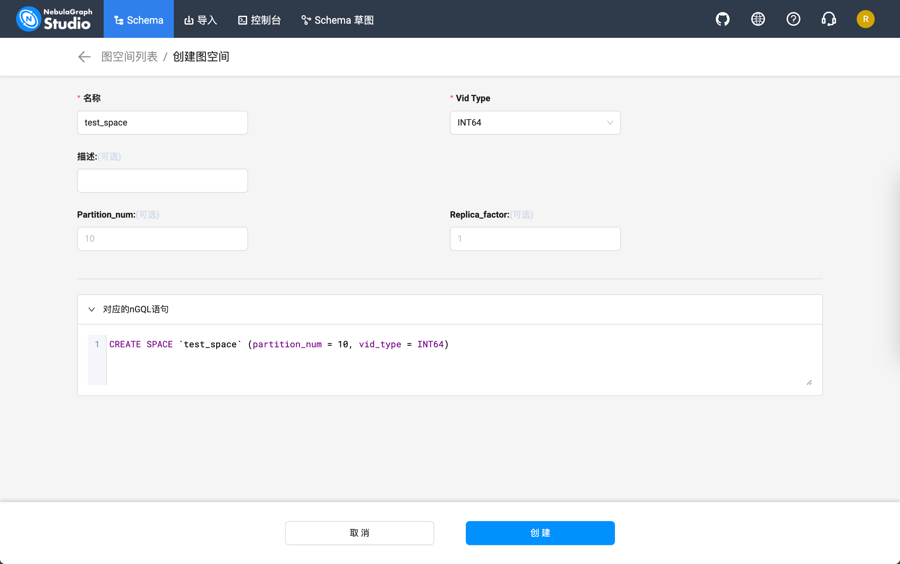
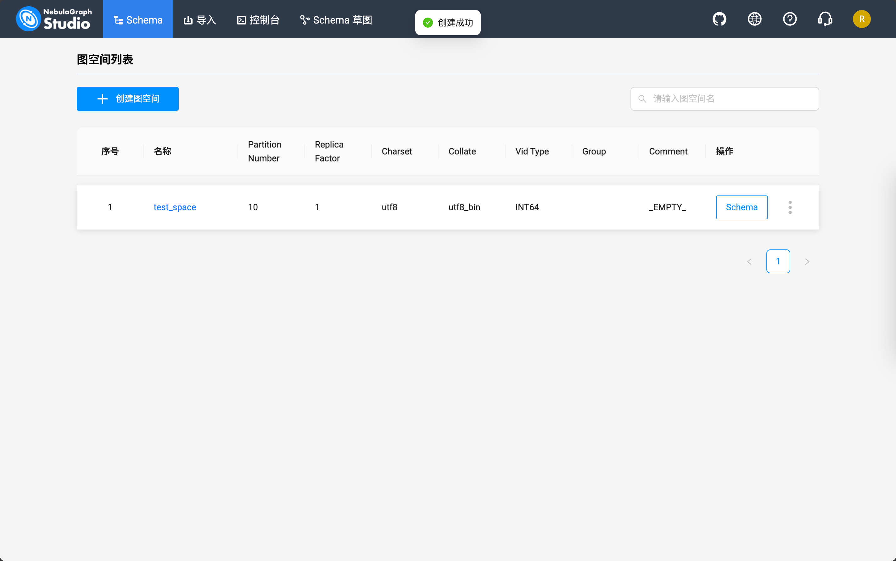

---
tags:
  - 命令行/kind
  - 开源/软件/kind
  - 命令行/kubectl
  - 软件/云原生/kubectl
  - 命令行/helm
  - 软件/云原生/helm
  - 开发/容器化/Docker
  - 开发/云原生/Docker
  - 软件/云原生/docker
  - 开发/云原生/Kubernetes
  - 计算机/数据库/图数据库/nebulagraph
---
# 在开发用的测试集群上用 Helm 安装 NebulaGraph

## 先决条件

- 有可用的容器环境（比如 Docker）
- 安装 [`kubectl`](https://kubernetes.io/docs/tasks/tools/install-kubectl-macos/)
- 安装 [`kind`](https://kind.sigs.k8s.io/)
- 安装 [`helm`](https://helm.sh/)

## 用 [`kind`](https://kind.sigs.k8s.io/) 创建一个测试用的 Kubernetes 集群

编写一个 `kind.yaml` 文件，然后指定一下配置：

```yaml
kind: Cluster
name: nebula-graph
apiVersion: kind.x-k8s.io/v1alpha4
nodes:
- role: control-plane
- role: worker
  extraPortMappings:
  # 提前分配好 NebulaGraph 自己的端口 # [!code highlight]
  - containerPort: 30101 # [!code highlight]
    hostPort: 30101 # [!code highlight]
    protocol: TCP
  # 提前分配好 NebulaGraph Studio 的端口 # [!code highlight]
  - containerPort: 30102 # [!code highlight]
    hostPort: 30102 # [!code highlight]
    protocol: TCP
```

用 `kind` 根据配置文件创建

```shell
kind create cluster --config ./kind.yaml
```

创建之后应该可以用 `kind` 看到

```shell
❯ kind get clusters
nebula-graph
```

这个时候 `kubectl` 用的配置文件这个时候也应该已经写入和准备好了，直接执行下面的命令就可以获得节点状态

```shell
kubectl get nodes
```

这个时候应该可以看到这样的输出

```shell
❯ kubectl get nodes
NAME                         STATUS   ROLES           AGE     VERSION
nebula-graph-control-plane   Ready    control-plane   4d22h   v1.27.3 # [!code ++]
nebula-graph-worker          Ready    <none>          4d22h   v1.27.3 # [!code ++]
```

确认无误后就可以继续后面的步骤了

## 添加 Helm Chart

按照 [NebulaGraph 官方文档](https://github.com/vesoft-inc/nebula-operator)的介绍，要用 Helm 管理和部署 NebulaGraph 集群到 Kubernetes 的话，需要安装 Operator。

添加一下 Operator 的 Helm Chart

```shell
helm repo add nebula-operator https://vesoft-inc.github.io/nebula-operator/charts
```

更新一下 Repo 引用

```shell
helm repo update
```

这个时候用

```shell
helm repo list
```

应该可以看到这些 repo

```shell
❯ helm repo list
NAME           	URL
nebula-operator	https://vesoft-inc.github.io/nebula-operator/charts # [!code ++]
```

## 安装 NebulaGraph 的 Operator

运行这个命令应该就能自动创建 Namespace 并且安装管理 NebulaGraph 集群用的 NebulaGraph Operator 了：

```shell
helm install nebula-operator nebula-operator/nebula-operator --namespace=nebula-operator-system --create-namespace
```

切换到 NebulaGraph 的 Operator 所在的 Namespace 下：

```shell
kubectl config set-context --current --namespace nebula-operator-system
```

这个时候应该可以看到这样的输出

```shell
❯ helm list
NAME           	NAMESPACE             	REVISION	UPDATED                             	STATUS  	CHART                	APP VERSION
nebula-operator	nebula-operator-system	1       	2023-12-29 10:14:05.534035 +0800 CST	deployed	nebula-operator-1.7.3	1.7.3 # [!code ++]
```

用 `get pods` 看看运行状态吧：

```shell
kubectl get pods
```

应该会有类似的输出

```shell
❯ kubectl get pods
NAME                                                             READY   STATUS    RESTARTS       AGE
nebula-operator-controller-manager-deployment-56c84fd68f-lnr85   2/2     Running   2 (107m ago)   4d5h # [!code ++]
nebula-operator-controller-manager-deployment-56c84fd68f-vz54m   2/2     Running   4 (107m ago)   4d5h # [!code ++]
nebula-operator-scheduler-deployment-6bf5cf6fc9-sx47x            1/1     Running   2 (107m ago)   4d5h # [!code ++]
nebula-operator-scheduler-deployment-6bf5cf6fc9-xq46m            1/1     Running   2 (107m ago)   4d5h # [!code ++]
```

看看 NebulaGraph 的 [CRD（Custom Resources）](https://kubernetes.io/docs/concepts/extend-kubernetes/api-extension/custom-resources/) 有没有装上了

```shell
kubectl get crd
```

应该会有类似的输出

```shell
❯ kubectl get crd
NAME                                            CREATED AT
nebulaautoscalers.autoscaling.nebula-graph.io   2023-12-29T02:14:03Z # [!code ++]
nebulaclusters.apps.nebula-graph.io             2023-12-29T02:14:03Z # [!code ++]
nebularestores.apps.nebula-graph.io             2023-12-29T02:14:03Z # [!code ++]
```

## 通过 NebulaGraph Operator 创建集群

在创建之前我们需要了解一下期望安装的 NebulaGraph 集群在创建 Kubernetes 硬盘和存储卷资源的时候所使用的 Storage Class 是什么：

```shell
kubectl get sc
```

```shell
❯ kubectl get sc
NAME                 PROVISIONER             RECLAIMPOLICY   VOLUMEBINDINGMODE      ALLOWVOLUMEEXPANSION   AGE
standard (default)   rancher.io/local-path   Delete          WaitForFirstConsumer   false                  4d22h
```

> [!TIP] 什么是 `sc` 和 Storage Class？
>
> `sc` 代表了 [Storage Class](https://kubernetes.io/docs/concepts/storage/storage-classes/)，对于使用 [`kind`](https://kind.sigs.k8s.io/) 创建的集群而言，默认填写 `standard` 就可以了。

接下来，和创建 NebulaGraph Operator 一样，用 Helm 安装一个 NebulaGraph 集群

```shell
helm install "nebula" \
	nebula-operator/nebula-cluster \
	--namespace="nebula" \
	--set nameOverride=nebula \
	--set nebula.storageClassName="standard"
	--create-namespace
```

切换到 NebulaGraph 集群所在的 Namespace 下：

```shell
kubectl config set-context --current --namespace nebula-operator-system
```

这个时候应该可以看到这样的输出

```shell
❯ helm list
NAME         	NAMESPACE	REVISION	UPDATED                             	STATUS  	CHART               	APP VERSION
nebula       	nebula   	1       	2023-12-29 11:10:27.293253 +0800 CST	deployed	nebula-cluster-1.7.3	1.7.3 # [!code ++]
```

老样子，检查一下 Pod 运行状态

```shell
kubectl get pods
```

这个时候应该可以看到这样的输出

```shell
❯ kubectl get pods
NAME                              READY   STATUS    RESTARTS       AGE
nebula-exporter-c4bd8556b-jt2jk   1/1     Running   1 (122m ago)   4d5h # [!code ++]
nebula-graphd-0                   1/1     Running   1 (122m ago)   4d5h # [!code ++]
nebula-graphd-1                   1/1     Running   1 (122m ago)   4d5h # [!code ++]
nebula-metad-0                    1/1     Running   1 (122m ago)   4d5h # [!code ++]
nebula-metad-1                    1/1     Running   1 (122m ago)   4d5h # [!code ++]
nebula-metad-2                    1/1     Running   1 (122m ago)   4d5h # [!code ++]
nebula-storaged-0                 1/1     Running   1 (122m ago)   4d5h # [!code ++]
nebula-storaged-1                 1/1     Running   1 (122m ago)   4d5h # [!code ++]
nebula-storaged-2                 1/1     Running   1 (122m ago)   4d5h # [!code ++]
```
## 安装可视化客户端 [NebulaGraph Studio](https://github.com/vesoft-inc/nebula-studio)

克隆一下 NebulaGraph Studio 的客户端

```shell
git clone git@github.com:vesoft-inc/nebula-studio.git
```

切换到 `nebula-studio` 下面的 `deployment/helm` 目录里面

```shell
cd nebula-studio/deployment/helm
```

因为我们是开发和测试用的，安装之前记得修改成 SQLite3 作为数据持久化方案，如果有别的数据库实例，可以改成自己的 MySQL 实例的地址（比如 Kubernetes 部署的 MySQL）：

```yaml
apiVersion: v1
kind: ConfigMap
metadata:
  name: {{ include "nebula-studio.name" . }}-config
data:
  studio-api.yaml: |
    Name: studio-api
    Host: 0.0.0.0
    Port: 7001
    MaxBytes: 1073741824
    Timeout: 60000
    Log:
      Mode: file
      Level: error
      KeepDays: 7
    Debug:
      Enable: false
    Auth:
      TokenName: "studio_token"
      AccessSecret: "login_secret"
      AccessExpire: 259200
    File:
      UploadDir: "/data/upload/"
      TasksDir: "/data/tasks"
    DB:
      # 1,2,3,4 corresponding to Silent, ERROR, Warn, INFO
      LogLevel: 4
      IgnoreRecordNotFoundError: false
      # AutoMigrate run auto migration for given models
      AutoMigrate: true
      # The database backend, either "mysql", "sqlite3".
      Type: "sqlite3" # [!code focus]
      # Database host
      Host: "192.168.8.44:3306"
      # Database name
      Name: "hetao_test"
      # Database user
      User: "root"
      # Database password
      Password: "nebula"
      # For "sqlite3" only, database file path
      SqliteDbFilePath: "./data/tasks.db"
      # The maximum open connections of the pool.
      MaxOpenConns: 30
      # The maximum idle connections of the pool.
      MaxIdleConns: 10
```

用当前目录的 Helm Chart 定义生成 Kubernetes 资源文件然后原地安装：

```shell
helm install nebula-studio --namespace nebula .
```

这个时候应该可以看到这样的输出

```shell
❯ helm list
NAME         	NAMESPACE	REVISION	UPDATED                             	STATUS  	CHART               	APP VERSION
nebula       	nebula   	1       	2023-12-29 11:10:27.293253 +0800 CST	deployed	nebula-cluster-1.7.3	1.7.3 # [!code ++]
nebula-studio	nebula   	1       	2024-01-02 15:23:28.852275 +0800 CST	deployed	nebula-studio-0.1.2 	v3.0.0 # [!code ++]
```

老样子，检查一下 Pod 运行状态

```shell
kubectl get pods
```

```shell
❯ kubectl get pods
NAME                              READY   STATUS    RESTARTS       AGE
nebula-exporter-c4bd8556b-jt2jk   1/1     Running   1 (123m ago)   4d5h
nebula-graphd-0                   1/1     Running   1 (123m ago)   4d5h
nebula-graphd-1                   1/1     Running   1 (123m ago)   4d5h
nebula-metad-0                    1/1     Running   1 (123m ago)   4d5h
nebula-metad-1                    1/1     Running   1 (123m ago)   4d5h
nebula-metad-2                    1/1     Running   1 (123m ago)   4d5h
nebula-storaged-0                 1/1     Running   1 (123m ago)   4d5h
nebula-storaged-1                 1/1     Running   1 (123m ago)   4d5h
nebula-storaged-2                 1/1     Running   1 (123m ago)   4d5h
nebula-studio-58f854d7c9-fflzq    1/1     Running   0              63m  # [!code ++]
```

```shell
❯ kubectl get svc
NAME                       TYPE        CLUSTER-IP      EXTERNAL-IP   PORT(S)                          AGE
nebula-exporter-svc        ClusterIP   10.96.183.159   <none>        9100/TCP                         4d5h
nebula-graphd-headless     ClusterIP   None            <none>        9669/TCP,19669/TCP               4d5h
nebula-graphd-svc          NodePort    10.96.31.131    <none>        9669:30101/TCP,19669:31873/TCP   4d5h
nebula-metad-headless      ClusterIP   None            <none>        9559/TCP,19559/TCP               4d5h
nebula-storaged-headless   ClusterIP   None            <none>        9779/TCP,19779/TCP,9778/TCP      4d5h
nebula-studio-service      ClusterIP   10.96.122.0     <none>        7001/TCP                         3s # [!code ++]
```

这个时候可以发现 NebulaGraph Studio 并没有可以供外部访问的 NodePort 类型的 Service，还记得之前的 `kind.yaml` 提前分配的 `30102` 端口吗？这个时候我们手动暴露一个 NodePort 类型的 Service 给 NebulaGraph Studio 并且修改一下端口就好。

> 详细的操作背后的逻辑和含义可以在 [[用 kind 创建的测试集群快速部署应用并暴露 NodePort 服务到宿主机方便调试]] 一文中阅读了解。

```shell
kubectl expose deployment nebula-studio --name=nebula-studio-nodeport --type=NodePort
```

修改 NodePort 端口到 `30102`

```shell
kubectl patch service nebula-studio-nodeport --type='json' --patch='[{"op": "replace", "path": "/spec/ports/0/nodePort", "value":30102}]'
```

查看创建的 NodePort 类型的 Service 的状态

```shell
kubectl get svc nebula-studio-nodeport -o wide
```

```shell
❯ kubectl get svc nebula-studio-nodeport -o wide
NAME                     TYPE       CLUSTER-IP    EXTERNAL-IP   PORT(S)          AGE   SELECTOR
nebula-studio-nodeport   NodePort   10.96.36.19   <none>        7001:30102/TCP   29s   app.kubernetes.io/instance=nebula-studio,app.kubernetes.io/name=nebula-studio
```

这个时候返回到开发的设备上通过 `localhost:30102` 就可以访问到了：


## 配置可视化客户端 [NebulaGraph Studio](https://github.com/vesoft-inc/nebula-studio)

这个时候我们来配置客户端。

因为 NebulaGraph Studio 是部署在和 NebulaGraph 相同的 Kubernetes 集群中的，所以可以通过 Kubernetes 的内部通信域名访问到服务资源，这个时候可以通过

```shell
kubectl get svc
```

查看到当前 Namespace 下面的 Service 资源，我们找到 `nebula-graphd-svc` 资源就好

```shell
❯ kubectl get svc
NAME                       TYPE        CLUSTER-IP      EXTERNAL-IP   PORT(S)                          AGE
nebula-exporter-svc        ClusterIP   10.96.183.159   <none>        9100/TCP                         4d6h
nebula-graphd-headless     ClusterIP   None            <none>        9669/TCP,19669/TCP               4d6h
nebula-graphd-svc          NodePort    10.96.31.131    <none>        9669:30101/TCP,19669:31873/TCP   4d6h
nebula-metad-headless      ClusterIP   None            <none>        9559/TCP,19559/TCP               4d6h # [!code focus]
nebula-storaged-headless   ClusterIP   None            <none>        9779/TCP,19779/TCP,9778/TCP      4d6h
nebula-studio-nodeport     NodePort    10.96.36.19     <none>        7001:30102/TCP                   65m
nebula-studio-service      ClusterIP   10.96.122.0     <none>        7001/TCP                         66m
```

然后填写 Service 的名称到 Graphd IP 地址的字段里，用户名填写 `root`，默认配置下，密码随便填，就可以通信啦：

| 字段名    | 值                             |
| --------- | ------------------------------ |
| Graphd IP | `nebula-graphd-svc`            |
| 端口      | `9669`                         |
| 用户名    | `root`                         |
| 密码      | 随便填，这里以 `123456` 为例子 |


进入之后可以通过 Schema 这个标签页创建一个测试用的图空间：



它会生成这样的 nSQL 语句：

```SQL
CREATE SPACE `test_space` (partition_num = 10, vid_type = INT64)
```

创建完成之后应该是这样的：



然后到「控制台」标签页就可以通过下面的命令查看当前的 NebulaGraph 中存储的图空间了：

```SQL
SHOW SPACES;
```


