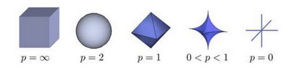
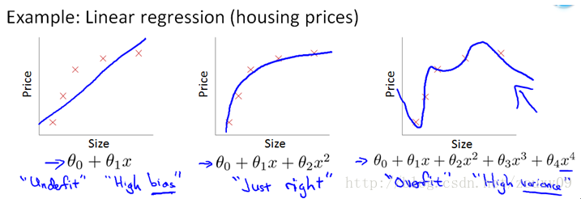

# 向量范数和矩阵范数

---
两个标量我们可以比较大小，比如 1，2，我们知道 2 比 1 大。但是现在如果是两个向量 $(1,2,1)$，$(2,2,0)$，我们如何比较大小呢？此时我们把一个向量通过不同的方法，映射到一个标量，从而可以比较大小，这个标量学名就叫做“范数”。

范数分为向量范数和矩阵范数。

向量 $x=[x_1,x_2,...,x_N]$。

```python
import numpy as np
X = np.array([-2, 5, 0, -3, 4])
# X 为 [-2 5 0 -3 4]
```

为 x 向量各个元素绝对值 $p$ 次方和的 $1/p$ 次方。

$$
\|x\|_p=(\sum_{i=1}^N|x_i|^p)^{1/p}
$$



上图表示了 p 从无穷到 0 变化时，三维空间中到原点的距离（范数）为 1 的点构成的图形的变化情况。

```python
# 向量 p-范数
def norm_p(X, p):
    return (sum([abs(x)**p for x in X])) ** (1.0/p)
norm_p(X, 1) # p 取 1，结果为 14.0
norm_p(X, 2) # p 取 2，结果为 7.348
norm_p(X, 3) # p 取 3，结果为 6.073
```

特殊地，当 $p$ 取 0，1，2，$\infty$，$-\infty$，时，对应范数意义如下。

- **向量 0-范数**：向量中非零元素的个数。

```python
# 向量零范数
def norm_0(X):
    return sum([1 for x in X if x])
norm_0(X)
# X 的零范数为 4
```

- **向量 1-范数**: 向量中各个元素绝对值之和。

    $$
    \|x\|_1=\sum\limits_{i=1}^N|x_i|
    $$

```python
# 向量 1-范数
def norm_1(X):
    return sum([abs(x) for x in X])
norm_1(X)
# X 的 1-范数为 14
```

- **向量 2-范数**: 向量中各个元素平方和的 $1/2$ 次方，L2 范数又称 Euclidean 范数（欧几里得范数），也就是通常说的向量长度。

    $$
    \|x\|_2=\left(\sum\limits_{i=1}^N|x_i|^2\right)^{1/2}
    $$

```python
# 向量 2-范数
def norm_2(X):
    return (sum([x*x for x in X])) ** (1.0/2)
norm_2(X)
# X 的 2-范数为 7.348
```

- **向量 $\infty$\-范数**：向量的正无穷范数即向量元素绝对值中的最大值。到原点的最远距离。

    $$
    \|x\|_\infty=\max\limits_{i}|x_i|
    $$

```python
# 向量无穷-范数
def norm_inf(X):
    return max([abs(x) for x in X])
norm_inf(X)
# X 的无穷-范数为 5
```

- **向量 $-\infty$\-范数**：向量的负无穷范数即向量元素绝对值中的最小值。到原点的最近距离。

    $$
    \|x\|_{-\infty}=\max\limits_i|x_i|
    $$

```python
# 向量负无穷-范数
def norm_finf(X):
    return min([abs(x) for x in X])
norm_finf(X)
# X 的负无穷-范数为 0
```

1. 正定性：$\|x\|\geq0$，当 $x=0$ 时，$\|x\|=0$。
2. 齐次性：$\|c\cdot x\| = c \|x\|$。
3. 三角不等式：$\|x+y\|\leq \|x\|+\|y\|$。

矩阵 $A=(a_{ij})_{m\ast n}$。

- **矩阵 0-范数**：标识矩阵中非零元素的个数。可以表示矩阵的稀疏程度。

- **矩阵 1-范数**：也称列和范数，即所有矩阵列向量的绝对值之和的最大值。

    $$
    \|A\|_1=\max\limits_j\sum\limits_{i=1}^m|a_{ij}|
    $$

- **矩阵 2-范数**：也称谱范数，即 $A^TA$ 的最大特征值开平方。

    $\|A\|_2 = \sqrt{max(\lambda_i)}$ 其中，$\lambda_i$ 是 $A^TA$ 矩阵的特征值，只有方阵才有 2-范数。

- **矩阵 $\infty$\-范数**：矩阵的 $\infty$\-范数，也称行和范数，即所有矩阵行向量的绝对值之和的最大值。

    $$
    \|A\|_\infty=\max\limits_i\sum\limits_{j=1}^m|a_{ij}|
    $$

- **矩阵 F-范数**：即 Frobenius 范数，矩阵元素的平方和再开平方。

    $$
    \|A\|_F=\left(\sum\limits_{i=1}^m\sum\limits_{j=1}^na_{ij}^2\right)^{1/2}
    $$

这玩意最难看懂，网上好多公式还是错的，写了代码实现。计算方法为 $A^TA$ 矩阵的最大特征值的开平方。

```python
import numpy as np
x = np.array([-1, 1, 0](-1,%201,%200))
print x
xtx = np.matmul(x.T, x)
print 'lambda  ', np.linalg.eigvals(xtx)
n2 = np.linalg.norm(x, ord = 2)
print 'norm_2  ', n2, np.sqrt(27.71086452)
```

程序执行结果：

```python
[[-1  1  0]
 [-4  3  0]
 [ 1  0  2]]
lambda   [ 27.71086452   0.03392256   4.25521292]
norm_2   5.26411099011  5.2641109904712309
```

矩阵 X 的 2-范数计算是先计算 $X^TX$ 的特征值 $\lambda_i$，然后找 $\lambda_i$ 中的最大值，再开方。代码里 xtx 即为 $X^TX$，eigvals 函数的返回值就是各个 $\lambda_i$。

矩阵第 m 行与第 n 列交叉位置的那个值，等于第一个矩阵第 m 行与第二个矩阵第 n 列，对应位置的每个值的乘积之和。


**矩阵的本质就是线性方程式，两者是一一对应关系。**

$$
\left\{
    \begin{array}{1}
        2x+y=3 \\
        4x+3y=7
    \end{array}
\right.
$$

$$
\left(
    \begin{array}{ll}
        2 & 1 \\
        4 & 3
    \end{array}
\right)
\left(
    \begin{array}{l}
        x \\
        y
    \end{array}
\right)
=
\left(
    \begin{array}{l}
        3 \\
        7
    \end{array}
\right)
$$

设 A 是 n 阶方阵，如果存在数 m 和非零 n 维列向量 x，使得 $Ax=mx$ 成立，则称 m 是矩阵 A 的一个特征值（characteristic value）或本征值（eigenvalue）。

机器学习中常用 L1 范数和 L2 范数来进行正则化，因为机器学习中往往需要最小化损失函数 Loss function，而最小化 Loss function 的过程中，模型参数不加以限制就容易导致过拟合，所以我们使用 L1 范数和 L2 范数把参数向量转化成一个可以度量的标量，同时加上最小化的约束，就达到了控制模型参数的目的从而防止过拟合。




- [《动手学深度学习》](http://zh.gluon.ai/)
- [https://ww2.mathworks.cn/help/matlab/ref/norm.html](https://ww2.mathworks.cn/help/matlab/ref/norm.html)
- [https://mathpix.com/](https://mathpix.com/)图片转公式貌似要收钱
- [NumPy 范数计算 | liao.cpython.org](http://liao.cpython.org/numpy11/)
- [理解矩阵乘法 | ruanyifeng.com](http://www.ruanyifeng.com/blog/2015/09/matrix-multiplication.html)阮一峰
- [https://blog.csdn.net/zouxy09/article/details/24971995](https://blog.csdn.net/zouxy09/article/details/24971995)
