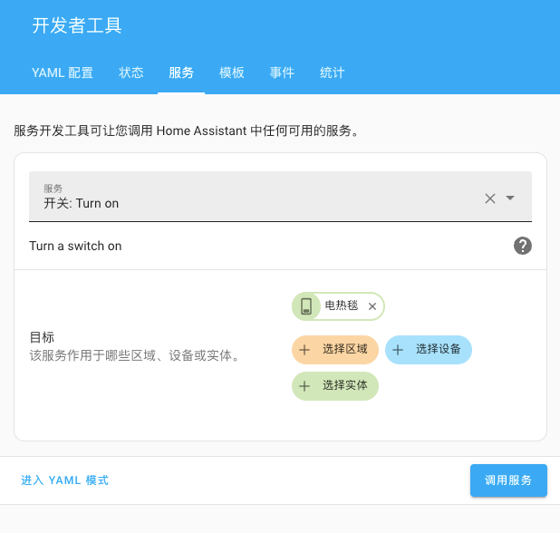

---
tags:
  - 开发/标记语言/YAML
  - 开源/软件/Home-Assistant
  - 开源/软件/Home-Assistant/HASS
  - 软件/iOS/Homekit
  - 软件/macOS/Homekit
  - 软件/iPadOS/Homekit
  - 开发/Xcode/Additional-Tools-for-Xcode
  - 开发/Xcode
  - 开源/软件/Home-Assistant/模式选择器
  - 开源/软件/Home-Assistant/空调控制器
  - 开源/软件/Home-Assistant/媒体选择器
  - 物联网/智能家居
  - 物联网/智能家居/Home-Assistant
  - 物联网/智能家居/Home-Assistant/HASS
  - 物联网/智能家居/Homekit
  - 运维/物联网
  - 操作系统/iOS
  - 操作系统/iPadOS
---

# 于 Homekit 中使用媒体播放器组件控制带有选项的智能家居设备

## 说明

### 问题根源

在使用 Home Assistant 将一些其他厂商提供的智能家居设备接入到 Home Assistant 并输出到 Homekit 作为一个配件时，往往会遭遇 Home Assistant 将带有多个选项的智能家居配件转换为在 Homekit 中的多个开关组合的配件，导致其使用起来非常不直观且困难，又因为开关组在 Homekit 中没有 **同一时刻有且仅有一个项目** 激活的限制，经常会出现点选了其他的开关来对配件进行模式和状态切换的时候会出现两个开关在某一个短时时间段内都会处于开启的状态，过一段时间之后才会将原先的开关状态关闭的问题。

### 当前困境

我们在入秋的时候购买了一个支持接入米家的电热毯，电热毯本身是支持多个档位的选择、甚至是运行模式的选择的，而如果我们直接接入到 Home Assistant 中再转发到 Homekit 的话就会发现它被转换成了多个开关，而且名字也都是晦涩难懂的 Gear 1、Gear 2、Gear 3 之类的，这并不利于我们的使用，我期望找到一个解决办法，可以让电热毯在 Homekit 中也拥有「选择器」的功能。

## TL;DR

用 `input_select` 和 `media_player` 组件来实现。

::: details 展开以查看 config/configuration.yaml 是如何配置的

```yaml
input_select:
  electric_blanket_heat_level:
    name: '电热毯温度档位'
    options:
      - '1 档'
      - '2 档'
      - '3 档'
    icon: 'mdi:application'

media_player:
  - platform: universal
    unique_id: 'ihome_cat_electric_blanket'
    name: '电热毯'
    device_class: tv
    attributes:
      state: switch.hddz_zndrt_d3d8_electric_blanket
      source: select.hddz_zndrt_d3d8_heat_level
      source_list: input_select.electric_blanket_heat_level|options
    commands:
      turn_on:
        service: switch.turn_on
        data: {}
        target:
          entity_id: switch.hddz_zndrt_d3d8_electric_blanket

      turn_off:
        service: switch.turn_off
        data: {}
        target:
          entity_id: switch.hddz_zndrt_d3d8_electric_blanket

      select_source:
        service: select.select_option
        data:
          option: >
            
            {{ source_map[source] if source in source_map else 'Gear 1' }}
        target:
          entity_id: select.hddz_zndrt_d3d8_heat_level
```

:::

## 开始动手吧

### 探索可能的替代配件

为了解决如此使用困难的问题，我尝试在 Home Assistant 中配置了其支持的基础集成 [Input Select](https://www.home-assistant.io/integrations/input_select/) ，希望能在 Homekit 中看到类似于空调运行模式和电视输入选择的模块，但事实证明，使用 Input Select 集成是无法让 Homekit 将其展示为多个模式、多个状态切换的配件的，查阅资料后才了解，Homekit 是有预先定义和限制了配件的组件和工作方式的[^1]，这也解释了为什么像是米家和 Aqara 的配件往往在 Homekit 中会显得简陋，而在他们自己的第三方 App 中功能就会变得繁多起来。

> [!TIP] 小贴士
> 如果你想要了解 Homekit 所支持的配件类型，可以在 [More Downloads for Apple Developers](https://developer.apple.com/download/more/?=for%20Xcode) 页面登录 Apple ID 后下载开头名为「Additional Tools for Xcode」的工具集[^2]，然后在下载获得的文件夹中找到「HomeKit Accessory Simulator」应用程序，你可以直接双击打开，也可以先拖放到 macOS 的应用程序文件夹再打开，具体的使用教程可以参考官方的文档：[Testing your app with the HomeKit Accessory Simulator](https://developer.apple.com/documentation/homekit/testing_your_app_with_the_homekit_accessory_simulator)。
>
> **注意：TV（电视或智能电视）类型的配件是无法通过 Homekit Accessory Simulator 进行模拟的（我此时无法找到相关的开发工具，也许是需要单独的应用程序支持才能进行模拟）。**

那我们换一条路，也许你知道，在众多配件与 Homekit 所兼容的配件中，**电视** （通常是智能电视，比如 LG 和 Sony 的电视）和 **空调控制器** （通常在中国大陆是作为 **空调伴侣** 的形式出现）是最明显的能支持模式选择器的两个设备（我通过 HomeKit Accessory Simulator 没有找到更接近或者更类似的设备，如果大家阅读本文之后有尝试找到更适合的 Homekit 配件的话也可以在本知识库的 GitHub 仓库提交 Issue 告知）。

<div flex justify-center text-center space-x-4>
  <div flex-1>
    
    <p>电视配件</p>
  </div>
  <div flex-1>
    
    <p>空调配件</p>
  </div>
</div>

在上面的两个图中，电视可以通过「信号源选择器」来选择信号源，而空调可以通过「空调模式选择器」来选择空调运行的模式。一目了然的是空调组件会多出一个超大的「目标温度」和「温度选择滑块」，这对于电热毯而言显得有些多余，毕竟电热毯是不会有 **目标温度** 这个概念的，而且电热毯的温度是通过档位来调节的，而不是通过温度来调节的，因此我们得出结论：我们需要将电热毯作为一个带有 **信号源选择器** 的电视来进行模拟。

### 在 Home Assistant 中编辑配置文件

Home Assistant 的配置文件分类和整理是另一个更大的话题，本文中我们将专注于编辑和修改 Home Assistant 的默认根配置文件 `config/configuration.yaml`。

通常而言，默认的配置文件将会是类似下面的样子：

```yaml
# Configure a default setup of Home Assistant (frontend, api, etc)
default_config:

group: !include groups.yaml
automation: !include automations.yaml
script: !include scripts.yaml
scene: !include scenes.yaml
```

为了能够存储和控制我们的电热毯，我们需要在 `config/configuration.yaml` 文件中添加两个根属性： `input_select`（对应 [Input Select](https://www.home-assistant.io/integrations/input_select/) 集成） 和 `media_player`（对应 [Media Player](https://www.home-assistant.io/integrations/media_player/) 集成和 [Universal Media Player](https://www.home-assistant.io/integrations/universal/) 集成）：

```yaml
# Configure a default setup of Home Assistant (frontend, api, etc)
default_config:

group: !include groups.yaml
automation: !include automations.yaml
script: !include scripts.yaml
scene: !include scenes.yaml

input_select: # [!code ++]
media_player: # [!code ++]
```

#### 编辑 `input_select` 配置

接下来我们需要在 `input_select` 中添加一个 `electric_blanket_heat_level` 的输入选择器，用来存储电热毯可选的温度档位：

```yaml
input_select:
  electric_blanket_heat_level: # [!code ++]
    name: '电热毯温度档位' # [!code ++]
    options: # [!code ++]
      - '1 档' # [!code ++]
      - '2 档' # [!code ++]
      - '3 档' # [!code ++]
    icon: 'mdi:application' # [!code ++]
```

##### 配置说明

```yaml
input_select:
  electric_blanket_heat_level: # [!code focus]
    name: '电热毯温度档位'
    options:
      - '1 档'
      - '2 档'
      - '3 档'
    icon: 'mdi:application'
```

`electric_blanket_heat_level` 是我们自定义的输入选择器的实体 ID（在 Home Assistant 中为 `entity_id`），这个字段值可以随意定义，但是需要保证在整个 Home Assistant 中的 `input_select` 下是唯一的。稍后我们可以通过 `input_select.electric_blanket_heat_level` 来引用这个输入选择器。

```yaml
input_select:
  electric_blanket_heat_level:
    name: '电热毯温度档位' # [!code focus]
    options: # [!code focus]
      - '1 档' # [!code focus]
      - '2 档' # [!code focus]
      - '3 档' # [!code focus]
    icon: 'mdi:application' # [!code focus]
```

`name` 是输入选择器的名称，`options` 是输入选择器的选项，`icon` 是输入选择器的图标。

现在我们将配置文件保存，在右手边侧边栏中选择「开发者工具」-> 点选「YAML 配置」Tab -> 在下方「配置检查与重启」一栏中点击「检查配置」，如果 Home Assistant 提示「配置不会阻止 Home Assistant 启动！」，则说明配置文件没有问题，可以点击「重启启动」按钮重启 Home Assistant。

等待重启后我们就能通过右手边侧边栏中选择「开发者工具」-> 点选「状态」Tab -> 在下方「实体」 -> 「输入筛选实体」一栏中输入 `input_select.electric_blanket_heat_level` 来查看我们刚刚添加的输入选择器。应当能看到如下图一样的界面：

<div flex flex-col justify-center text-center>
  <div>
    
    <p>输入选择器实体状态</p>
  </div>
</div>

#### 编辑 `media_player` 配置

##### 配置基础信息

接下来我们需要在 `media_player` 中添加一个 `platform` 为 `universal` 的媒体播放器，用来控制电热毯：

```yaml
media_player:
  - platform: universal # [!code ++]
    unique_id: 'ihome_cat_electric_blanket' # [!code ++]
    name: '电热毯' # [!code ++]
    device_class: tv # [!code ++]
```

```yaml
media_player:
  - platform: universal
    unique_id: 'ihome_cat_electric_blanket' # [!code focus]
    name: '电热毯'
    device_class: tv # [!code focus]
```

注意这里的 `unique_id` 是可选的，如果你也要填写这个字段的话，需要保证在整个 Home Assistant 中的 `media_player` 下是唯一的。为了让 Homekit 将我们的「电视型电热毯」展示为一个正确的电视配件，我们需要将 [`device_class`](https://www.home-assistant.io/integrations/universal/#device_class) 设置为 `tv`。

##### 配置 `attributes`

```yaml
media_player:
  - platform: universal
    unique_id: 'ihome_cat_electric_blanket'
    name: '电热毯'
    device_class: tv
    attributes: # [!code ++]
      state: switch.hddz_zndrt_d3d8_electric_blanket # [!code ++]
      source: select.hddz_zndrt_d3d8_heat_level # [!code ++]
      source_list: input_select.electric_blanket_heat_level|options # [!code ++]
```

我们添加了 `attributes` 和其附属的属性字段。这里的 `attributes` 是一个字典。

1. `state` 对应的是开关状态，当我们在媒体播放器中选择开关打开的时候，`state` 的值就会变成 `on`，反之，`state` 的值就会变成 `off`。
2. `source` 对应的是当前选中的信号源，当我们在媒体播放器中选择信号源 1 的时候，`source` 的值就会变成 `1`。
3. `source_list` 对应的是信号源列表，是一个数组

```yaml
media_player:
  - platform: universal
    unique_id: 'ihome_cat_electric_blanket'
    name: '电热毯'
    device_class: tv
    attributes:
      state: switch.hddz_zndrt_d3d8_electric_blanket
      source: select.hddz_zndrt_d3d8_heat_level
      source_list: input_select.electric_blanket_heat_level|options # [!code focus]
```

注意这里的 `attributes` 的 `source_list` 是 `input_select.electric_blanket_heat_level|options` 作为字段值，别把 `|options` 漏掉了，这是 Home Assistant 的模板语法，用来获取 `input_select` 实体的选项列表。

##### 配置 `commands`

有了基础的状态，我们现在可以开始配置能操作 `media_player` 的命令（`commands`）了。这些命令将在我们通过 Home Assistant 或者是 Homekit 来操作「电视型电热毯」的时候被调用。

```yaml
media_player:
  - platform: universal
    unique_id: 'ihome_cat_electric_blanket'
    name: '电热毯'
    device_class: tv
    attributes:
      state: switch.hddz_zndrt_d3d8_electric_blanket
      source: select.hddz_zndrt_d3d8_heat_level
      source_list: input_select.electric_blanket_heat_level|options
    commands:  # [!code ++]
      turn_on:  # [!code ++]
        service: switch.turn_on  # [!code ++]
        data: {}  # [!code ++]
        target:  # [!code ++]
          entity_id: switch.hddz_zndrt_d3d8_electric_blanket  # [!code ++]

      turn_off:  # [!code ++]
        service: switch.turn_off  # [!code ++]
        data: {}  # [!code ++]
        target:  # [!code ++]
          entity_id: switch.hddz_zndrt_d3d8_electric_blanket  # [!code ++]

      select_source:  # [!code ++]
        service: select.select_option  # [!code ++]
        data:  # [!code ++]
          option: >  # [!code ++]
              # [!code ++]
            {{ source_map[source] if source in source_map else 'Gear 1' }}  # [!code ++]
        target:  # [!code ++]
          entity_id: select.hddz_zndrt_d3d8_heat_level  # [!code ++]
```

现在 `commands` 下新增了 `turn_on`、`turn_off` 和 `select_source` 三个命令，分别对应了开关电热毯的开和关的操作以及选择信号源的操作。

>  小贴士
>
> 我们在不了解实体之前，如何知道如何配置命令下面的服务呢？
> 其实我们可以借助于 Home Assistant 的开发者工具，在右手边侧边栏中选择「开发者工具」-> 点选「服务」Tab，然后在「服务」下拉框中选择 `switch.turn_on`，在「实体」下拉框中搜索我们想要的实体，此处我们选择 `switch.hddz_zndrt_d3d8_electric_blanket`，然后点击「调用服务」。
>
> <div flex flex-col justify-center text-center>
>   
>   <p>通过服务直接调用 switch 类型的实体的 turn_on 服务</p>
> </div>
>
> 点击调用服务之后，我们返回「状态」Tab 再次检查 `switch.hddz_zndrt_d3d8_electric_blanket` 的状态，可以看到状态已经变成了 `on`，这说明我们的操作是成功的。
>
> 如果你的智能设备需要使用别的类型的服务完成操作，也可以先通过在右手边侧边栏中选择「开发者工具」-> 点选「状态」Tab，并搜索实体的状态和附属的实体信息来决定如何调用服务。

```yaml
    commands: # [!code focus]
      turn_on: # [!code focus]
        service: switch.turn_on # [!code focus]
        data: {} # [!code focus]
        target: # [!code focus]
          entity_id: switch.hddz_zndrt_d3d8_electric_blanket # [!code focus]

      turn_off: # [!code focus]
        service: switch.turn_off # [!code focus]
        data: {} # [!code focus]
        target: # [!code focus]
          entity_id: switch.hddz_zndrt_d3d8_electric_blanket # [!code focus]
```

开和关这两个命令的 `service` 都是 `switch.turn_on` 和 `switch.turn_off`，`target` 都是 `switch.hddz_zndrt_d3d8_electric_blanket`，由于是 `switch` 类型的实体，不需要 `data` 字段，所以此处 `data` 留空就好。

```yaml
      select_source:
        service: select.select_option # [!code focus]
        data:
          option: >
            
            {{ source_map[source] if source in source_map else 'Gear 1' }}
        target: # [!code focus]
          entity_id: select.hddz_zndrt_d3d8_heat_level # [!code focus]
```

最后一个属性！`select_source` 将会在我们选择该媒体播放器的信号源（信号源）时被调用，在这份例子中，我们为电热毯选择档位时，`select_source` 就会被调用。此处由于我们需要操作的目标对象（即最下方的 `target.entity_id` 指向的电热毯温度档位实体 `select.hddz_zndrt_d3d8_heat_level` 是一个 `select` 实体，所以我们需要调用 `select.*` 相关的服务），所以 `service` 为 `select.select_option`。

```yaml
      select_source:
        service: select.select_option
        data: # [!code focus]
          option: > # [!code focus]
             # [!code focus]
            {{ source_map[source] if source in source_map else 'Gear 1' }} # [!code focus]
        target:
          entity_id: select.hddz_zndrt_d3d8_heat_level
```

接下来是 `data` 字段，`data` 字段是一个对象，用于包含我们需要传递给服务的数据。

为了方便我们在 Homekit 和 Home Assistant 中使用方便，此处我们还使用了 Home Assistant 的模板功能将我们在 `input_select` 中配置的选项映射为 `select` 实体的选项。

> [!TIP] 小贴士
>
> 其实我们可以借助于 Home Assistant 的开发者工具，在右手边侧边栏中选择「开发者工具」-> 点选「模板」来对模板进行调试，这样我们就可以在 Home Assistant 中直接调试模板了。
>
> <div flex flex-col justify-center text-center>
>   
>   <p>对模板进行预览和调试</p>
> </div>
>
> 在上图中我们直接将刚刚配置的模板粘贴到了模板编辑器中，可以看到当我们传入 `source` 为 `二档` 时，模板的输出为 `Gear 2`，这就是我们想要的结果。

我们通过模板语法定义了一个名为 `source_map` 的变量，里面存储一个字典，字典中将会把我们的中文档位选项映射到 `Gear 1`, `Gear 2`, `Gear 3` 上。这个 `Gear 1` 的值是通过在右手边侧边栏中选择「开发者工具」-> 点选「状态」Tab，搜索 `select.hddz_zndrt_d3d8_heat_level` 了解到的，这个实体中包含了 `Gear 1`, `Gear 2`, `Gear 3` 三个档位的选项值，所以我们映射的目标也就是这三个值。

在模板的最后一行中我们通过

```yaml
{{ source_map[source] if source in source_map else 'Gear 1' }}
```

将选中的 `source` 的值通过 `source_map` 进行映射并输出映射到的值，如果 `source` 的值不在 `source_map` 中，那么就使用 `Gear 1` 作为默认值。

到这里就大功告成啦！

### 最终效果

<div flex flex-col justify-center text-center>
  <video controls muted>
    <source src="./assets/homekit-use-media-player-as-a-controller-record-01.mov" type="video/mp4">
  </video>
  <p>在 Home Assistant 中操作</p>
</div>

<div flex flex-col justify-center text-center>
  <video controls muted>
    <source src="./assets/homekit-use-media-player-as-a-controller-record-02.mov" type="video/mp4">
  </video>
  <p>在 Homekit 中操作</p>
</div>

## 总结

这里只是用能接入米家的电热毯作为例子讲解了如何使用电视配件来控制电热毯，但我想这个方法应该可以用于任何能接入 Home Assistant 的设备。祝大家玩的开心！

## 参考资料

[如何为通用媒体播放器的信号源创建别名 - 媒体播放器信号源概述 - Home Assistant Community](https://community.home-assistant.io/t/media-player-universal-source-in-overview/135331/3)

## 延伸阅读

[Jinjia 模板文档 — Jinja Documentation (3.2.x)](https://jinja.palletsprojects.com/en/latest/templates/)

[使用模版 - Home Assistant](https://www.home-assistant.io/docs/configuration/templating/)

[通用媒体播放器 - Home Assistant](https://www.home-assistant.io/integrations/universal/)

[^1]: Apple 开发者文档中提及了 Homekit 配件的两个关键类型，一个是 [配件服务类型（Accessory Service Types）](https://developer.apple.com/documentation/homekit/hmservice/accessory_service_types) ，另一个是 [配件特征 类型（Characteristic types）](https://developer.apple.com/documentation/homekit/hmcharacteristic/characteristic_types)
[^2]: Apple 提供了 macOS 端的 HomeKit Accessory Simulator 应用程序来支持让开发者通过 macOS 模拟 Homekit 配件，教程：[Testing your app with the HomeKit Accessory Simulator](https://developer.apple.com/documentation/homekit/testing_your_app_with_the_homekit_accessory_simulator)
