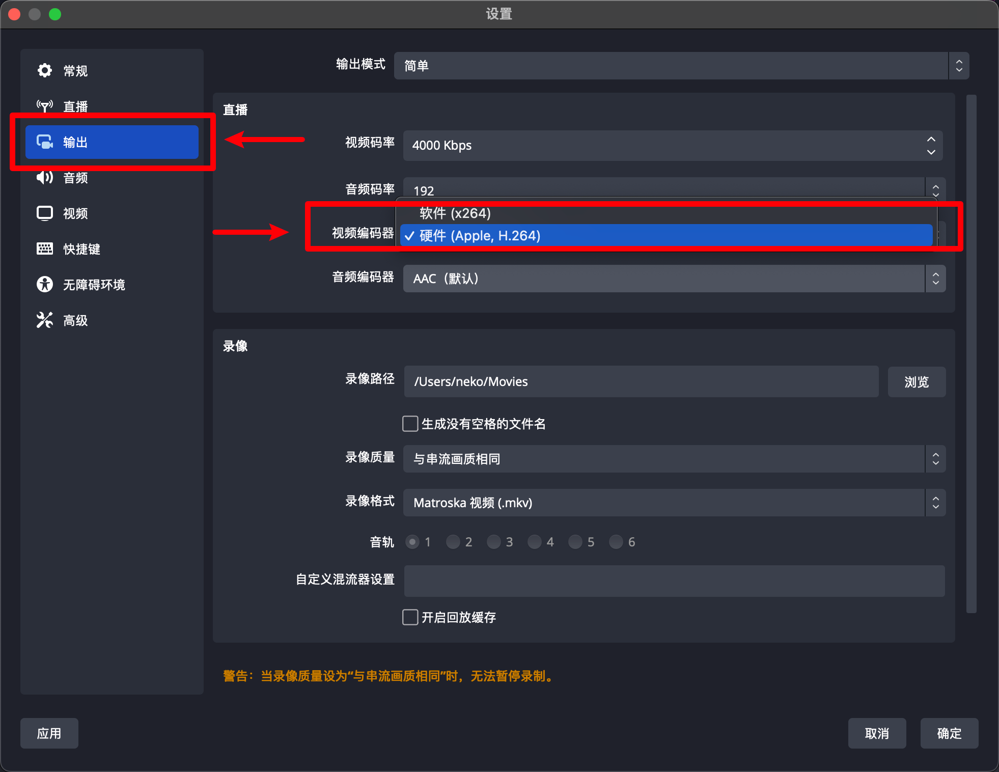
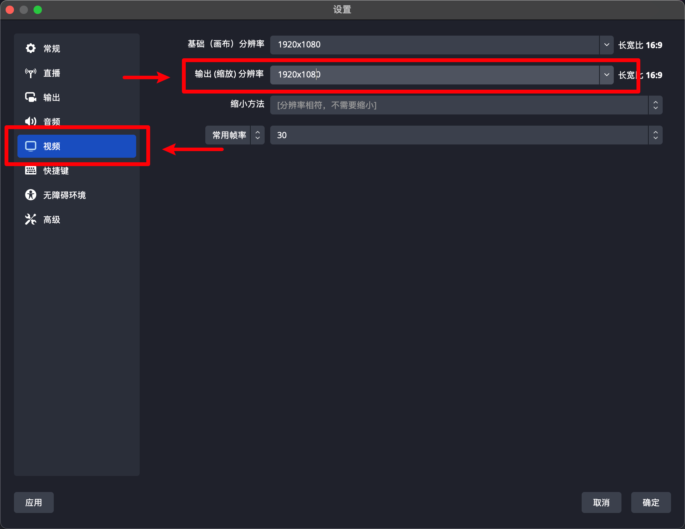

---
tags:
  - 软件/串流
  - 软件/直播
  - 软件/开源/OBS
  - 操作系统/macOS
  - 软件/macOS
---
# 优化直播的时候 OBS 会造成 macOS 卡顿的问题

## 说明

这两天在尝试 VTuber 直播的时候觉得 macOS 在开启 OBS 直播的时候负载会变的很高很卡，导致 VSCode 整个的帧率都下跌得厉害，尤其是在多个屏幕同时输出的时候会变的更加明显，更别提是在面向 Kubernetes 进行开发和进行前端的实时编译和打包了：

截图里面的负载算是比较低的水平，实际情况下可能会飙升到 170% 甚至是 200% 的用量，导致整体用户的 CPU 负载提升到 50% 到 60%。

这里面可以有好几个点可以优化：

1. 默认情况下 OBS 采用的是软件编解码视频，可以通过修改 OBS 来采用 Apple Silicon 内置的专用视频芯片来进行硬件编解码来缓解软件编解码方案造成的系统负载过高；
2. 修改和降低 OBS 的码率和分辨率；
3. 使用采集卡在另外一台专用推流的设备编解码和串流视讯信号。

在这个文档中将会讲解其中两种方案的配置方案。

## 采用硬件编码器

在 OBS 中，可以点击「设置」-「输出」-「视频编码器」来修改视频编码器为先前提及的 Apple Silicon 视频编码器：

## 采用较低的码率

码率是**单位时间内视频（或音频）的数据量**，即每一帧画面中的信息密度，越高的时候，信息量越大；这在运动的画面中会显得更加明显。

如果配置了较低的码率，而画面中出现了动画、运动、转场，这个时候就会出现模糊的情况，直播写代码的时候可以稍微调低一些，但是直播游戏和其他动画相关的画面的时候不可以设置得太低，否则画面会很模糊。

在 OBS 中，可以点击「设置」-「输出」-「视频码率」来修改编码视频的时候的视频码率：

## 采用较低的分辨率

分辨率就是输出的像素密度，这与码率有不同的含义，大概可以把分辨率理解为直播画面的模糊下限，而码率是上限。

在 OBS 中，可以点击「设置」-「视频」-「输出画布分辨率」来修改输出视频的分辨率：

