---
tags:
  - 软件/开源/OBS
  - 媒体/直播
  - 媒体/Vtuber
  - 操作系统/macOS
  - 网站/Twitch
  - 媒体/Vtuber/NeuroSama
  - 媒体/Vup
  - 媒体/Vup/撕梓咩
  - 媒体/Vup/Suzume
---
# 在 macOS 上作为 Vtuber 进行直播

最近天天看 [Suzume](https://space.bilibili.com/6610851/) 和 [Neuro Sama](https://www.twitch.tv/vedal987)，已经彻底地被**耳濡目染**了啊！

整得我也想套皮直播。又因为我之前在 Booth.me 上是买过 3D 的 VRChat 的皮的，觉得这个事情似乎没有想象中这么复杂，于是我就去找了找现有的 macOS 直播 VTuber 的方案。

很庆幸的是，我真的找到了一个 UI/UX 虽然有点小复杂，但是还算不错的方案，在这里分享给大家！

## 配置直播软件 OBS

在 OBS 的官网 [Open Broadcaster Software | OBS (obsproject.com)](https://obsproject.com/) 就可以下载到 OBS 啦，网上有很多教程教过了这里就不赘述了。

<AppContainer href="https://obsproject.com/">
  <template #image>
    
  </template>
  <template #name>
    OBS
  </template>
  <template #by>
    OBS Project
  </template>
</AppContainer>

安装完成之后在来源分栏中点击右键，然后点选「添加」，再点选「macOS 屏幕采集」就可以添加显示屏采集了：

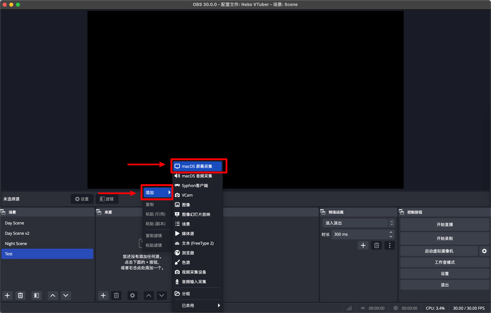

添加之后应该是这样的：

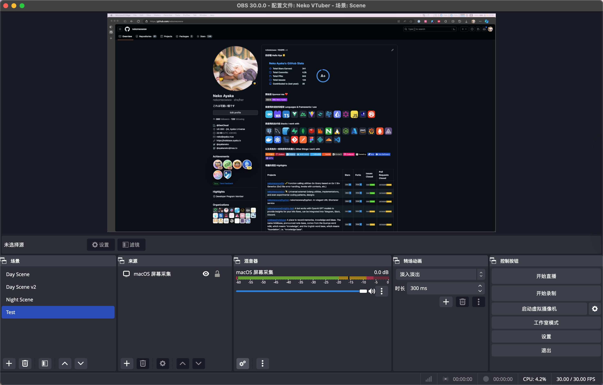

## 安装面捕和动捕软件 [VCam](https://vcamapp.com/en)

我在这期间找到了非常多的 VTuber 软件，其中只有 [VCam](https://vcamapp.com/en)（它也是开源的，开源在 [vcamapp/app](https://github.com/vcamapp/app)）的 UI，兼容性，适配性和功能效果上让我比较满足。

<AppContainer href="https://vcamapp.com/en">
  <template #image>
    
  </template>
  <template #name>
    VCam
  </template>
  <template #by>
    Tatsuya Tanaka
  </template>
</AppContainer>

> 其他的软件我将会在之后的笔记中包含，如果阅读完之后觉得我选择的软件不够好的话，也可以把本文档收藏起来之后等过两天再来看看对于不同软件不同效果的介绍。

### 操作概览

1. 在 [VCam 的 GitHub 上的 Release 页面](https://github.com/vcamapp/app/releases) 上下载最新版本的 VCam
2. 安装 VCam

### 开始吧

官方建议的下载地点在 [VCam 的 GitHub 上的 Release 页面](https://github.com/vcamapp/app/releases)上，所以在 Release 页面中寻找最新版本的 VCam 下载即可：

接下来可以执行正常的 Mac App 的安装步骤来进行安装。

> [!TIP] 如果安装的时候有个「」图标，或者如果开启之后报错
>
> 这意味着下载到了与当前 macOS 版本不兼容的 VCam 版本。
>
> 可以在 [VCam 的 GitHub 上的 Release 页面](https://github.com/vcamapp/app/releases) 上再往前找一个版本来下载，一直这样操作直到找到可以用的 VCam 版本就好了！
>

::: details 如何安装？

没问题，教你。

在上面的链接和页面上点击下载了拓展名为 `.dmg` 的文件之后，可以在浏览器的下载窗口中，或者 macOS 的「访达（Finder）」的「下载目录（Downloads）」中找到这个由 `VCam` 开头，由 `.dmg` 结尾的文件，双击这个文件之后将会打开下面这样的窗口：

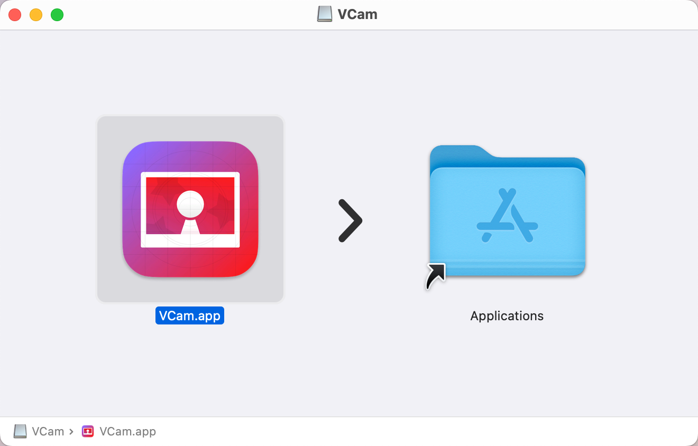

在 macOS 上，这样的窗口是用来安装应用程序的，和 Windows 以及 Linux 的很多应用程序的安装逻辑不同，绝大多数 macOS 的软件都会附带一个 `.dmg` 这样的文件，你可以把它理解成一个虚拟的小 U 盘，在这个 U 盘里面有一个独立的窗口教你如何将小 U 盘的应用程序安装到本地的 macOS 电脑上。

接下来我们安装，在安装的时候，按住触控板或者鼠标左键，将 `VCam.app` 的图标连根拔起，拖拽到右侧的 `Applications` 目录的顶部，然后放手即可。

记得哦，这就是一个虚拟的 U 盘，请不要在打开了这个小小的独立窗口之后就直接运行里面的 `VCam.app`，这样是行不通的，macOS 一般情况下也会弹窗提示警告你。

与此同时，正因为它是一个虚拟的小 U 盘，我们也要像往常一样记得将 U 盘弹出 ⏏️。你可以

1. 在当前界面下按下 <kbd data-macos-keyboard-key="command">command</kbd> + <kbd>E</kbd> 来弹出
2. 在访达（Finder）中左侧的侧边栏中找到 VCam 的虚拟 U 盘栏位，点击它右侧的 ⏏️ 图标就可以完成弹出
3. 在桌面上找到 VCam 的虚拟 U 盘图标，右键点击「弹出」即可完成弹出

到这里，你就完成了安装的步骤了。恭喜！

:::

安装完成之后在

- 启动台找到 VCam 的图标
- 在访达（Finder）的「应用程序（Applications）」目录下找到 `VCam.app`
- Spotlight 中输入 VCam

然后打开就可以开始尝试配置和使用了！

::: details 什么？你不记得图标长什么样子了？

没问题！它的图标是这样的，找找有没有类似的吧！

<AppContainer href="https://vcamapp.com/en">
  <template #image>
    
  </template>
  <template #name>
    VCam
  </template>
  <template #by>
    Tatsuya Tanaka
  </template>
</AppContainer>

:::

## 配置面捕和动捕软件 [VCam](https://vcamapp.com/en)

> VCam 说实话还是有点点反人类，但是它已经是我能找到的足够好的软件了，之后如果有更好的软件我也会更新一下这篇文档让大家都能用上比较好用的 Vtuber 直播工具！

> 模型需要提前准备吗？

不需要！我们先配置，然后之后会教如何通过 VRoid Studio 这样的软件自己捏人的！开启 VCam 之后的模型是开源的模型，也可以自己拿来直播玩玩看w

### 操作概览

1. 授予摄像头权限
2. （可选）授予麦克风权限
3. 授予安装虚拟摄像头驱动的权限
4. 配置绿幕需要的绿色背景

### 授予权限

首次安装之后点击打开将会遇到很多权限相关的报错。

比如下面有关摄像头权限的申请弹窗：

这其中有很多个权限和涉及到授权安装和激活系统拓展的步骤：

1. 授予摄像头权限
2. 授予安装虚拟摄像头驱动的权限

对于第二个权限，最乐观的情况下是它会先提示并且申请安装虚拟摄像头，但是你也可能会遇到报错说依然无法安装，这个时候需要参考[重要：授予安装虚拟摄像头驱动的权限](#重要-授予安装虚拟摄像头驱动的权限)章节的指引进行进一步操作和确认了。

> [!CAUTION] 操作前须知
>
> - 在默认的行为情况下，VCam 在通过左上角的「Quit（退出）」或者是通过 <kbd data-macos-keyboard-key="command">command</kbd> + <kbd>Q</kbd> 退出之后**依然会在背景运行**，你必须要到菜单栏中找到 VCam 的框框图标之后点击「Quit（退出）」才能完全干净地退出。
> - 如果遇到了什么奇怪的卡死无法退出的时候，可以选择打开 macOS 的任务管理器「活动监视器」搜索 VCam 并点选 🛑 图标来退出或者强制退出。
> - 无论是什么权限，为了确保后续的步骤正常，建议最好每次授权之后都重启一下应用程序。

接下来开始配置吧，我们按照它的要求来打开「系统设置」即可进行后续的配置。

::: details 系统设置没有自动打开？

如果没有打开，可以通过点击左上角的「🍎」然后，点选「系统设置...」来打开。

或者在 Spotlight 中输入查找「系统设置」打开即可。

:::

#### 重要：授予摄像头权限

要给它授权摄像头权限的话，它应该会自动打开到摄像头相关的权限界面，这个时候我们需要二次确认是否是「隐私与安全性」设置一栏的「摄像头」相关权限列表，在这个列表中可以找到 VCam 的图标和应用程序名称，点选右侧的按钮打开即可，这意味着我们授权 VCam 使用和访问我们摄像头的信息。

::: details 没有自动打开到这个摄像头权限配置页面？

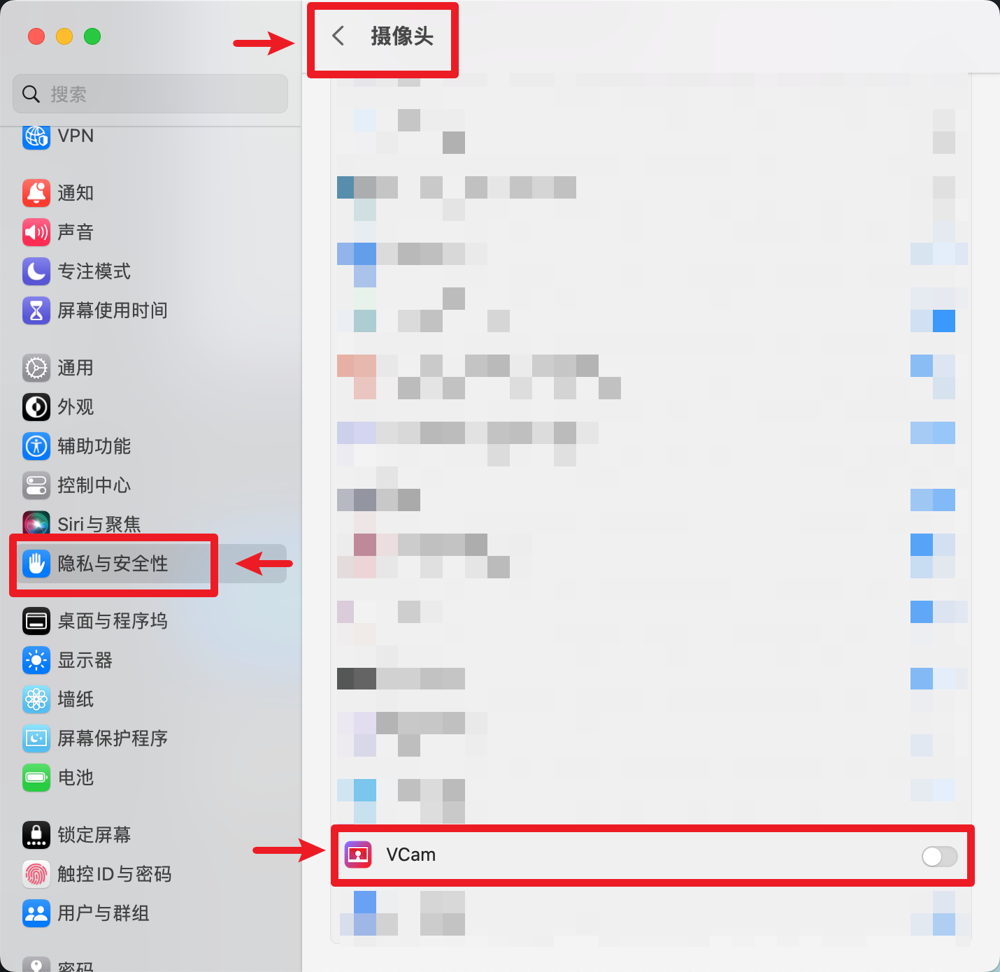

1. 先点选左上角的「🍎」然后，点选「系统设置...」来打开系统设置；
2. 在左侧的栏目中找到「隐私与安全性」，点选「隐私与安全性」；
3. 在列表中找到「摄像头」，点选「摄像头」；
4. 然后确认并执行上面说的权限授权操作吧。

:::

> [!WARNING] 权限不生效吗？
>
> 如果在之后的步骤中执行完成之后还是发现无法获得相关的权限，可以考虑完全重启一下 VCam 应用程序本身。

#### 可选：授予麦克风权限

如果你打算使用 VCam 支持的通过麦克风收音大小来判断人物模型是否张嘴的功能的话，你也需要和上面的步骤一样，配置一下麦克风的访问授权。

> [!WARNING] 权限不生效吗？
>
> 如果在之后的步骤中执行完成之后还是发现无法获得相关的权限，可以考虑完全重启一下 VCam 应用程序本身。

#### 重要：授予安装虚拟摄像头驱动的权限

VCam 支持安装一个虚拟的摄像头驱动以方便作为一个「摄像头」的输入源集成和添加到我们先前安装的用于直播和推流的 OBS 软件中。

一般而言在安装之后就会尝试安装这个虚拟摄像头，我们按照步骤要求进行安装即可，但是如果提示安装失败，那么就有可能看到下面画面中的右下角的提示：

但是不必惊慌。

我们可以到左上角的 VCam 的「Setting（设置）」中配置所谓「Virtual Camera（虚拟摄像头）」的安装。

进入到这个页面之后就可以看到指引和提示，让我们去「系统设置」应用程序中对「隐私和安全性」进行配置，允许 VCam 希望安装的虚拟摄像机的拓展的安装请求：

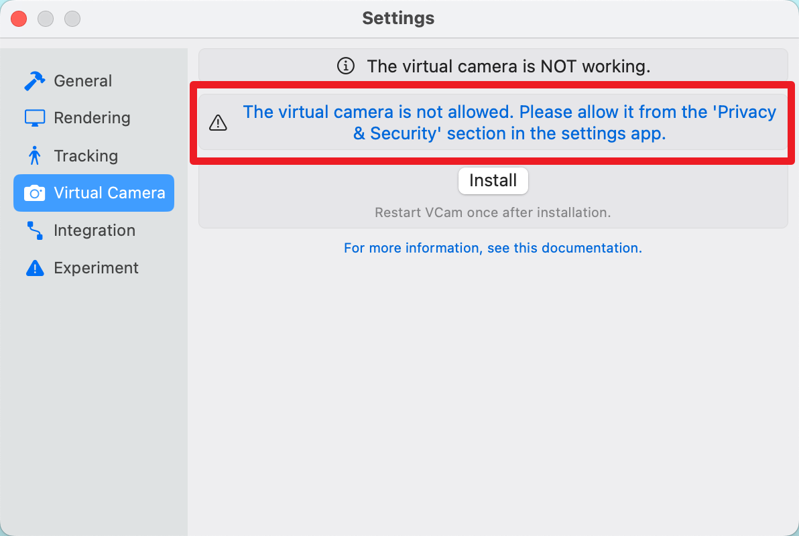

这个时候前往「系统设置」-左边侧边栏的「隐私与安全性」-「安全性」下方应该就能看到有一行提示：

> 来自应用程序 "VCam.app" 的系统软件已被阻止载入。

这个时候我们点选允许就好了。

允许之后我们返回到刚才的弹窗界面中，选择「Install」就可以执行安装操作：

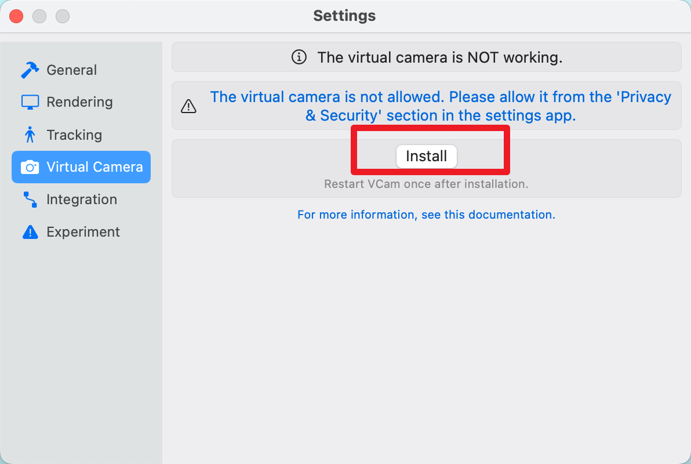

当我们看到下面这样的提示说「Success」之后就意味着成功了！

> [!CAUTION] 需要重启
>
> 绝大多数情况下，安装成功之后它都会变的有点 Buggy，建议退出 VCam 应用程序，让它以能检测到安装的虚拟摄像头插件交互的状态重新启动一次。

### 配置绿幕需要的绿色背景

等再次打开 VCam 的时候，就能看到右下角没有错误提示了！

现在可以试着动动脑袋，动动手，动动眼睛，里面的人物应该能够正常进行活动和追踪的，也就是所谓的「面捕」和「动捕」。

接下来我们要配置的是直播和录制软件 OBS 在直播的时候需要的「绿幕」，现在我们的人物在 VCam 中处于一个淡蓝色背景的空间内，这不利于 OBS 的背景裁切，一般情况下，我们会选择把背景和空间配置为纯粹的绿色来方便「背景移除」这样的操作。

在 VCam 里面配置环境其实非常简单，点击屏幕左下方「🎨」（调色板）按钮，就可以看到弹出的颜色选择器：

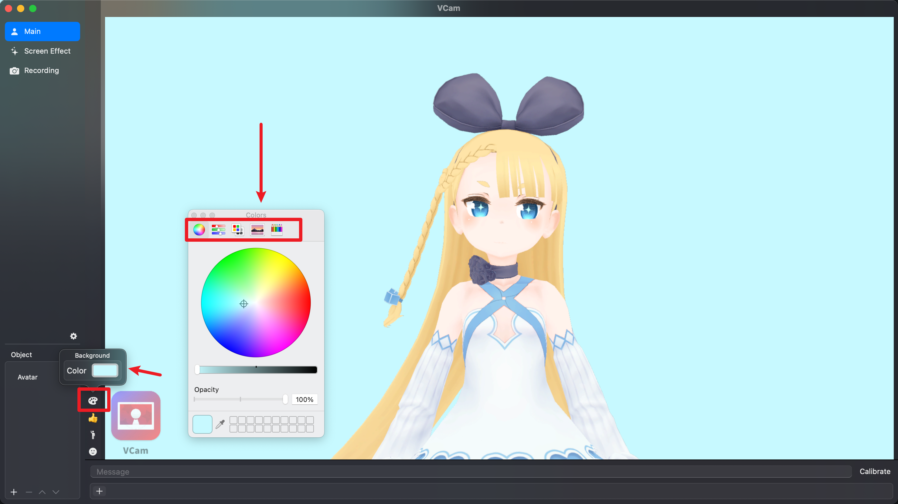

在这个 macOS 系统自带的颜色选择器中，可以看到上方有一排模式选择，我们需要「点击第二个 Tab」来激活滑块选择器。

在接下来的滑块选择器界面的第一个下拉选择器中，我们要选择「RGB Sliders（RGB 滑块选择器）」来方便我们精准选择绿色：

选中之后就会出现下面这样的三个滑块，分别对应了

<ul>
  <li> Red 红色通道</li>
  <li> Green 绿色通道</li>
  <li> Blue 蓝色通道</li>
</ul>

也就是物理上说的三基色，是像素点的基本构成单位。

我们需要将滑块调整到和下图一样的位置，或者说把  Red（红色通道）和  Blue（蓝色通道）降至最低（也就是 0），然后把  Green（绿色通道）调整为最高（也就是 255）：

这个时候 VCam 的背景空间应该已经变成纯粹的绿色了，这代表我们已经成功配置好了绿幕，接下来需要配置 OBS 的绿幕裁切。

## 添加 VCam 虚拟摄像头设备到 OBS

在开始之后的绿幕裁切等操作之前，我们需要添加先前安装 VCam 时 VCam 为我们设备安装的「虚拟摄像头」设备作为 OBS 的「视频采集设备」添加到 OBS 的来源列表中。

现在单击来源左下角的「+」或者在来源窗口中点击右键，点选「添加」，然后点选「视频采集设备」：

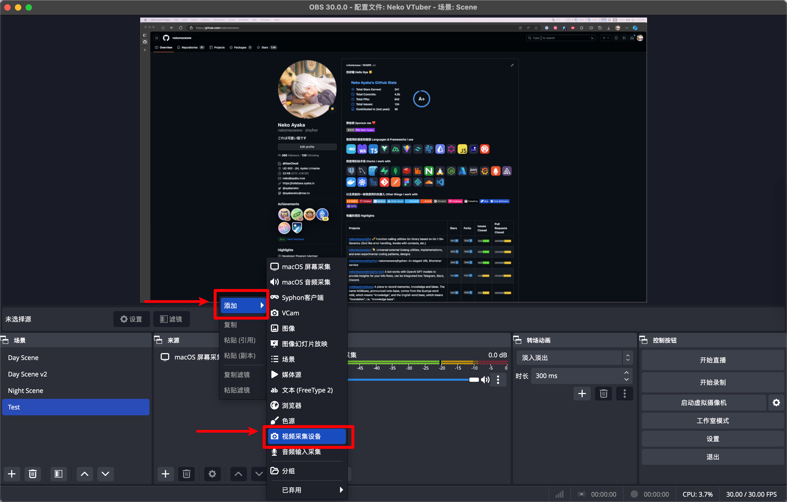

在弹出的窗口中，输入一个自己喜欢的名字，然后点击「确认」。

在第二个弹出的窗口中，我们需要选择希望添加的视频采集设备，正如之前所说，我们需要添加 VCam 为我们创建的虚拟视频设备，这个时候点选「设备」，然后在下拉菜单中选择「VCam」字样的设备作为我们的「虚拟摄像头」添加到 OBS 中：

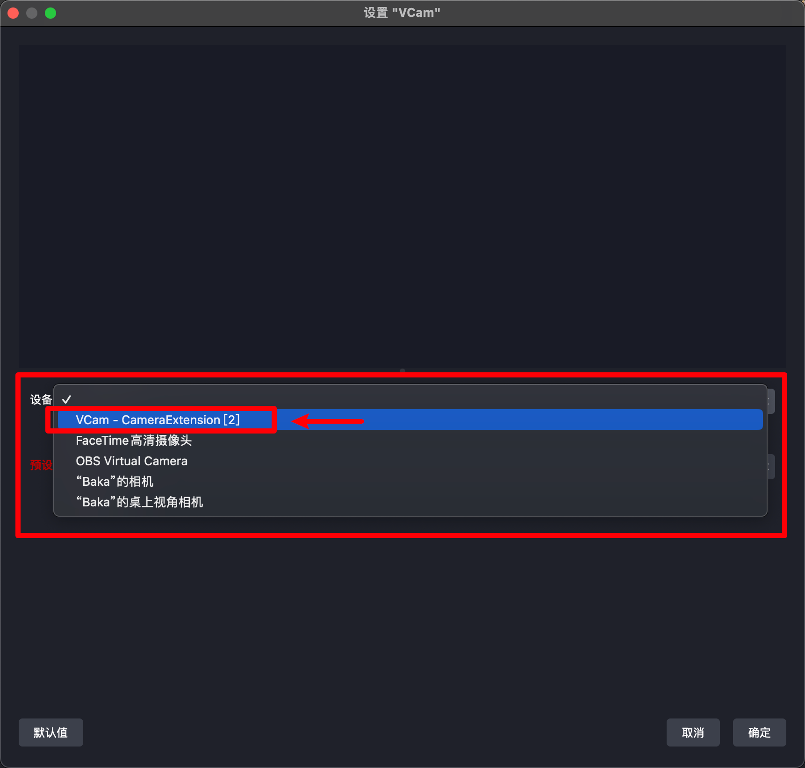

确认无误后点击「确认」，这个时候再返回 OBS 就能看到和在 VCam 里面看到的一样的画面了：

## 在 OBS 中添加绿幕过滤滤镜

接下来我们要做的是添加一个滤镜，将纯粹的绿色从输入信号中滤除。

现在在已经添加的「VCam」（或者说 VCam 的虚拟摄像头）设备上右击，然后点选「滤镜」选项来配置滤镜：

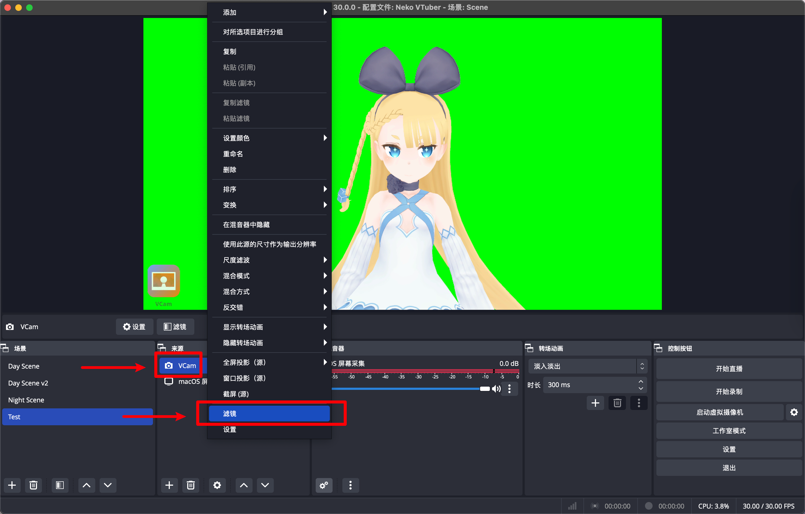

在弹出的窗口中，左侧有两个滤镜分栏，上面的「音视频滤镜」是用于音效的处理和过滤的，而下方则是我们即将操作的「效果滤镜」，是用于视频信号本身的处理和过滤的。

在「效果滤镜」这个分栏里面点击右键后点选「添加」，或者点击左下角「+」，然后点选「色度键」来添加一个「色度键」滤镜：

添加之后可以看到在右侧的预览窗口中，绿色的背景空间已经消失了，取而代之的是透明的背景，但是取决于不同的模型和贴图，默认的「色度键」的「绿色」滤镜可能不适用，你可以在这个右侧的选单中调整「关键色类型」和另外两个比较重要的「相似度」和「平滑」滑块选项来调整绿幕抠除的效果：

确认无误之后点击右下角关闭，就可以保存效果了然后返回 OBS 主窗口了。

这个时候可以看到画面已经变得很可爱了！

但是左下角还是有一个 VCam 的水印，怎么办？

> 白嫖是正常的，但也请多支持开发者。抠除水印之后也记得多给 VCam 本身和开发者多多宣传和贡献哦！

没问题，可以去除！

## 在 OBS 中剪裁 VCam 画面来去除水印

和之前一样，在已经添加的「VCam」（或者说 VCam 的虚拟摄像头）设备上右击，然后点选「滤镜」选项来配置滤镜。

然后在弹出的窗口的左下角的「效果滤镜」这个分栏里面点击右键后点选「添加」，或者点击左下角「+」，然后点选「裁剪/填充」：

然后可以填入我已经测试过的 `150` 这个数值来裁切：

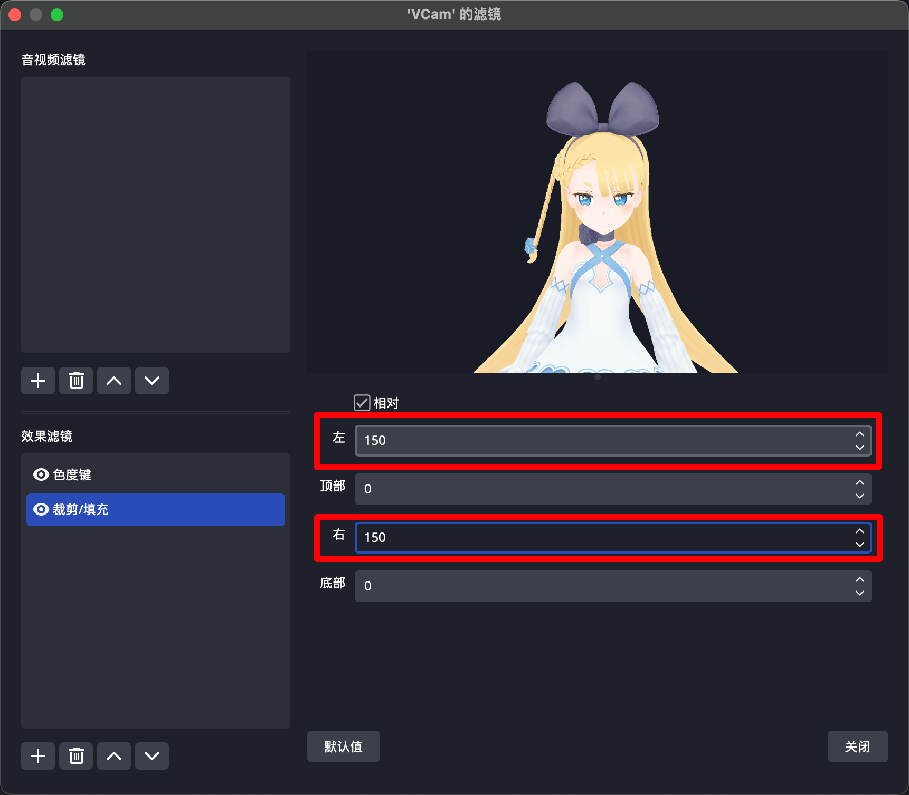

当然你也可以选取自己的数字来操作，我为了保持左右对齐，不会出现横坐标偏移的情况，这里直接填写了两个一样的数值。

如果你希望在保持整体比例相同的情况下裁剪，就需要根据屏幕比例来计算一下了！

接下来确认无误之后点击右下角的「关闭」就可以返回 OBS 的主窗口了！

现在调整 VCam 输入来源到喜欢的位置上（我喜欢在右下角），就可以达到这样的效果：

我们已经完成了许多重要的步骤，现在还需要一个可爱的人物模型来代表我们 😋。

## 用 [VRoid Studio](https://vroid.com/en/studio) 创建属于自己的模型

创建一个模型其实比想象中简单得多，其实 [Pixiv](https://www.pixiv.net/) 旗下有一个名为 [VRoid Studio](https://vroid.com/en/studio) 的 3D 二次元人物建模软件，借助这个软件我们可以像是游戏里捏脸一样通过 GUI 快速地创建自己的模型，然后输出成 VCam 这样的 Vtuber 模型交互和渲染程序支持的 VRM 格式的模型文件，最后让这些 Vtuber 程序串流渲染好的画面到 OBS 中就可以完成直播啦！

<AppContainer href="https://vroid.com/en/studio">
  <template #image>
    
  </template>
  <template #name>
    VRoid Studio
  </template>
  <template #by>
    Pixiv
  </template>
</AppContainer>

在 [VRoid Studio](https://vroid.com/en/studio) 的官网首页就可以直接点击下载下载到适用于 macOS 和 Apple Silicon 的 VRoid Studio 了，这里我们直接跳过这个步骤，讲解

- 如何创建模型
- 模型输出的时候需要注意什么

### 创建模型

安装完成之后打开 [VRoid Studio](https://vroid.com/en/studio) 就可以看到界面了，它长这样：

> 其实很多年都没变过了？

当我们想要新建一个模型的时候，点选「Create New（创建一个新的）」就可以创建模型。

在这个新弹出的窗口中，会提示选择两种人物基础模型「Fem」和「Masc」，可以理解为外观看起来偏女性化和外观看起来偏男性化的不同基础模型。

我比较可爱，这里就用「Fem」作为基础模型来创建：

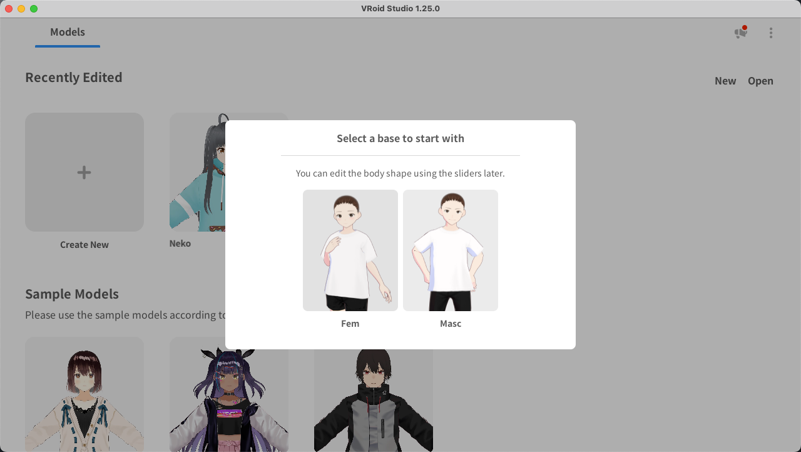

::: details 觉得预览分辨率太低了太糊了？

分辨率很低，或者说渲染质量很差，可以在右上角的「...」中找到「Settings（设置）」：

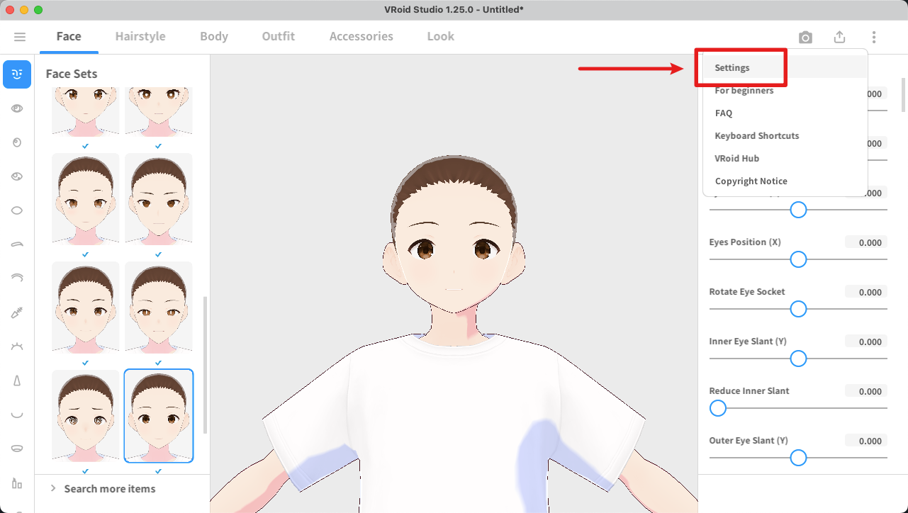

然后配置「3D Preview Quality（3D 预览质量）」为「High（高）」即可解决分辨率低或者说渲染质量很差的问题：

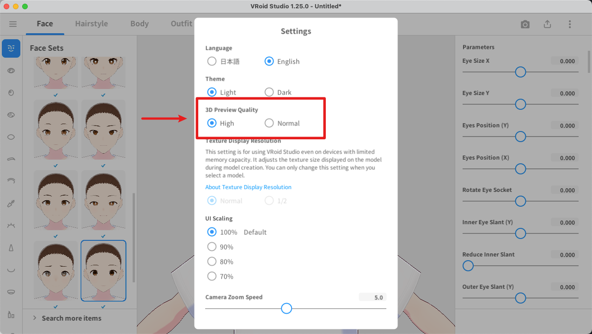

:::

VRoid Studio 的界面其实和游戏里的捏人十分相像，顶部 Tab 栏从左到右依次是

- 面部 Face
- 发型 Hairstyle
- 身体 Body
- 外装 Outfit
- 配件 Accessories
- 外观 Look

每一个 Tab 之下又分有左侧和右侧两个选单面板，左侧的面板一般是选择预设和图形化编辑和选择用的，而右侧一般是作为数值编辑器使用的，比如编辑颜色，编辑面部和形体的数值之类的：

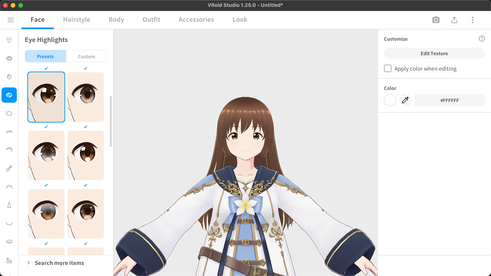

我们只需要在这个界面中遵循挨个从左到右，从上到下的规律点击和配置这些选项并且捏出来一个自己喜欢的模型就好了。

::: details 想要猫耳朵？没问题！

在顶部 Tab 栏中找到 Accessories（配件）这个 Tab，然后在左侧的选单中找到「Add Accessory（添加配件）」，然后在弹出的选单中找到「Cat Ears（猫耳朵）」，然后点击「Add（添加）」就可以添加猫耳朵了：

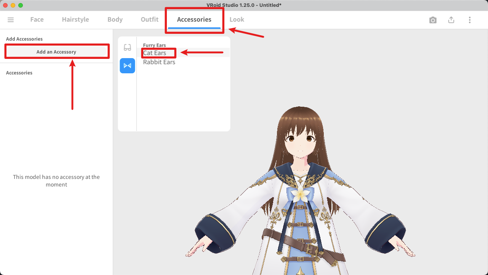

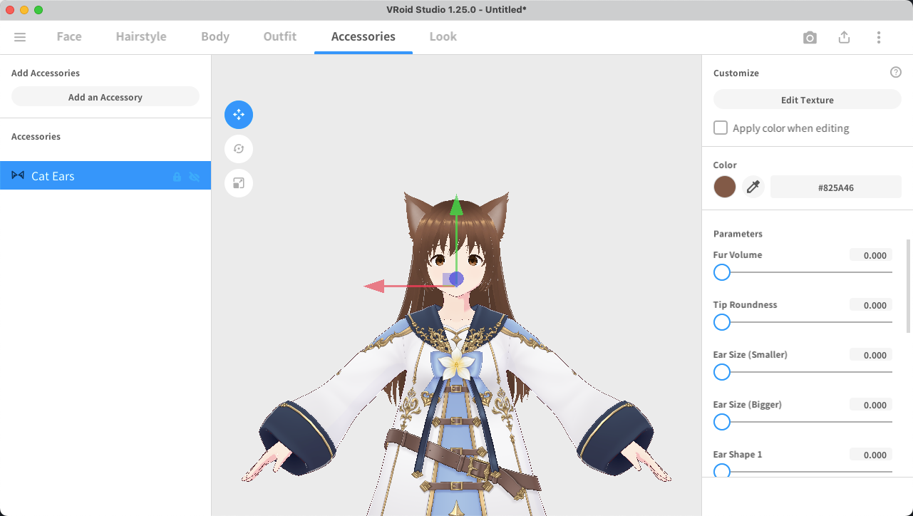

:::

### 导出模型

恭喜你创建好了自己的模型，这个时候我们来导出创建好的模型给 VCam 使用。

在导出的时候，在右上角找到「」图标，然后选择「Export as VRM（导出为 VRM）」的选项来开始导出的向导：

接下来会来到一个界面，这个界面是用于优化模型多边形数量，材质优化和骨骼绑定优化的，一般情况下我们作为玩耍用途的模型创建不太需要。但如果你希望把 VRoid Studio 当作是一个服装设计或者角色设计的工具的话，当希望在 VRChat 中使用，或者是期望交付到生产环境（诸如游戏开发和动画制作）的时候就可能需要对此进行进一步的调整和优化了。

这个时候我们直接点击「Export（导出）」即可：

在新的界面中，我们需要进一步配置导出的 VRM 版本。

> [!NOTE] 不同的 VRM 版本都有什么区别？
>
> 首先，VRM 格式是广泛在 VRChat 和 Vtuber 领域使用的模型格式。
>
> VRM 格式中除去必要的模型的多边形、骨骼、材质贴图和贴图、坐标的绑定之外，还有对于模型和 VRChat 模型生态最为重要的对于创作者的保护。这样的保护是通过在 VRM 模型数据中写入模型的创作者、创作者的联系方式，以及不同版权控制策略下的条款制约限制来实现的，当用户加载和尝试修改 VRM 的时候加载器和动画绑定器将会读取这些数值然后判断用户是否拥有许可，从而实现对创作者和创作资源的保护。
>
> `VRM0.0` 和 `VRM1.0` 是两种区别很大的 VRM 模型格式。
>
> |                  | `VRM0.0` | `VRM1.0` |
> | ---------------- | -------- | -------- |
> | 软件支持度       | 好       | 较差     |
> | 版权保护全面程度 | 好       | 更好     |
> | 拓展可能性       | 高       | 很高     |
>
> 在撰写这篇文档的 2023 年的现在，`VRM1.0` 的支持度是很差的，虽然在这篇文档中介绍的 VCam 软件其实已经全面支持了 `VRM1.0` 并且在软件中集成了从 `VRM0.0` 到 `VRM1.0` 的转换支持。
>
> 所以从长远来看，使用、购买和下载支持 `VRM1.0` 的模型将会有更好的兼容度，但是就目前来看，导出为 `VRM0.0` 将可以允许你在更多的 Vtuber 软件中导入和使用这些 VRM 模型。
>
> 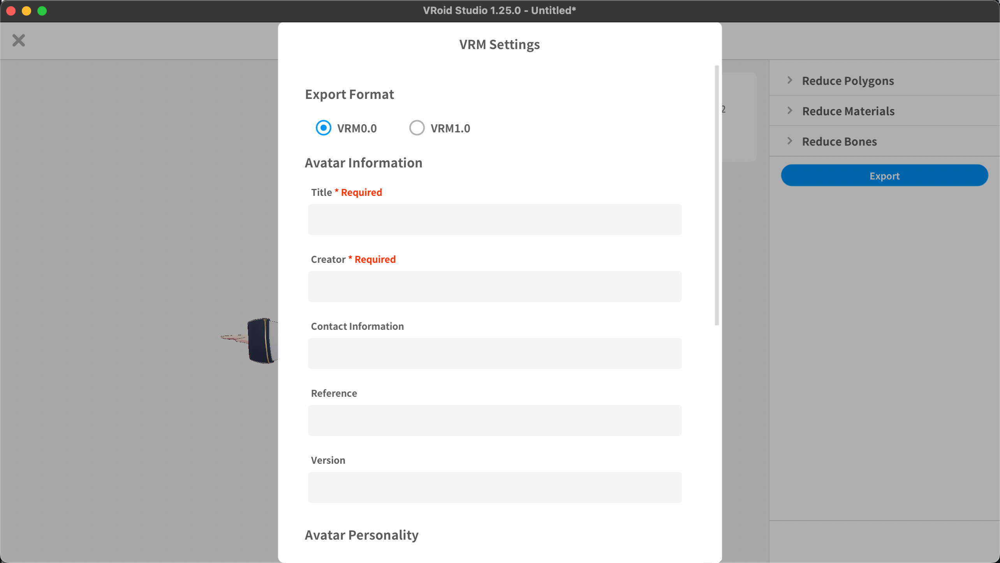
>
> 

>   
VRM0.0 选项下的字段

> 

>
> 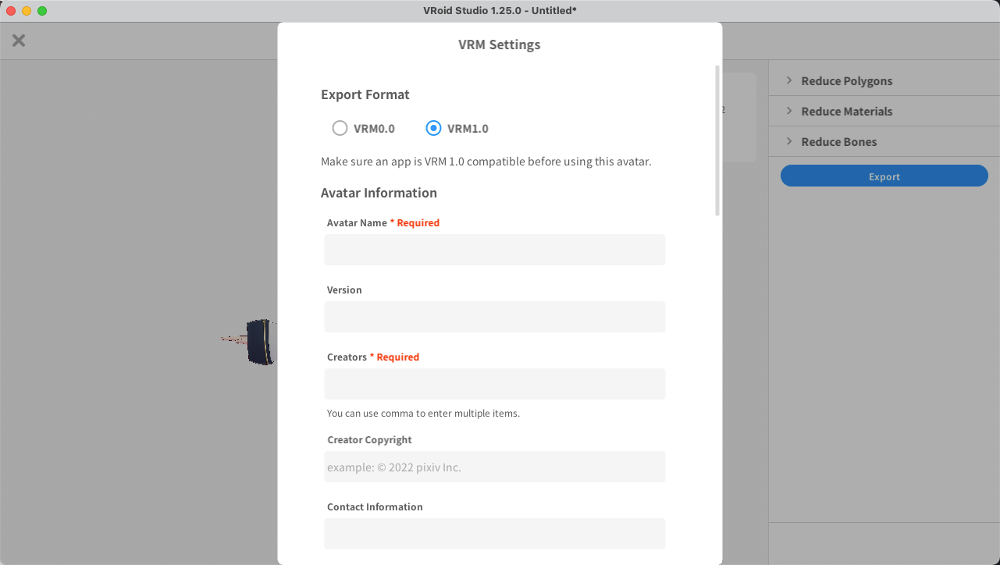
>
> 

>   
VRM1.0 选项下的字段

> 

在这个文档中我们就直接选择 `VRM0.0` 就好了。填写一下必须要填写的 Title 和 Creator 字段就行，然后滚到最下方点选 Export 就可以导出模型了：

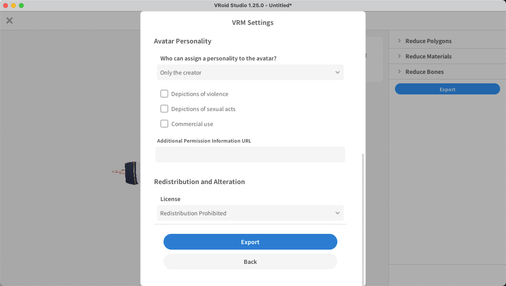

## 将模型添加到 VCam 中

在 VCam 窗口激活的时候，点选菜单栏的「File（文件）」选单，然后点选「Load VRM file（加载 VRM 文件）」并且选择我们先前导出的模型文件就可以加载模型到 VCam 了：

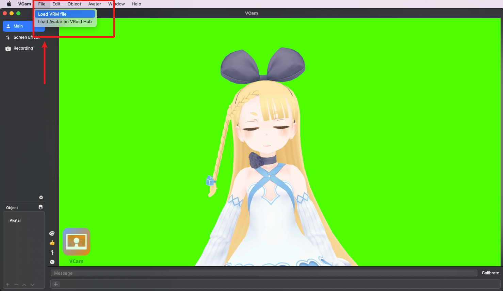

就像这样！

这个时候返回 OBS 看看自己的模型是不是符合自己的需求吧！

超可爱的！

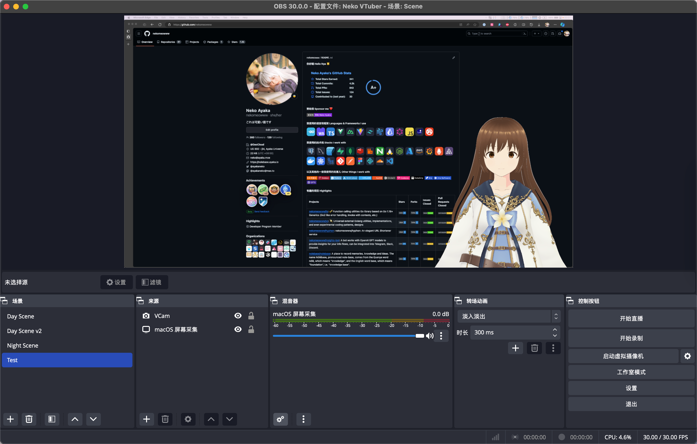

## 一些额外的 VCam 配置

除去上面讲述的很多配置之外，我还会给 VCam 额外配置几个选项。

1. 默认的情况下，VCam 会激活手臂和手指的追踪，但是我感觉在默认的算法的配置情况下，手臂和手指的追踪效果很差，经常会出现穿模和卡 Bug 的情况，感觉很多时候还不如不开，所以我会在「Tracking（追踪）」侧边栏选单的「Hand（手）」配置为「None（无）」
2. 默认的情况下，VCam 将会使用麦克风的音频振幅大小来判断是否让模型人物的嘴巴张开，如果环境不够安静的话，很容易造成自己的人物模型一直处于一个张嘴的形态。我会选择在「Tracking（追踪）」侧边栏选单的「Lip-sync（嘴唇同步）」配置选项选择「Camera（摄像头）」，而非默认的「Microphone（麦克风）」

## 额外的 [VRoid Studio](https://vroid.com/en/studio) 配件，衣服和外观

> 想要额外的给 [VRoid Studio](https://vroid.com/en/studio) 建模出来的人物角色配装、更替衣物、添加更可爱的猫耳朵或者兽耳朵，甚至是外观？

没问题的，可以的。

如果你有尝试探索 [VRoid Studio](https://vroid.com/en/studio) 编辑器，你应该可以发现，很多地方是可以添加自己的 Preset 预设的。这里就要介绍到，其实在 VRChat 和 Vtuber 模型的生态里，人设、本体模型和外观，以及配件是可以分开创作、购买、下载和加载的。这也是为什么绝大多数的 Vtuber 能在特殊节日或者活动的时候换上特别的衣服或者打扮的根本原因。

这意味着其实模型之外，我们还可以在

1. [VRoid Studio](https://vroid.com/en/studio) 生态下的 [VRoid Hub](https://hub.vroid.com/en)
2. [Booth](https://booth.pm/)（同样是 [Pixiv](https://www.pixiv.net/) 旗下的产品，现在应该是仅次于 VRChat Mod 最大的模型和配装售卖平台？）

购买和下载到更多的配件。然后导入到 [VRoid Studio](https://vroid.com/en/studio) 进行使用。

  
<a href="https://hub.vroid.com/en">VRoid Hub</a> 正在售卖的多种不同的服装

  
<a href="https://booth.pm/">Booth</a> 里可见的从 VRChat 可以用的袜子、人物模型、Vtuber 直播软件，到直播用的背景和人设商品

当然，大到人设、本体模型和外观，以及配件这样与人物模型强相关的物件，小到作为 Vtuber 的时候使用的背景、背景中的小道具，乃至是上舰和 Subscribe 之后的物品也都可以通过这两个平台购入或者下载然后集成到自己的直播间里面。

当然如果你在 [Booth](https://booth.pm/) 上遇到了自己非常喜欢的创作者，你也完全可以像是在 [Pixiv](https://www.pixiv.net/) 里那样找他们约稿，约件！

## 延伸阅读

VCam 官方的文档写的还是很好的，如果遇到什么问题其实都可以去 VCam 的文档里面探寻一下：[VCam - VCam Docs](https://docs.vcamapp.com/)
