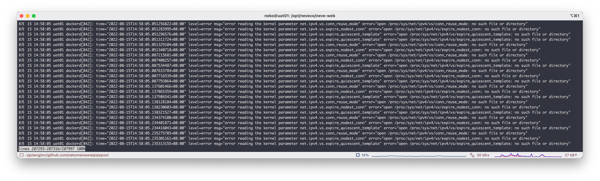
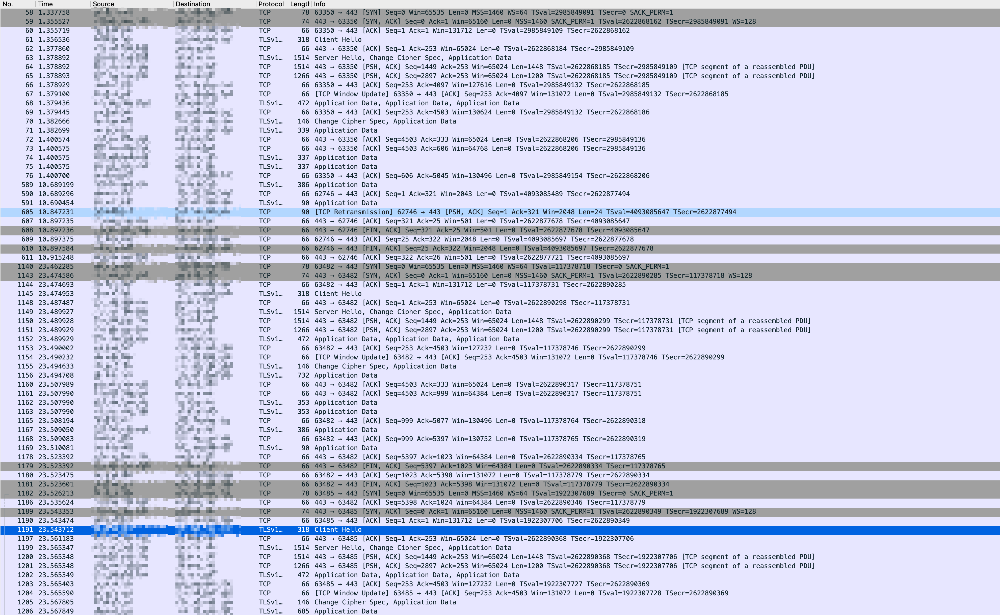

##### 文档版本

| 编辑者 | 版本 | 变更日期 | 变更说明 |
| ----- | --- | ------- | ------- |
| Neko | v1.0.0 | 2022-08-15 | 创建 |

##### 文档兼容性

| 主体 | 版本号 | 文档地址（如果有） |
| -- | -- | -- |
| Debian | 11/5.10.127-1/amd64 |  |
| Docker | 20.10.17 | [Docker Documentation](https://docs.docker.com/) |
| OpenResty | openresty/1.21.4.1 | [OpenResty® - Official Site](https://openresty.org/en/) |

深入kube-proxy ipvs模式的conn_reuse_mode问题 - MAAO的博客
https://maao.cloud/2021/01/15/%E6%B7%B1%E5%85%A5kube-proxy%20ipvs%E6%A8%A1%E5%BC%8F%E7%9A%84conn_reuse_mode%E9%97%AE%E9%A2%98/
IPVS 在 k8s 中连接保持引发的问题 - Program Life
https://joyous-x.gitbook.io/mbook/part-devops/ipvs_in_k8s
[SWARM] Very poor performance for ingress network with lots of parallel requests · Issue #35082 · moby/moby
https://github.com/moby/moby/issues/35082
Overlay network not working not working between two containers - Part II - General Discussions / General - Docker Community Forums
https://forums.docker.com/t/overlay-network-not-working-not-working-between-two-containers-part-ii/116222/3
https://github.com/moby/moby/issues/35082#issuecomment-668762331
