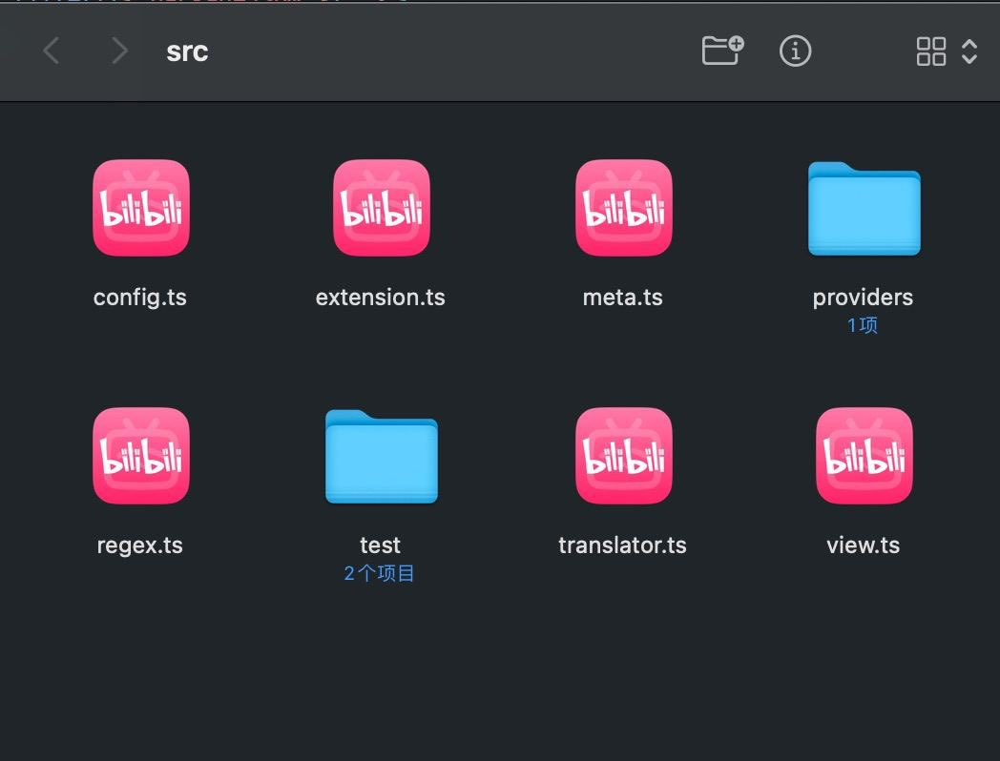

---
tags:
  - 操作系统/macOS
  - 软件/macOS/Finder
  - 命令行/rm
  - 命令行/find
  - 命令行/touch
  - 命令行/killall
---
# 修复 Finder（访达）在变更默认打开程序之后图标依然维持原样的异常问题

### 文档兼容性

| 主体  | 版本号             | 文档地址 |
| ----- | ------------------ | -------- |
| macOS | Ventura 13.4.1 (c) |          |

## 说明

前两天小音 @LittleSound 的 macOS 中的 Finder、Visual Studio Code 中的 TypeScript 文件（拓展名为 `.ts`）的文件预览图标都莫名其妙地变成了哔哩哔哩的客户端的模样：



> 开发插件的时候遇到了这样的问题，请问是叔叔入侵电脑了吗？ -- [Twitter](https://twitter.com/OikawaRizumu/status/1690198922210189312/photo/1)

有伙伴提到 `.ts` 拓展名其实是一种 MPEG 传输流的文件格式[^1][^2]，也许是因为这样的原因所以导致 `.ts` 文件被当作成了一种「视频文件」，于是出现了这样的乌龙事件。

但是小音已经尝试过通过在 Finder 中右键 `.ts` 文件，点选「显示简介」- 在「打开方式」部分中选择「Visual Studio Code」-点击「全部更改...」来配置文件的默认打开方式为 Visual Studio Code 后，重启 Finder 也好，重启 macOS 也好，图标依然是哔哩哔哩的图标，找了许多方法，大多都已经在 2023 年的 macOS 版本中不再奏效。
## TL;DR

不过好消息是，在寻找答案的时候发现了 [StackOverflow](https://apple.stackexchange.com/a/450863) 上的回答给出了脚本：

```shell
sudo rm -rfv /Library/Caches/com.apple.iconservices.store
sudo find /private/var/folders/ \( -name com.apple.dock.iconcache -or -name com.apple.iconservices \) -exec rm -rfv {} \;
sleep 3
killall Dock; killall Finder
```

你可以逐行复制执行。或者写到某个地方存放着在需要的时候执行。

其中：

- `com.apple.iconservices.store` 是系统图标存储的缓存文件，有的时候出问题了可以尝试通过删除来进行修复[^3]
- `com.apple.dock.iconcache` 和 `com.apple.iconservices` 也是系统图标缓存和图标服务的文件，有的时候 `com.apple.iconservices` 会过大，可以通过删除进行清理

## 解释

很容易理解的是，第一行的命令中的 `rm -rfv` 就是简单的强制删除文件的含义。

但第二行的 `/private/var/folders/` 在不同的系统版本上可能会略有区别，比如在早期的版本里你也许会需要移除 `/private` 这个前缀的目录，而第二行命令的 `/private/var/folders/` 后面接上了 `-name com.apple.dock.iconcache` 其实并不意味着 `com.apple.dock.iconcache` 图标缓存文件和 `com.apple.iconservices` 图标服务（也许未来会变成目录）这两个文件就直接放在 `/private/var/folders/` 的目录下，其实在实际的情况中，它前缀的命令也许是根据不同的 container 容器（macOS 的概念）来生成的，比如：

```shell
/private/var/folders//m0/k_38ftb53yg0mqbcrrjypr3m0000gn/C/com.apple.dock.iconcache
```

所以这也是为什么我们需要使用 `find` 命令来先搜索再删除的原因。

另外值得一提的是，我在寻找资料的时候发现有的地方会使用类似于下面的命令：

```shell
sudo find /private/var/folders/ -name com.apple.dock.iconcache -exec rm {} \;
sudo find /private/var/folders/ -name com.apple.iconservices -exec rm -rf {} \;
```

但其实这段和上面的命令

```shell
sudo find /private/var/folders/ \( -name com.apple.dock.iconcache -or -name com.apple.iconservices \) -exec rm -rfv {} \;
```

效果是一模一样的，只是写法合并了起来。

最后一部分的 `killall Dock; killall Finder` 就是字面含义，将 `Dock` 和 `Finder` 进程都结束掉，请放心，他们都会自动重启的，如果出现问题，你也可以通过重启 macOS 来尝试应用上面命令带来的系统变更和恢复 Dock 栏以及 Finder（访达）应用的正常运行。
## 参考资料

- [macos - Icons remains the same after I have changed the default program for opening the file - Ask Different](https://apple.stackexchange.com/a/450863)
- [Clear the icon cache on a Mac when you start seeing generic icons in Finder or the Dock - GitHub Gist](https://gist.github.com/ismyrnow/e92c6010cda9325b2d8811387a05f224)
- [How to clear Mac OSX icon cache - Apple Community](https://discussions.apple.com/thread/8441124)
- [macos - Reset icon cache on MacBook - Ask Different](https://apple.stackexchange.com/a/225084)
## 延伸阅读

- [finder - How to reset file icons associated with default program on El Capitan - Ask Different](https://apple.stackexchange.com/questions/246745/how-to-reset-file-icons-associated-with-default-program-on-el-capitan)
- [Rubicode - RCDefaultApp](https://www.rubicode.com/Software/RCDefaultApp/)
- [macos - How do I restore icons in Finder? - Ask Different](https://apple.stackexchange.com/questions/183166/how-do-i-restore-icons-in-finder)

[^1]: https://x.com/zhizijun/status/1690257064554344448
[^2]: [MPEG transport stream - Wikipedia](https://en.wikipedia.org/wiki/MPEG_transport_stream)
[^3]: [What is com.apple.iconservices.store? I f… - Apple Community](https://discussions.apple.com/thread/253834128)