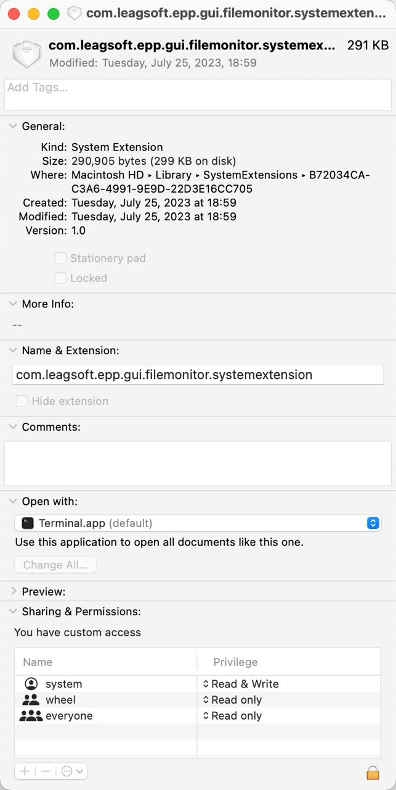

---
tags:
  - 操作系统/macOS
  - 计算机/信息技术/安全/企业安全/监控软件/提供商/联软科技
  - 软件/macOS
---
# 修复 macOS 反复弹出提示 `com.leagsoft.epp.gui.filemonitor.systemextension` 将对你的电脑造成伤害的错误

## TL;DR

> 先临时禁止 SIP 后，在删除，然后在开启 SIP

## 前情提要

今天在测试一些 i18n 的时候，把平时 macOS 的系统语言从简体中文切换到了 English，结果在切换并重启电脑完成之后，macOS 突然开始报错说：

> `com.leagsoft.epp.gui.filemonitor.systemextension` 将对你的电脑造成伤害
>
> "com.leagsoft.epp.gui.filemonitor.systemextension" will damage your computer

的错误。

错误弹窗还会提示说这个是一个 malware（病毒软件）。

## 排查与探索

乍一看的话，这个文件是在 System Extensions 目录里面的。

有人提出这个是 [深圳市联软科技股份有限公司-终端一体化](https://www.leagsoft.com/) 的  **联软科技 EPP 端点安全一体化平台** 的系统拓展。[^1]

考虑到之前入职大企业的时候安装过相关的安全软件，会出现它也是理所应当，不过我现在已经离职了，理论上可以直接忽视掉它。

不过好巧不巧地是，如果不删除掉这个文件，macOS 就会一直报错，我猜，也许是连接丢失了，或者证书，或者 LICENSE 失效了。

## 解决

好在还有解决方案，根据 [Mac 反复弹出 “com.leagsoft.… - Apple 社区](https://discussionschinese.apple.com/thread/255486776?sortBy=best) 社区讨论中的 [tonyfromcalgary](https://discussionschinese.apple.com/profile/tonyfromcalgary/participation) 大神给出的解决方案：

> 先临时禁止 SIP 后，在删除，然后在开启 SIP

进行操作，就可以消除掉这个错误了。

有关如何关闭 SIP，请参见 [Disabling and Enabling System Integrity Protection | Apple Developer Documentation](https://developer.apple.com/documentation/security/disabling_and_enabling_system_integrity_protection) 文档和 [`csrutil disable` command FAILED. The OS … - Apple Community](https://discussions.apple.com/thread/253397576?sortBy=best) 文档。

## 参考资料

- [Mac 反复弹出 “com.leagsoft.… - Apple 社区](https://discussionschinese.apple.com/thread/255486776?sortBy=best)

[^1]: 由 Sariel 用户得出的结论：[Mac 反复弹出 “com.leagsoft.… - Apple 社区](https://discussionschinese.apple.com/thread/255486776?answerId=260215818322&sortBy=best#260215818322)
