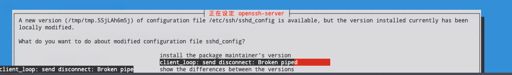

---
tags:
  - 计算机/操作系统/Linux
  - 操作系统/Linux
  - 操作系统/Debian
  - 操作系统/Debian/Debian-11
  - 操作系统/Unix
  - 命令行/apt
  - 运维
  - 命令行/ssh
  - 命令行/终端
  - 开发/故障排查
---
# `apt upgrade` 执行更新到一半发生了 SSH 断连但是没有 `tmux` 和 `screen` 帮助创建守护 `tty`，但是报错了无法获得 `lock-frontend` 锁的时候怎么办？

## TL;DR

确认是不是 `apt` 造成的锁文件

```shell
sudo lsof /var/lib/dpkg/lock-frontend
```

如果是的话，一般而言这个时候 `apt` 进程已经不会再继续执行了，最好执行一次系统备份和快照。

然后重启

```shell
sudo reboot
```

执行

```shell
sudo dpkg --configure -a
```

来恢复和继续更新会话。

## 背景

这是一个很有意思的问题：



我之前在滚更新的时候离开了电脑，结果更新的途中弹窗提示并且 hold 住了整个更新，结果跑 SSH 连接去更新的设备和远端服务器的连接故障了，发生了 Broken Pipe，而且我还没有开 `tmux` 和 `screen` 去维持住 `tty`。

这个时候如果你重新登录到 SSH 之后尝试再次运行 `apt upgrade` 的时候其实会遇到这样的事情

```shell
$ sudo apt upgrade
正在等待缓存锁：无法获得锁 /var/lib/dpkg/lock-frontend。锁正由进程 8168（apt）持有
```

或者在英文里是这样的

```shell
$ sudo apt upgrade
Waiting for cache lock: Could not get lock /var/lib/dpkg/lock-frontend. It is held by process 8168 (apt)
```

一般而言如果直接参考 Debian 的文档 [Q: What can be done when the dpkg lock is held?](https://wiki.debian.org/Teams/Dpkg/FAQ#Q:_What_can_be_done_when_the_dpkg_lock_is_held.3F) 的话，会要求执行

```shell
dpkg --configure --pending
```

来配置正在过程中的 `apt` 事务操作，但是你很可能会直接遇到报错说遇到了锁：

```shell
$ sudo dpkg --configure --pending
dpkg: 错误: dpkg 前端锁 已被另一个 pid 为 8168 的进程加锁
注意：删除锁文件的操作是错误的，这样操作会损坏上锁的部分甚至损坏
个系统。详情请见 <https://wiki.debian.org/Teams/Dpkg/FAQ>。
```

或者在英文里是这样的

```shell
$ sudo dpkg --configure --pending
dpkg: error: dpkg frontend lock was locked by another process with pid 8168
Note: removing the lock file is always wrong, and can end up damaging the
locked area and the entire system. See <https://wiki.debian.org/Teams/Dpkg/FAQ>.
```

好的，那怎么解决？

## 解决

我们当然不可以直接去删掉 `/var/lib/dpkg/lock-frontend`！因为如果删掉了，可能会有别的脚本和命令会开始抢夺，造成意外之外的更新，甚至破坏整个系统。比如如果设定了 `systemd-timer` 来自动更新系统，那这个时候可能会出现系统直接被触发的 timer 更新的情况。

首先这个 pid 8168 可以通过下面的命令来获得：

```shell
sudo lsof /var/lib/dpkg/lock-frontend
```

你也可以通过

```shell
sudo ps -A | grep apt
```

来查找到对应的进程信息。找到和确认了造成锁的僵死的 `apt` 进程之后，你也可以通过 `top`、`btop`、`htop` 这样的命令来观察这个僵死的 `apt` 的资源消耗，当然，实际上，即便是对于系统更新而言，一般而言这个时候 `apt` 进程已经不会再继续执行了[^1]。

这意味着你完全可以在其他系统上正在进行的工作完成收尾和备份完成后先执行重启

```shell
sudo reboot
```

然后在重新登录的时候就可以先执行一次

```shell
sudo apt upgrade
```

来试图重新更新，很有可能你会获得下面的错误和提示

```shell
$ sudo apt upgrade
[sudo] neko 的密码：
E: dpkg 被中断，您必须手工运行 ‘sudo dpkg --configure -a’ 解决此问题。
```

而这个 `sudo dpkg --configure -a` 恰好就是我们最终会需要的命令。

接下来最后我们执行

```shell
sudo dpkg --configure -a
```

就可以继续我们之前被打断的 `apt` 了。


[^1]: [debian - SSH pipe broke while running apt upgrade. What can I do about it? - Unix & Linux Stack Exchange](https://unix.stackexchange.com/questions/156541/ssh-pipe-broke-while-running-apt-upgrade-what-can-i-do-about-it)
