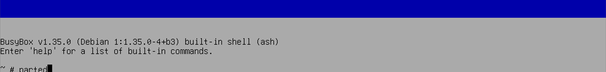

---
tags:
  - 操作系统/Debian
  - 操作系统/Debian/Debian-12
  - 计算机科学/内存/虚拟内存/swap
  - 操作系统/BIOS/引导/grub
  - 计算机/操作系统/Linux/内核/initramfs
  - 命令行/parted
  - 操作系统/Busybox
  - 命令行/update-grub
  - 命令行/update-initramfs
  - 命令行/e2fsck
  - 命令行/resize2fs
  - 操作系统/文件系统
---
# 为 Debian 使用的硬盘进行扩容操作

::: tip

Debian 在安装的时候采取的默认的分区策略中会创建最后一个分区为 swap 分区，这样的 swap 分区是用来提供虚拟内存的，如果你希望在扩容的时候一同操作 swap 分区，甚至希望删除 swap 分区的话（比如正在运行 `kubelet` 的节点），可以通过下面的操作安全地关闭 swap 和移除 swap 分区的引用。

1. 先执行 `swapoff` 命令全局关闭 `swap`：

```shell
sudo swapoff -a
```

2. 然后我们需要修改 `/etc/fstab` 中的 swap 分区的引用：

使用

```shell
sudo vim /etc/fstab
```

来打开 Vim 编辑器编辑 `/etc/fstab`：

```shell
# /etc/fstab: static file system information.
#
# Use 'blkid' to print the universally unique identifier for a
# device; this may be used with UUID= as a more robust way to name devices
# that works even if disks are added and removed. See fstab(5).
#
# systemd generates mount units based on this file, see systemd.mount(5).
# Please run 'systemctl daemon-reload' after making changes here.
#
# / was on /dev/sda2 during installation
UUID=c10110c9-c86b-4020-ad6c-78e46ec3e642 /               ext4    errors=remount-ro 0       1
# /boot/efi was on /dev/sda1 during installation
UUID=325D-4C1F  /boot/efi       vfat    umask=0077      0       1
# swap was on /dev/sda3 during installation # [!code hl]
UUID=ec583562-8777-45cb-9512-e19b7ae96ee3 none            swap    sw              0       0 # [!code --]
# UUID=ec583562-8777-45cb-9512-e19b7ae96ee3 none            swap    sw              0       0 # [!code ++]
/dev/sr0        /media/cdrom0   udf,iso9660 user,noauto     0       0
```

编辑结束后我们还需要编辑 `initramfs` 配置文件中的 `resume` 配置来进一步关闭 swap

```shell
sudo vim /etc/initramfs-tools/conf.d/resume
```

在文件中找到和之前注释掉的 `/etc/fstab` 中 swap 分区相同的设备 UUID 的 `RESUME` 行：

```shell
RESUME=UUID=ec583562-8777-45cb-9512-e19b7ae96ee3 # [!code --]
# RESUME=UUID=ec583562-8777-45cb-9512-e19b7ae96ee3 # [!code ++]
```

然后**按顺序执行**下面的两个命令分别更新 `grub` 和 `initramfs`

```shell
sudo update-grub
```

```shell
sudo update-initramfs -u
```

:::

## 先决条件

- 由于涉及到硬盘分区的操作，请参考 [[通过 Hyper-V 进入 Debian 12 LiveCD 自带的 Rescue Mode（急救模式）]] 启动单独的 LiveCD 离线环境，并在 LiveCD 中提供的 shell 中执行相关的扩容命令操作。

## 调整分区

进入 LiveCD 中提供的环境之后我们就可以进行后续的操作了！

对于 Debian 12 的 LiveCD 而言，它会提供 BusyBox（一个非常轻量和好用的发行版）给我们使用：



接下来我们在这个命令窗口中输入和使用 `parted` 命令就可以修改分区了：

```shell
parted
```

进入 `parted` 之后会是这样的输出：

```shell
$ parted
GNU Parted 3.5
Using /dev/sda
Welcome to GNU Parted! Type 'help' to view a list of commands.
(parted)
```

- 可以通过 `help` 命令要求 `parted` 输出可以使用的操作命令
- 可以通过 `print` 打印现在的分区表

接下来，我们要通过 `print` 命令查看可以修改的分区：

```shell
print
```

::: info

> Warning: Not all the space available to /dev/sda appears to be used, you can fix the GPT to use all of the space (an extra 545259520 blocks) or continue with the current setting?
> 警告：`/dev/sda` 的可用空间似乎未全部使用，您可以修复 GPT 以使用全部空间（额外的 `545259520` 块），或者继续使用当前设置？

如果出现了这样的提示，不要惊慌，是正常的行为，这意味着我们修改过的 Hyper-V 和其他 VM 控制器提供的虚拟硬盘的数据能被 `parted` 检测到了。

```shell
(parted) print
print
Warning: Not all the space available to /dev/sda appears to be used, you can fix the GPT to use all of the space (an extra 545259520 blocks) or continue with the current setting?
Fix/Ignore?
```

这个时候我们根据 `parted` 的提示，输入 `Fix` 就可以进行修复和更新以使用全部硬盘空间。

```
Fix
```

:::

输出应该是这样的结果：

```shell
(parted) print
print
Model: Msft Virtual Disk (scsi)
Disk: /dev/sda 42.9GB
Sector Size (logical/physical): 512B/4096B
Partition Table: GPT
Disk Flags:

Number  Start   End     Size    File system     Name  Flags
 1      1049kB  538MB   537MB   fat32                 boot, esp
 2      538MB   41.9GB  41.4GB  ext4
```

::: tip

如果要删除不要的 swap 分区

```shell
(parted) print
print
Model: Msft Virtual Disk (scsi)
Disk: /dev/sda 42.9GB
Sector Size (logical/physical): 512B/4096B
Partition Table: GPT
Disk Flags:

Number  Start   End     Size    File system     Name  Flags
1      1049kB  538MB   537MB   fat32                 boot, esp
2      538MB   41.9GB  41.4GB  ext4
3      41.9GB  42.9GB  1023MB  linux-swap(v1)
```

可以通过

```shell
rm <分区编号
```

的命令进行删除操作。

:::

现在我希望将分区 2 拓展扩容到 300G，只需要执行下面的命令就可以扩容了：

```shell
resizepart 2 300G
```

完成扩容之后检查是否成功：

```shell
(parted) print
print
Model: Msft Virtual Disk (scsi)
Disk: /dev/sda 42.9GB
Sector Size (logical/physical): 512B/4096B
Partition Table: GPT
Disk Flags:

Number  Start   End     Size    File system     Name  Flags
 1      1049kB  538MB   537MB   fat32                 boot, esp
 2      538MB   300GB   299GB   ext4
```

确认无误之后就可以通过输入下面的命令保存退出 `parted` 了：

```shell
quit
```

## 通过 `e2fsck` 检查文件系统是否正确配置

现在我们回到了 BusyBox 的命令界面了，可以通过自带的 `e2fsck` 在应用扩容之前检查一下 `/dev/sda2` 目标硬盘下属的文件系统是否正常：

- 是否正确配置
- 是否有可优化的地方
- 是否有错误的异常

```shell
$ e2fsck -f /dev/sda2
e2fsck 1.47.0 (5-Feb-2023)
Pass 1: Checking inodes, blocks, and sizes
Pass 2: Checking directory structure
Pass 3: Checking directory connectivity
Pass 4: Checking reference counts
Pass 5: Checking group summary information
/dev/sda2: 259337/2526384 files (0.2% non-contiguous), 4445023/10104320 blocks
```

检查无误之后就可以进行其他的操作了！

## 通过 `resize2fs` 应用扩容到文件系统

现在就是最后一步了，我们通过 `resize2fs` 命令将 `/dev/sda2` 目标硬盘的大小更新应用到文件系统和内核中：

```shell
$ resize2fs /dev/sda2
resize2fs 1.47.0 (5-Feb-2023)
Resizing the filesystem on /dev/sda2 to 73110859 (4k) blocks.
The filesystem on /dev/sda2 is now 73110859 (4k) blocks long.
```

## 参考资料

- [linux - How to safely turn off swap permanently and reclaim the space? (on Debian Jessie) - Unix & Linux Stack Exchange](https://unix.stackexchange.com/q/224156)
- [debian - Is it safe to delete all swap partitions? - Unix & Linux Stack Exchange](https://unix.stackexchange.com/questions/225459/is-it-safe-to-delete-all-swap-partitions)
