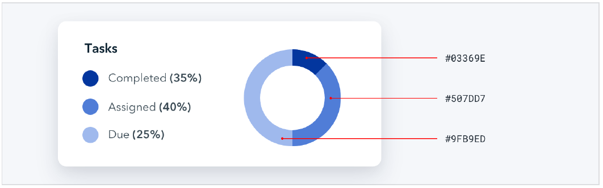
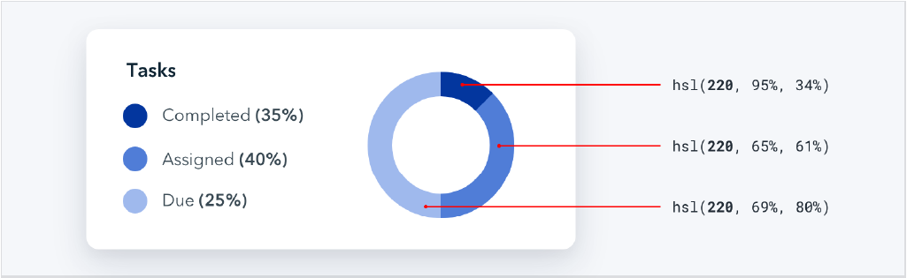
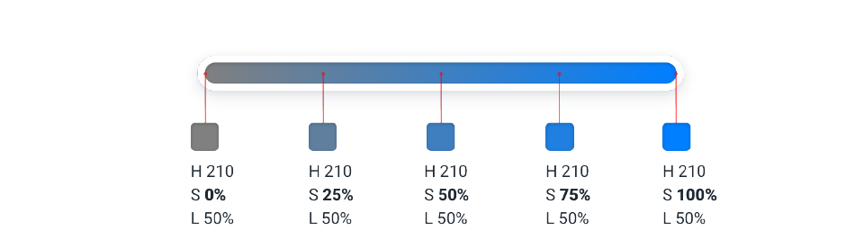
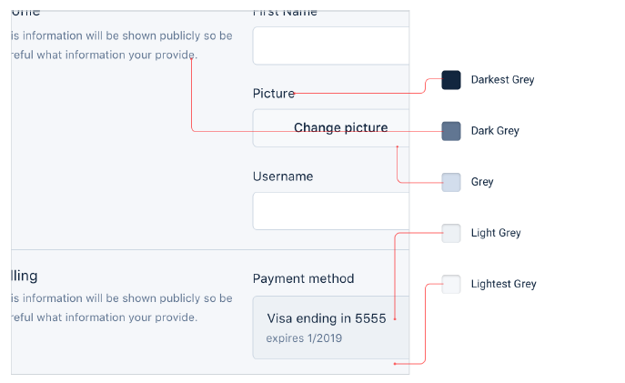
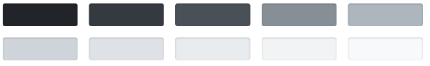
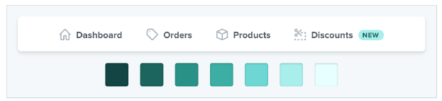
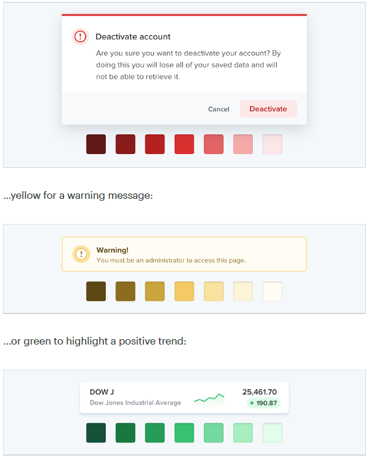

# 摒弃十六进制，改用 HSL - Ditch hex for HSL

[[Hex]] 和 [[RGB]] 是网络上代表颜色最常见的形式，但它们并不是最实用的。

> [[Hex]] and [[RGB]] are the most common formats for representing color on the web, but they’re not the most useful.

不过，使用 [[Hex]] 和 [[RGB]] ，那些视觉上看起来很接近的颜色，代码中却截然不同。

> Using [[hex]] or [[RGB]], colors that have a lot in common visually look nothing alike in code.

而 [[HSL]] 改进了这一点。它使用了人眼直观感知的元素来展示颜色：[[Hue 色调]]、[[ Saturation 饱和度]]  和 [[Lightness 亮度]]。

> [[HSL]] fixes this by representing colors using attributes the human-eye intuitively perceives: hue, saturation, and lightness.

其中 **[[Hue 色调]]** 是通过在色盘上的位置体现颜色，它是颜色的一种属性能让我们区分出两种不同的蓝色。

> **Hue** is a color’s position on the color wheel — it’s the attribute of a color that lets us identify two colors as “blue” even if they aren’t identical.

[[Hue 色调]] 使用 `°` 度来衡量，其中0° 代表红色， 120° 代表绿色，240° 代表蓝色。

> Hue is measured in degrees, where 0° is red, 120° is green, and 240° is blue.

---

[[Saturation 饱和度]] 是一种颜色看起来有多么的生动。饱和度为 0% 代表灰色（没有颜色），而饱和度 100% 的颜色是生动和鲜艳的。

> Saturation is how colorful or vivid a color looks. 0% saturation is grey (no color), and 100% saturation is vibrant and intense.

离开了 [[Saturation 饱和度]]，[[Hue 色调]] 便会黯然失色：在 [[Saturation 饱和度]] 为 0% 的情况下，无论如何变换色调，实际上都不会改变颜色。

> Without saturation, hue is irrelevant — rotating the hue when saturation is 0% doesn’t actually change the color at all.

[[Lightness 亮度]] 就像它起来的那样，它度量了一个颜色有多接近于黑色或是接近于白色。0% 亮度的颜色是纯黑，而100% 亮度的颜色是纯白，而 50% 亮度的颜色是指定 [[Hue 色调]] 颜色的纯色。

> Lightness is just what it sounds like — it measures how close a color is to black or to white. 0% lightness is pure black, 100% lightness is pure white, and 50% lightness is a pure color at the given hue.

# HSL vs. HSB
> Don’t confuse HSL for HSB — lightness in HSL is not the same than brightness in HSB.

> In HSB, 0% brightness is always black, but 100% brightness is only white when the saturation is 0%. When saturation is 100%, 100% brightness in HSB is the same as 100% saturation and 50% lightness in HSL.

> HSB is more common than HSL in design software, but browsers only understand HSL, so if you’re designing for the web, HSL should be your weapon of choice.

## 你比你想的需要更多的颜色

使用颜色生成器当你起一个起始颜色，它们是适合你的网站的最佳颜色吗？

>This calculated approach to picking the perfect color scheme is extremely seductive, but it’s not very useful unless you want your site to look like this:

## 你真正需要什么？

你不可能仅仅靠五个 `hex` 编码来构建任何东西。为了让东西看起来更真实，你需要一个更完整的颜色集供你挑选。

> You can’t build anything with five hex codes. To build something real, you need a much more comprehensive set of colors to choose from.

一个好的调色板可以分成三个等级。

> You can break a good color palette down into three categories.

## Greys

Text, backgrounds, panels, form controls — almost everything in an interface
is grey.

You’ll need more greys than you think, too — three or four shades might
sound like plenty but it won’t be long before you wish you had something a
little darker than shade #2 but a little lighter than shade #3.

In practice, you want 8-10 shades to choose from (more on this in “Define
your shades up front”). Not so many that you waste time deciding between
shade #77 and shade #78, but enough to make sure you don’t have to
compromise too much.

True black tends to look pretty unnatural, so start with a really dark grey and
work your way up to white in steady increments.

Primary color(s)

Most sites need one, maybe two colors that are used for primary actions,
active navigation elements, etc. These are the colors that determine the
overall look of a site — the ones that make you think of Facebook as “blue”.
Just like with greys, you need a variety (5-10) of lighter and darker shades to
choose from.

Just like with greys, you need a variety (5-10) of lighter and darker shades to
choose from.

Ultra-light shades can be useful as a tinted background for things like alerts,
while darker shades work great for text.
Accent colors
On top of primary colors, every site needs a few accent colors for
communicating different things to the user.
For example, you might want to use an eye-grabbing color like yellow, pink,
or teal to highlight a new feature:

You might also need colors to emphasize different semantic states, like red
for confirming a destructive action:

You’ll want multiple shades for these colors too, even though they should be
used pretty sparingly throughout the UI.

If you’re building something where you need to use color to distinguish or
categorize similar elements (like lines on graphs, events in a calendar, or
tags on a project), you might need even more accent colors.

All in, it’s not uncommon to need as many as ten different colors with 5-10
shades each for a complex UI.

