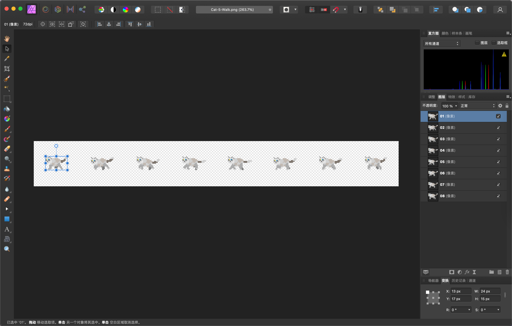
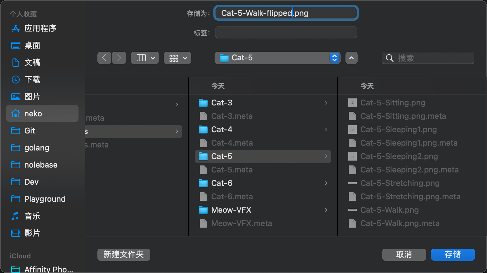
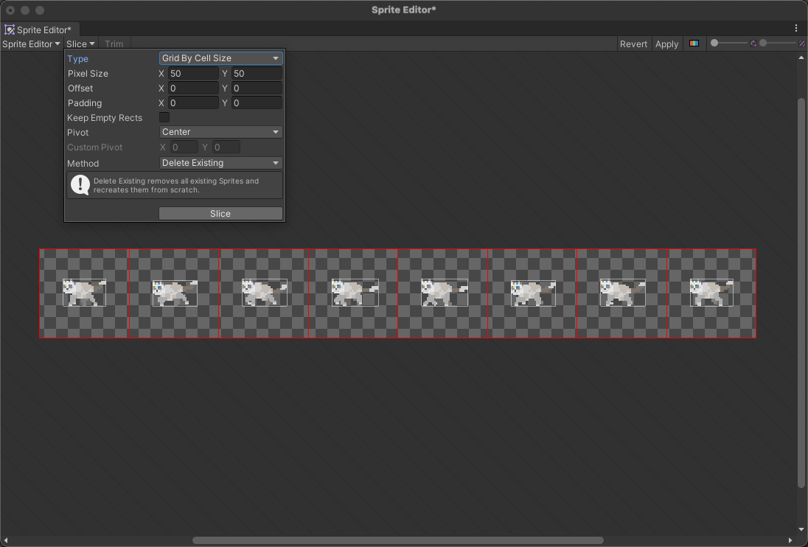

---
tags:
  - 游戏
  - 游戏/分类/2D视角
  - 游戏/分类/像素画风
  - 开发/游戏/Unity
  - 艺术/美术/游戏开发/精灵图
---

# 反转精灵图动画帧

我们可以在任意类似 Photoshop 的软件（比如 Affinity Photo，Photomea 等）中打开动画帧精灵图：

然后我们挨个给他们排个序

接下来重新命名：

重命名完成之后在 Unity 中在界面中点击打开精灵图编辑器：

在编辑器中我们选择 Grid By Cell Size 就可以切分了：

切分完之后就可以看到反过来的动画了：

