---
tags:
  - 开发/游戏
  - 开发/游戏/Unity
  - 游戏/分类/俯视角
  - 开发/CSharp
  - 开发/游戏/动画
  - 操作系统/macOS
  - 软件/macOS/Affinity-Photo
  - 游戏/分类/2D视角
  - 游戏/分类/像素画风
  - 艺术/美术/画风/像素
  - 艺术/美术/游戏开发/动画
  - 艺术/美术/游戏开发/精灵图
  - 艺术/美术/游戏开发/资产处理
---

# 用几行代码和 Unity 制作一只带动画的 2D 俯视角移动小猫咪

周末参加 GameJam 2024 中国的时候基本上是把 Unity 的人物移动和动画相关的知识点学了一下，跟着很厉害的 YouTube 大佬做了一个很可爱的会动的像素画小猫咪。

效果是这样的：

<video controls muted>
  <source src="./assets/unity-movement-animation-of-2d-top-down-characters-screenshot-42.mov" type="video/mp4">
</video>

## 从 Unity Hub 创建 2D Sample 项目


## 下载游戏素材

在 Unity Asset Store 下载免费的小猫咪资源就好了！

[Pet Cats Pixel Art Pack | 2D 角色 | Unity Asset Store](https://assetstore.unity.com/packages/2d/characters/pet-cats-pixel-art-pack-248340)

## 创建一个新的 2D 游戏对象（GameObject）


修改这个 Player Game Object 的名字为 Player 而不是默认的 Square。

这样的操作可以在 Unity 界面的左侧的 Hierarchy 面板中找到 Player 这个游戏对象，点选之后在右侧的 Inspector 找到如下图所示的输入框并且键入自己喜欢的名字来修改它：

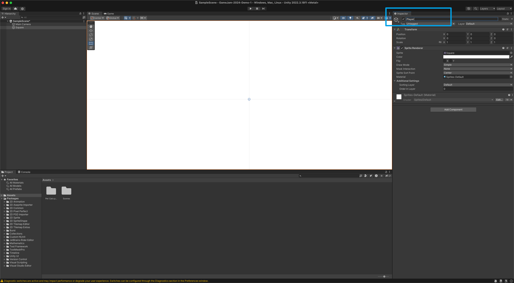

修改完成之后，我们需要附着和配置我们下载好的精灵图中的小猫咪的图。

先在 Unity 界面的左侧的 Hierarchy 面板中找到 Player 这个游戏对象，点选激活 Player 对象，确保右侧的 Inspector 上方显示的是 Player 的名字。

接下来，在下载好的资源目录中，找到自己喜欢的小猫咪的 Idle 状态的精灵图到右侧 Inspector 下方附属的 Sprite Renderer 的 Sprite 输入框中：


拖放完成后，就会是这样的界面状态：


## 为 Player 添加 2D 刚体

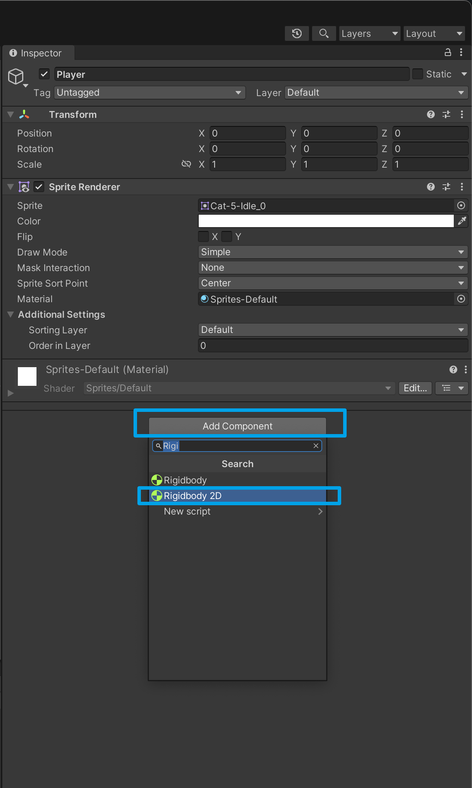

添加之后可以点击正上方的「游玩」按钮然后看看效果：

<video controls muted>
  <source src="./assets/unity-movement-animation-of-2d-top-down-characters-recording-47.mov" type="video/mp4">
</video>

可以发现小猫咪会直接掉下去，这是因为我们的小猫咪现在在默认的 `Rigibody 2D` 对象的影响下，默认会带有数值为 `1` 的重力。

要修复这个问题，可以通过右侧 Inspector 下方附属的 `Rigibody 2D` 的组件选单中的 `Gravity Scale` 栏位中将数据从 `1` 修改为 `0` 来解决：


再次点击游玩的时候就能发现小猫咪不再会掉下去了，但是小猫咪没有任何反应。

## 为 Player 添加接收键盘事件的控制用脚本

### 创建一个 Script 组件到 Player 对象

在 Unity 界面的左侧的 Hierarchy 面板中找到 Player 这个游戏对象，点选 Player 选中 Player 这个游戏对象（Game Object），然后在右侧的 Inspector 中找到 Add Component 按钮，输入找到「New Script」就可以创建新的脚本了：

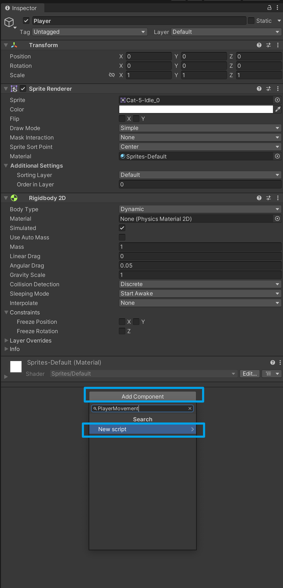

点击「New Script」之后就会提示要输入脚本的名字，可以使用 `PlayerMovement` 这个作为控制脚本的名字：

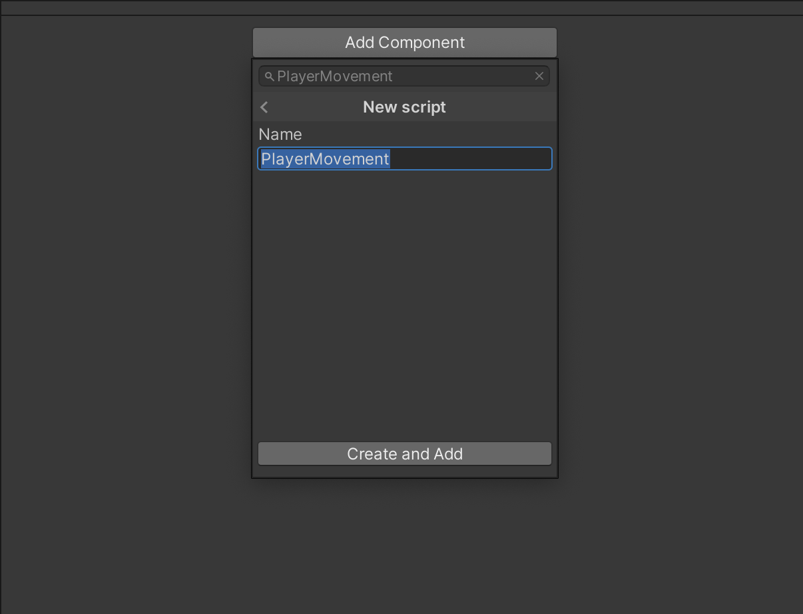

### 编辑 Script 以添加键盘事件处理的代码

准备好之后就可以编辑新创建的脚本了。

在 Unity 界面的左侧的 Hierarchy 面板中找到 Player 这个游戏对象，点选 Player 选中 Player 这个游戏对象（Game Object），然后在右侧的 Inspector 中找到我们刚刚创建的「`PlayerMovement`」脚本。

然后点击组件右侧的三个点来展开更多信息菜单，然后点选「Edit Script」来编辑代码文件。

> [!TIP] 在使用 macOS 进行开发吗？
>
> 如果你遭遇了任何编辑代码的时候的问题，可以通过参考[[配置 macOS 上的 VSCode 来编辑 Unity 的 C Sharp 代码]]文档来配置自己的开发环境哦！


然后我们编写如下的代码：

```csharp
using System.Collections;
using System.Collections.Generic;
using UnityEngine;

public class PlayerMovement : MonoBehaviour
{
    public float moveSpeed = 1f;
    public Rigidbody2D rb;

    Vector2 movement;

    // Start is called before the first frame update
    void Start()
    {

    }

    // Update is called once per frame
    void Update()
    {
        movement.x = Input.GetAxisRaw("Horizontal");
        movement.y = Input.GetAxisRaw("Vertical");
    }

    // FixedUpdate is called once per frame
    void FixedUpdate()
    {
        rb.MovePosition(rb.position + movement * moveSpeed * Time.fixedDeltaTime);
    }
}

```

编辑结束之后，因为我们在代码中声明了一个 `public`（公开）的名为 `rb` 的，类型为 `Rigibody 2D` 的字段，这个字段用来存放我们先前创建的 `Rigibody 2D` 的组件。

在 Unity 界面的左侧的 Hierarchy 面板中找到 Player 这个游戏对象，点选 Player 选中 Player 这个游戏对象（Game Object），然后在右侧的 Inspector 中将 `Rigibody 2D` 拖放配置到 `rb`：


这个时候点击正上方的「游玩」按钮就可以看到小猫咪会移动了！

## 为 Player 添加动画

我们的小猫咪暂时没有任何的动画，只会在按下方向键的时候左右平移，我们需要通过预设的静态精灵图（Sprite）资源创建动画。

### 创建动画

在 Unity 的「Window」菜单栏选项中找到「Animation」，然后点选「Animation」下方的「Animation」来打开动画界面：

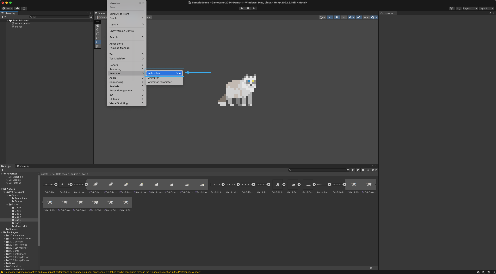

打开之后应该默认是一个独立的窗口，可以通过将这个窗口拖放到下图指示的区域中让「Animation」吸附和停靠在下方面板中：

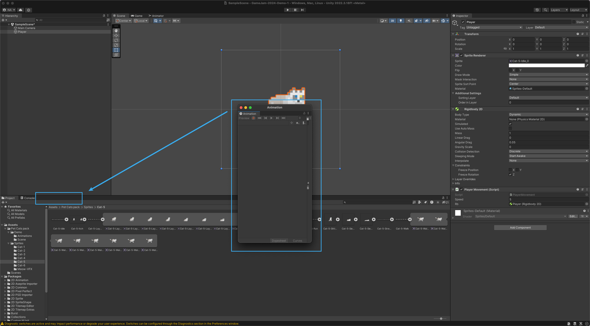

吸附之后就应该变成这样：


接下来我们需要一个存放和管理动画的地方：

1. 我们切换项目目录到「`Assets`」
2. 然后在空白区域中点击鼠标右键
3. 在弹出的选单中选择「Create（创建）」来创建一个资源
4. 选择「Folder」来创建一个存放动画的文件夹

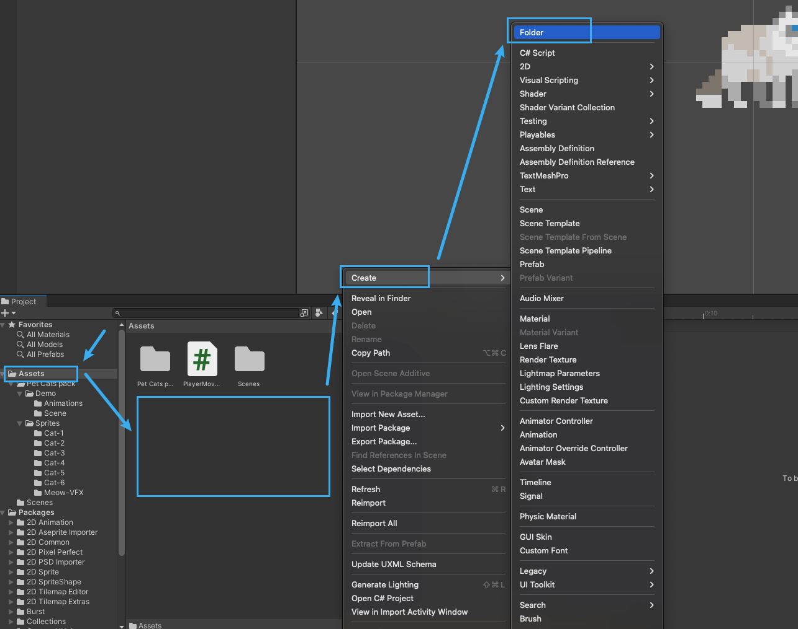

准备好之后应该是这样的：

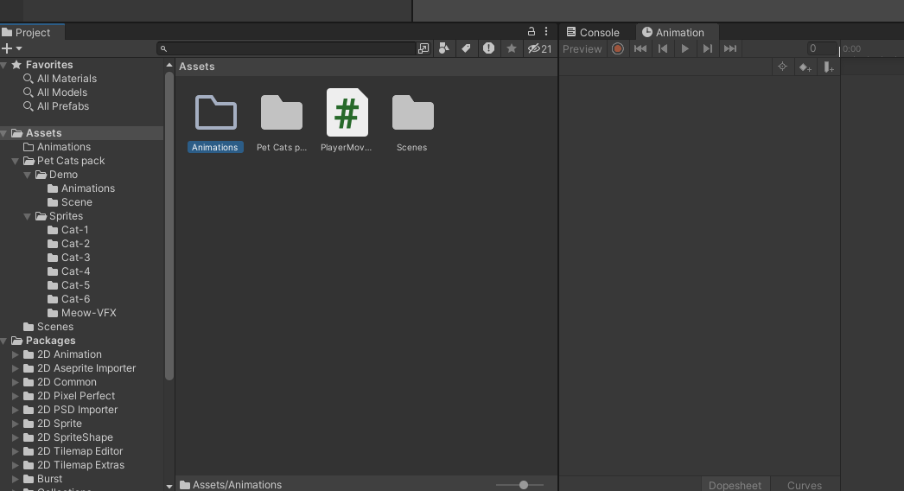

双击目录就可以进入到「`Animation`」文件夹了（可以通过「Project」面板确认是否在文件夹中）。

确认之后，

1. 在 Unity 界面的左侧的 Hierarchy 面板中找到 Player 这个游戏对象
2. 点选 Player 选中 Player 这个游戏对象（Game Object）
3. 在中间靠右的「`Animation`」面板中找到「Create（创建）」按钮
4. 点击「Create（创建）」按钮来创建一个「`Animation`（动画）」
5. 命名为你喜欢的名字，我这里叫 `Player_Idle`，然后存放到先前创建的「`Animation`」文件夹中


创建好之后，我们

1. 在 Unity 界面的左侧的 Hierarchy 面板中找到 Player 这个游戏对象
2. 点选 Player 选中 Player 这个游戏对象（Game Object）
3. 在中间靠右的「`Animation`」面板中看到现在激活的动画为刚刚创建的「`Player_Idle`」动画文件：


现在动画帧里都是空的。

我们需要

- 在左边找到小猫咪 Idle（闲置）的时候的动画精灵图（Sprite）（如果看不到序列帧，可以点击精灵图（Sprite）资源右侧的小箭头来展开）
- 将这些动画帧选中并拖放到右侧的动画帧时间线区域中（蓝色线框的区域）

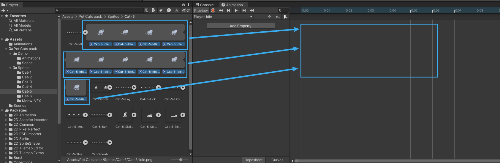

如果点击「`Animation`（动画）」面板的播放就可以看到这些动画开始播放了！

就像这样：

<video controls muted>
  <source src="./assets/unity-movement-animation-of-2d-top-down-characters-recoding-10.mov" type="video/mp4">
</video>

接下来如法炮制，把

- 向上走的
- 向下走的
- 向左走的
- 向右走的

的动画都创建出来。

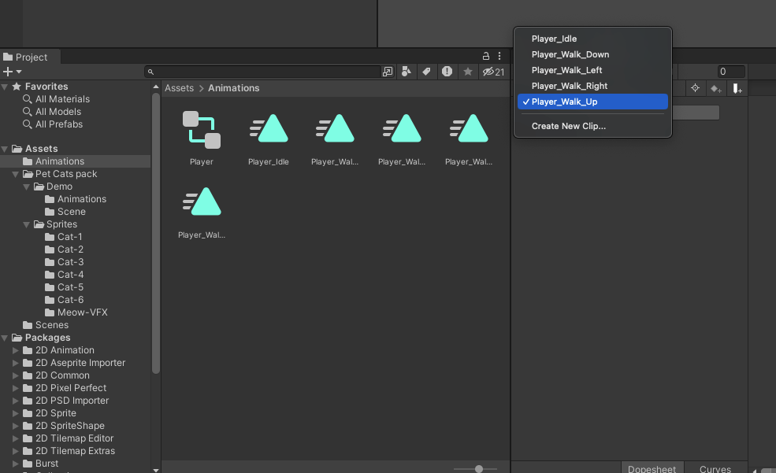

> [!TIP] 动画太快或者太慢了？
>
> 可以在动画面板的右侧找到三个点，点选之后选择「Show Sample Rate（显示采样频率）」来显示当前的动画帧速率。
>
> 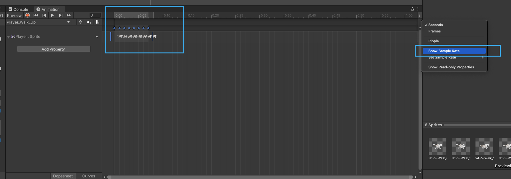
>
> 打开之后在「`Animation`（动画）」面板中的左侧就可以看到新出现的数字，调整这个数字的数值就可以完成动画帧率的编辑和修改了。
>
> 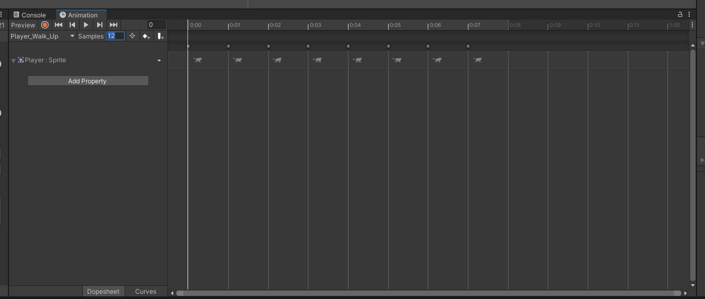

### 通过 Animator（动画编辑器）配置状态变化

#### 找到 Animator Tab

在「Project（项目）」面板中，找到方框形状的图表，这个就是「Animator（动画器）」类型的资源，点选之后，正中间应该会打开激活一个名为「Animator（动画器）」的新面板，在这个面板中，我们将会需要配置动画切换的过程和切换的时机和对其进行相关的配置。

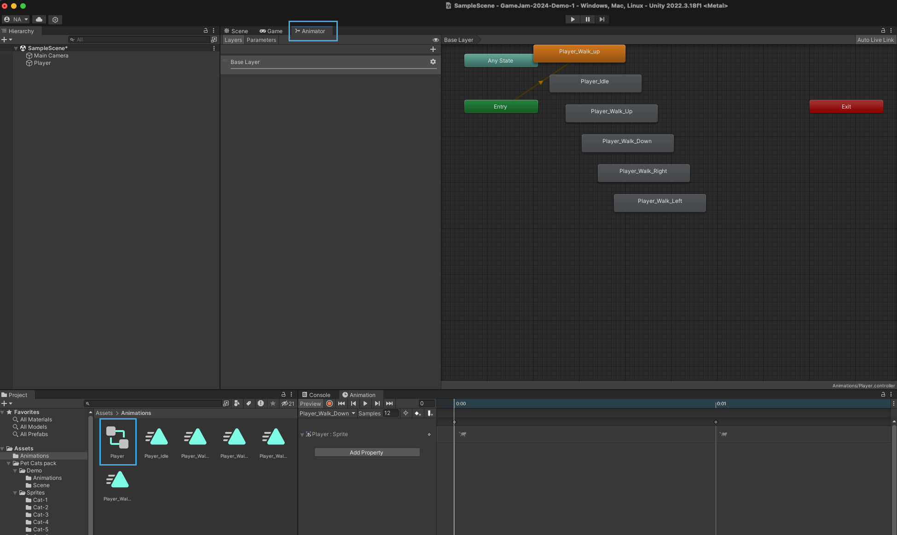

#### 设定默认动画

可以看到，当前的界面中，「Empty（空）」状态指向了名为「`Player_Walk_up`」的动画状态，这意味着在默认情况下，小猫咪的动画将会播放「`Player_Walk_up`」的动画，而非我们先前指定的「`Player_Idle`」的闲置动画。

这个时候可以通过在我们期望配置为「默认状态下的动画」的节点上点击鼠标右键来配置更多的信息，点选「Set as Layer Default State（设置为涂层默认状态）」就可以配置为默认的动画啦：

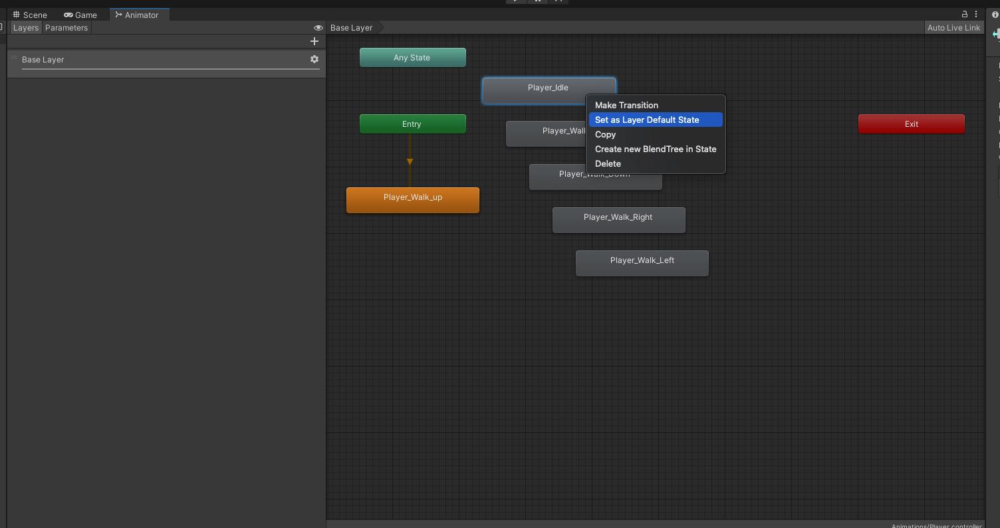

#### 移除不必要的状态

我们还会发现这个界面中存在着先前导入的很多其他的动画，可以删掉这些节点。

框选出这些不要的额外节点，只保留

- Any State
- Empty
- `Player_Idel`
- Exit

这几个节点，对其他的节点右键，然后选择「Delete（删除）」就可以删掉了：

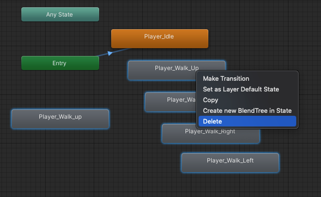

#### 在 Animator 中创建用于水平移动和纵向移动的 Parameters（参数）

接下来我们需要配置新的用于控制动画变化用的给动画专属的参数。

在「Animator（动画器）」面板中

1. 切换到「Parameters（参数）」标签页
2. 点选右侧的「加号」来展开新建菜单
3. 点选「Float」来创建一个浮点数类型的动画控制参数


命名为「`Horizontal`」，作为水平移动时会修改的参数。

> 名字可以随便取的，只要作为开发者的你看得懂就行，之后会通过界面拖放的方式来配置这些参数的，无需担心命名规范。

接下来重复上面的步骤，创建名为「`Vertical`」，类型为「`Float`」的另一个参数。
#### 在 Animator 中创建一个新的 Blend Tree 节点

为了能控制这两个我们新创建的参数 `Horizontal` 和 `Vertical`，我们需要一种全新的节点类型，这种节点叫「Blend Tree」。

在「Animator（动画器）」面板中，

1. 在右侧的节点编辑器的空白区域中，点击鼠标右键
2. 然后点选「From New Blend Tree」选项来创建一个新的「Blend Tree」

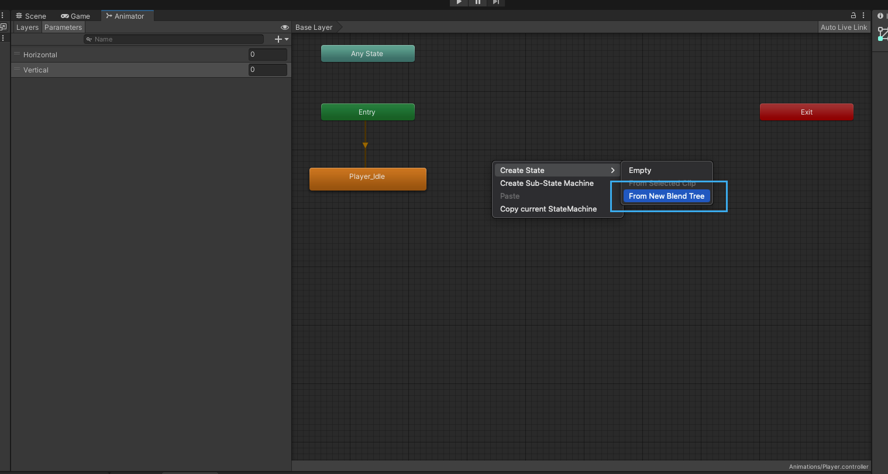

创建之后右侧 Inspector 中应该可以看到全新的对于 Blend Tree 的信息和面板。

#### 配置 Blend Tree 的 Motion Field 选项

这个时候我们需要在 Blend Tree 对象信息中，点选右侧下方的「加号」，创建添加一个名为「Motion Field」的配置选项来方便我们控制动画：

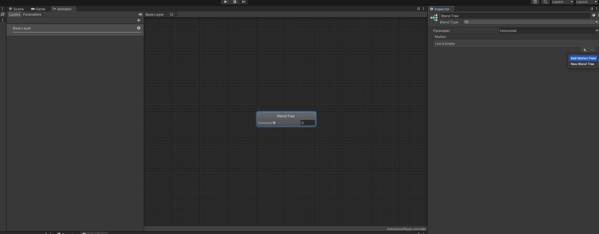

创建好 Motion Field 配置选项之后，可以发现它多了两个参数栏目，我们把向上走和向下走的动画拖拽配置到 Motion Field 的第 1 和第 2 栏目中：

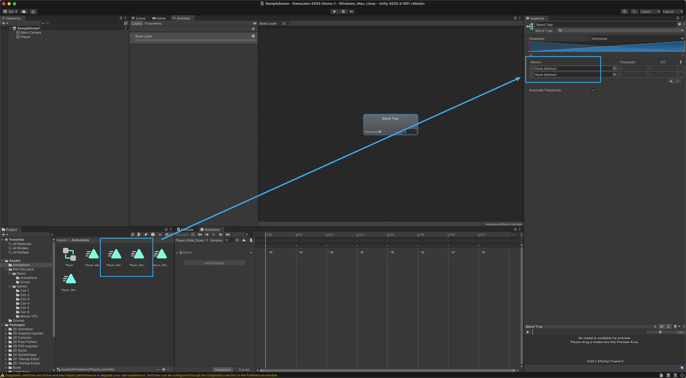

这个时候我们在 Motion Field 的这个交叉的切换图谱中滑动鼠标，观察左侧节点编辑器内的 `Hotizontal` 数值就会发现它会跟随着变化：


现在，为了能实现 `Horizontal` 的数值修改的时候能激活不同的动画（也就是激活之前拖拽上去的「向上走」和「向下」走的动画），我们需要给这两个栏目配置激活的阈值（也就是 Threshold）。

在现在配置的 Motion Field 中，

1. 取消勾选「Automate Threshold」配置选项
2. 将 `Player_Walk_Down` 动画栏目的 `Threshold` 配置为 `-1`
3. 将 `Player_Walk_Up` 动画栏目的 `Threshold` 配置为 `1`


配置 Blend Tree 的类型为「2D Simple Directional（2D 简单有方向性的）」来让我们能够映射和配置水平和纵向的数值切换时不同的动画：


配置完成之后修改 Inspector 中的 Parameters 配置选项中的第二个参数为 `Vertical`


接下来配置各项动画的 `Threshold` 为：

- 上：`0`，`1`
- 下：`0`，`-1`
- 左：`-1`，`0`
- 右：`1`，`0`

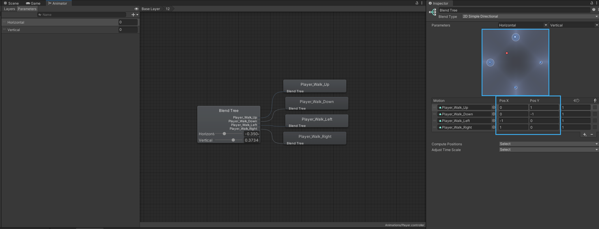

这个时候看下方的动画界面，与此同时拖动 Inspector 中的 Blend Tree 展示的 2D 小地图的时候就会发现小猫咪会根据配置的数值的阈值不同来切换动画了：


可以在 Inspector 中修改 Blend Tree 的名字为「Movement」
#### 在 Animator 中创建用于判断速度的 Parameters（参数）

和之前一样，接下来我们需要配置新的用于根据速度不同变换动画的参数。

在「Animator（动画器）」面板中

1. 切换到「Parameters（参数）」标签页
2. 点选右侧的「加号」来展开新建菜单
3. 点选「Float」来创建一个浮点数类型的动画控制参数


命名为「`Speed`」。

#### 创建动画状态转变规则

现在

1. 在右侧的节点编辑器上点选「`Player_Idle`」动画状态
2. 点击鼠标右键来编辑这个动画状态的配置选项
3. 选择「Make Transition（制作变换）」来创建动画切换的目标

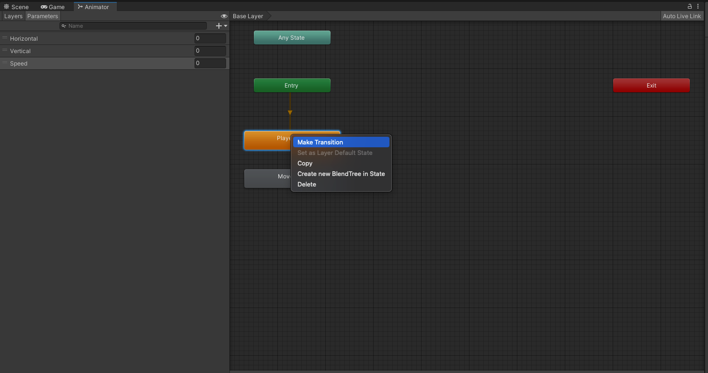

点击之后就会有一个跟随鼠标走的箭头。

我们让这个箭头附着在先前创建的名为「Movement」的 Blend Tree 上：


这样我们就创建好转变规则了！

Unity 接下来就会在条件满足的时候切换动画到 `Movement` 动画。

如何配置条件呢？

- 在节点编辑器中找到转变动画的箭头
- 在右侧 Inspector 中配置箭头的参数
- 在 BlendTree Parameters 配置选项的部分中配置「Conditions（条件）」，意味着我们正在配置并告知 Unity，在什么参数，满足什么条件的时候，切换和转变动画
- 现在配置三个值
	- 配置第一个下拉菜单为 Speed
	- 配置第二个下拉菜单为 Greater（大于）
	- 第三个输入框填写 `0.01`

现在我们创建了一条规则，告诉 Unity：在我们先前创建的 `Speed` 参数大于 `0.01` 的时候将动画切换为 `Movement`

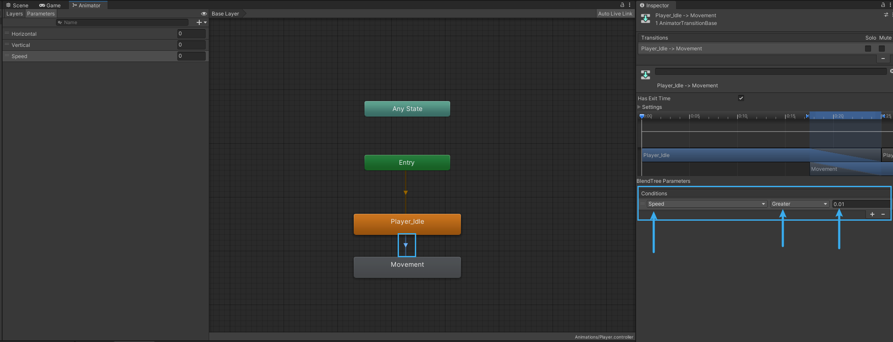

但是光切换为 `Movement` 是不够的，我们还要让小猫咪在玩家不进行任何操作的时候还原到先前的状态。

现在

1. 在节点编辑器中对着 `Movement` 动画状态
2. 点击鼠标右键，选择「Make Transition」
3. 拖放这个箭头到 `Player_Idle` 动画状态上

和之前一样，我们需要告诉 Unity 何时切换 `Movement` 动画为 `Player_Idle`。

现在

1. 在节点编辑器中找到转变动画的箭头
2. 在右侧 Inspector 中配置箭头的参数
3. 在 BlendTree Parameters 配置选项的部分中配置「Conditions（条件）」，意味着我们正在配置并告知 Unity，在什么参数，满足什么条件的时候，切换和转变动画
4. 现在配置三个值
	- 配置第一个下拉菜单为 Speed
	- 配置第二个下拉菜单为 Less（大于）
	- 第三个输入框填写 `0.01`

现在我们创建了一条规则，告诉 Unity：在我们先前创建的 `Speed` 参数小于 `0.01` 的时候将动画切换回 `Player_Idle`

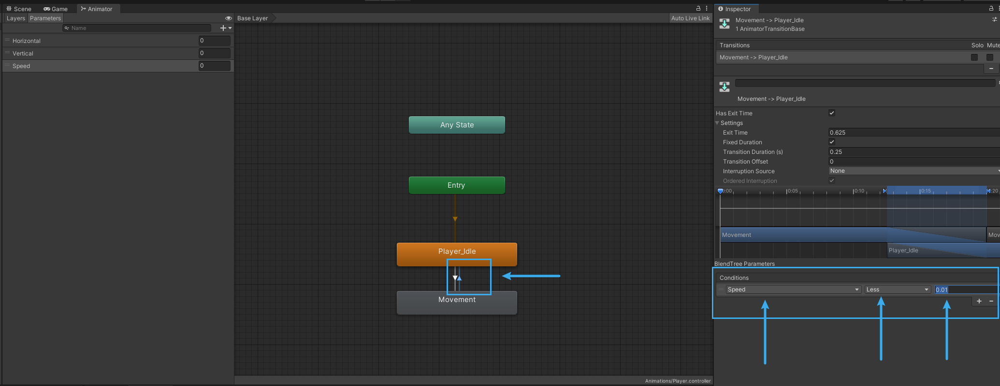

不过现在如果我们直接去看动画的话会有点奇怪，这个时候可以给两个箭头的动画转变都取消勾选「Has Exit Time（具有退出时间）」：


#### 通过 Animator 在运行过程中动态地调试动画

现在，我们点击上方的游玩按钮，然后将「Animator（动画器）」面板放置于「Game」面板的右侧的时候，就可以看到实时的动画状态了：

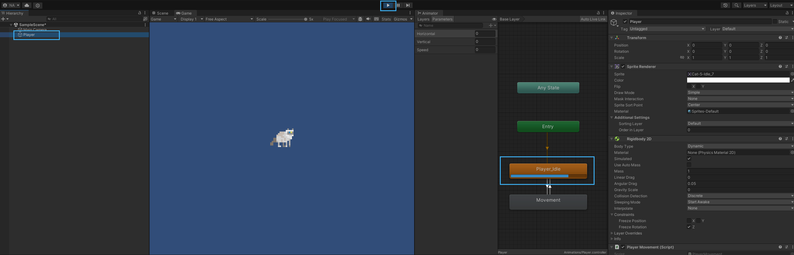

如果直接修改这个 `Speed` 数值就可以看到动画被切换了！


### 应用动画到 Player 上

现在我们要让动画能够和用户事件关联起来。

再次打开我们的 `PlayerMovement` 的 C# 脚本，编辑修改代码为这样：

```csharp
using System.Collections;
using System.Collections.Generic;
using UnityEngine;

public class PlayerMovement : MonoBehaviour
{
    public float speed = 1f;
    public Rigidbody2D rb;
    public Animator animator; // [!code ++]

    Vector2 movement;

    // Start is called before the first frame update
    void Start()
    {

    }

    // Update is called once per frame
    void Update()
    {
		movement.x = Input.GetAxisRaw("Horizontal"); // [!code --]
		movement.y = Input.GetAxisRaw("Vertical"); // [!code --]
    }

    // FixedUpdate is called once per physics update
    void FixedUpdate()
    {
        // Input // [!code ++]
        movement.x = Input.GetAxisRaw("Horizontal"); // [!code ++]
        movement.y = Input.GetAxisRaw("Vertical"); // [!code ++]

        // Animation // [!code ++]
        animator.SetFloat("Horizontal", movement.x); // [!code ++]
        animator.SetFloat("Vertical", movement.y); // [!code ++]
        // use the magnitude of the vector to determine the speed of the animation
        animator.SetFloat("Speed", movement.sqrMagnitude); // [!code ++]

        // Movement
        rb.MovePosition(rb.position + movement * speed * Time.fixedDeltaTime);
    }
}
```

然后把动画器对象拖放到 `PlayerMovement` 脚本的 `Animator` 字段上：

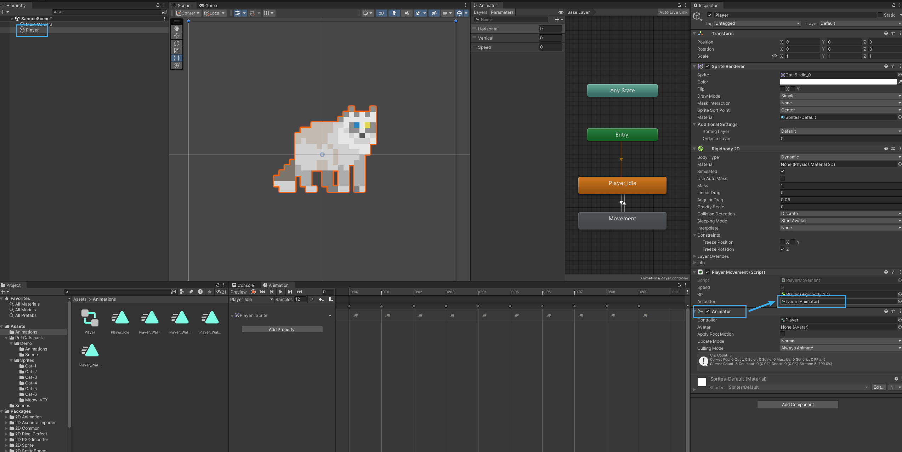

现在点击游玩按钮，就可以看到这样的效果啦：

<video controls muted>
  <source src="./assets/unity-movement-animation-of-2d-top-down-characters-screenshot-42.mov" type="video/mp4">
</video>

## 参考资料

[TOP DOWN MOVEMENT in Unity! - YouTube](https://www.youtube.com/watch?v=whzomFgjT50)
