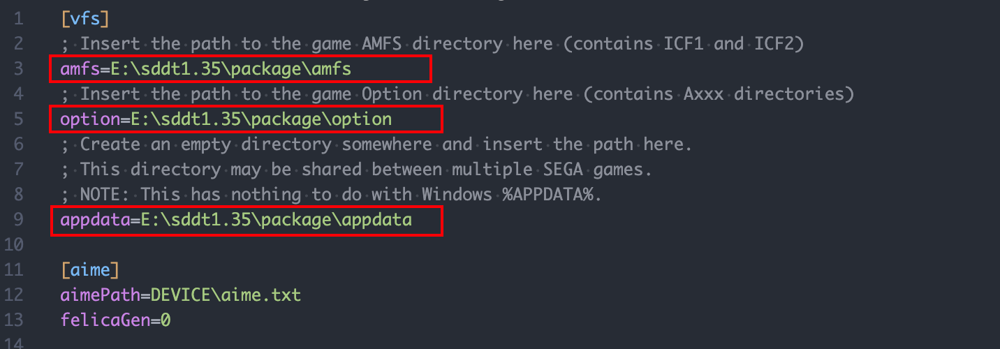
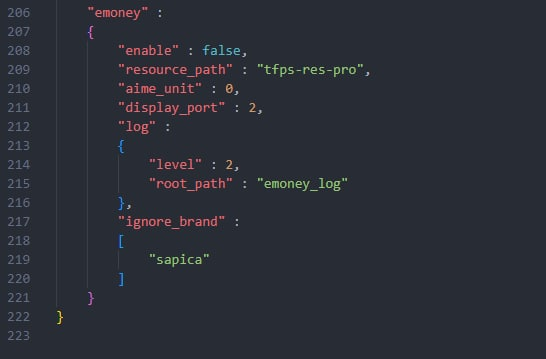
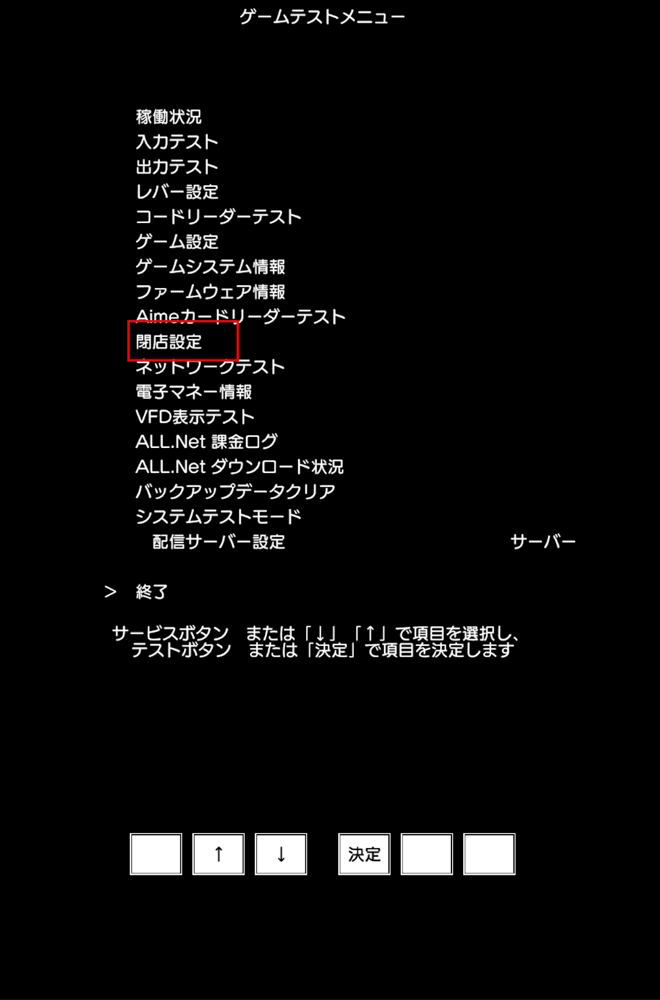
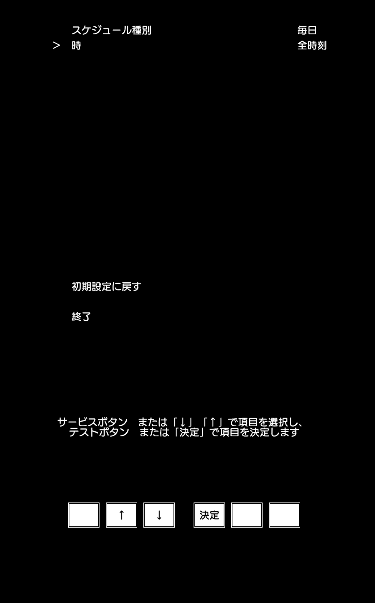

---
tags:
  - 游戏/街机游戏
  - 游戏/音乐游戏/音击/ONGEKI
  - 游戏/音乐游戏/世嘉游戏/HDD
  - 操作系统/Windows
---

# SDDT 1.35 HDD 配置

##### 文档版本

| 编辑者 | 版本 | 变更日期 | 变更说明 |
| ----- | --- | ------- | ------- |
| Neko | v1.0.0 | 2022-05-27 | 创建 |

### 文档兼容性

| 主体 | 版本号 | 文档地址（如果有） |
| -- | -- | -- |
| O.N.G.E.K.I Bright Memory | 1.35.01 |  |
| sddt_mod | v2 |  |
| Aqua | 1.35.01 |  |
| Segatools | 1.35.01 |  |

## 说明

SDDT 代表世嘉出品的 O.N.G.E.K.I 游戏。1.35 版本是当前正在稼动的 Bright Memory 游戏版本。

## 流程

### 解压 VDH 文件

在稍早前流出的 HDD 中，部分的 HDD 有自己的 NTFS 分区，可以通过双击来自动挂载到 Windows 上。但对于此次配置的 SDDT 1.35 的 VHD 而言这样的方法不能奏效，我们需要使用到 7z 这个解压缩工具来完成对 VHD 文件的解压和提取操作。
想要下载 7z 非常简单，可以前往：[7z 官方网站](https://www.7-zip.org/ )  选择对应的系统进制版本然后下载安装。

在资源管理器中右键使用 7z 打开，点按上方的提取（Extract）按钮，然后选择期望解压的文件夹进行解压。


解压后可以看到类似于下面的文件结构


接下来我们需要前往 `package` 目录进行后续配置和设置

### 配置 segatools

#### 解压缩 segatools 压缩包

在获取了对应的 segatools 压缩包（也许下载到的档案名叫 `SDDT_1.35_segatools.zip`）之后，使用常见的解压缩软件打开该压缩包（此处我使用 Bandizip），打开后将里面所有的文件全选并拖拽到 `package` 目录下，然后我们可以获得类似的目录结构：


#### 配置 `segatools.ini`

配置文件很长，需要逐行进行说明和解释。

**在编辑时，请使用类似于 Notepad++ 或是 Visual Studio Code 这样比较方便的编辑器软件进行编辑，切勿使用 Windows 自带的记事本进行编辑，可能会出现奇怪的问题。**

##### vfs 部分的配置

在刚刚解压好的配置文件中，有三个字段是需要我们检查并重新配置的，分别是：

1. `amfs`
2. `option`
3. `appdata`

如下图所示：



这三个字段分别对应了你当前所在的 `package` 目录下有的三个同名文件夹。

如果 `segatools.ini` 和这三个文件夹在同一层级的话（通常而言应该如此，即解压 segatools 之后的默认目录结构），你可以直接写为如下的配置：

```ini
[vfs]
; Insert the path to the game AMFS directory here (contains ICF1 and ICF2)
amfs=amfs

; Insert the path to the game Option directory here (contains Axxx directories)
option=option

; Create an empty directory somewhere and insert the path here.
; This directory may be shared between multiple SEGA games.
; NOTE: This has nothing to do with Windows %APPDATA%.
appdata=appdata
```

这样是使用了相对路径去配置文件夹路径，方便我们在期望的时候随意移动整个游戏文件夹也不需要花时间再去检查配置。

当然，如果 `segatools.ini` 并不和这三个文件夹在同一层级的话，你可能需要根据自己的情况填写绝对路径或是相对路径。

##### aime 部分的配置

如果你没有物理连接的 Aime 读卡器，则需要额外设定一个新的字段 `enable` 并设定它的值为 `1` ，比如：

```ini
[aime]
enable=1
aimePath=DEVICE\aime.txt
felicaGen=0
```

此处需要额外说明的是，如果没有物理读卡器，但是在过去的实体街机游玩时是持有 Aime 卡片，或是在先前的线上服务器版本中使用了 Aime 卡片的，可以在 `segatools.ini`  文件的同目录下的 DEVICE 目录下的 aime.txt 中直接填写自己持有的或是使用过的卡号。

##### dns 部分的配置

该部分配置是十分重要的，它决定了互联网连接（即线上服务器/本地服务器）是如何进行的。
在该教程中暂时不对本地服务器进行讲解，此处我先使用线上服务器 [ea1.msm.moe](https://ea1.msm.moe) 进行配置和演示。

使用 [ea1.msm.moe](https://ea1.msm.moe) 作为线上服务器时，可以填写为：

```ini
[dns]
; Insert the hostname or IP address of the server you wish to use here.
; Note that 127.0.0.1, localhost etc are specifically rejected.
default=ea1.msm.moe
```

##### netenv 部分的配置

保持默认即可，在之后的多人基准机配置中会对该部分配置进行进一步说明。

##### keychip 部分的配置

保持默认即可。

##### io3 部分的配置

该部分的配置大家可以根据自己的需求进行设置，除去第一个字段 `mode` 比较特别以外，其他的字段都是对游戏按键进行配置，可以参考 [虚拟键代码 - Microsoft](https://docs.microsoft.com/zh-cn/windows/win32/inputdev/virtual-key-codes) 这篇文档对照进行编写即可。

###### `mode` 字段

该字段用于说明当前的输入模式。有两个可选值，`1` 和 `2`。

1. 值 `1` 表示使用 XInput 手柄控制器映射进行输入模拟
2. 值 `2` 表示使用键盘输入进行输入模拟

说简单点就是 `1` 表示 Xbox 手柄模式，`2` 表示键盘模式

```ini
[io3]

; Input API selection for JVS input emulator.
; Set "1" to use a xinput gamepad and set "2" to use keyboard.
mode=1

test=0x31
service=0x32
```

##### dinput 部分的配置

该部分的配置大家可以根据自己的需求进行设置，除去第一个字段 `SLIDER_SPEED` 比较特别以外，其他的字段都是对游戏按键进行配置，可以参考 [虚拟键代码 - Microsoft](https://docs.microsoft.com/zh-cn/windows/win32/inputdev/virtual-key-codes) 这篇文档对照进行编写即可。

###### `SLIDER_SPEED` 字段

摇杆灵敏度，可以根据自己的需求进行调整。

```ini
[dinput]

LEFT_A=0x53
LEFT_B=0x44
LEFT_C=0x46

LEFT_MENU=0x51

LEFT_SIDE=0x52

RIGHT_A=0x4A
RIGHT_B=0x4B
RIGHT_C=0x4C

RIGHT_MENU=0x50

RIGHT_SIDE=0x55

SLIDER_LEFT=0x54
SLIDER_RIGHT=0x59

;Change move speed of slider when use dinput
SLIDER_SPEED=1000
```

### 配置鼠标模拟支持

在获取了对应的鼠标支持压缩包（也许下载到的档案名叫 `SDDT_1.35_mouse.zip`）之后，使用常见的解压缩软件打开该压缩包（此处我使用 Bandizip），打开后将里面所有的文件全选并解压到单独的文件夹以确保不会覆盖我们先前配置的文件。

解压后的目录结构如下：


我们需要将 `mu3hook.dll` 和 `mu3io.dll` 这两个文件放到先前配置 `segatools.ini` 的 `package` 目录下并完全替换文件。
接下来我们打开被解压的 `segatools.ini`，会发现里面多了一些配置。
在下方将会对这些多出来的配置进行说明，配置调整好之后还需要将这些配置信息复制粘贴到原先配置好的 `segatools.ini` 中。

##### ds 部分的配置

在 dns 部分的配置下方出现了新的配置 `ds`：

```ini
[ds]

; Region code on the emulated AMEX board DS EEPROM.
; 1: Japan
; 4: Export (some UI elements in English)
;
; NOTE: Changing this setting causes a factory reset.
region=1
```

该部分的配置是用于切换模拟的 AMEX 板的 DS EEROM 的，可以用来配置机台所在的地区。
**但是请注意，变更这个设置将会导致游戏进行一次还原工厂设置。**

所以一般保持默认就好

#### gpio 部分的配置

该配置项是用于分发服务器设置的模拟的 Nu DIP 开关。

```ini
[gpio]

; Emulated Nu DIP switch for Distribution Server setting.
;
; If multiple machines are present on the same LAN then set this to 1 on
; exactly one machine and set this to 0 on all others.
dipsw1=1
```

如果需要在同一个局域网内运行多台设备，那么需要设置 `dipsw1` 字段值为 `1`，否则将所有机器的 `dipsw1` 字段设置为 0。

#### io3 部分的配置

在 io3 部分的配置中出现了一个新的字段 `mouse`，我们需要将这个字段和值复制到 `segatools.ini` 中。将该字段设定为 1 的时候表示启用鼠标代替摇杆模拟。

```ini
[io3]

; Input API selection for JVS input emulator.
; Set "1" to use a xinput gamepad and set "2" to use keyboard.
mode=2

; Set "1" to enable mouse lever emulation.
mouse=1

test=0x75
service=0x76
```

#### dinput 部分的配置

和之前提到的 dinput 部分的配置一样，只不过下面的配置文件列出了可能更适合玩家操作的配置，也提供了将鼠标左右键设置为音击的左右侧键的配置，大家可以参考并复制粘贴到 `segatools.ini` 中。

```ini
[dinput]
LEFT_A=0x41	;A
LEFT_B=0x53	;S
LEFT_C=0x44	;D

;LEFT_SIDE=0x51     ;Q
;RIGHT_SIDE=0x45    ;E

LEFT_SIDE=0x01	; Mouse Left
RIGHT_SIDE=0x02	; Mouse Right

RIGHT_A=0x4A ;J
RIGHT_B=0x4B ;K
RIGHT_C=0x4C ;L

LEFT_MENU=0x55 ;U
RIGHT_MENU=0x4F ;O

; Change move speed of slider when use dinput
SLIDER_SPEED=1000
```

### 完整的 segatools 配置案例

此处是我的 segatools 配置：

```ini
[vfs]
; Insert the path to the game AMFS directory here (contains ICF1 and ICF2)
amfs=amfs
; Insert the path to the game Option directory here (contains OPxx directories)
option=option
; Create an empty directory somewhere and insert the path here.
; This directory may be shared between multiple SEGA games.
; NOTE: This has nothing to do with Windows %APPDATA%.
appdata=appdata

[aime]
enable=1
aimePath=DEVICE\aime.txt
felicaGen=0

[dns]
; Insert the hostname or IP address of the server you wish to use here.
; Note that 127.0.0.1, localhost etc are specifically rejected.
default=ea1.msm.moe

[ds]
; Region code on the emulated AMEX board DS EEPROM.
; 1: Japan
; 4: Export (some UI elements in English)
;
; NOTE: Changing this setting causes a factory reset.
region=1

[netenv]
; Simulate an ideal LAN environment. This may interfere with head-to-head play.
; SEGA games are somewhat picky about their LAN environment, so leaving this
; setting enabled is recommended.
enable=1

[keychip]
; The /24 LAN subnet that the emulated keychip will tell the game to expect.
; If you disable netenv then you must set this to your LAN's IP subnet, and
; that subnet must start with 192.168.
subnet=192.168.1.0

[gpio]
; Emulated Nu DIP switch for Distribution Server setting.
;
; If multiple machines are present on the same LAN then set this to 1 on
; exactly one machine and set this to 0 on all others.
dipsw1=0

; -----------------------------------------------------------------------------
; Input settings
; -----------------------------------------------------------------------------

; Keyboard bindings are specified as hexadecimal (prefixed with 0x) or decimal
; (not prefixed with 0x) virtual-key codes, a list of which can be found here:
;
; https://docs.microsoft.com/en-us/windows/win32/inputdev/virtual-key-codes
;
; This is, admittedly, not the most user-friendly configuration method in the
; world. An improved solution will be provided later.

[io3]
; Input API selection for JVS input emulator.
; Set "1" to use a xinput gamepad and set "2" to use keyboard.
mode=2

; Set "1" to enable mouse lever emulation.
mouse=1

test=0x75
service=0x76

[dinput]
LEFT_A=0x53  ;S
LEFT_B=0x44  ;D
LEFT_C=0x46 ;F

;LEFT_SIDE=0x51     ;Q
;RIGHT_SIDE=0x45    ;E

LEFT_SIDE=0x01  ; Mouse Left
RIGHT_SIDE=0x02  ; Mouse Right

RIGHT_A=0x4A  ;J
RIGHT_B=0x4B  ;K
RIGHT_C=0x4C  ;L

LEFT_MENU=0x55  ;U
RIGHT_MENU=0x4F  ;O

; Change move speed of slider when use dinput
SLIDER_SPEED=1000
```

### 配置 freeplay（免费游玩）

由于当前版本的 HDD 暂时无法直接支持先前版本中可以使用的 coin 键，所以我们需要使用别的方案来解决投币问题。

需要前往并打开 `package` 目录下的 `client_common.json` 文件，编辑下图所示区域：


编辑 `credit` 对象下方的 `config` 对象中的 `freeplay` 字段值为 `true`
这样在连接到服务器时，直接选择自己期望的币值即可，**有些情况下可能会需要倒计时为 0 时币值才会生效**。

### 额外配置说明

对于连接到 [ea1.msm.moe](https://ea1.msm.moe) 的玩家，我们需要配置额外的内容。

需要前往并打开 `package` 目录下的 `client_common.json` 文件，编辑下图所示区域：


编辑 `emoney` 对象下的 `enable` 字段并将其值改为 `false`

### 启动前

#### 配置 inject.exe 的权限和启动方式

为了确保我们能够正确配置上述 `segatools.ini` 中的值，我们需要给和 `segatools.ini` 文件同目录下的 `inject.exe` 文件进行属性配置，并设定为使用管理员权限启动。

1. 右键 `inject.ext`
2. 点选「属性」
3. 点选「兼容性」标签页
4. 在下方的「设置」一栏中找到「以管理员身份运行此程序」并勾选
5. 点击「确定」以保存

### 启动

我们需要命令行来完成启动。

1. 在 Windows 10 中，右键 Windows 徽标，点选 Windows Powershell (管理员)(A) 来新建一个管理员命令行窗口。
2. 在 Windows 11 中，可以下载 Windows Terminal 来获得更好的体验。下载后点 Windows 徽标，搜索 Windows Terminal 或是 终端 并选择「以管理员身份运行」。

打开命令行之后，在资源管理器中导航到音击所在的目录，进入到 `package` 目录，比如我是：`D:\Games\O.N.G.E.K.I_Bright_Memory\SDDT_1.35.01\package` 这样的路径，点选资源管理器的地址栏，全选并复制文本地址，并返回到命令行。

在命令行中输入：

```powershell
cd <package 所在的目录>
```

比如我的是：

```powershell
cd D:\Games\O.N.G.E.K.I_Bright_Memory\SDDT_1.35.01\package
```

然后输入：

```powershell
./start.bat
```

就可以开启游戏了。

### 启动后

#### 进入 service 模式


在游戏读取到不是「**初期化中**」的时候，按下 F6 进入 service 模式（如果按了没有反应，请检查 `segatools.ini`
 的 io3 部分的配置）。


进入 service 模式后，我们可以使用 dinput 部分配置的 `LEFT_B` 按键（默认是 S）和 `LEFT_C` 按键（默认是 D）来完成上下导航，使用 `RIGHT_A` 按键（默认是 J）来确认并进入下级菜单。
在我们完成配置时导航到「**终了**」并按下 `RIGHT_A` 按键（默认是 J）来返回到游戏进入前的最后自检模式。

#### 配置摇杆

我们配置过鼠标模拟支持后，需要先到 service 中配置一下摇杆并矫正它：

1. 前往 service 模式，导航到「**レバー設定**（摇杆设定）」并按下 `RIGHT_A` 按键（默认是 J）来进行摇杆设定


2. 进入后按下 `RIGHT_A` 按键（默认是 J）来选择「**初期設定に戻す**」来恢复摇杆的初始化值，此时此刻移动鼠标就可以看到「**レバー位置**」对应的值发生变化。


配置完成后，导航到「**终了**」并按下 `RIGHT_A` 按键（默认是 J）来返回到 service 菜单。

#### 配置闭店时间

1. 前往 service 模式，导航到「**閉店設定** （店铺关门设定）」并按下 `RIGHT_A` 按键（默认是 J）来进行店铺关门设定



2. 在「**時**」字段上，不断按下 `RIGHT_A` 按键（默认是 J）直至字段值为「**全時刻**（全天候）」



配置完成后，导航到「**终了**」并按下 `RIGHT_A` 按键（默认是 J）来返回到 service 菜单。

#### 配置基准机

1. 前往 service 模式，导航到「**ゲーム設定**（游戏设定）」并按下 `RIGHT_A` 按键（默认是 J）来进行游戏设定


2. 导航到「**グループ内基準機の設定**（组内基准机的设定）」字段，不断按下 `RIGHT_A` 按键（默认是 J）直至值被更改为改为「**基準機**」
3. 导航到「**イベントモード設定**（事件模式设定）」字段，不断按下 `RIGHT_A` 按键（默认是 J）直至值被更改为「**OFF**」


配置完成后，导航到「**终了**」并按下 `RIGHT_A` 按键（默认是 J）来返回到 service 菜单。

#### 进行网络测试（如有必要）

想要检查网络连接，可以前往 service 模式，导航到「**ネットワークテスト**（网络测试）」并执行测试：


网络测试应当得到如下的结果才算正常：


## 常见问题和解决方案

#### IP BAD / DNS BAD

检查网络连接是否正常，如果是连接的线上服务器，也请务必检查线上服务器是否在线和正常运作。

#### All.net Authentication BAD / AIME Server BAD

如果是连接的线上服务器，可能是网络有故障，或是版本不被支持。

如果是连接的本地服务器，请确保你更新到了最新的 aqua 或是 minime 服务器源代码然后再次重试，亦或是服务器配置有问题。

#### Title Server BAD

在 `segatools.ini` 文件中有 vfs 部分配置，检查其中 `amfs` 字段中配置的 `amfs` 文件夹内是否含有 IC1 文件，如果没有，可以从 segatools 中重新解压获取。

在 `segatools.ini` 文件中有 dns 部分配置，检查其中 startup 字段或是 default 字段所填写的域名或是 IP 是否在线和可被访问并支持你所运行的 O.N.G.E.K.I Bright Memory 游戏版本。
