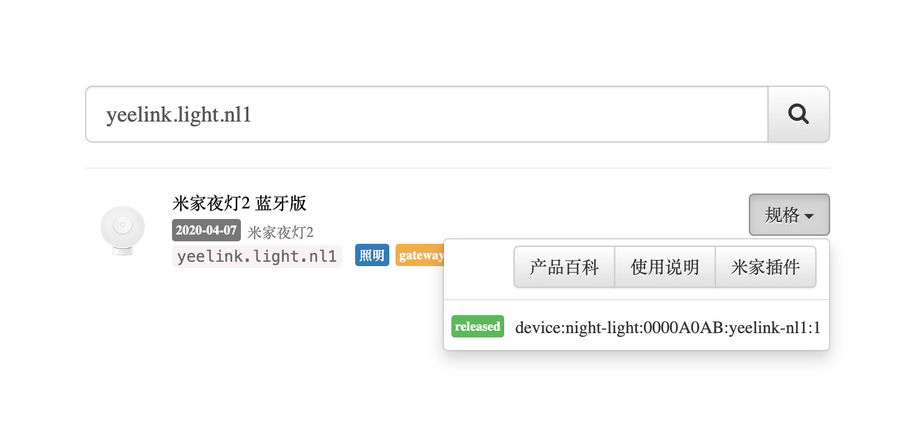
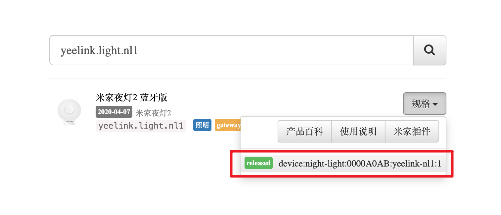
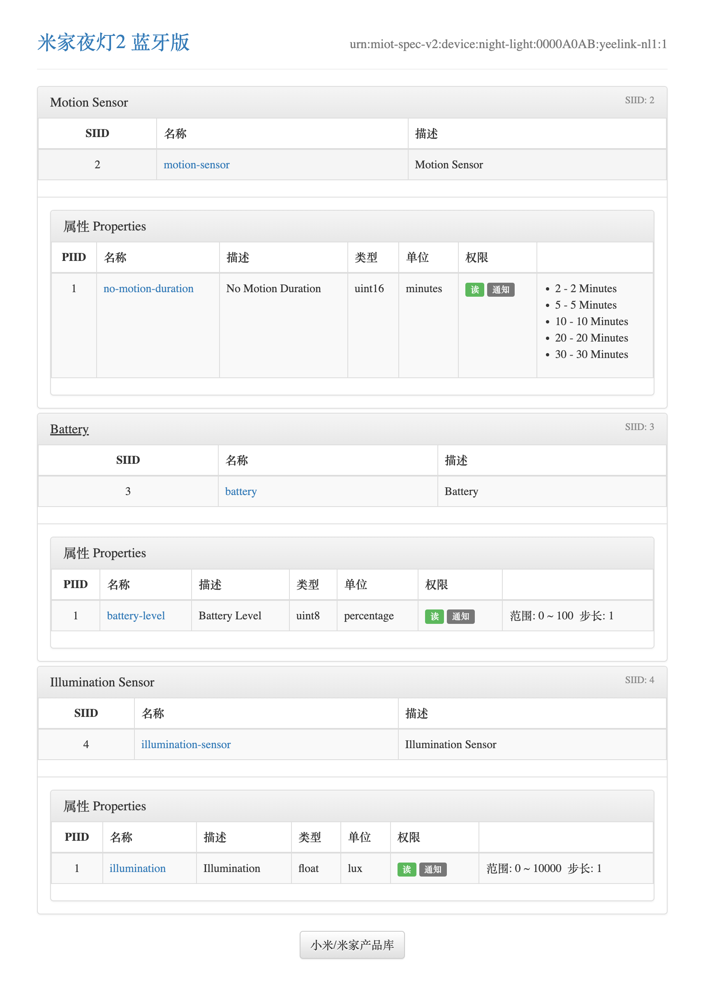

---
tags:
  - 物联网/智能家居
  - 物联网/IoT
  - 开源/软件/Home-Assistant
  - 开源/软件/Home-Assistant/HASS
  - 物联网/智能家居/Home-Assistant/HASS
  - 物联网/智能家居/生态/米家
  - 物联网/智能家居/品牌/小米
  - 物联网/智能家居/Home-Assistant
  - 物联网/智能家居/Homekit
---

# 米家设备状态和属性的 API 文档

## 为啥要文档

米家生态的智能家居设备状态虽然是直接能在 Home Assistant 中读取的，但是在玩转 Home Assistant 进行自动化和状态配置的时候一定会很摸不清头脑吧？
其实 Home Assistant 的集成 [Xiaomi Miot Auto](https://github.com/al-one/hass-xiaomi-miot) 在 Home Assistant 中会给一个带有链接的按钮方便你直接查看设备的状态、属性的文档的。
## 长话短说 TL;DR

你可以直接去 [小米/米家产品库 - Xiaomi Miot Spec](https://home.miot-spec.com/s/) 输入自己的设备来查询相关的状态、属性的文档。

你可以通过前往「配置」->「设备与服务」->「Xiaomi Miot Auto」->「`<n>` 个设备」->「`<某个特定的设备>`」->「访问设备」来查看设备的 API 文档。

一般会带你去[小米/米家产品库 - Xiaomi Miot Spec](https://home.miot-spec.com/s/) 然后自动附上产品的 API ID：

比如 [米家夜灯2 蓝牙版 yeelink.light.nl1 - 小米/米家产品库](https://home.miot-spec.com/s/yeelink.light.nl1)。

这个时候你点击产品右侧的「规格」，就会跳出来一个弹窗。

我们点击下面的固件版本号（一般不知道就点最后冒号之后的最大的数字的）：

然后就能去到 API 文档了：

比如上图前往了 [米家夜灯2 蓝牙版 - 产品规格](https://home.miot-spec.com/spec?type=urn:miot-spec-v2:device:night-light:0000A0AB:yeelink-nl1:1)。

有了这个文档之后你就能看懂 Home Assistant 中的属性和状态啦。
