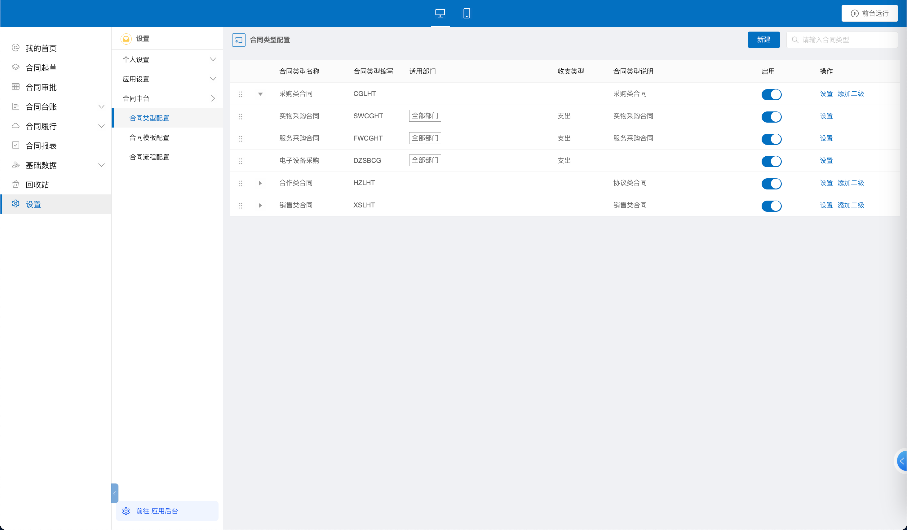
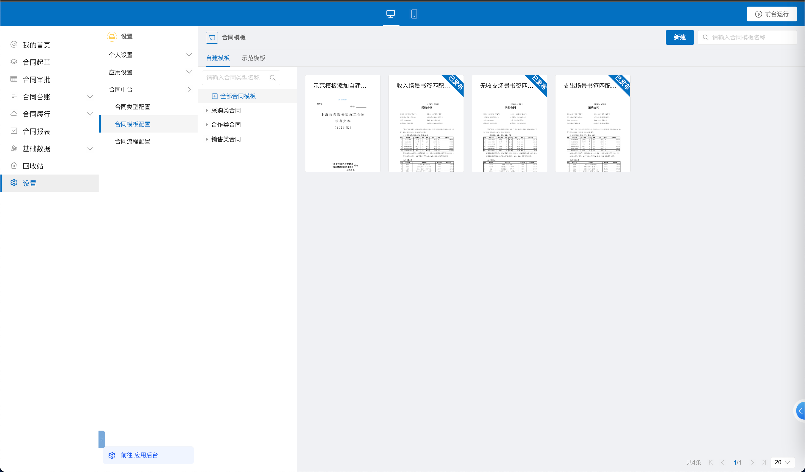

首先，请您在设置中选择【合同中台】，确认合同类型、合同模板以及合同流程都已经正确配置好。合同类型已经添加上本部门。

请您在合同模板配置中，新建好要使用的合同模板，并且与相应的合同类型相关联。

请您在合同流程的配置中，把后台的流程与合同类型做匹配。
![[20240227173346.png]]

把上述配置完成之后，恭喜你！前期准备工作已经顺利完成啦，我们可以开始起草一个合同了。

<iframe src="//player.bilibili.com/player.html?aid=1650423248&bvid=BV1D7421N7xN&cid=1432133457&p=1" scrolling="no" border="0" frameborder="no" framespacing="0" allowfullscreen="true"> </iframe>