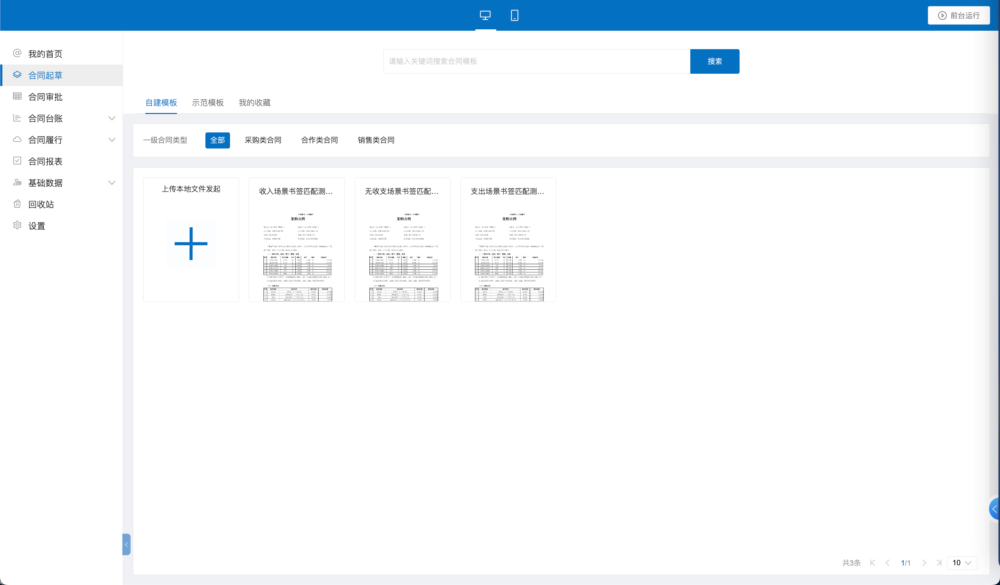
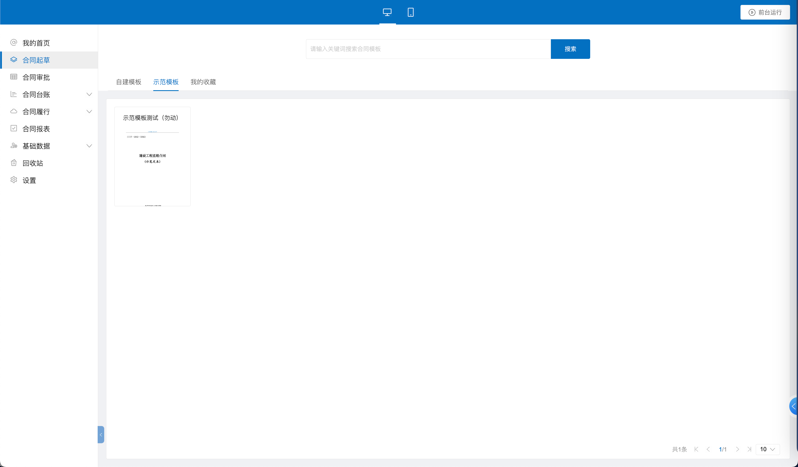
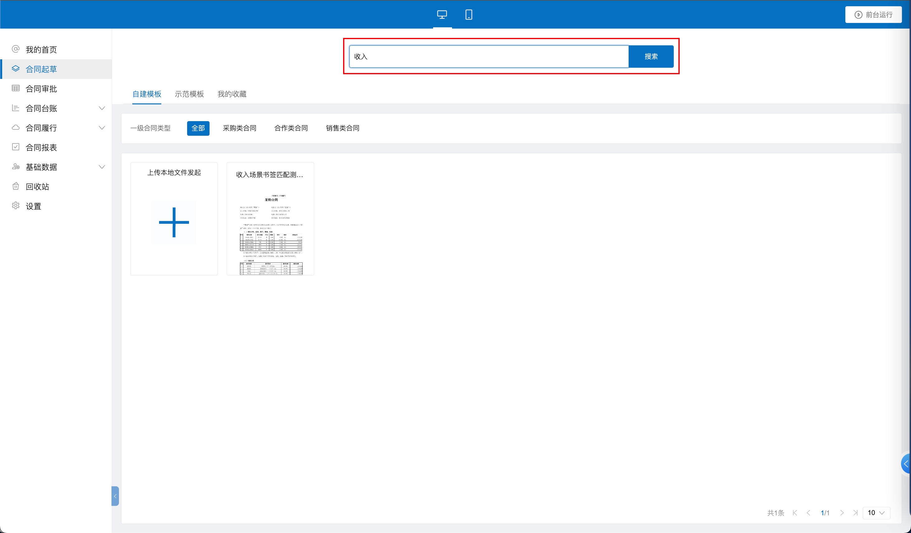
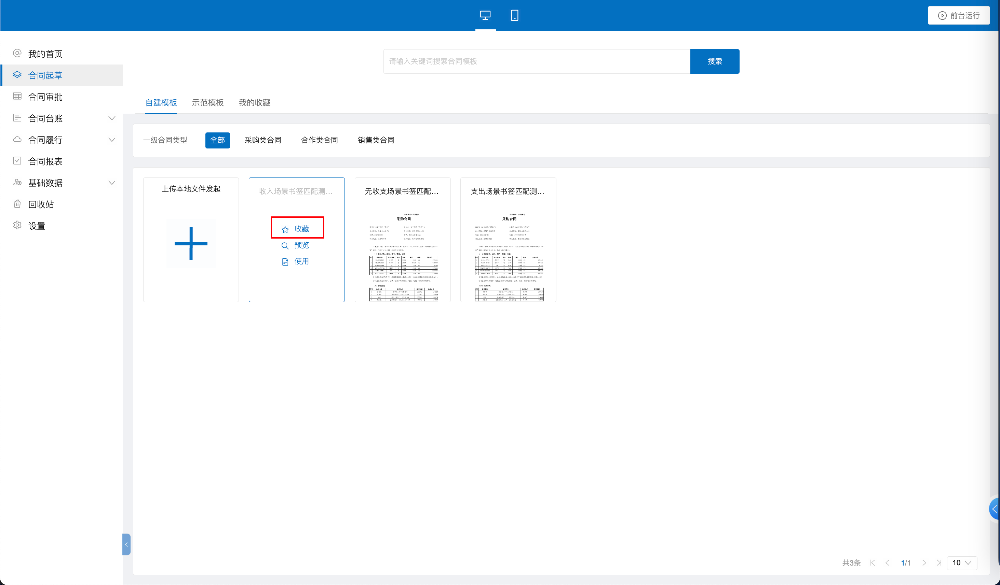
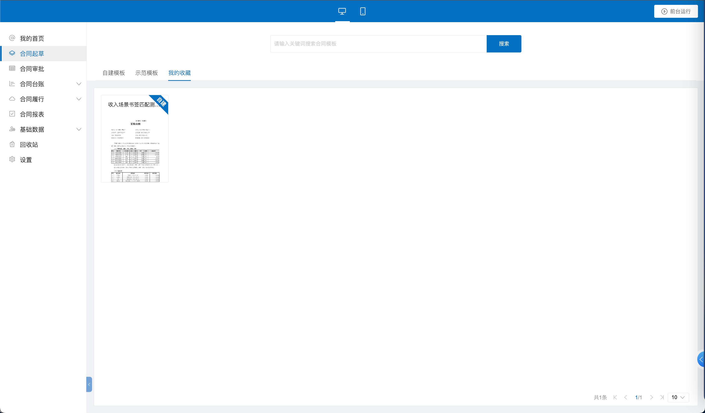

# 合同起草

我们点击左侧菜单里的合同起草按钮，可以看到我们是根据合同模板来发起合同的。合同模板大体上分为两大类：自建模板和示范模板。

一方面，我们可以在【自建模板】中选择我们自己创建的模板来发起合同。具体合同模板的创建方法，我们可以在[[合同新建]]中查看。

点击相应的模板卡片，就进入合同起草的页面了。

另一方面，我们系统也预置了500多个行业公认的合同模板。打开【示范模板】Tab页，我们就可以使用示范模板来创建合同了。

此外，合同模板有很多怎么办？我们有两种方法能够快捷定位到我们想要的合同模板：我们使用在上方的搜索框进行搜索。

您也可以事先收藏您常用的合同模板，

然后点击【我的收藏】，就能直接访问相应的合同了。
