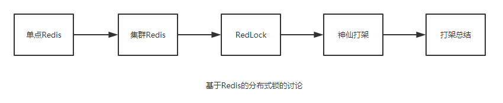
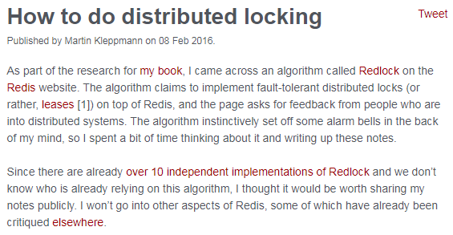
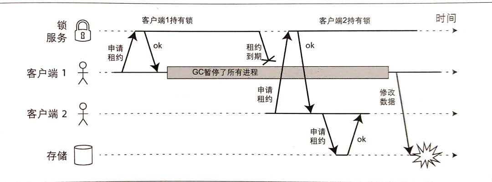
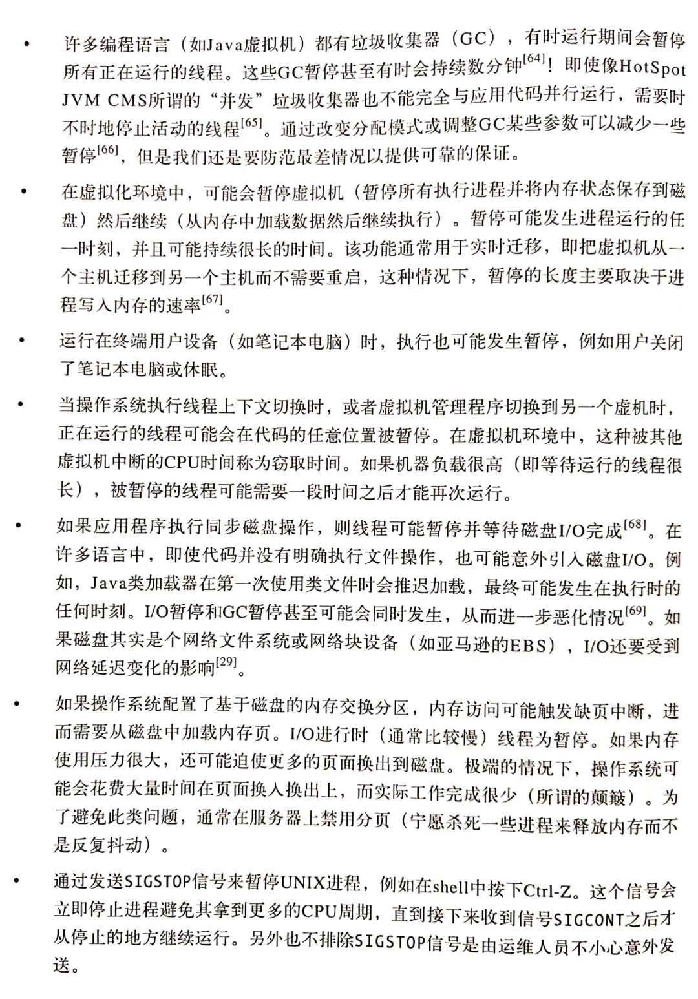
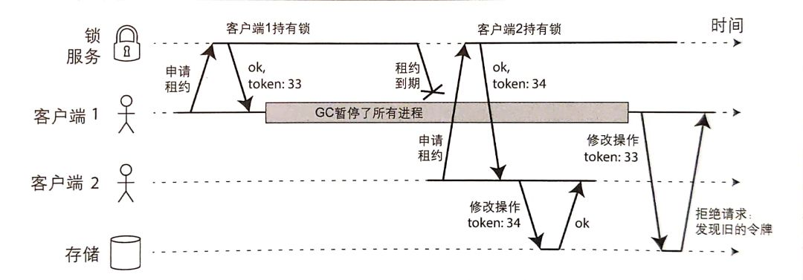
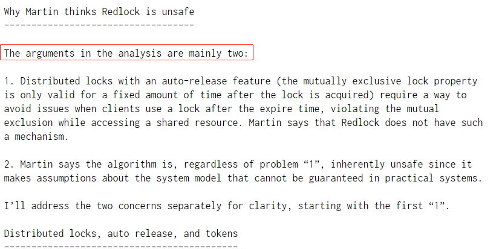
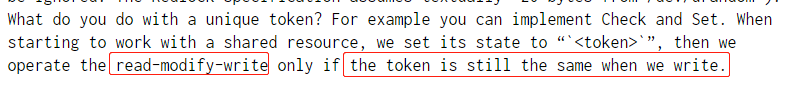
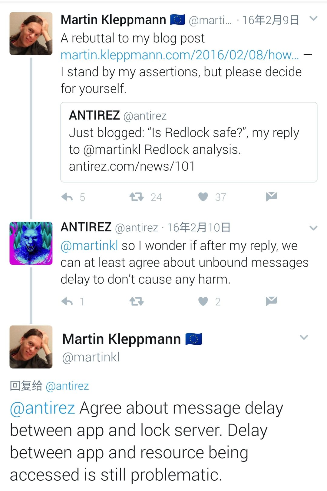

---
tags:
  - 开发/后端
  - 开源/软件/Redis
  - 开发/后端/分布式
  - Archive/微信公众号文章
---
# 【求锤得锤的故事】Redis锁从面试连环炮聊到神仙打架

---

##### Archive 信息

| Archive 自 | Archive 创建于 | 原始作者 | 原始地址 | 原始资源创建时间 | 原始资源更新时间 |
| ---------- | ------------ | ------- | ------- | ------------- | ------------- |
| 微信公众号文章 | 2022-10-29 16:30 | why技术 | [链接](https://mp.weixin.qq.com/s?__biz=Mzg3NjU3NTkwMQ==&mid=2247505097&idx=1&sn=5c03cb769c4458350f4d4a321ad51f5a&source=41) | 2020-03-15 14:57 | 2020-03-15 14:57 |

## 正文

这是why技术的第**38**篇原创文章


又到了一周一次的分享时间啦，老规矩，还是先荒腔走板的聊聊生活。

有上面的图是读大学的时候，一次自行车骑行途中队友抓拍的我的照片。拍照的地方，名字叫做牛背山，一个名字很 low，实际很美的地方。

那条上山的路很难骑，超级烂路和极度变态的陡坡。真是一种折磨，是对意志力的完全考验。

在我们几近崩溃，弹尽粮绝，离山顶还有近两个多小时的时候，一个卡车司机主动要求把我们免费带到山顶。我们拒绝了。

因为同行的星哥他说了一句话：“骑行牛背山这件事情，我这辈子只会做这一次。现在的情况还不是那么糟，如果我搭车上去了，之后想起来我会有遗憾的。所以我更情愿推车。”

第二天下午山上下了一场暴风雪。于是我们几个南方孩子在这少见的雪景中肆意打闹。打雪仗，堆雪人，滑雪......

晚上雪停了之后，我看到了让我终身难忘的场景。星空，美丽到让人想哭的星空！

后来，在人生路上的很多场景中，我都会想起星哥的那句话：这件事，我这辈子只会做这一次，我不想留下遗憾。还会想起那晚璀璨的、触手可及般的星空。

坚持不住的时候再坚持一下，确实是一种难能可贵的精神。

好了，说回文章。

### 背景铺垫

面试的时候，不管你的简历写没写 Redis，它基本上是一个绕不过的话题。


为了引出本文要讨论的关于 Redlock 的神仙打架的问题，我们就得先通过一个面试连环炮：

1. Redis 做分布式锁的时候有需要注意的问题？
2. 如果是 Redis 是单点部署的，会带来什么问题？
3. 那你准备怎么解决单点问题呢？
4. 集群模式下，比如主从模式，有没有什么问题呢？
5. 你知道 Redis 是怎么解决集群模式也不靠谱的问题的吗？
6. 那你简单的介绍一下 Redlock 吧？
7. 你觉得 Redlock 有什么问题呢？

很明显，上面是一个常规的面试连环套路题。中间还可以插入很多其他的 Redis 的考察点，我这里就不做扩展了。

单点的 Redis 做分布式锁不靠谱，导致了基于 Redis 集群模式的分布式锁解决方案的出现。

基于 Redis 集群模式的分布式锁解决方案还是不靠谱，Redis 的作者提出了 Redlock 的解决方案。

Redis 作者提出的 Redlock 的解决方案，另一位分布式系统的大神觉得它不靠谱，于是他们之间开始了 battle。

基于这场 battle，又引发了更多的讨论。

**这场 battle 难分伯仲，没有最后的赢家。如果一定要选出谁是最大的赢家的话，那一定是吃瓜网友。**因为对于吃瓜网友来说（比如我），可以从两位大神的交锋中学习到很多东西。

让你深刻的体会到：**看起来那么无懈可击的想法，细细推敲之下，并不是那么天衣无缝。**


所以本文就按照下面的五个模块展开讲述。



先来一波劝退：**本文近1.2w字，谨慎观看。看不下去不要紧，拉到最后点个“在看”。就是对于我最大的鼓励。奥利给！**


#### 单点Redis

按照我的经验，当面试聊到 Redis 的时候，百分之 90 的朋友都会说：**Redis在我们的项目中是用来做热点数据缓存的。**

然后百分之百的面试官都会问：

> **Redis除了拿来做缓存，你还见过基于Redis的什么用法？**

接下来百分之 80 的朋友都会说到：我们还用 Redis 做过分布式锁。

（当然， Redis 除了缓存、分布式锁之外还有非常非常多的奇技淫巧，不是本文重点，大家有兴趣的可以自己去了解一下。）

那么面试官就会接着说：

> **那你给我描述（或者写一下伪代码）基于Redis的加锁和释放锁的细节吧。**

注意面试官这里说的是**加锁和释放锁的细节，魔鬼都在细节里。**

问这个问题面试官无非是想要听到下面几个关键点：

**关键点一：原子命令加锁。**因为有的“年久失修”的文章中对于 Redis 的加锁操作是先set key，再设置 key 的过期时间。这样写的根本原因是在早期的 Redis 版本中并不支持原子命令加锁的操作。不是原子操作会带来什么问题，就不用我说了吧？如果你不知道，你先回去等通知吧。

而在 2.6.12 版本后，可以通过向 Redis 发送下面的命令，实现原子性的加锁操作：

```shell
SET key random_value NX PX 30000
```

**关键点二：设置值的时候，放的是random\_value。**而不是你随便扔个“OK”进去。

先解释一下上面的命令中的几个参数的含义：

random\_value：是由客户端生成的一个随机字符串，它要保证在足够长的一段时间内在所有客户端的所有获取锁的请求中都是唯一的。

NX：表示只有当要设置的 key 值不存在的时候才能 set 成功。这保证了只有第一个请求的客户端才能获得锁，而其它客户端在锁被释放之前都无法获得锁。

PX 30000：表示这个锁有一个 30 秒的自动过期时间。当然，这里 30 秒只是一个例子，客户端可以选择合适的过期时间。

再解释一下为什么 value 需要设置为一个随机字符串。这也是第三个关键点。

**关键点三：value 的值设置为随机数主要是为了更安全的释放锁**，释放锁的时候需要检查 key 是否存在，且 key 对应的值是否和我指定的值一样，是一样的才能释放锁。所以可以看到这里有获取、判断、删除三个操作，**为了保障原子性，我们需要用 lua 脚本。**

（基本上能答到这几个关键点，面试官也就会进入下一个问题了。常规热身送分题呀，朋友们，得记住了。）


#### 集群模式

面试官就会接着问了：

> **经过刚刚的讨论，我们已经有较好的方法获取锁和释放锁。基于Redis单实例，假设这个单实例总是可用，这种方法已经足够安全。如果这个Redis节点挂掉了呢？**

到这个问题其实可以直接聊到 Redlock 了。**但是你别慌啊，为了展示你丰富的知识储备（疯狂的刷题准备），你得先自己聊一聊 Redis 的集群**，你可以这样去说：


为了避免节点挂掉导致的问题，我们可以采用Redis集群的方法来实现Redis的高可用。

> Redis集群方式共有三种：主从模式，哨兵模式，cluster(集群)模式

其中主从模式会保证数据在从节点还有一份，但是主节点挂了之后，需要手动把从节点切换为主节点。它非常简单，但是在实际的生产环境中是很少使用的。

哨兵模式就是主从模式的升级版，该模式下会对响应异常的主节点进行主观下线或者客观下线的操作，并进行主从切换。它可以保证高可用。

cluster (集群)模式保证的是高并发，整个集群分担所有数据，不同的 key 会放到不同的 Redis 中。每个 Redis 对应一部分的槽。

（上面三种模式也是面试重点，可以说很多道道出来，由于不是本文重点就不详细描述了。主要表达的意思是你得在面试的时候遇到相关问题，需要展示自己是知道这些东西的，都是面试的套路。）

在上面描述的集群模式下还是会出现一个问题，由于节点之间是采用异步通信的方式。如果刚刚在 Master 节点上加了锁，但是数据还没被同步到 Salve。这时 Master 节点挂了，它上面的锁就没了，等新的 Master 出来后（主从模式的手动切换或者哨兵模式的一次 failover 的过程），就可以再次获取同样的锁，出现一把锁被拿到了两次的场景。

锁都被拿了两次了，也就不满足安全性了。**一个安全的锁，不管是不是分布式的，在任意一个时刻，都只有一个客户端持有。**


#### Redlock简介

为了解决上面的问题，Redis 的作者提出了名为 Redlock 的算法。

**在 Redis 的分布式环境中，我们假设有 N 个 Redis Master。这些节点完全互相独立，不存在主从复制或者其他集群协调机制。**

前面已经描述了在单点 Redis 下，怎么安全地获取和释放锁，我们确保将在 N 个实例上使用此方法获取和释放锁。

在下面的示例中，我们假设有 5 个完全独立的 Redis Master 节点，他们分别运行在 5 台服务器中，可以保证他们不会同时宕机。

从官网上我们可以知道，一个客户端如果要获得锁，必须经过下面的五个步骤：

> 步骤描述来源：
>
> [http://redis.cn/topics/distlock.html](http://redis.cn/topics/distlock.html)

1. 获取当前 Unix 时间，以毫秒为单位。
2. 依次尝试从 N 个实例，使用相同的 key 和随机值获取锁。在步骤 2，当向 Redis 设置锁时，**客户端应该设置一个网络连接和响应超时时间，这个超时时间应该小于锁的失效时间**。例如你的锁自动失效时间为 10 秒，则超时时间应该在 5-50 毫秒之间。这样可以避免服务器端 Redis 已经挂掉的情况下，客户端还在死死地等待响应结果。如果服务器端没有在规定时间内响应，客户端应该尽快尝试另外一个 Redis 实例。
3. 客户端使用当前时间减去开始获取锁时间（步骤 1 记录的时间）就得到获取锁使用的时间。当且仅当从大多数（这里是 3 个节点）的 Redis 节点都取到锁，并且使用的时间小于锁失效时间时，锁才算获取成功。
4. **如果取到了锁，key 的真正有效时间等于有效时间减去获取锁所使用的时间（步骤 3 计算的结果）。**
5. 如果因为某些原因，获取锁失败（没有在至少 N/2+1 个Redis实例取到锁或者取锁时间已经超过了有效时间），**客户端应该在所有的 Redis 实例上进行解锁**（即便某些 Redis 实例根本就没有加锁成功）。

通过上面的步骤我们可以知道，只要大多数的节点可以正常工作，就可以保证 Redlock 的正常工作。这样就可以解决前面单点 Redis 的情况下我们讨论的节点挂掉，由于异步通信，导致锁失效的问题。

但是，还是不能解决故障重启后带来的锁的安全性的问题。你想一下下面这个场景：

我们一共有 A、B、C 这三个节点。

1. 客户端 1 在 A，B 上加锁成功。C 上加锁失败。
2. 这时节点 B 崩溃重启了，但是由于持久化策略导致客户端 1 在 B 上的锁没有持久化下来。
3. 客户端 2 发起申请同一把锁的操作，在 B，C 上加锁成功。
4. 这个时候就又出现同一把锁，同时被客户端 1 和客户端 2 所持有了。

（接下来又得说一说Redis的持久化策略了，全是知识点啊，朋友们）


比如，Redis 的 AOF 持久化方式默认情况下是每秒写一次磁盘，即 fsync 操作，因此最坏的情况下可能丢失 1 秒的数据。

当然，你也可以设置成每次修改数据都进行 fsync 操作（fsync=always），但这会严重降低 Redis 的性能，违反了它的设计理念。（我也没见过这样用的，可能还是见的太少了吧。）

而且，你以为执行了 fsync 就不会丢失数据了？天真，真实的系统环境是复杂的，这都已经脱离 Redis 的范畴了。上升到服务器、系统问题了。


所以，根据墨菲定律，上面举的例子：由于节点重启引发的锁失效问题，总是有可能出现的。

为了解决这一问题，**Redis 的作者又提出了延迟重启（delayed restarts**）**的概念。**


意思就是说，一个节点崩溃后，不要立即重启它，而是等待一定的时间后再重启。等待的时间应该大于锁的过期时间（TTL）。这样做的目的是保证这个节点在重启前所参与的锁都过期。相当于把以前的帐勾销之后才能参与后面的加锁操作。

但是有个问题就是：**在等待的时间内，这个节点是不对外工作的。那么如果大多数节点都挂了，进入了等待。就会导致系统的不可用，因为系统在TTL时间内任何锁都将无法加锁成功。**

Redlock 算法还有一个需要注意的点是它的释放锁操作。

**释放锁的时候是要向所有节点发起释放锁的操作的。**这样做的目的是为了解决有可能在加锁阶段，这个节点收到加锁请求了，也set成功了，但是由于返回给客户端的响应包丢了，导致客户端以为没有加锁成功。所有，释放锁的时候要向所有节点发起释放锁的操作。

你可以觉得这不是常规操作吗？

有的细节就是这样，说出来后觉得不过如此，但是有可能自己就是想不到这个点，导致问题的出现，所以我们才会说：**细节，魔鬼都在细节里。**

好了，简介大概就说到这里，有兴趣的朋友可以再去看看官网，补充一下。

> 中文：[http://redis.cn/topics/distlock.html](http://redis.cn/topics/distlock.html)
>
> 英文：[https://redis.io/topics/distlock](https://redis.io/topics/distlock)

好了，经过这么长，这么长的铺垫，我们终于可以进入到神仙打架环节。

### 神仙打架

神仙一：Redis 的作者 antirez 。有的朋友对英文名字不太敏感，所以后面我就叫他**卷发哥**吧。


神仙二：分布式领域专家 Martin Kleppmann，我们叫他**长发哥**吧。


> **看完上面两位神仙的照片，再看看我为了写这篇文章又日渐稀少的头发，我忍不住哭出声来。可能只有给我点赞，才能平复我的心情吧。**

卷发哥在官网介绍 Redlock 页面的最后写到：如果你也是使用分布式系统的人员，你的观点和意见非常重要，欢迎和我们讨论。


于是，“求锤得锤”！这一锤，锤出了众多的吃瓜网友，其中不乏在相关领域的专业人士。


#### 长发哥出锤

故事得从 2016年2月8号 长发哥发布的一篇文章《How to do distributed locking》说起：

> 文章地址：
>
> [http://martin.kleppmann.com/2016/02/08/how-to-do-distributed-locking.html](http://martin.kleppmann.com/2016/02/08/how-to-do-distributed-locking.html)



这一部分直接翻译过来就是：

> 作为本书（《数据密集型应用系统设计》）研究的一部分，我在Redis网站上 看到了一种称为Redlock的算法。该算法声称在Redis实现容错的分布式锁（或更确切地说， 租约），并且该页面要求来自分布式系统人员的反馈。这个算法让我产生了一些思考，因此我花了一些时间写了我的这篇文章。
>
> 由于Redlock已经有10多个独立的实现，而且我们不知道谁已经在依赖此算法，因此我认为值得公开分享我的笔记。我不会讨论Redis的其他方面，其中一些已经在其他地方受到了批评 。

你看这个文章，开头就是火药味十足：**你说要反馈，那我就给你反馈。而且你这个东西有其他问题，我也就不说了。**（其实作者在这篇文章中也说了，他很喜欢并且也在使用 Redis，只是他觉得这个 Redlock 算法是不严谨的）

长发哥主要围绕了下面的这张图进行了展开：


要是一眼没看明白，我再给你一个中文版的，来自长发哥于2017年出版的书《数据密集型应用系统设计》：



可以看到上面的图片中提到了申请租约、租约到期的关键词，租约其实就是可以理解为带超时时间的锁。

而在书中，这张图片的下面写的描述这样的，你咂摸咂摸：


拿 HBase 举例，其设计的目标是确保存储系统的文件一次只能由一个客户端访问，如果多个客户端试图同时写入该文件，文件就会被破坏。那么上面的图片解释起来就是：

1. 客户端 1 先去申请锁，并且成功获取到锁。之后客户端进行了长时间的 GC 导致了 STW 的情况。
2. 在 STW 期间，客户端 1 获取的锁的超时时间到了，锁也就失效了。
3. 由于客户端 1 的锁已经过期失效了，所以客户端 2 去申请锁就可以成功获得锁。
4. 客户端 2 开始写文件，并完成文件的写入。
5. 客户端 1 从 STW 中恢复过来，他并不知道自己的锁过期了，还是会继续执行文件写入操作，导致客户端 2 写入的文件被破坏。而且可以看到，它没有满足锁在任意时刻只有一个客户端持有的原则，即没有满足互斥性。

**书里面没有明说，但是你品一品，这里的锁服务难道不是在说 Redis？**

有的朋友就会说了，那客户端 1 写入文件的时候，再判断一下自己的锁有没有过期不就可以了吗？

你可真是个小机灵鬼呢，那我问你，GC 可能是发生在任何时间的，万一 GC 发生在判断之后呢？

你继续怼我，如果客户端使用的是没有 GC 的语言呢？


**GC 不是导致线程暂停的唯一原因啊，朋友们。**发生这种情况的原因有很多的，你看看长发哥书里举的例子：

上面的内容总结起来，就是就算锁服务是正常的，但是由于锁是有持有时间的，由于客户端阻塞、长时间的 GC 或者网络原因，导致共享资源被一个以上的客户端同时访问了。

其实上面长发哥在书里直接说了：这是不正确的实现。

你多品一品，上面的图是不是有点像由于 Redis 锁的过期时间设置的不合理，导致前一个任务还没执行完成，但是锁的时间到期了，后一个任务也申请到了锁。

对于这种场景，Redission 其实有自己的看门狗机制。但是不在这次 Redlock 的讨论范围内，所以这里就不描述了。

长发哥提出的解决方案是什么呢？

他称为：fencing token。

**长发哥认为使用锁和租约机制来保护资源的并发访问时，必须确保因为异常原因，导致锁过期的那个节点不能影响其他正常的部分，要实现这一目标，可以采用一直相当简单的 fencing（栅栏）。**


假设每次锁服务在授予锁或者租约时，还会同时返回一个 fencing 令牌，该令牌每次授予都会递增。

然后，要求客户端每次向存储系统发送写请求时，都必须包含所持有的 fencing 令牌。存储系统需要对令牌进行校验，发现如果已经处理过更高令牌的请求，则拒绝执行该请求。

比如下面的图片：



1. 客户端 1 获得一个具有超时时间的锁的同时得到了令牌号 33，但随后陷入了一个长时间的暂停直到锁到期。
2. 这时客户端2已经获得了锁和令牌号 34 ，然后发送写请求（以及令牌号 34）到存储服务。
3. 接下来客户端 1 恢复过来，并以令牌号 33 来尝试写入，存储服务器由于记录了最近已经完成了更高令牌号（34），因此拒绝令牌号 33 的写请求。

这种版本号的机制，让我不禁想起了 Zookeeper。**当使用 ZK 做锁服务时，可以用事务标识 zxid 或节点版本 cversion 来充当 fencing 令牌，这两个都可以满足单调递增的要求。**

在长发哥的这种机制中，**实际上就是要求资源本身必须主动检查请求所持令牌信息，如果发现已经处理过更高令牌的请求，要拒绝持有低令牌的所有写请求。**

但是，不是所有的资源都是数据库里面的数据，我们可以通过版本号去支持额外的令牌检查的，那么对于不支持额外的令牌检查资源，我们也可以借助这种思想绕过这个限制，比如对于访问文件存储服务的情况，我们可以将令牌嵌入到文件名中。

总之，为了避免在锁保护之外发生请求处理，需要进行额外的检查机制。

长发哥在书中也说到了：在服务端检查令牌可能看起来有点复杂，但是这其实是推荐的正确的做法：**系统服务不能假定所有的客户端都表现的符合预期。从安全角度讲，服务端必须防范这种来自客户端的滥用。**

这个就类似于我们作为后端开发人员，也不能相信来自前端或者其他接口过来的数据，必须对其进行校验。

到这里长发哥铺垫完成了，开始转头指向 RedLock，他认为 Redlock 是一个严重依赖系统时钟的分布式锁。


他举了一个例子：

1. 客户端 1 从 Redis 节点 A, B, C 成功获取了锁。由于网络问题，无法访问 D 和 E。
2. 节点 C 上的时钟发生了向前跳跃，导致它上面维护的锁过期了。
3. 客户端 2 从 Redis 节点 C, D, E 成功获取了同一个资源的锁。由于网络问题，无法访问 A 和 B。
4. 现在，客户端 1 和客户端 2 都认为自己持有了锁。

这样的场景是可能出现的，因为 Redlock 严重依赖系统时钟，所以一旦系统的时间变得不准确了，那么该算法的安全性也就得不到保障了。

长发哥举这个例子其实是为了辅佐他前面提出的观点：**一个好的分布式算法应该是基于异步模型的，算法的安全性不应该依赖与任何记时假设，就是不能把时间作为安全保障的。在异步模型中，程序暂停、消息在网络中延迟甚至丢失、系统时间错误这些因素都不应该影响它的安全性，只能影响到它的活性。**

用大白话说，就是**在极其极端的情况下，分布式系统顶天了也就是在有限的时间内不能给出结果而已，而不能给出一个错误的结果。**

这样的算法实际上是存在的，比如 Paxos、Raft。很明显，按照这个标准， Redlock 的安全级别是不够的。

而对于卷发哥提出的延迟启动方案，长发哥还是一棒子打死：**你延迟启动咋的？延迟启动还不是依赖于合理准确的时间度量。**


可能是长发哥觉得举这个时钟跳跃的例子不够好的，大家都可能认为时钟跳跃是不现实的，因为对正确配置NTP就能摆正时钟非常有信心。

在这种情况下，他举了一个进程暂停可能导致算法失败的示例：


1. 客户端 1 向 Redis 节点 A, B, C, D, E 发起锁请求。
2. 各个 Redis 节点已经把请求结果返回给了客户端 1，但客户端 1 在收到请求结果之前进入了长时间的 GC 阶段。
3. 长时间的 GC，导致在所有的 Redis 节点上，锁过期了。
4. 客户端 2 在 A, B, C, D, E 上申请并获取到了锁。
5. 客户端 1 从 GC 阶段中恢复，收到了前面第 2 步来自各个 Redis 节点的请求结果。客户端 1 认为自己成功获取到了锁。
6. 客户端 1 和客户端 2 现在都认为自己持有了锁。

其实只要十分清楚 Redlock 的加锁过程，我们就知道，这种情况其实对于 Redlock 是没有影响的，因为在第 5 步，客户端 1 从 GC 阶段中恢复过来以后，在 Redlock 算法中，（我们前面 Redlock 简介的时候提到的第四步）如果取到了锁，key 的真正有效时间等于有效时间减去获取锁所使用的时间。

所以客户端1通过这个检查发现锁已经过期了，不会再认为自己成功获取到锁了。

而随后卷发哥的回击中也提到了这点。


但是，细细想来，我觉得长发哥的意图不在于此。抛开上面的问题来讲，他更想突出的是，一个锁在客户端拿到后，还没使用就过期了，这是不好的。**从客户端的角度来看，就是这玩意不靠谱啊，你给我一把锁，我还没用呢，你就过期了？**


除了上面说的这些点外，长发哥还提出了一个算是自己的经验之谈吧：

**我们获取锁的用途是什么？
**

在他看来不外乎两个方面，**效率和正确性**。他分别描述如下：


如果是为了效率，那么就是要协调各个客户端，避免他们做重复的工作。这种场景下，即使锁偶尔失效了，只是可能出现两个客户端完成了同样的工作，其结果是成本略有增加（您最终向 AWS 支付的费用比原本多5美分），或者带来不便（例如，用户最终两次收到相同的电子邮件通知）。

如果是为了正确性，那么在任何情况下都不允许锁失效的情况发生，因为一旦发生，就可能意味着数据不一致，数据丢失，文件损坏，或者其它严重的问题。（比如个患者注射了两倍的药剂）

最后，长发哥得出的结论是：neither fish nor fowl（不伦不类）

**对于提升效率的场景下，使用分布式锁，允许锁的偶尔失效，那么使用单 Redis 节点的锁方案就足够了，简单而且效率高。用 Redlock 太重。**

**对于正确性要求高的场景下，它是依赖于时间的，不是一个足够强的算法。Redlock并没有保住正确性。**


那应该使用什么技术呢？

长发哥认为，应该考虑类似 Zookeeper 的方案，或者支持事务的数据库。


#### 卷发哥回击

长发哥发出《How to do distributed locking》这篇文章的第二天，卷发哥就进行了回击，发布了名为《Is Redlock safe?》的文章。

> 文章地址：[http://antirez.com/news/101](http://antirez.com/news/101)

要说大佬不愧是大佬，卷发哥的回击条理清楚，行文流畅。他总结后认为长发哥觉得 Redlock 不安全主要分为两个方面：



1. 带有自动过期功能的分布式锁，需要一种方法（fencing机制）来避免客户端在过期时间后使用锁时出现问题，从而对共享资源进行真正的互斥保护。马丁说Redlock没有这种机制。
2. 马丁说，无论问题“1”如何解决，该算法本质上都是不安全的，因为它对系统模型进行了记时假设，而这些假设在实际系统中是无法保证的。

对于第一个点，卷发哥列了5大点来反驳这个问题，其中一个重要的观点是他认为虽然 Redlock 没有提供类似于fencing机制那样的单调递增的令牌，但是也有一个随机串，把这个随机串当做token，也可以达到同样的效果啊。当需要和共享资源交互的时候，我们检查一下这个token是否发生了变化，如果没有再执行“获取-修改-写回”的操作。



最终得出的结论是一个灵魂反问：**既然在锁失效的情况下已经存在一种fencing机制能继续保持资源的互斥访问了，那为什么还要使用一个分布式锁并且还要求它提供那么强的安全性保证呢？**


然而第二个问题，对于网络延迟或者 GC 暂停，我们前面分析过，对 Redlock 的安全性并不会产生影响，说明卷发哥在设计的时候其实是考虑过时间因素带来的问题的。

但是如果是长发哥提出的时钟发生跳跃，很明显，卷发哥知道如果时钟发生跳跃， Redlock 的安全性就得不到保障，这是他的命门。

但是对于长发哥写时钟跳跃的时候提出的两个例子：

1. 运维人员手动修改了系统时钟。
2. 从NTP服务收到了一个大的时钟更新事件。

卷发哥进行了回击：

第一点这个运维人员手动修改时钟，属于人为因素，这个我也没办法啊，人家就是要搞你，怎么办？加强管理，不要这样做。

第二点从NTP服务收到一个大的时钟更新，对于这个问题，需要通过运维来保证。需要将大的时间更新到服务器的时候，应当采取少量多次的方式。多次修改，每次更新时间尽量小。

关于这个地方的争论，就看你是信长发哥的时间一定会跳跃，还是信卷发哥的时间跳跃我们也是可以处理的。

关于时钟跳跃，有一篇文章可以看看，也是这次神仙打架导致的产物：

> [https://jvns.ca/blog/2016/02/09/til-clock-skew-exists/](https://jvns.ca/blog/2016/02/09/til-clock-skew-exists/)

文章得出的最终结论是：时钟跳跃是存在的。


其实我们大家应该都经历过时钟跳跃的情况，你还记得2016年的最后一天，当时有个“闰秒”的概念吗？导致2017年1月1日出现了07:59:60的奇观。


#### 打架的焦点

**经过这样的一来一回，其实双方打架的焦点就很明确了，就是大延迟对分布式锁带来的影响。**

而对于大延迟给Redlock带来的影响，就是长发哥分析的那样，锁到期了，业务还没执行完。卷发哥认为这种影响不单单针对 Redlock ，其他具有自动释放锁的分布式锁也是存在一样的问题。


而关于大延迟的问题，我在某社交平台上找到了两位神仙的下面的对话：



卷发哥问：我想知道，在我发文回复之后，我们能否在一点上达成一致，就是大的消息延迟不会给Redlock的运行造成损害。

长发哥答：对于客户端和锁服务器之间的消息延迟，我同意你的观点。但客户端和被访问资源之间的延迟还是有问题的。

所以通过卷发哥的回击文章和某社交平台的记录，**他是同意大的系统时钟跳跃会造成 Redlock 失****效的。在这一点上，他与长发哥的观点的不同在于，他认为在实际系统中是可以通过好的运维方式避免大的时钟跳跃的。**

所以到这里，两位神仙好像又达到了一个平衡，实现了争论上的求同存异。


### 打架总结

作为一个互联网行业的从业者，也是分布式系统的使用者，读完他们的文章以及由此文章衍生出来的知识点后，受益良多，于是写下此文作为学习总结，也与大家分享。本文还有很多不足之处，还请各位海涵。

如同文章开篇说的，这场争论没有最后的赢家。很明显卷发哥是没有说服长发哥的，因为在长发哥2017年出版的《数据密集型应用系统设计》一书中，专门有一小节的名称叫做：**不可靠的时钟**


其实在这场争论的最后，长发哥对这场争论进行了一个非常感性的总结，他说：

> 下面翻译来自：
>
> [https://www.jianshu.com/p/dd66bdd18a56](https://www.jianshu.com/p/dd66bdd18a56)

对我来说最重要的一点在于：**我并不在乎在这场辩论中谁对谁错 —— 我只关心从其他人的工作中学到的东西，以便我们能够避免重蹈覆辙，并让未来更加美好。前人已经为我们创造出了许多伟大的成果：站在巨人的肩膀上，我们得以构建更棒的软件。**

**对于任何想法，务必要详加检验，通过论证以及检查它们是否经得住别人的详细审查。那是学习过程的一部分。但目标应该是为了获得知识，而不应该是为了说服别人相信你自己是对的。有时候，那只不过意味着停下来，好好地想一想。**


### 吃瓜网友的收获

这里的吃瓜网友就是指我啦。

写这篇文章我的收获还是挺大的，首先我买了长发哥的《数据密集型应用系统设计》一书，读了几节，发现这书是真的不错，豆瓣评分9.6，当当最近也在搞活动，52元就能拿下，强推：

其次完成了这周的周更任务，虽然写的很艰难，从周六中午，写到周日凌晨3点。。。

然后还吃到了另外的一个瓜，可谓是瓜中瓜。

这周五的时候 Redis 官网不是出现了短暂的宕机吗，宕机其实也没啥稀奇的，但是页面上显示的是连不上 Redis 。这就有点意思了。


我在写这篇文章的时候，在卷发哥的某社交平台上发现了这个：


我关心的并不是 OOM，而是卷发哥居然让 Redis 官网运行在一台一个月仅 5 美元，内存只有 1G 的虚拟机上。哈哈哈，震惊，这瓜味道不错。

最后，由于卷发哥是个意大利人，由于最近疫情，四川专家组驰援意大利的事，big thank 中国人。其实这个网友的回答挺好的：投桃报李。


疫情早点过去吧，世界和平。

## 最后说一句（求关注）

我写到这里的时候，不知不觉已经凌晨3点多了，但是因为一直跟着这两位大神的激烈讨论，我的思维异常的清晰。

**写完之后我也说不出谁对谁错。我觉得对于系统的设计，每个人的出发点都不一样，没有完美的架构，没有普适的架构，但是在完美和普适能平衡的很好的架构，就是好的架构。**

瞟了一眼文章字数，快突破了1.2w字。可能又是一篇写了没人看的劝退文吧，但是没有关系，只要有一个人看了我的文章觉得有帮助就行。

**点个“在看”吧，写文章很累的，不要白嫖我，需要一点正反馈。
**


才疏学浅，难免会有纰漏，如果你发现了错误的地方，还请你留言给我指出来，我对其加以修改。（我每篇技术文章都有这句话，我是认真的说的。）

感谢您的阅读，**我坚持原创**，十分欢迎并感谢您的关注。

**我是why技术，一个不是大佬，但是喜欢分享，又暖又有料的四川好男人。**

## 参考资料

1. [http://martin.kleppmann.com/2016/02/08/how-to-do-distributed-locking.html](http://martin.kleppmann.com/2016/02/08/how-to-do-distributed-locking.html)
2. [https://redis.io/topics/distlock](https://redis.io/topics/distlock)
3. [http://antirez.com/news/101](http://antirez.com/news/101)
4. [https://www.jianshu.com/p/dd66bdd18a56](https://www.jianshu.com/p/dd66bdd18a56)
5. 《数据密集型应用系统设计》
