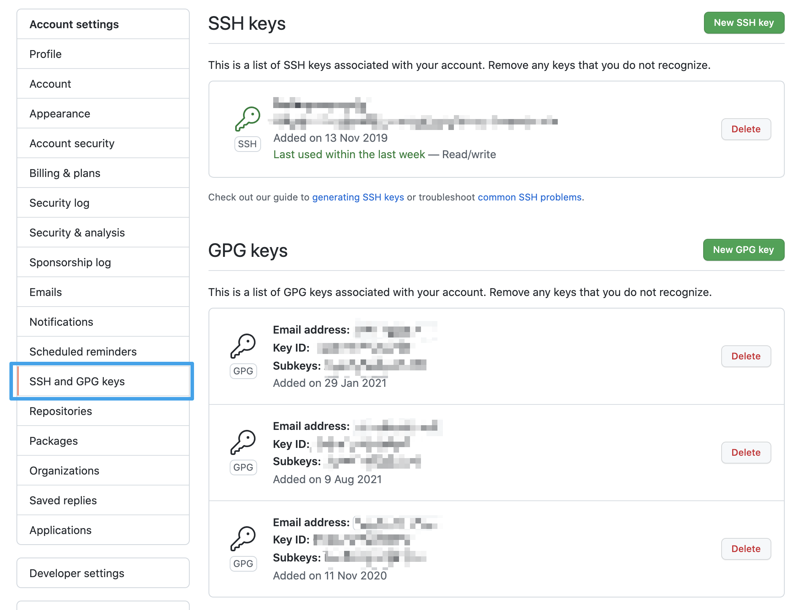

---
tags:
  - 开发/Git
  - 命令行/git
  - 网站/GitLab
  - 网站/GitHub
  - 命令行/ssh
  - 开源/软件/ssh
  - 操作系统/macOS
  - 操作系统/Linux
  - 计算机/信息技术/安全
  - 数学/密码学/非对称加密
  - 数学/密码学/算法/RSA
  - 数学/密码学/算法/ECDSA
---
# Git 客户端配置 SSH 验证

## macOS / Linux

### 创建 SSH 密钥对

SSH 密钥对是两个基于非对称加密算法生成的文件：

1. 一个是公钥文件，拓展名通常以 `pub` 或者 `pem` 结尾
2. 一个是私钥文件，拓展名通常以 `key` 为结尾，或是无拓展名

#### SSH 密钥对存储位置

SSH 相关的密钥、文件，都应该放到 `$HOME/.ssh` 目录下，也就是个人用户目录的 `.ssh` 目录，这个目录下，存放着以下几种文件：

1. `config` - SSH 连接配置文件
2. `xxx_rsa` - RSA 私钥文件，`xxx` 有可能是 `id`，也有可能是别的名字
3. `xxx_rsa.pub` - RSA 私钥对应的公钥文件，`xxx` 有可能是 `id`，也有可能是别的名字
4. `authorized_keys`  - 远程连接 SSH 时验证的公钥文件，每行一个公钥，**发起请求用的 SSH 客户端是不会需要配置的**。

> [!NOTE] 如果没有这个目录，需要使用 `mkdir` 命令（参考 [[mkdir 创建目录]]）手动创建该目录
>
> ```shell
> mkdir $HOME/.ssh
> ```
>
> ⚠️ 注意：创建时应该使用对应的用户进行创建。如果你现在在 `/home/rizumu` 目录（如果不知道你现在在哪个目录，可以通过 `pwd` 命令来获得），则应该使用 `rizumu` 用户创建，而不是 `root`
>
> ```shell
> sudo su rizumu # 切换用户到 rizumu
> mkdir $HOME/.ssh # 创建目录
> ```

#### SSH 密钥对存储位置的权限配置

此处还需要注意的是 `.ssh` 目录和该目录下的文件权限，都有不同的要求：
权限说明：[Linux 权限](../../Linux%20%E6%9D%83%E9%99%90.md)

1. `.ssh` 目录要求 700 (`drwx------``)
2. `.pub` 公钥文件（包括但不限于 `.pub` 文件）要求 644 (`-rw-r--r--`)
3. `authorized_keys`（远程服务端）和 私钥文件（本地）要求 600 (`-rw-------`)

> [!WARNING] 新建 `.ssh` 目录之后需要改变权限值
>
> 使用 `chmod` 命令（参考 [chmod 变更权限](../../Linux%20%E5%91%BD%E4%BB%A4/%E6%9D%83%E9%99%90%E7%AE%A1%E7%90%86/chmod%20%E5%8F%98%E6%9B%B4%E6%9D%83%E9%99%90.md)）进行调整
>
> ```shell
> chmod 644 .ssh
> ```

#### 开始生成 SSH 密钥对

##### 使用 `cd` 命令（参考 [cd 变更目录](../../Linux%20%E5%91%BD%E4%BB%A4/%E6%96%87%E4%BB%B6%E7%AE%A1%E7%90%86/cd%20%E5%8F%98%E6%9B%B4%E7%9B%AE%E5%BD%95.md)）切换到 `$HOME/.ssh` 目录，也可以使用 `~/.ssh` 来表示

```shell
cd $HOME/.ssh
```

##### 使用 `ssh-keygen` 命令创建密钥对

我们可以使用 `ssh-keygen` 命令（参考 [ssh-keygen 创建 SSH 密钥](../SSH%20%E8%BF%9C%E7%A8%8B%E7%99%BB%E5%85%A5/ssh-keygen%20%E5%88%9B%E5%BB%BA%20SSH%20%E5%AF%86%E9%92%A5.md)）来创建 `SSH` 密钥对，此处的参数：

1. `t` 表示算法，我们指定算法为 RSA
2. `b` 表示位数，我们指定为 4096 位的 RSA 密钥

```shell
ssh-keygen -t rsa -b 4096 -C "<GitHub 账号的电子邮件地址>"
```

执行命令后会有次需要输入额外信息，完整流程见下方：

此处需要填写私钥文件名称，github 的话可以填写 `github_rsa`

```shell
Generating public/private rsa key pair.
Enter file in which to save the key (/home/neko/.ssh/id_rsa): github_rsa
```

设定私钥的密码，如果不希望每次使用都输入密码，可以留空，直接回车

```shell
Enter passphrase (empty for no passphrase):
```

确认密码，如果留空，直接回车

```shell
Enter same passphrase again:
```

完整的流程：

```shell
$ ssh-keygen -t rsa -b 4096 -C "neko@ayaka.moe"
Generating public/private rsa key pair.
Enter file in which to save the key (/home/neko/.ssh/id_rsa): github_rsa
Enter passphrase (empty for no passphrase):
Enter same passphrase again:
Your identification has been saved in github_rsa. # 私钥已保存 github_rsa
Your public key has been saved in github_rsa.pub. # 公钥已保存为 github_rsa.pub
The key fingerprint is: # 密钥对指纹为：
SHA256:3P4U6I/ROsAaUJdYTAVHpZk02D80aTAjpIf4XDIDPUA yuna@Ayaka-MBP.local
The key's randomart image is: # 随机码的可视化
+---[RSA 4096]----+
|   .Eo **BXo..   |
|     o=o=+.B=    |
|    ..*oo ++ .   |
|    .o B . .o    |
|     .o.S o ..   |
|      . oo . .   |
|       o .+ o    |
|      .   .B     |
|          o.o    |
+----[SHA256]-----+
```

现在就创建完毕了。私钥的文件存放在 `~/.ssh/<填写的私钥文件名>`内，公钥存放在 `~/.ssh/<填写的私钥文件名>.pub` 内

### 配置 GitHub 的 SSH

#### 创建新的 GitHub SSH 密钥条目

前往 [GitHub 个人设置 | SSH 与 GPG 密钥](https://github.com/settings/keys) 页面进行设置



点选 SSH Keys 右手边的绿色按钮 `New SSH Key` 来上传我们的公钥


#### 填写标题和公钥内容

标题只需要你看得懂，作为备注信息就好了。
获取公钥可以通过 `cat` 命令（参考 [cat 输出文件](../../Linux%20%E5%91%BD%E4%BB%A4/%E6%96%87%E6%A1%A3%E8%AF%BB%E5%86%99/cat%20%E8%BE%93%E5%87%BA%E6%96%87%E4%BB%B6.md)）完成

```shell
cat ~/.ssh/github_rsa.pub # github_rsa 是上一步命名的私钥名称，公钥文件名直接在私钥文件名后面加 .pub 即可，可以根据自己的需求填写
```

复制里面的内容粘贴到 GitHub 的页面表单内即可

### 配置本地 SSH 连接

我们需要去 `$HOME/.ssh/config` 文件中配置我们的连接，使用偏好的编辑器打开这个文件：

::: code-group

```shell [喜欢 vim]
vim ~/.ssh/config
```

```shell [喜欢 Visual Studio Code]
# 需要预先在 Visual Studio Code 中通过命令面板 command Palette（可以在 Windows 和 Linux 上通过 Ctrl + Shift + P 或者在 macOS 上通过 command + Shift + P）
code ~/.ssh/config
```

```shell [喜欢 nano]
nano ~/.ssh/config
```

:::

一般情况下，为 Git 配置的 SSH 配置文件的格式如下

```ssh-config
Host <连接时在输入 ssh 命令时引用的域名别名>
    HostName <Git 服务器>
    User <用户名>
    Port <端口>
    IdentityFile <公钥所在的路径>
```

1. **Host**：域，等同于别名，比如我们可以在这个字段中填写 `gh`，下面的 `HostName` 填写 `github.com`，则连接的时候我们输入并执行 `ssh gh` 就可以自动指向到 `github.com`，这个地方选择自己喜欢的方式命名即可，比如我喜欢 `<用户名>.git` 这样（`nekomeowww.git`），这样多用户的时候可以方便配置
2. **HostName**：域名，需要连接的远程服务器域名或是 IP 地址，GitHub 的 SSH 需要填写 github.com，GitLab 则填写 gitlab.com，如果是自建的 GitLab 实例，则需要填写对应的实例域名或是 IP
3. **User**：用户，连接时使用的用户，对于 GitHub SSH 而言，默认填写 git，不用写为自己的用户名，服务器那边会通过你的公钥自动判断的
4. **IdentityFile**：身份文件，一般是 RSA 密钥的私钥文件，格式不限，只要是复合 OpenSSH 规范的即可

> [!NOTE] 如果你使用 1Password CLI，也可以省略掉 `IdentityFile`
>
> ```ssh-config
> Host <连接时在输入 ssh 命令时引用的域名别名>
>     HostName <Git 服务器>
>     User <用户名>
>     Port <端口>
> ```

我们往 `~/.ssh/config` 文件中写入上面自定义好的内容即可。也可以参考下面的配置：

::: code-group

```shell [GitHub]
Host github.com
  User git
  HostName github.com
  Port 22
  IdentityFile ~/.ssh/id_rsa.pub # 记得改成自己的公钥所在的位置
```

```shell [GitLab]
Host gitlab.com
  User git
  HostName gitlab.com
  Port 22
  IdentityFile ~/.ssh/id_rsa.pub # 记得改成自己的公钥所在的位置
```

:::

当然你也可以参考我的配置：

```ssh-config
Host nekomeowww.git
    HostName ssh.github.com
    User git
    Port 443
    IdentityFile ~/.ssh/nekomeowww_rsa
```

### 测试 GitHub 连接

使用 `ssh` 命令加上参数 `T` 来测试

```shell
ssh -T <别名> # 别名填写上面 Host 字段的值
```

比如如果用大家最常用的配置的话：

```ssh-config
Host github.com
  User git
  HostName github.com
  Port 22
  IdentityFile ~/.ssh/id_rsa.pub # 记得改成自己的公钥所在的位置
```

那么就输入

```shell
ssh -T github.com
```

来进行配置。

> [!NOTE] 遭遇到了 `error: kex_exchange_identification: Connection closed by remote host` 错误？
>
> 如果你在中国大陆进行访问，那么首先在中国大陆通过 `22` 端口连接到 `github.com` 就是被防火墙禁止的，如果你已经使用了梯子进行科学上网，也依然可能会遭遇因梯子提供商封禁 `22` 端口的代理而遭遇上述错误。
>
> 这个时候你需要根据官方指引的[通过 HTTPS 端口使用 SSH](https://docs.github.com/en/authentication/troubleshooting-ssh/using-ssh-over-the-https-port) 配置使用 `ssh.github.com` 域名和 `443` 端口进行访问：
>
> ```ssh-config
> Host github.com
>   User git
>   HostName ssh.github.com
>   Port 443
>   IdentityFile ~/.ssh/id_rsa.pub
> ```

正常情况下的测试结果：

```shell
ssh -T nekomeowww.git
Hi nekomeowww! You've successfully authenticated, but GitHub does not provide shell access.
```

出现这样的字样就说明配置完成了，可以在 Git 命令行工具中使用了。

### 实际使用方式

以我的配置为例：

```ssh-config
Host github.com
  User git
  HostName ssh.github.com
  Port 443
  IdentityFile ~/.ssh/nekomeowww_2023.pub
```

Git 克隆命令：

```shell
git clone nekomeowww.git:nekomeowww/repo.git
```

为老的仓库设定使用 SSH 连接：

```shell
git remote set-url origin nekomeowww.git:nekomeowww/repo.git
```
