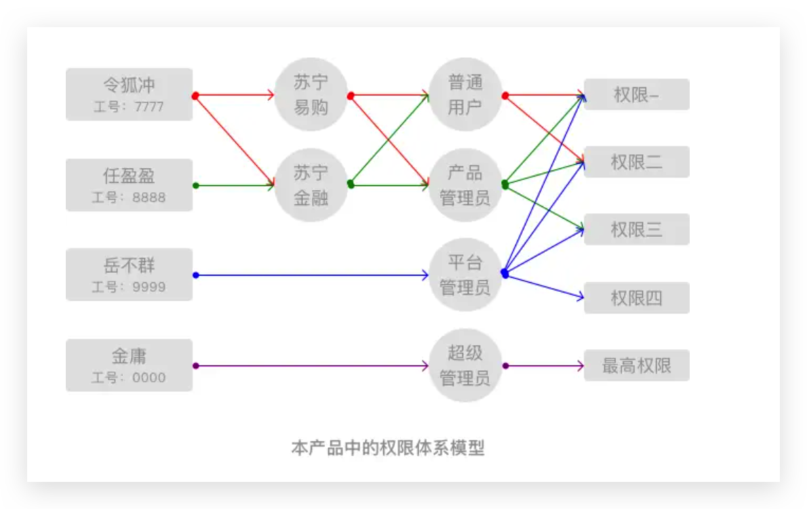
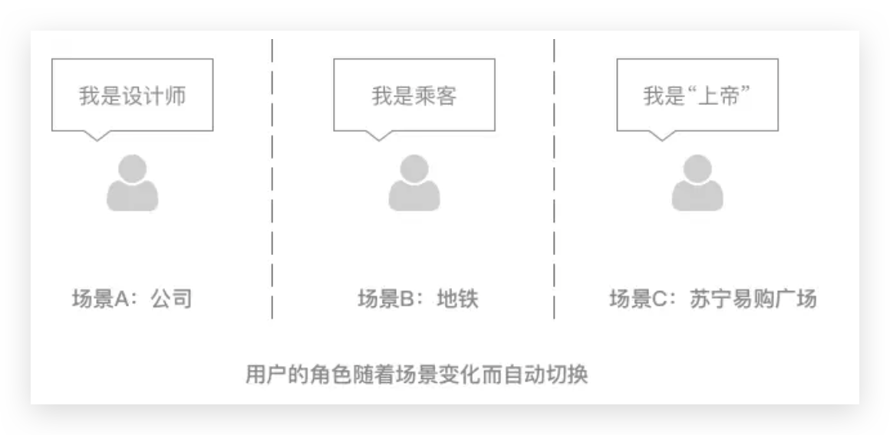

## B端产品中，如何构建权限体系？

>不管是C端还是B端产品，“权限体系”几乎存在于所有产品中。那么在B端，如何构建一套“权限体系”以满足业务需求？以下，笔者将详细讲述。

前段时间，笔者在一款B端数据产品中，基于RBAC模型构建了一套重用性极佳的“权限体系”，上线后得到一致好评。不仅降低了运维成本，更是对产品的传播扩散有极大的催化作用，并且这套“权限体系”被借鉴应用在内部数个项目当中。

## 一、什么是“权限体系”

在C端，一般会通过会员类型（等级）来区分不同的用户权限。

例如：在“苏宁易购”，如果你是Super会员，那么就会得到2%的返利、运费券、PP体育会员等普通用户无法享受的权益，这就是通过会员体系（V1、V2、V3、V4、Super）构建了一套权限体系。

与C端不同，B端产品的“权限体系”一般不采用会员类型（等级）的概念来构建，而是使用“普通用户、管理员”这种角色概念。

这就是RBAC模型：基于角色的权限访问控制（Role-Based Access Control）。

RBAC的特点就是：通过创建不同的角色（每种角色关联不同的权限），通过赋予用户不同的角色，从而使得用户获得对应角色的权限，建立用户和权限的关联。

这种模型的优点就是：可以通过动态调整角色的权限，便捷地对用户进行批量的权限变更、迁移、回收。

## 二、构建“权限体系”的目的

有“数据”的地方就有江湖。

作为互联网企业中的核心资产，“数据”经过采集、清洗、存储，就是为了最终孵化出经营性的数据产品，为业务的发展提供引擎。

笔者本次参与的是就是一款B端的数据产品，用户群体是内部的员工。根据员工在公司内部的身份，区分出查看对应数据的权限，也就是哪些数据能看、哪些数据不能看。

因此，构建“权限体系”的目的主要有：

1. 随着商业竞争的升级，要避免给无关的员工有使用本数据产品的权限，防止数据泄漏；
2. 虽然对员工有保密意识培训，但需防患于未然，尽量保持每个员工的最小权限，让权限与工作职责挂钩；
3. 作为平台性的数据产品，需要把一部分权限下放，以保证用户能参与产品的内容建设、运维及传播。

## 三、建立“权限体系”模型

根据RBAC模型，将权限体系的建模对象分为三种：用户、角色、权限。

一般的产品针对以上三种对象进行建模也就可以了，但如果是平台性的数据产品，还需要在“用户”和“角色”之间引入一个对象：数据集合。

“数据集合”就是将数据根据一定规律划分成若干个集合，同种规则下每个数据集合之间相互独立。引入“数据集合”的好处在于：

1. 用户在一个“数据集合”中选择一种“角色”，那么在不同“数据集合”中就可以拥有不同的角色，同时用户所拥有这个“角色”的权限也被圈定在特定的“数据集合”内；
2. 权限体系的本质是对用户身份做控制，引入“数据集合”后就可以将数据来源也作为一种对象进行控制，在管理层面更加细致、灵活；

**用户**：每个员工就是一名用户，可以与工号进行挂钩，从而建立最小粒度的“用户”对象，并且可以确保具有唯一性。

**数据集合**：本次B端数据产品作为一个平台，每个接入的产品（例如：苏宁易购、苏宁金融等等）就是“数据集合”。由于每个产品互相独立，因此可以按照产品进行数据集合的划分，即一个产品就是一个数据集合。

**角色**：根据对用群体调研和产品目前所处的阶段，设定了四种角色：普通用户、产品管理员、平台管理员、超级管理员。

**权限**：根据MECE分析法（Mutually Exclusive Collectively Exhaustive），将权限划分为“相互独立”的元素，这些权限元素可以按照角色的划分组成不同的集合，这些集合就是对应角色的权限。

Q：如何将权限划分成“相互独立”的元素？

A：首先将产品内每个功能模块都一一列举出来，然后针对每个功能模块分为三种权限：可读、不可读、可写。如果需要继续细化，针对“可写”又可细分为“增、删、改、查”四种。

可以制作一个Excel表格，角色、功能分别是其中的X、Y轴。针对每个功能，将每个角色拥有的权限进行标记，这样就可以形成一份清晰的“角色-权限”对照表。

## 四、总结

笔者所构建的权限体系是在RBAC模型的基础上引入“数据集合”作为用户和角色之间的对象，因此可以将其定义为：基于数据集合及角色的权限访问控制模型。

相比于RBAC，该模型的优势在于：能够让同一用户在多场景中无感知的切换角色。

原因如下：

1. 一个“数据集合”就是一个场景，多个“数据集合”就是多个场景；
2. 在单一场景下用户的角色是固定、唯一的，但在多场景下用户的角色会随着场景的变化而变化；
3. 在“用户”和“角色”之间引入“数据集合”，就是为了将用户的角色与场景进行绑定，这样在多场景环境中用户的角色就会随着场景变化而自动切换，用户能更为通畅的使用产品。

