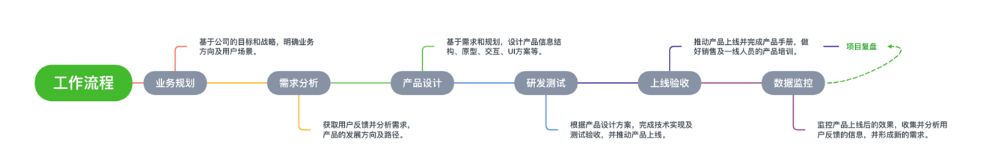

# B端产品经理的通用工作流程

本文为大家推荐一套适合B端产品经理使用的流程，这一流程包含七个步骤，它们是：业务规划 => 需求分析 => 产品设计 => 研发测试 => 上线验收 => 数据监控 =>项目复盘。

1. 业务规划：基于公司的目标和战略，明确业务方向及用户场景；
2. 需求分析：获取用户反馈并分析需求，产品的发展方向及路径；
3. 产品设计：基于需求和规划，设计产品信息结构、原型、交互、UI方案等；
4. 研发测试：根据产品设计方案，完成技术实现及测试验收；
5. 上线验收：推动产品上线并完成产品手册，做好销售及一线人员的产品培训；
6. 数据监控：监控产品上线后的效果，收集并分析用户反馈的信息，并形成新的需求；
7. 项目复盘：通过线上数据分析，检验现有需求真实性，为下一个需求提供依据并反哺业务规划。

## 一、业务规划

B端产品的设计，其核心就是服务业务。做B端产品设计，我们一定要一切以线下业务逻辑的还原度，业务流程的完整性及顺畅性为出发点。

B端的产品，大多业务接近于我们生活的干姿百态，与我们的生活息息相关。各行各业都有着不同的业务场景，流程逻辑。产品经理在做产品设计之前了解业务，学习业务流程，是必不可少的过程。那么怎样快速的熟悉业务并提炼业务逻辑呢？

方法一般有三种：
- 方法一：通过行业报告，从宏观层面了解行业近况及未来趋势，从顶层俯瞰行业发展潜力。
- 方法二：学习竞争对手，通过竞争对手可以很好地理解行业核心需求是什么。因为B端的产品一定都是发展了若干年的产物，这个过程一定有已存在，或者尚且活着的产品。他们也是逐步学习业务并设计产品的，所以通过这些竞品抓住了核心痛点，归纳普适性的需求，那么产品整体的思路就不会跑偏。方法三：虚心请教同事，在具体的业务上，还是请教同事比较靠谱，B端产品不像C端产品，想要体验到产品比较麻烦。通过同事的描述，特别是接近一线业务的同事。他们更加能把行业的业务逻辑、流程梳理出来。在此基本之上我们就可以把握住行业，同时更快速的挖掘产品需求。

90天B端产品经理实战班