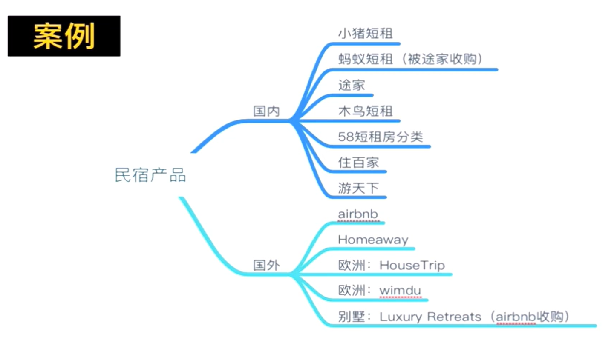
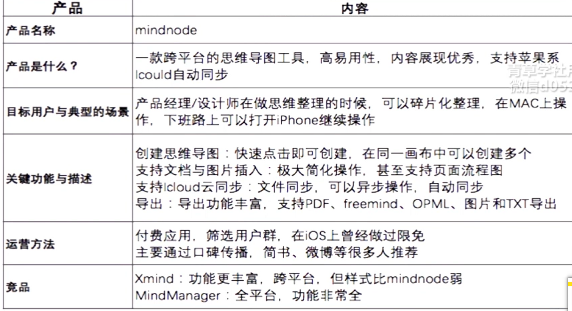

用户视角 = 体验 - 最浅层的视角，是感官的东西，只是对表面的理解
产品视角 = 逻辑
商业视角 = 利益 - 规模化复制的可能

## 体验用户与场景

- 目标用户
- 典型场景
- 需求痛点

什么样的用户，在什么情况下会用这个产品或功能，解决了用户什么问题

## 稍微加点暴力测试
- 关键功能上限：有哪些限制，为什么会有这些限制？
- 作弊空间：有哪些空子可以钻？钻空子的复杂程度
- 特别的玩法：有哪些意想不到的玩法？为什么会出来这个？

## 认识产品

案例

案例

案例

