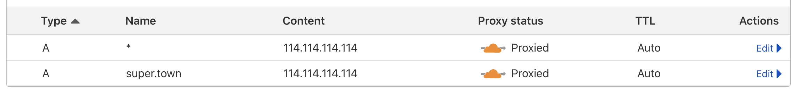

由于 GFW 的原因，很多的域名会被拦截和处理，一般称为「被污染」和「被墙」，这里转过来别人的文字，我还没有深入研究：

域名可以被污染，也可以被墙，而且两者互不相关。域名被污染大家都懂。域名被墙是指用此域名向墙外ip发送连接请求会触发tcp连接重置。大家可以修改hosts把某个域名指向任一墙外ip(比如cloudflare)，然后在浏览器中分别用http和https访问此域名进行测试。墙域名有两种方式，第一种是检测http的请求头(这里称为1类被墙)，第二种是检测tls的sni(这里称为2类被墙)。

举例：
- 被污染+1类被墙+2类被墙: www.google.com www.FB.com zh.wikipedia.org www.reddit.com
- 被污染+1类被墙: www.tunsafe.com www.v2ray.com
- 被污染，未被墙: bwh1.net justmysocks.net
- 未被污染，1类被墙: www.afreecatv.com
- 未被污染+1类被墙+2类被墙: (暂未发现)

另外，en.wikipedia.org已被两种方式墙和污染，但污染不彻底。因此部分地区属于a,部分地区属于e

域名「被墙」的处理：
「301跳转」可以当成一个术语，意思是：把被墙的域名跳转到一个没有被墙的域名上（HTTP Status Codes 的 301，告诉搜索引擎永久重定向到一个新域名），至少极少数的服务器是可以用来做301跳转的，这里介绍一下：

（1）国内服务器：我知道的是温州、镇江、无锡、济南、洛阳、陕西安康的机房有一些「免备案服务器」，可以做301跳转使用，但是要求是不能放 H X 和 ZZ 相关的东西，还不能有落地页，必须直接跳转，比如这几个IP段：

- 61.164.149.X
- 61.164.153.X （高防）
- 111.6.74.X
- 111.21.252.X （未验证）
- 116.207.160.X
- 119.188.197.X
- 171.11.231.X
- 122.226.56.X
- 222.186.138.X
- 222.191.251.X
- 180.97.196.X （秒解）
  
（2）香港服务器，要求不能放 VPN 和 ZZ，别的都可以放：

103.133.93.X

（3）美国服务器，只见过还没有用过，所以不清楚具体的内容需求：

- 23.225.255.X （39100.com）
- 23.225.194.X（39100h.com）
- 38.143.11.X（未验证）
测试方法：把域名指向一个 IP，然后用「curl -v 204.13.68.45 -H “Host: cp01.vip”」看返回结果是否会被 reset，如果依然被墙着就会显示 reset：

（4）指向国内已备案的大厂，或比如公共域名解析服务DNS： 114.114.114.114

鸣谢：[Marvin](https://samon127.medium.com/%E5%AD%A6%E4%B9%A0%E7%AC%94%E8%AE%B0-%E5%9F%9F%E5%90%8D%E6%8A%A2%E6%95%91-66cde1f83aa0)