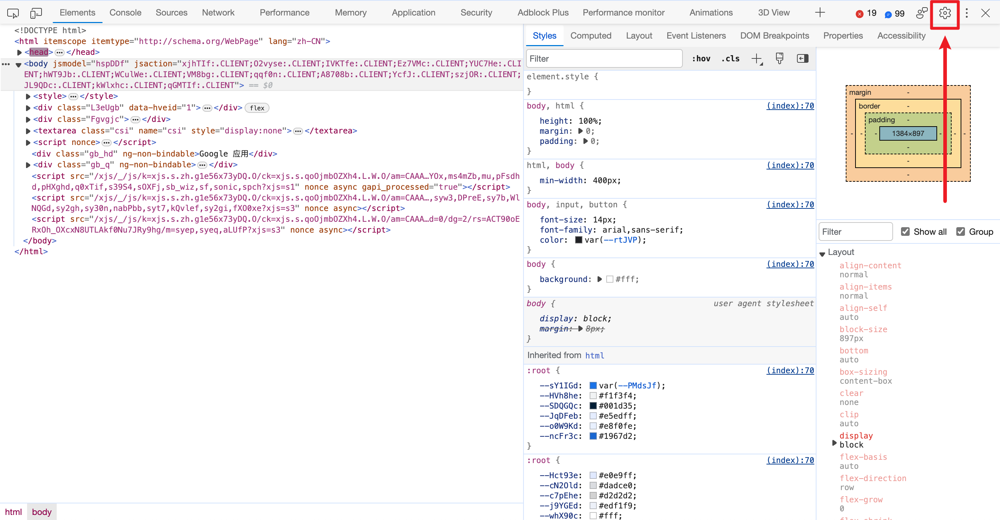
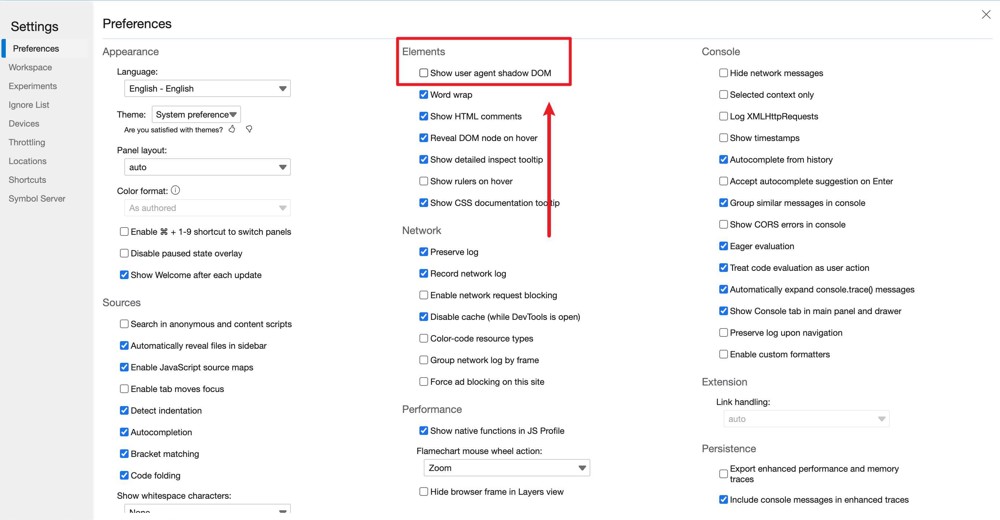
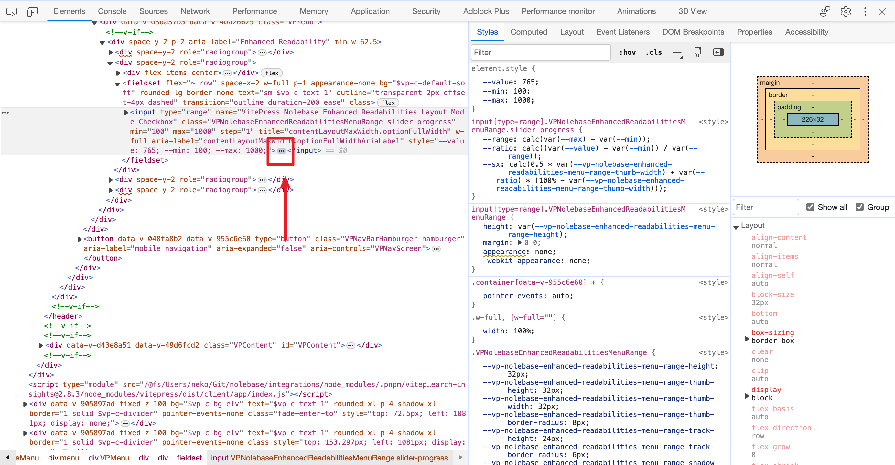
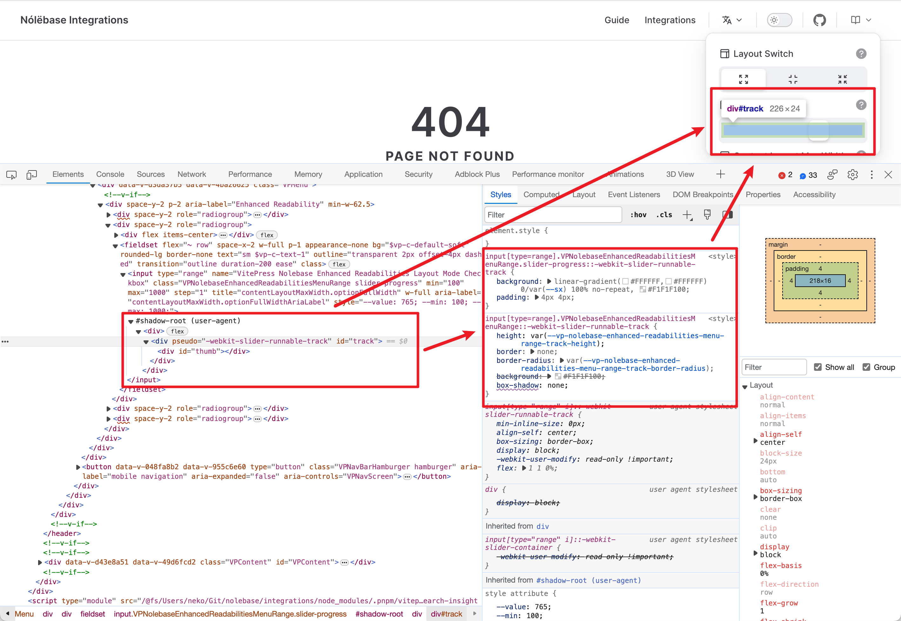

---
tags:
  - 开发/前端
  - 开发/前端/样式层叠表
  - 开发/前端/样式层叠表/CSS
  - 开发/前端/开发者工具
  - 软件/浏览器
  - 软件/浏览器/Edge
  - 软件/浏览器/Chrome
  - 开发/标记语言/HTML
  - 开发/标记语言/HTML/DOM
  - 开发/前端/浏览器/DOM
  - 开发/前端/浏览器/阴影-DOM
  - 开发/前端/浏览器/阴影-DOM/Shadow-DOM
---
# 如何调试有着浏览器引擎前缀的伪元素 CSS？

## 说明

写前端的时候你可能会用到下面的这些[带有浏览器前缀的 CSS 伪元素选择器](https://en.wikipedia.org/wiki/CSS_hack#Browser_prefixes)：

::: details 一些常见的带有浏览器前缀的 CSS 伪元素选择器

- [`::-moz-color-swatch`](https://developer.mozilla.org/en-US/docs/Web/CSS/::-moz-color-swatch)
- [`::-moz-focus-inner`](https://developer.mozilla.org/en-US/docs/Web/CSS/::-moz-focus-inner)
- [`::-moz-list-bullet`](https://developer.mozilla.org/en-US/docs/Web/CSS/::-moz-list-bullet)
- [`::-moz-list-number`](https://developer.mozilla.org/en-US/docs/Web/CSS/::-moz-list-number)
- [`::-moz-page`](https://developer.mozilla.org/en-US/docs/Web/CSS/::-moz-page)
- [`::-moz-page-sequence`](https://developer.mozilla.org/en-US/docs/Web/CSS/::-moz-page-sequence)
- [`::-moz-progress-bar`](https://developer.mozilla.org/en-US/docs/Web/CSS/::-moz-progress-bar)
- [`::-moz-range-progress`](https://developer.mozilla.org/en-US/docs/Web/CSS/::-moz-range-progress)
- [`::-moz-range-thumb`](https://developer.mozilla.org/en-US/docs/Web/CSS/::-moz-range-thumb)
- [`::-moz-range-track`](https://developer.mozilla.org/en-US/docs/Web/CSS/::-moz-range-track)
- [`::-moz-scrolled-page-sequence`](https://developer.mozilla.org/en-US/docs/Web/CSS/::-moz-scrolled-page-sequence)
- [`::-webkit-inner-spin-button`](https://developer.mozilla.org/en-US/docs/Web/CSS/::-webkit-inner-spin-button)
- [`::-webkit-meter-bar`](https://developer.mozilla.org/en-US/docs/Web/CSS/::-webkit-meter-bar)
- [`::-webkit-meter-even-less-good-value`](https://developer.mozilla.org/en-US/docs/Web/CSS/::-webkit-meter-even-less-good-value)
- [`::-webkit-meter-inner-element`](https://developer.mozilla.org/en-US/docs/Web/CSS/::-webkit-meter-inner-element)
- [`::-webkit-meter-optimum-value`](https://developer.mozilla.org/en-US/docs/Web/CSS/::-webkit-meter-optimum-value)
- [`::-webkit-meter-suboptimum-value`](https://developer.mozilla.org/en-US/docs/Web/CSS/::-webkit-meter-suboptimum-value)
- [`::-webkit-outer-spin-button`](https://developer.mozilla.org/en-US/docs/Web/CSS/::-webkit-outer-spin-button)
- [`::-webkit-progress-bar`](https://developer.mozilla.org/en-US/docs/Web/CSS/::-webkit-progress-bar)
- [`::-webkit-progress-inner-element`](https://developer.mozilla.org/en-US/docs/Web/CSS/::-webkit-progress-inner-element)
- [`::-webkit-progress-value`](https://developer.mozilla.org/en-US/docs/Web/CSS/::-webkit-progress-value)
- [`::-webkit-scrollbar`](https://developer.mozilla.org/en-US/docs/Web/CSS/::-webkit-scrollbar)
- [`::-webkit-search-cancel-button`](https://developer.mozilla.org/en-US/docs/Web/CSS/::-webkit-search-cancel-button)
- [`::-webkit-search-results-button`](https://developer.mozilla.org/en-US/docs/Web/CSS/::-webkit-search-results-button)
- [`::-webkit-slider-runnable-track`](https://developer.mozilla.org/en-US/docs/Web/CSS/::-webkit-slider-runnable-track)
- [`::-webkit-slider-thumb`](https://developer.mozilla.org/en-US/docs/Web/CSS/::-webkit-slider-thumb)

:::

这些伪元素选择器通常是用来给诸如[滚动条](https://developer.mozilla.org/zh-CN/docs/Web/CSS/::-webkit-scrollbar)、[范围输入元素（范围选择器）](https://developer.mozilla.org/en-US/docs/Web/HTML/Element/input/range)这样的可视元素添加不同的样式的，但是与 [`::after`](https://developer.mozilla.org/en-US/docs/Web/CSS/::after) 和 [`::before`](https://developer.mozilla.org/en-US/docs/Web/CSS/::before) 这样更加常见和通用的伪元素不同的是，这些伪元素选择器在不同的浏览器中有着不同的实现，而你也不能在开发者工具中直接审查和查看这些元素以及对应的 CSS 样式属性，这是因为这样的功能在基于 Chromium 内核的浏览器中是需要通过单独的开关来配置和打开的。

## 步骤

### 在基于 Chromium 内核的浏览器中激活该功能

基于 Chromium 内核的浏览器包括了 Google Chrome 和 Microsft Edge，想要在这些浏览器中配置和打开这些特殊的伪元素选择器其实非常简单。

你需要首先在网页上按 <kbd>F12</kbd> 或者右击网页并选择「审查元素（Inspect Elements）」来打开「开发者工具」。

然后找到右上角的设置按钮，点击进入开发者工具的设置：

在「元素（Elements）」一列，找到「显示用户代理阴影 DOM（Show user agent shadow DOM）」，勾选即可完成配置。

接下来你可以单击右上角的 X 图标来关闭设置界面，然后返回到开发者工具的「元素 Elements」标签，找到你希望调试的元素。

比如我这里正在调试一个 `<input type="range" />`（也就是[范围输入元素（范围选择器）](https://developer.mozilla.org/en-US/docs/Web/HTML/Element/input/range)），可以观察到这个原本没有包含任何子元素的 `<input>` 元素突然多出来了可以展开的按钮，单击这个展开按钮就可以查看现在 `<input>` 元素附属的 `track`（范围输入滑块轨道）元素和 `thumb`（范围输入滑块）元素和他们的样式了：

现在在展开的 `<input>` 元素下方，就可以看到名为 `#shadow-root (user-agent)`（也就是先前配置的所谓「用户代理阴影 DOM」，或者说「User agent shadow DOM」）的元素，再次将鼠标移动到 `#shadow-root (user-agent)` 之后，就可以看到我们正在调试的滑块轨道和滑块元素都被高亮了，右侧也出现了先前无法在「样式 Styles」标签页中的 `::webkit-slider-runnable-track` 和 `::webkkit-slider-thumb` 伪元素：

## 参考资料

- [html - Inspect webkit-input-placeholder with developer tools - Stack Overflow](https://stackoverflow.com/a/26853319/19954520)
- [html - Webkit Pseudo Elements Documentation - Stack Overflow](https://stackoverflow.com/questions/71133738/webkit-pseudo-elements-documentation)
- [Vendor Prefix - MDN Web Docs Glossary: Definitions of Web-related terms | MDN](https://developer.mozilla.org/en-US/docs/Glossary/Vendor_Prefix)
