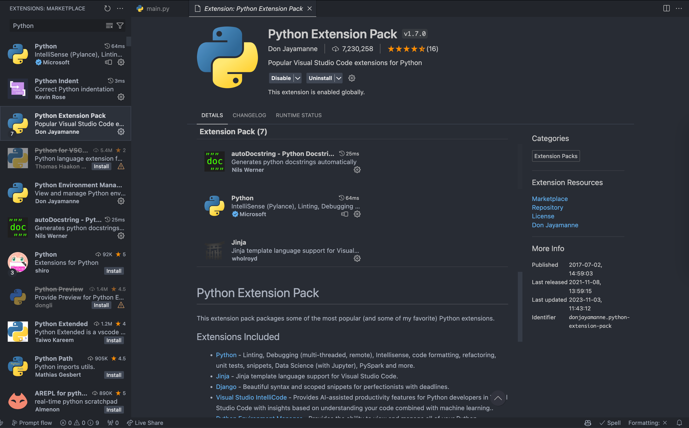
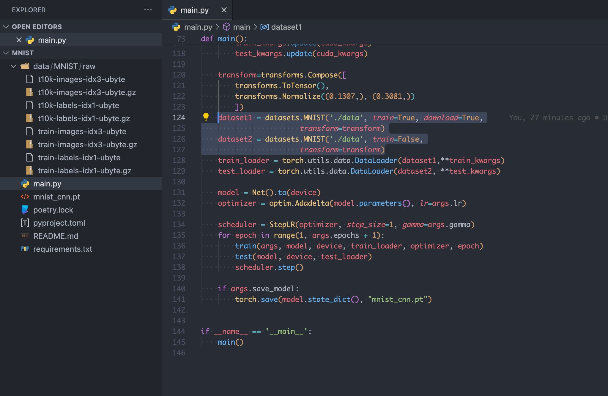

---
tags:
  - AI
  - 开发/Python/PyTorch
  - 开发/Python
  - AI/教程
  - 操作系统/macOS
  - 操作系统/Linux
  - 操作系统/Windows
  - 软件/Visual-Studio-Code/vscode
  - 开发/Git
  - 命令行/git
---
# 1 从用 PyTorch 运行一个模型训练开始

想要跑这样的训练其实非常简单。

在 macOS，Linux 和 Windows 上都可以操作。

## 下载 PyTorch 的官方示例

创建一个 pytorch 目录用来存放 pytorch 官方的源代码

```shell
mkdir pytorch
```

下载 `pytorch/examples` 仓库到本地

```shell
git clone git@github.com:pytorch/examples.git
```

下载完成之后进入这个仓库目录

```shell
cd examples
```

## 准备编辑器

在 Visual Studio Code 中安装 Python 插件包



## 创建项目

### 用 Poetry

#### 创建项目

```shell
❯ poetry init

This command will guide you through creating your pyproject.toml config.

Package name [mnist]:
Version [0.1.0]:
Description []:
Author [Neko Ayaka <neko@ayaka.moe>, n to skip]:
License []:
Compatible Python versions [^3.11]:

Would you like to define your main dependencies interactively? (yes/no) [yes]
You can specify a package in the following forms:
  - A single name (requests): this will search for matches on PyPI
  - A name and a constraint (requests@^2.23.0)
  - A git url (git+https://github.com/python-poetry/poetry.git)
  - A git url with a revision (git+https://github.com/python-poetry/poetry.git#develop)
  - A file path (../my-package/my-package.whl)
  - A directory (../my-package/)
  - A url (https://example.com/packages/my-package-0.1.0.tar.gz)

Package to add or search for (leave blank to skip): torch
Found 20 packages matching torch
Showing the first 10 matches

Enter package # to add, or the complete package name if it is not listed []:
 [ 0] torch
 [ 1] fast-torch
 [ 2] welford-torch
 [ 3] torch-soft
 [ 4] torch-yolo3
 [ 5] sphericart-torch
 [ 6] gato-torch
 [ 7] metatensor-torch
 [ 8] torch-metrics
 [ 9] agent-torch
 [ 10]
 > 0
Enter the version constraint to require (or leave blank to use the latest version):
Using version ^2.1.2 for torch

Add a package (leave blank to skip): torchvision
Found 20 packages matching torchvision
Showing the first 10 matches

Enter package # to add, or the complete package name if it is not listed []:
 [ 0] torchvision
 [ 1] torchvision4ad
 [ 2] torchvision-yolov3
 [ 3] torchvision-raspi
 [ 4] nvidia-torchvision
 [ 5] torchvision-extra
 [ 6] rpi-torchvision
 [ 7] torchvision-detection
 [ 8] torchvision-enhance
 [ 9] cjm-torchvision-tfms
 [ 10]
 > 0
Enter the version constraint to require (or leave blank to use the latest version):
Using version ^0.16.2 for torchvision

Add a package (leave blank to skip):

Would you like to define your development dependencies interactively? (yes/no) [yes] no
Generated file

[tool.poetry]
name = "mnist"
version = "0.1.0"
description = ""
authors = ["Neko Ayaka <neko@ayaka.moe>"]
readme = "README.md"

[tool.poetry.dependencies]
python = "^3.11"
torch = "^2.1.2"
torchvision = "^0.16.2"


[build-system]
requires = ["poetry-core"]
build-backend = "poetry.core.masonry.api"


Do you confirm generation? (yes/no) [yes]
```

#### 安装需要的依赖

```shell
❯ poetry install
Creating virtualenv mnist-CoEc1jnQ-py3.11 in /Users/neko/Library/Caches/pypoetry/virtualenvs
Updating dependencies
Resolving dependencies... Downloading

Writing lock file

Package operations: 17 installs, 0 updates, 0 removals

  • Installing markupsafe (2.1.3)
  • Installing mpmath (1.3.0)
  • Installing certifi (2023.11.17)
  • Installing charset-normalizer (3.3.2)
  • Installing filelock (3.13.1)
  • Installing fsspec (2023.12.2)
  • Installing idna (3.6)
  • Installing jinja2 (3.1.2)
  • Installing networkx (3.2.1)
  • Installing sympy (1.12)
  • Installing typing-extensions (4.9.0)
  • Installing urllib3 (2.1.0)
  • Installing numpy (1.26.3)
  • Installing pillow (10.2.0)
  • Installing requests (2.31.0)
  • Installing torch (2.1.2)
  • Installing torchvision (0.16.2)
```

安装完成之后可能会有这样的提示，这是因为 Python 环境不正确


可以通过 <kbd data-macos-keyboard-key="command">command</kbd> + <kbd data-keyboard-key="shift">Shift</kbd> + <kbd>P</kbd> 打开 VSCode 的命令面板然后输入「Select Interpreter」来选择正确的 Python 环境中的 Python 程序来解决


#### 准备代码



#### 训练

通过

```shell
poetry run python main.py --epochs 2 --save-model
```

命令就可以训练了。其中：

- `--epochs 2` 参数表示训练完整的两个周期；
- `--save-model` 参数表示训练之后保存模型。

```shell
❯ poetry run python main.py --epochs 2 --save-model

Downloading http://yann.lecun.com/exdb/mnist/train-images-idx3-ubyte.gz
Downloading http://yann.lecun.com/exdb/mnist/train-images-idx3-ubyte.gz to ./data/MNIST/raw/train-images-idx3-ubyte.gz
100.0%
Extracting ./data/MNIST/raw/train-images-idx3-ubyte.gz to ./data/MNIST/raw

Downloading http://yann.lecun.com/exdb/mnist/train-labels-idx1-ubyte.gz
Downloading http://yann.lecun.com/exdb/mnist/train-labels-idx1-ubyte.gz to ./data/MNIST/raw/train-labels-idx1-ubyte.gz
100.0%
Extracting ./data/MNIST/raw/train-labels-idx1-ubyte.gz to ./data/MNIST/raw

Downloading http://yann.lecun.com/exdb/mnist/t10k-images-idx3-ubyte.gz
Downloading http://yann.lecun.com/exdb/mnist/t10k-images-idx3-ubyte.gz to ./data/MNIST/raw/t10k-images-idx3-ubyte.gz
100.0%
Extracting ./data/MNIST/raw/t10k-images-idx3-ubyte.gz to ./data/MNIST/raw

Downloading http://yann.lecun.com/exdb/mnist/t10k-labels-idx1-ubyte.gz
Downloading http://yann.lecun.com/exdb/mnist/t10k-labels-idx1-ubyte.gz to ./data/MNIST/raw/t10k-labels-idx1-ubyte.gz
100.0%
Extracting ./data/MNIST/raw/t10k-labels-idx1-ubyte.gz to ./data/MNIST/raw

Train Epoch: 1 [0/60000 (0%)]	Loss: 2.300024
# ...
Train Epoch: 1 [59520/60000 (99%)]	Loss: 0.016723

Test set: Average loss: 0.0513, Accuracy: 9830/10000 (98%)

Train Epoch: 2 [0/60000 (0%)]	Loss: 0.060729
# ...
Train Epoch: 2 [59520/60000 (99%)]	Loss: 0.000367

Test set: Average loss: 0.0381, Accuracy: 9869/10000 (99%)
```

训练完成之后就能看到 `mnist_cnn.pt` 的模型文件了：


