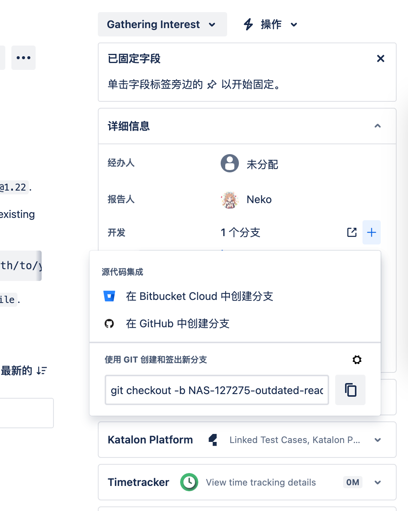

---
tags:
  - 开源/贡献指南
  - 开发/前端
  - 开源/贡献/TrueNAS
  - 开源/贡献/TrueNAS/webui
  - 网站/GitHub
  - 网站/GitHub/组织/truenas
  - 开源/软件/TrueNAS
  - 基础设施/存储
  - 软件/Jira
---

# 为 TrueNAS 贡献

## 流程介绍

- 和其他的 GitHub 上协作的开源项目不同，TrueNAS 使用 Atlassian 公司开发的 Jira 平台追踪和记录 Issue（Bug 提交，需求说明），所以我们需要先到 Jira 上像开 Issue 那样开一个单独的 Issue 来记录并且发到 Jira 上
- Fork 并克隆目标项目
- 写代码
- 创建 Pull Request
- 等待 Review
- 合并 🎉
## 实际操作

### 注册或直接登录到 Jira

首先需要登录到 TrueNAS 母公司 [ixsystems 的 Jira 系统](https://ixsystems.atlassian.net/jira/projects)中。

- 前往 https://ixsystems.atlassian.net/jira/projects
- 点击右上角登录
- 然后按需创建 Atlassian 的账户即可
- 如果你已经有 Atlassian 账户（Confluence，Jira，Trello），可以复用


创建账户结束后，点击顶部导航栏的蓝色图标「创建」按钮创建一个 Jira Issue 来汇报错误和 Bug。

在创建 Jira 事务的过程中，会要求填写

- 项目：因为我这里在尝试讲解如何贡献给 TrueNAS，所以我选择了 TrueNAS，如果你在贡献给 ixsystem 其他的产品，也可以按需选择
- 事务类型：
	- 缺陷：等同于汇报 Bug
	- 改进：就是加需求，要多写很多说明
- 摘要：就是 Bug 的标题，用英文撰写，尽量写的简短清晰
- 组件：因为我在尝试贡献到 TrueNAS 的前端仓库 webui，所以这里我选择 WebUI


选择之后填写自己的 Bug 和改进点，像这样填写足够详尽的内容就好了，主要是为了方便 ixsystem 的工作人员审阅和纪录信息：


### Fork 并克隆目标项目

1. 在 GitHub 上找到自己想要贡献的项目仓库，点击右上角的 Fork 按钮，创建一个基于项目的 Fork。比如我在这里创建了 [nekomeowww/truenas-webui](https://github.com/nekomeowww/truenas-webui)
2. 创建完成后克隆自己 Fork 过的代码仓库到本地
3. 记得在本地的 git 仓库中添加 Fork 的时候原本的仓库，因为我使用 SSH 进行 git 的操作，所以我应该会这样输入一个命令：

```shell
git remote add upstream nekomeowww.git:nekomeowww/truenas-webui.git
```

有关给 git 配置 SSH 的教学和说明，可以参考 [[Git 客户端配置 SSH 验证]] 的文档说明。
### 创建分支进行开发

创建 Jira 之后，为了方便 TrueNAS 的 CI/CD Bot 自动识别我们的 Jira 事务 ID，可以通过 Jira 面板复制一个 Jira 提供的分支名称进行开发：



在本地直接执行命令，分支就创建完成了。

在完成了代码，文档还有 i18n 的修改之后就可以提交到远程的分支啦！

可以通过

```shell
git push -u origin <分支名>
```

来推送到远程分支。

### 创建 Pull Request

在 GitHub 上创建一个带有 Jira ID（也就是分支名里面的 `NAS-<数字>` 的部分）的 PR 标题即可：


这个时候一般会有一个 Bot 冒出来，修改 GitHub Pull Request 的标题为 TrueNAS 团队期望的标题，我们不用修改，保持原样就好，然后静静等待来自 ixsystem 的开发者们审阅 Jira，然后 review Pull Request 即可。

我给 TrueNAS 提交了两个 PR，都已经合入了 👏，感谢 TrueNAS 团队帮忙审阅！

- [NAS-127275: Update Development requirements section of README.md along with formatting by nekomeowww · Pull Request #9645 · truenas/webui](https://github.com/truenas/webui/pull/9645)，Jira 在 [https://ixsystems.atlassian.net/browse/NAS-127275](https://ixsystems.atlassian.net/browse/NAS-127275)
- [NAS-127276 / 24.10 / guard user.privilege access when processing login results to prevent undefined property read by nekomeowww · Pull Request #9646 · truenas/webui](https://github.com/truenas/webui/pull/9646)，Jira 在 [https://ixsystems.atlassian.net/browse/NAS-127276](https://ixsystems.atlassian.net/browse/NAS-127276)
