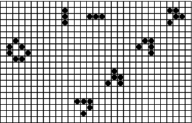
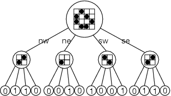
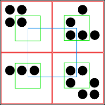
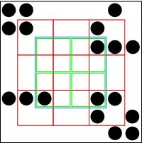
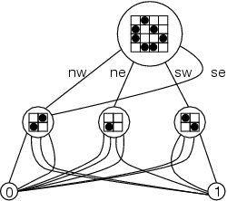

# HashLife

## HashLife - Tomas G. Rokicki, DDJ, April 01, 2006

一种压缩空间和时间的算法

[http://www.drdobbs.com/jvm/an-algorithm-for-compressing-space-and-t/184406478](http://www.drdobbs.com/jvm/an-algorithm-for-compressing-space-and-t/184406478)

---

由 Tomas G. Rokicki 于 2006 年 4 月 1 日撰写

让一个缓慢的程序变得快速，既能带来快乐，也能带来挫折。但有时一种新的方法会产生惊人的改进。

让一个缓慢的程序变得快速，既能带来快乐，也能带来挫折。通常情况下，你能做的最好的事情是用低级别的技巧将程序的速度提高一倍或四倍；例如，许多读者可能已经用位级操作实现了约翰-康威的 "生命游戏"，获得了显著的速度提升。但有时，一个全新的方法，仅仅结合几个想法，就能产生惊人的改进。由William Gosper（"Exploiting Regularities in Large Cellular Spaces"，Physica 10D，1984）发明的一种简单的算法，叫做 "HashLife"，它结合了四叉树和记忆化，使「生命游戏」获得了天文数字般的速度。在这篇文章中，我将最简单的「生命游戏」实现通过这种算法进行演化，解释它是如何工作的，并运行一些宇宙，它们会在数万亿代之后成长为数十亿个细胞。

马丁·加德纳从 1970 年 10 月起在《科学美国人》杂志上发表的关于康威生命游戏的专栏，激发了整整一代程序员的灵感；这是一个令人惊叹的二维生命体世界，只需几个简单的规则，就能通过简易的编程来模拟和展示。生命游戏（图 1）是在一个无限的二维网格上进行的「接龙游戏」。网格中的每个细胞要么是活的（1，用黑圈表示），要么是死的。

- 每个活着的细胞如果有两个或三个活着的邻居（紧邻的八个），就会一直活着，否则就会死亡。
- 任何被正好三个活着的邻居包围的死细胞都是出生细胞，在下一个回合中会出生。

所有的规则都在同一时刻适用于所有的细胞。这些规则导致了稳定和振荡的生命形式——在宇宙中运送自己的滑翔机和宇宙飞船，生长不受约束或完全消亡的生命形式。只有九个初始活细胞的种子模式可以变异数千代，不断移动的混乱活动区域在大型稳定的动物群中喷出滑翔机。



图 **1:** *一些生命实例。左边是一个稳定的松饼图案。左上角是眨眼器的两个阶段，一个周期为 2 的振荡器。从左下角到右上角的对角线是滑翔机穿越宇宙时经历的四个阶段。*

生命游戏最简单的实现方式是使用一对二维数组，代表宇宙中有限部分的状态。在每一代中，旧数组中一个细胞的邻居细胞状态用以计算新数组中这个单元细胞的状态，然后数组被交换，同时更新到显示器上。这种方法有很多令人沮丧的地方：宇宙越大，程序运行的速度越慢；然而，较小的宇宙限制了模式的增长，人为地制约了它们。我对基本算法的第一个改进是用一个无界的宇宙来取代这个有限的宇宙；在任何时候，它都是有限的，但你可以根据需要增加它的大小。我使用一个简单的树状表示法，称为 "四叉树"（图2）。



图 **2:** *一个包含松饼图案的 4×4 单元的四叉树表示。*

树上的每个节点代表生命游戏宇宙的一个正方形部分。每一个树的叶子大小为一个比特，要么是 1（活），要么是 0（死）。每个非叶节点代表一个更大的正方形，由四个子节点组成，这些子节点按其离中心的方向命名：nw 是西北（左上方）小正方形的名字，ne 是（右上方）东北小正方形，以此类推。一个节点的级别是与叶子的距离；叶子在 0 级。因此，一个处于 n 级的节点在每条边上代表一个大小为 2n 的正方形。

实现生命游戏算法的直接方法是编写一个递归函数，该函数接收给定级别的树，并在原地更新该树或返回一个全新的树。我选择返回一棵全新的树。如果我可以返回同一级别的树，那么这个算法就会非常简单。不幸的是：这在没有一些额外信息的引入的情况下是不可能的，因为该节点的邻居也会影响边界单元的下一代的计算。解决这个问题的一种方法是在同一层传入邻居节点；另一种方法是维护邻居节点指针。相反，我选择了一个更简单的方法。递归函数的结果是一个向下一级的节点，相对于原始节点居中。例如，该函数在第 2 层取一个节点，代表宇宙的一个 4×4 的正方形，并返回第 1 层的一个节点，代表着你从该 4×4 正方形的信息中直接计算出的 2×2 正方形。同样地，它在第 5 级取一个节点，代表宇宙的一个 32×32 的正方形，并返回一个第 4 级的正方形，代表下一层级中中心的 16×16 像素区块。这个可以让你在一个不可变的数据结构上使用完全的功能化方法，如果你喜欢的话。（树状结构的层级命名问题参见：[What is level of root node in a tree?](https://stackoverflow.com/questions/59151282/what-is-level-of-root-node-in-a-tree)）

大多数在树状结构上工作的递归算法只是对子代进行递归，并以某种方式将结果合并。如果我在这里这样做，使用「列举 01」这样的代码计算出来的方块之间就会有空隙，如图 3 所示。这就需要更复杂的方法了。我不能在递归调用中直接使用现有的子代；相反，我必须创建临时的子代，并将其移位，以确保我得到的结果方格是按照我们要求的方式排列的。

### 列举 01

```java
class Node {
   Node nextGeneration() { // 下一代
      if (level == 2) {
         ... 在正常的模拟中做一些基本操作 ...
      } else {
         return new Node(nw.nextGeneration(), ne.nextGeneration(),
              sw.nextGeneration(), se.nextGeneration()) ; // 返回四个节点产生的下一代
      }
   }
}

```



图 **3:** 为什么一个简单的递归算法不会成功。黑色外方块代表一个节点的面积；四个红色内方块是子节点。我想在下一代中计算蓝色内方格的面积，但是子节点的内方格是绿色的，它们不能组合成蓝色内方格，因为它们不与之重叠。

我在两层以下构建了九个新的节点，它们被适当地移位了。为了构建这些两层以下的节点，我实际上访问了三层以下的节点来组成新的节点。从这九个新节点中，我创建了四个新的一级节点。我正是在这四个新节点上进行递归。这让我在适当的位置得到了结果节点，这样我就可以在正确的层次上将它们组合成所需的输出节点（见图 4）。



图 **4:** 解决差距问题的方法：从现有节点的组件中构建新的子节点来计算我们实际需要的方块。同样，蓝色是我希望计算的区域；我把它分成四个绿色节点。我通过从九个红色子节点的各种组合中构建子节点来计算这四个蓝色节点，这些子节点可以由原始节点的子节点构建。

在「列举 02」中，我确实对实用性做了一些小小的让步。任何我知道是完全空的树，我都通过共享节点来构建；见图4。当我计算任何节点的下一代时，我首先检查它是否是空的，如果是，则立即返回一个空子树。

### 列举 02

```java
// 中心居中的子节点
Node centeredSubnode() {
   return new Node(nw.se, ne.sw, sw.ne, se.nw) ;
}
// 中心居中的子节点
Node centeredHorizontal(Node w, Node e) {
   return new Node(w.ne.se, e.nw.sw, w.se.ne, e.sw.nw)
;
}
Node centeredVertical(Node n, Node s) {
   return new Node(n.sw.se, n.se.sw, s.nw.ne, s.ne.nw);
}
Node centeredSubSubnode() {
   return new Node(nw.se.se, ne.sw.sw, sw.ne.ne,
se.nw.nw) ;
}
Node nextGeneration() {
   if (level == 2) {
      ... do base case through normal simulation ...
   } else {
      Node n00 = nw.centeredSubnode(),
           n01 = centeredHorizontal(nw, ne),
           n02 = ne.centeredSubnode(),
           n10 = centeredVertical(nw, sw),
           n11 = centeredSubSubnode(),
           n12 = centeredVertical(ne, se),
           n20 = sw.centeredSubnode(),
           n21 = centeredHorizontal(sw, se),
           n22 = se.centeredSubnode() ;
      return new Node(
         new Node(n00, n01, n10, n11).nextGeneration(),
         new Node(n01, n02, n11, n12).nextGeneration(),
         new Node(n10, n11, n20, n21).nextGeneration(),
         new Node(n11, n12, n21, n22).nextGeneration());
   }
}

```

到目前为止，我的算法并没有好到哪里去。它需要更多的内存，而且速度较慢。它产生了很多需要管理或垃圾回收的新节点。它有一个有点复杂的递归。我通过两个步骤来解决所有这些问题--节点的经典化和 "记忆化"。

四叉树数据结构（见图5）比简单的位图要多出很多空间（虽然只是一个常数）；对于代表256×256宇宙的树来说，0 叶的数量加上 1 叶的数量是 65,536，还有 16,384+ 4096+1024+256+64+16+4+1 或 21845 个非叶节点。每个节点代表一个恒定的、不可变的位图，所以不需要有共享相同值的不同节点。所有的 1 叶都可以由一个典型的 1 叶来代表；同样，所有西北象限是 1 叶，其他三个象限是 0 叶的节点都可以由这个节点的一个典型实例来代表。这种范式可以一直延伸到根。规范化一个节点需要基于一个简单的哈希集来递归；一旦节点被规范化，一个节点的值就完全由该节点的指针来表示（包括用于比较），所以一个节点的哈希函数可以像四个子节点的地址的一些混合一样简单。这个规范化步骤类似于 Java 字符串实习函数的做法，代表了不可变结构的一个优势。



图 **5:** *另一个例子*

就其本身而言，这个规范化步骤是压缩空间的一种强大形式。宇宙中所有的空白区域都压缩到一个小的节点集合中。常见的生命形式，如滑翔机和积木，被挤压到共同分享的节点中。事实上，对于现在正在构建的一些生命形式，这种四叉树的序列化形式提供了唯一合理的存储格式，因为这些形式实在是太大了，无法用常用的运行长度编码格式来分发。

此外，提供规范化的哈希集可以被简单地垃圾回收，甚至在像 C++ 这样的语言中也是如此（假设哈希集存储指针）；只需创建一个新的空哈希集，将其与当前规范化的哈希集交换，从当前根开始重新规范化，然后删除所有在旧哈希集而不是新哈希集中的节点。

正则化是由 CanonicalTreeNode 类实现的，在这里我为散列提供了必要的基础设施，并涵盖了负责创建每个节点实例的工厂方法。

在解决了空间问题之后，我对 nextGeneration 函数做了一个简单的修改，以解决时间问题：我对该函数进行了 "备忘"（也就是说，我将计算出的答案保存起来，以便以后重复使用，而不是重新计算）。记忆化无非是缓存一个函数的结果，以备再次以相同的参数调用它。考虑一下记忆化的经典例子，斐波那契函数。通常的递归表述如例1(a)。这个函数以指数形式增长，计算它所需的调用次数也是如此。但是加入一个简单的数组作为缓存，如例1(b)，使其在n中以线性时间运行。虽然有更有效的方法来计算斐波那契数，但该技术本身是非常有用的。

例子 **1:**

**(a)** 递归公式*.*

```java
int fib(int n) {
   if (n < 3)
      return 1 ;
   return fib(n-1) + fib(n-2) ;
}

```

**(b)** *使用缓存的线性时间增长版本.*

```java
int cache[] ;
int fib(int n) {
   if (n < 3)
      return 1 ;
   if (cache[n])
      return cache[n] ;
   return cache[n] = fib(n-1) + fib(n-2) ;
}

```

为了备忘 nextGeneration，我在节点数据结构中添加了一个指针，用来存储 nextGeneration 函数在该节点上的结果；如果这个指针不是空的，它就包含结果节点。通过保持 nextGeneration 的纯函数化而实现的速度提升，足以抵消返回一个比其参数低一级的节点所带来的低效率。实现这一扩展的类是 MemoizedTreeNode。

在这一点上，Life 算法还不完全是 HashLife。在一些有规律的大宇宙中，它比传统算法更快，甚至是高度优化的算法。例如，在经典的繁殖者（参考图4）上，每一代的时间是恒定的，尽管人口随着代数的平方上升。到目前为止，我们所构建的所有基础设施可以让你为创建最终的HashLife算法迈出最后一大步--压缩时间。

早些时候，我提到我将运行一些非简单的模式，以达到数万亿代的效果。即使只是数到一万亿，对现代CPU来说也需要相当多的时间；然而HashLife可以将繁殖器运行到一万亿代，并在不到一秒的时间内打印出其产生的 1,302,083,334,180,208,337,404 个细胞。这只需要对我到目前为止所描述的程序做一个相对较小的改动。（你可能想在这里停止阅读，看看你是否能想出这个变化是什么）。

最后的调整是改变递归调用所计算的代数。目前，它在每一级都只计算一个世代。这可以提供一个速度，但是运行时间将总是至少与代数成线性关系，即使是对于一个空的宇宙。相反，我们重写nextGeneration函数，以计算每一级增加的世代数。也就是说，在第二级和一个4×4的节点上，它将计算向前的一代，就像现在这样；在第三级，代表一个8×8的节点，它计算两代；在第八级，有一个256×256的节点，它计算未来的64代。

事实证明，这一变化在一定程度上简化了递归函数，因为下一世代的计算将处理一些节点移动的问题，而这些节点移动需要先前的许多附加函数。清单三显示了代码的变化。完整的实现是在HashLifeTreeNode类中（见附件中的zip）。那里提供的代码总是根据根的当前级别采取步骤；这可以通过使用我们为TreeNode提供的原始nextGeneration函数来修改，用于高于固定值的级别，以及用于低于该级别的新函数。如果需要更大的步长，根节点的级别可以通过调用expandUniverse方法轻松增加。

### 举例 03

```java
Node horizontalForward(Node w, Node e) {
   return node(w.ne, e.nw, w.se, e.sw).nextGeneration();
}
Node verticalForward(Node n, Node s) {
   return node(n.sw, n.se, s.nw, s.ne).nextGeneration();
}
Node centeredForward() {
   return node(nw.se, ne.sw, sw.ne, se.nw).nextGeneration() ;
}
Node nextGeneration() {
   if (level == 2) {
      ... do base case through normal simulation ...
   } else {
      Node n00 = nw.nextGeneration(),
           n01 = horizontalForward(nw, ne),
           n02 = ne.nextGeneration(),
           n10 = verticalForward(nw, sw),
           n11 = centeredForward(),
           n12 = verticalForward(ne, se),
           n20 = sw.nextGeneration(),
           n21 = horizontalForward(sw, se),
           n22 = se.nextGeneration() ;
      return new Node(
         new Node(n00, n01, n10, n11).nextGeneration(),
         new Node(n01, n02, n11, n12).nextGeneration(),
         new Node(n10, n11, n20, n21).nextGeneration(),
         new Node(n11, n12, n21,  n22).nextGeneration());
   }
}

```

这就是HashLife。正如所展示的那样，这段代码在大多数常见的模式上获得了惊人的速度；对于大多数模式，在最初的热身期之后，由于所有的哈希运算，它的运行速度比传统算法慢，然后它就 "跑了"，在单位时间内计算出指数级增长的代数。

让我回到开头。2000年12月，在一个私人邮件列表中，Nick Gotts发布了一个新的、奇妙的52个单元的图案，称为 "metacatacryst"。他确信它表现出二次增长，但并不绝对确定。他问是否有人能针对它运行一个HashLife。由于刚刚完成了一个快速的传统生命程序，并且已经看到了关于这样一个程序如何工作的足够多的暗示和传言，而且由于Bill Gosper的原始实现只在Lisp机器上工作，而这种机器很少，我认为是时候尝试写一个了。随着我对迄今为止所提出的想法的雏形的融入，我能够将metacatacryst运行到许多万亿代，并表明它在整个范围内表现出二次增长。这种模式是惊人的美丽，具有分形的特性，如果不把它运行到数十亿代，并有能力以某种足够大的比例、可缩放的形式显示所产生的宇宙，就无法欣赏到它。

我还用 HashLife 找到了另一个 Methuselah，它是一个小的初始生命体，在落地前持续了很长时间，初始种群中有 12 个细胞，持续了 12000 多代。其他人正在用它调查大型构造模式，模拟图灵机、寄存器机器和以前未达到的速度的宇宙飞船。

真正的乐趣在于算法，这完全归功于 Bill Gosper，我把所有的功劳和荣誉都归功于他。对于那些想做实验的人来说，开源程序 Golly 可以在[http://sf.net/projects/golly/](http://sf.net/projects/golly/)上找到。

HashLife 是一种独特的算法，由 sheng ming you 的下一代函数的记忆化组成，适用于宇宙的四叉树表示。同样的技术也可以应用于其他领域。

[下载本文附带的源代码。](http://twimgs.com/ddj/images/article/2013/0213/compress.zip)

Tomas是Instantis的技术总监。他的联系方式是[rokicki@gmail.com](mailto:rokicki@gmail.com)。

四叉树相关：

四叉树运算可视化：[http://blog.ivank.net/quadtree-visualization.html](http://blog.ivank.net/quadtree-visualization.html)

四叉树可视化：[https://codepen.io/afterburn/details/LdQGZV](https://codepen.io/afterburn/details/LdQGZV)

树生成算法：[https://cs.brown.edu/people/rtamassi/gdhandbook/chapters/trees.pdf](https://cs.brown.edu/people/rtamassi/gdhandbook/chapters/trees.pdf)
