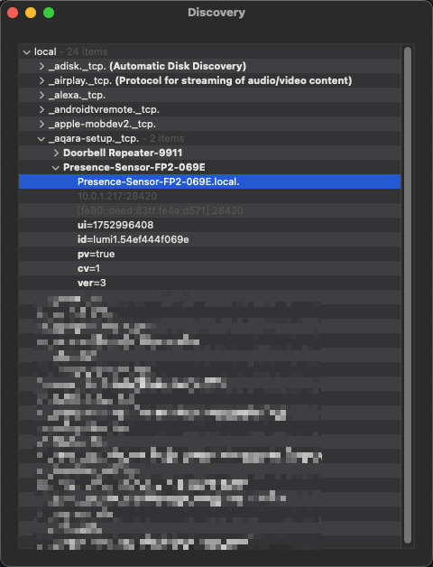

---
tags:
  - 物联网/智能家居/Homekit
  - 物联网/智能家居/生态/Homekit
  - 计算机/网络/协议/mDNS
  - 操作系统/Debian
  - 命令行/apt
  - 命令行
  - 开发/故障排查
  - 物联网/IoT
  - 物联网/智能家居
  - 开源/软件/Home-Assistant
  - 开源/软件/Home-Assistant/HASS
  - 物联网/智能家居/Home-Assistant
  - 物联网/智能家居/Home-Assistant/HASS
---

# 如何 Debug Homekit 设备

## 观察 mDNS 是否正常工作

### 如果你熟悉 CLI

#### 使用 `avahi-browse` 来探索本地网络中的 mDNS 设备

```shell
sudo apt update
sudo apt install avahi-utils
```

```shell
avahi-browse -a
```

```shell
$ avahi-browse -a

+   eth0 IPv4 OpenWRT                                       Microsoft Windows Network local
+   eth0 IPv4 OpenWRT                                       Device Info          local
+   eth0 IPv4 Presence-Sensor-FP2-069E                      _aqara-setup._tcp    local
```

```shell
$ avahi-browse -rv _aqara-setup._tcp

Server version: avahi 0.8; Host name: gateway.local
E Ifce Prot Name                                          Type                 Domain
+   eth0 IPv6 Presence-Sensor-FP2-069E                      _aqara-setup._tcp    local
+   eth0 IPv4 Presence-Sensor-FP2-069E                      _aqara-setup._tcp    local
   hostname = [Doorbell\032Repeater-9911.local]
   address = [10.0.2.71]
   port = [51024]
   txt = ["id=lumi1.54ef444c9911" "pv=true" "zi=0" "ui=1752996408" "cv=1" "ver=3"]
=   eth0 IPv6 Presence-Sensor-FP2-069E                      _aqara-setup._tcp    local
   hostname = [Presence-Sensor-FP2-069E.local]
   address = [10.0.1.217]
   port = [28420]
   txt = ["ver=3" "cv=1" "pv=true" "id=lumi1.54ef444f069e" "ui=1752996408"]
=   eth0 IPv4 Presence-Sensor-FP2-069E                      _aqara-setup._tcp    local
   hostname = [Presence-Sensor-FP2-069E.local]
   address = [10.0.1.217]
   port = [28420]
   txt = ["ver=3" "cv=1" "pv=true" "id=lumi1.54ef444f069e" "ui=1752996408"]
: All for now
: Cache exhausted
```

#### 如果你不熟悉 CLI，想用 UI

- macOS 平台上可以用 [Discovery - DNS-SD Browser](https://apps.apple.com/us/app/discovery-dns-sd-browser/id1381004916?l=zh-Hans-CN&mt=12)（**免费**）
- iOS 平台上可以用 Service Browser（**需要付费**）



## 观察检查设备的网络连通性

你可以通过[观察 mDNS 是否正常工作](#观察-mdns-是否正常工作)来通过设备广播的 mDNS 的 DNS 记录来获取设备的 IP 地址，然后通过 `ping` 命令来检查设备的网络连通性。

比如在上面的章节中，我们可以看到 `Presence-Sensor-FP2-069E` 的 IP 地址是 `10.0.1.217` ，那么我们就可以通过执行

```shell
ping 10.0.1.217
```

来检查设备的网络连通性：

```shell
$ ping 10.0.1.217

PING 10.0.1.217 (10.0.1.217): 56 data bytes
64 bytes from 10.0.1.217: icmp_seq=0 ttl=255 time=52.822 ms
64 bytes from 10.0.1.217: icmp_seq=1 ttl=255 time=75.201 ms
64 bytes from 10.0.1.217: icmp_seq=2 ttl=255 time=8.313 ms
64 bytes from 10.0.1.217: icmp_seq=3 ttl=255 time=120.029 ms
64 bytes from 10.0.1.217: icmp_seq=4 ttl=255 time=34.006 ms
64 bytes from 10.0.1.217: icmp_seq=5 ttl=255 time=52.525 ms
64 bytes from 10.0.1.217: icmp_seq=6 ttl=255 time=96.767 ms
^C
--- 10.0.1.217 ping statistics ---
7 packets transmitted, 7 packets received, 0.0% packet loss
round-trip min/avg/max/stddev = 8.313/62.809/120.029/35.022 ms
```

## 观察 Home Assistant 上的 `zeroconf` 和 `aiohomekit` 日志

在 Home Assistant 关于日志的文档 [Logger - Home Assistant](https://www.home-assistant.io/integrations/logger/) 介绍了开启日志的方式，对于 Homekit 设备故障的问题，可以通过将下面的 YAML 配置添加到 Home Assistant 的配置文件 `configurations.yaml` 中来开启 `zeroconf` 和 `aiohomekit` 的日志：

```yaml
logger:
    default: warn
    logs:
        aiohomekit: debug
        homeassistant.components.zeroconf: debug
        zeroconf: debug
```

## 延伸阅读

- [Debugging the Home Assistant Operating System | Home Assistant Developer Docs (home-assistant.io)](https://developers.home-assistant.io/docs/operating-system/debugging/#ssh-access-to-the-host)
- [Zeroconf - Integration Manifest | Home Assistant Developer Docs](https://developers.home-assistant.io/docs/creating_integration_manifest/#zeroconf)
- [Homekit - Integration Manifest | Home Assistant Developer Docs (home-assistant.io)](https://developers.home-assistant.io/docs/creating_integration_manifest/#homekit)
