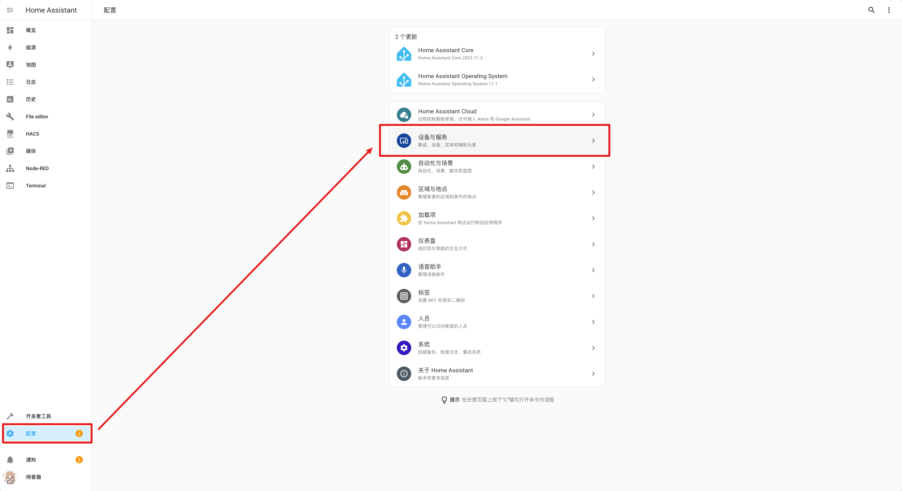
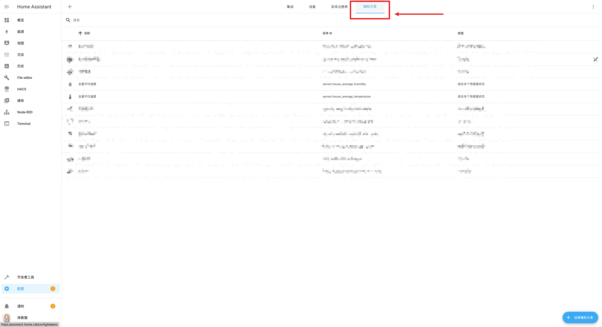
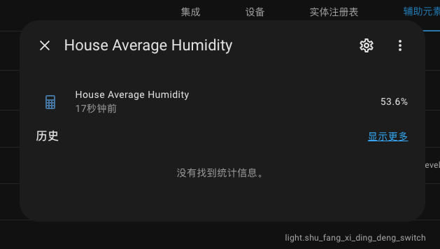

---
tags:
  - 开源/软件/Home-Assistant
  - 开源/软件/Home-Assistant/HASS
  - 物联网/智能家居/Home-Assistant/HASS
  - 物联网/智能家居/Home-Assistant
---
# 如何创建一个平均传感器

很简单，跟随下面的步骤来一起创建一个「全屋平均湿度」吧！

点击右手边 Tab 栏的「配置」，然后点选「设备与服务」

然后在新的视图的顶端找到「辅助元素」的 Tab，点选来切换到辅助元素即可创建。

接下来点击右下角的「+ 创建辅助元素」，就可以进入到辅助元素的创建引导选单了，这个时候点击「结合多个传感器状态」：

然后

1. 在标题中输入你喜欢的名字，我不喜欢 Home Assistant 的拼音转写，所以我会把名称写成全英文的，然后再在创建之后修改实体的 friendly name（人类友好名称）作为实际展示的名称，这里为了方便大家理解，就先填写中文的占个坑
2. 在下面的实体列表中搜索你希望添加进去的传感器实体
3. 在「统计项」中选择「平均值」
4. 精度可以自行设置，因为这里做的是湿度的平均值，所以精度一般不会太高，我选择精度为 1，也就是保留一位小数

点击右下角的提交之后就可以在之前的辅助元素 Tab 下面的视图看到新创建的实体了，点击之后就可以看到统计出来的数值。

正如之前所说，我希望修改一下展示名称，方便大家直接阅读和查找，所以可以点击右上角的齿轮 ⚙️ 图标，然后进入编辑器：

在「名称」一栏输入你喜欢的名称，最后点击更新就大功告成了！

