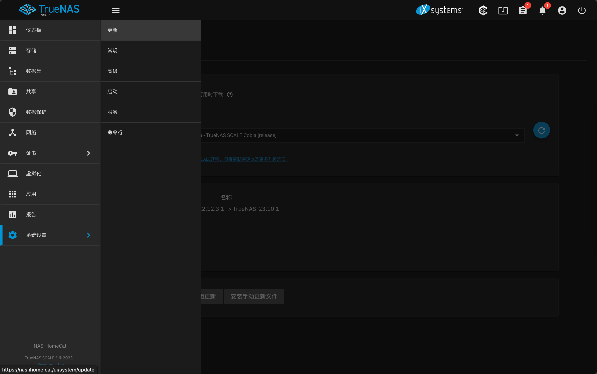
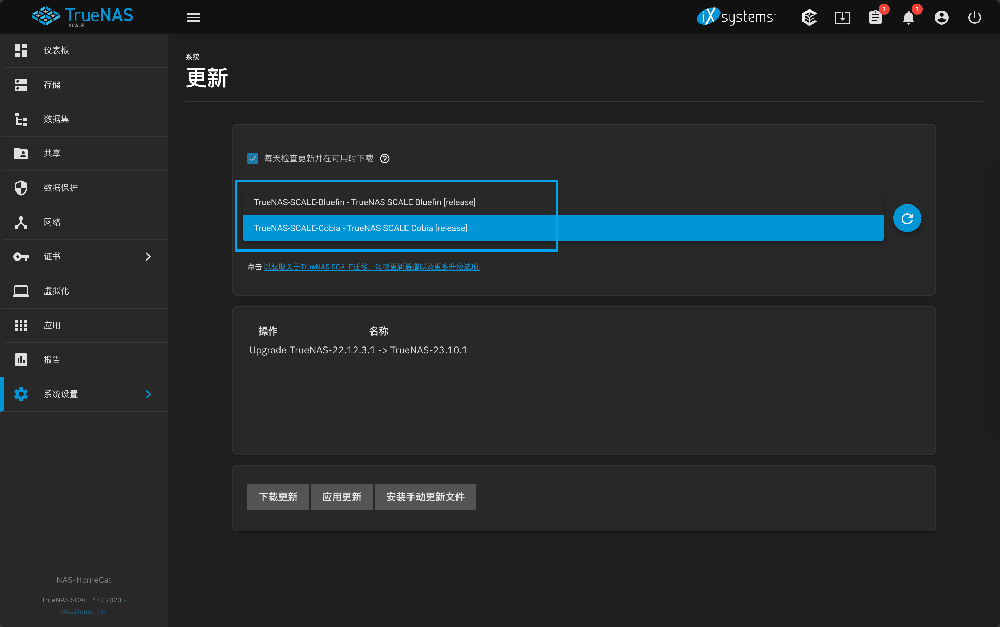
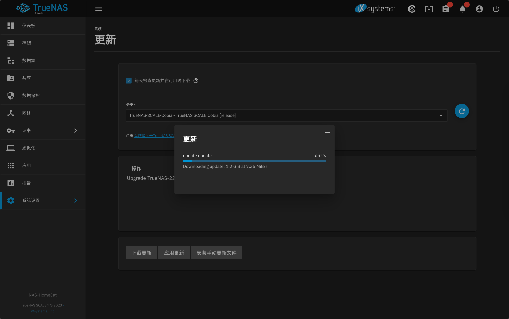

---
tags:
  - 基础设施/Homelab
  - 基础设施/Homelab/NAS
  - 软件/TrueNAS-SCALE
  - 软件/TrueNAS
  - 运维/云原生/Kubernetes
  - 运维/云原生/Kubernetes/K3s
  - 计算机/信息技术/安全
  - 命令行/kubectl
  - 软件/云原生/kubectl
---

# TrueNAS SCALE 发行版本 Bluefin 在更新 TrueCharts 应用时遭遇错误

## 第一次更新之后遇到的错误

### 错误详情

升级 TrueNAS SCALE 的应用（K3s Chart App）的时候遇到了这样的错误：

```txt
CallError: [EFAULT] Failed to upgrade chart release: Error: UPGRADE FAILED: template: scrutiny/templates/common.yaml:1:3: executing "scrutiny/templates/common.yaml" at <include "tc.v1.common.loader.all" .>: error calling include: template: scrutiny/charts/common/templates/loader/_all.tpl:6:6: executing "tc.v1.common.loader.all" at <include "tc.v1.common.loader.apply" .>: error calling include: template: scrutiny/charts/common/templates/loader/_apply.tpl:47:6: executing "tc.v1.common.loader.apply" at <include "tc.v1.common.spawner.pvc" .>: error calling include: template: scrutiny/charts/common/templates/spawner/_pvc.tpl:25:10: executing "tc.v1.common.spawner.pvc" at <include "tc.v1.common.lib.persistence.validation" (dict "rootCtx" $ "objectData" $objectData)>: error calling include: template: scrutiny/charts/common/templates/lib/storage/_validation.tpl:18:43: executing "tc.v1.common.lib.persistence.validation" at <$objectData.static.mode>: nil pointer evaluating interface {}.mode
```

看着密密麻麻，但是实际上最关键的错误是这个：

```txt
executing "tc.v1.common.lib.persistence.validation" at <$objectData.static.mode>: nil pointer evaluating interface {}.mode
```

查了一下资料之后发现 TrueNAS 社区有人提到了： [Help on yaml:1:3: executing ?? | TrueNAS Community](https://www.truenas.com/community/threads/help-on-yaml-1-3-executing.115091/) 这是因为安装的应用正在升级到的最新版本的、所依赖的 TrueCharts 已经不再支持 Bluefin，只支持 Cobia，需要更新 TrueNAS SCALE 到 Cobia 发行才行。

### 修复 `nil pointer evaluating interface {}.mode` 错误

导航到 TrueNAS 的「系统设置」，然后点选「更新」：



在更新频道下拉框中选择现在最新的 TrueNAS SCALE 发行版「Cobia」将 Bluefin 更新到 Cobia：



更新完成之后再次前往左侧的「应用」选单即可：



## 更新为 Cobia 之后的 K3s 应用错误

更新之后的 TrueNAS SCALE 大变样了，看他们改造了很多应用（K3s）相关的界面和使用体验。

更新之后再次检查「应用」选单可以发现应用会出现卡在「Deploying（正在部署）」的状态里面，如果看右边的 Kubernetes 事件列表或者直接通过命令行 `describe deployment`，会发现提示说：

```shell
MountVolume.SetUp failed for volume "pvc-9062b24f-39e7-4809-bb4e-58c73bfdf052" : kubernetes.io/csi: mounter.SetUpAt failed to get CSI client: driver name zfs.csi.openebs.io not found in the list of registered CSI drivers
```

```shell
Warning  FailedMount  77s (x25 over 80s)  kubelet            MountVolume.SetUp failed for volume "pvc-9062b24f-39e7-4809-bb4e-58c73bfdf052" : kubernetes.io/csi: mounter.SetUpAt failed to get CSI client: driver name zfs.csi.openebs.io not found in the list of registered CSI drivers
```

这个提示是说应用（K3s）引用的 PVC（持久卷申领）对应的 CSI（容器存储接口） `zfs.csi.openebs.io` 不存在了，虽然我还没有具体调查原因，但是推测是因为 CSI 的名字更新了，所以导致了这样的问题，可以通过更新 TrueCharts 来解决这个问题。

在应用列表中选择更新应用，然后选择最新版本的 TrueCharts 点选更新，更新之后应该就没有问题了。
