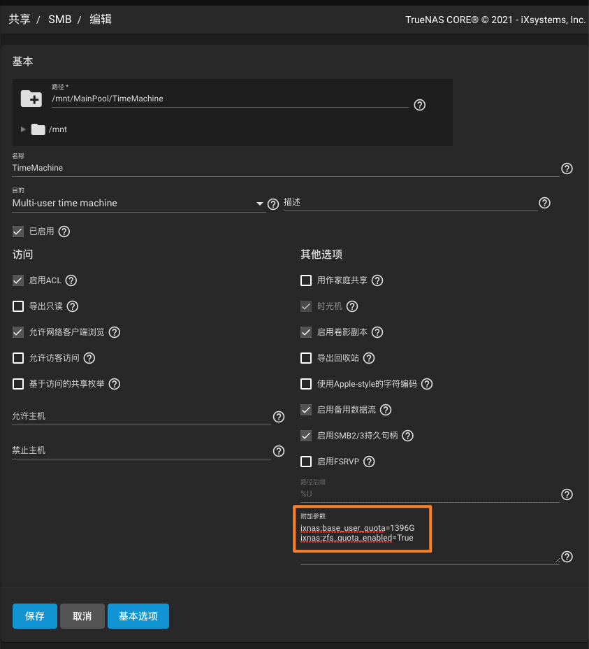

---
tags:
  - 软件/TrueNAS
  - 基础设施/Homelab/NAS
  - 基础设施/NAS
  - 基础设施/Homelab
  - 计算机/网络/协议/SMB
  - 软件/TrueNAS-SCALE
---

# 设置 SMB 共享配额

**适用版本:** `TrueNAS-12.0-U6.1`

共享 -> Windows共享（SMB）

1. 找到你要设置配额的共享 Samba，点击右侧的三个点，点击编辑
2. 在打开的设置中点选 **高级选项**
3. 在附加参数中添加如下配置

```txt
ixnas:base_user_quota=<容量，例如 100G｜100T｜100M >
ixnas:zfs_quota_enabled=True
```

4. 保存设置


