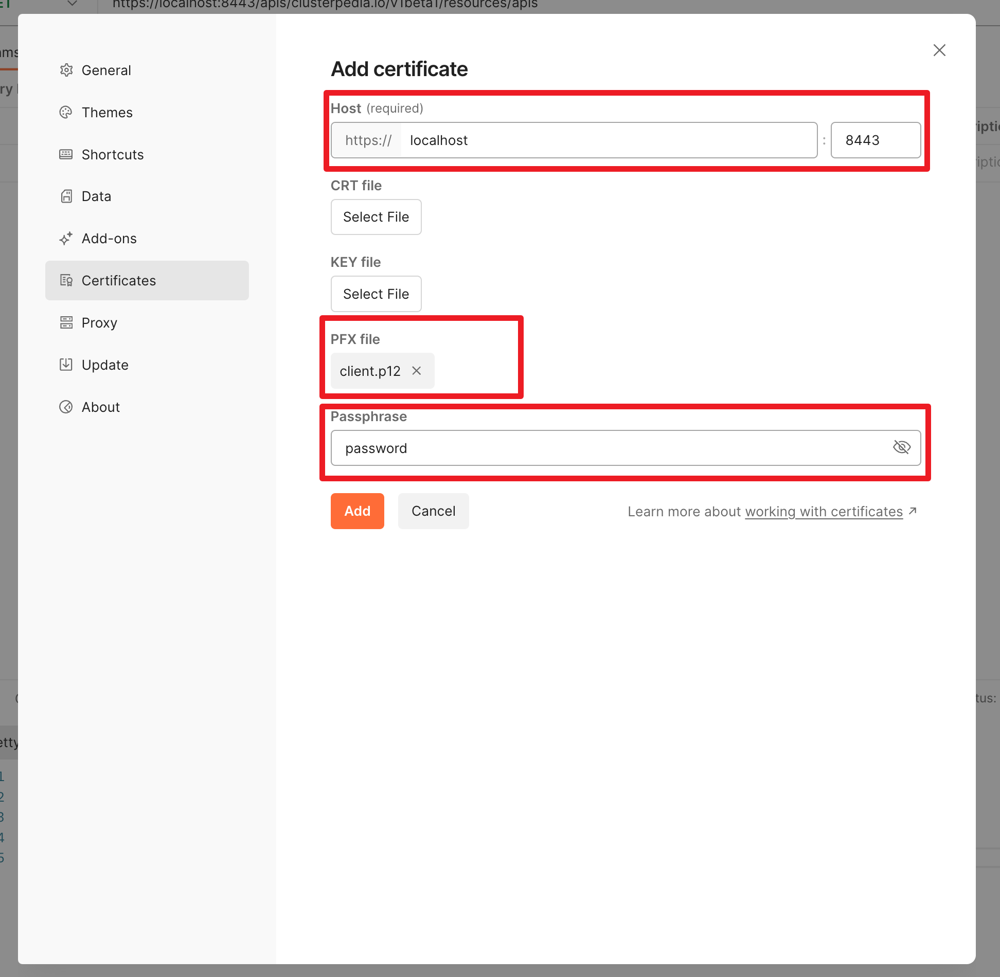

---
tags:
  - 开发/云原生/Kubernetes
  - 开发/云原生/Kubernetes/K8s
  - 开发/云原生/Kubernetes/Clusterpedia
  - 开源/软件/Clusterpedia
  - 开发
  - 命令行
  - 命令行/终端
  - 开发/语言/Golang
  - 命令行/go
  - 命令行/make
  - 命令行/curl
  - 命令行/openssl
  - 数学/密码学/证书/TLS/mTLS
  - 数学/密码学/证书/证书机构/CA
  - 数学/密码学/证书/TLS
  - 开发/Git
  - 命令行/git
  - 命令行/kubectl
  - 软件/云原生/kubectl
---
# 如何开发和测试 Clusterpedia

## 准备工作

### 准备 apiserver 之后通信的时候使用的 mTLS 证书

根据文档 [kubernetes/sample-apiserver: Reference implementation of an apiserver for a custom Kubernetes API.](https://github.com/kubernetes/sample-apiserver#running-it-stand-alone) 来做一些本地的 Clusterpedia API Server 启动前的准备：

#### 创建 CA

```shell
openssl req -nodes -new -x509 -keyout ca.key -out ca.crt
```

#### 创建客户端证书

```shell
openssl req -out client.csr -new -newkey rsa:4096 -nodes -keyout client.key -subj "/CN=development/O=system:masters"
```

#### 签发客户端证书

```shell
openssl x509 -req -days 365 -in client.csr -CA ca.crt -CAkey ca.key -set_serial 01 -sha256 -out client.crt
```

#### 打包客户端证书为 p12 证书

```shell
openssl pkcs12 -export -in ./client.crt -inkey ./client.key -out client.p12 -passout pass:password
```

### 准备 apiserver 测试时使用的临时数据库

本地测试的话，可以用 SQLite 来作为数据持久化：

```yaml
type: sqlite
dsn: file:test.db
lg:
  stdout: true
  color: true
  slowThreshold: 100ms
```

### 使用 kind 创建测试用的集群

```shell
kind create cluster
```

### 部署一个 Hello World 工作负载方便之后测试

```shell
kubectl create deployment hello-node --image=registry.k8s.io/e2e-test-images/agnhost:2.39 -- /agnhost netexec --http-port=8080
```

### 在希望测试的集群中创建 Namespace

在开始之后的步骤之前，我们还需要在测试的集群中创建一下 `clusterpedia-system` Namespace：

```shell
kubectl apply -f https://raw.githubusercontent.com/clusterpedia-io/clusterpedia/main/deploy/clusterpedia_namespace.yaml
```

### 在希望测试的集群中应用 CRD

Clusterpedia 用到了 `ClusterSyncResources` 和 `PediaCluster` 两种自定义资源类型，你需要通过

```shell
kubectl apply -f https://raw.githubusercontent.com/clusterpedia-io/clusterpedia/main/kustomize/crds/cluster.clusterpedia.io_clustersyncresources.yaml
```

和

```shell
kubectl apply -f https://raw.githubusercontent.com/clusterpedia-io/clusterpedia/main/kustomize/crds/cluster.clusterpedia.io_pediaclusters.yaml
```

分别为他们创建，创建之后再次使用

```shell
kubectl get crd
```

就可以看到 Clusterpedia 相关的 CRD 资源了：

```shell
❯ kubectl get crd
NAME                                           CREATED AT
clustersyncresources.cluster.clusterpedia.io   2023-11-27T04:22:46Z
pediaclusters.cluster.clusterpedia.io          2023-11-27T04:22:53Z
```

当然你也可以通过

```shell
kubectl api-resources
```

来找到他们，就像这样：

```shell
❯ kubectl api-resources
NAME                              SHORTNAMES   APIVERSION                             NAMESPACED   KIND
bindings                                       v1                                     true         Binding
componentstatuses                 cs           v1                                     false        ComponentStatus
configmaps                        cm           v1                                     true         ConfigMap
endpoints                         ep           v1                                     true         Endpoints
events                            ev           v1                                     true         Event
limitranges                       limits       v1                                     true         LimitRange
namespaces                        ns           v1                                     false        Namespace
nodes                             no           v1                                     false        Node
persistentvolumeclaims            pvc          v1                                     true         PersistentVolumeClaim
persistentvolumes                 pv           v1                                     false        PersistentVolume
pods                              po           v1                                     true         Pod
podtemplates                                   v1                                     true         PodTemplate
replicationcontrollers            rc           v1                                     true         ReplicationController
resourcequotas                    quota        v1                                     true         ResourceQuota
secrets                                        v1                                     true         Secret
serviceaccounts                   sa           v1                                     true         ServiceAccount
services                          svc          v1                                     true         Service
mutatingwebhookconfigurations                  admissionregistration.k8s.io/v1        false        MutatingWebhookConfiguration
validatingwebhookconfigurations                admissionregistration.k8s.io/v1        false        ValidatingWebhookConfiguration
customresourcedefinitions         crd,crds     apiextensions.k8s.io/v1                false        CustomResourceDefinition
apiservices                                    apiregistration.k8s.io/v1              false        APIService
controllerrevisions                            apps/v1                                true         ControllerRevision
daemonsets                        ds           apps/v1                                true         DaemonSet
deployments                       deploy       apps/v1                                true         Deployment
replicasets                       rs           apps/v1                                true         ReplicaSet
statefulsets                      sts          apps/v1                                true         StatefulSet
tokenreviews                                   authentication.k8s.io/v1               false        TokenReview
localsubjectaccessreviews                      authorization.k8s.io/v1                true         LocalSubjectAccessReview
selfsubjectaccessreviews                       authorization.k8s.io/v1                false        SelfSubjectAccessReview
selfsubjectrulesreviews                        authorization.k8s.io/v1                false        SelfSubjectRulesReview
subjectaccessreviews                           authorization.k8s.io/v1                false        SubjectAccessReview
horizontalpodautoscalers          hpa          autoscaling/v2                         true         HorizontalPodAutoscaler
cronjobs                          cj           batch/v1                               true         CronJob
jobs                                           batch/v1                               true         Job
certificatesigningrequests        csr          certificates.k8s.io/v1                 false        CertificateSigningRequest
clustersyncresources                           cluster.clusterpedia.io/v1alpha2       false        ClusterSyncResources # [!code focus]
pediaclusters                                  cluster.clusterpedia.io/v1alpha2       false        PediaCluster # [!code focus]
leases                                         coordination.k8s.io/v1                 true         Lease
endpointslices                                 discovery.k8s.io/v1                    true         EndpointSlice
events                            ev           events.k8s.io/v1                       true         Event
flowschemas                                    flowcontrol.apiserver.k8s.io/v1beta3   false        FlowSchema
prioritylevelconfigurations                    flowcontrol.apiserver.k8s.io/v1beta3   false        PriorityLevelConfiguration
ingressclasses                                 networking.k8s.io/v1                   false        IngressClass
ingresses                         ing          networking.k8s.io/v1                   true         Ingress
networkpolicies                   netpol       networking.k8s.io/v1                   true         NetworkPolicy
runtimeclasses                                 node.k8s.io/v1                         false        RuntimeClass
poddisruptionbudgets              pdb          policy/v1                              true         PodDisruptionBudget
clusterrolebindings                            rbac.authorization.k8s.io/v1           false        ClusterRoleBinding
clusterroles                                   rbac.authorization.k8s.io/v1           false        ClusterRole
rolebindings                                   rbac.authorization.k8s.io/v1           true         RoleBinding
roles                                          rbac.authorization.k8s.io/v1           true         Role
priorityclasses                   pc           scheduling.k8s.io/v1                   false        PriorityClass
csidrivers                                     storage.k8s.io/v1                      false        CSIDriver
csinodes                                       storage.k8s.io/v1                      false        CSINode
csistoragecapacities                           storage.k8s.io/v1                      true         CSIStorageCapacity
storageclasses                    sc           storage.k8s.io/v1                      false        StorageClass
volumeattachments                              storage.k8s.io/v1                      false        VolumeAttachment
```

## 构建和启动 Clusterpedia `apiserver`

### 构建

通过 `make` 来执行构建

```shell
make apiserver
```

如果遭遇了

```shell
fatal: No names found, cannot describe anything.
```

也可以考虑原地创建一个 `git tag`

```shell
git tag -a v0.0.0 -m "test: v0.0.0"
```

如果希望删掉的话

```shell
git tag -D v0.0.0
```

### 启动

现在可以开启 `apiserver` 了

```shell
./bin/apiserver \
	--secure-port 8443 \
	--storage-config sqlite.yaml --v=7 \
	--client-ca-file ca.crt \
	--kubeconfig ~/.kube/config \
	--authentication-kubeconfig ~/.kube/config \
	--authorization-kubeconfig ~/.kube/config
```

### 测试连接

由于集群本身的测试还需要另一个 Clusterpedia 组件参与，接下来我们先试试看能不能通过 `/apis/clusterpedia.io/v1beta1/resources/version` 接口获取到版本相关的信息吧。

#### 使用 `curl` 来测试 Clusterpedia 的 `apiserver` 是否正常运作

然后你可以先用 curl 尝试调用一下接口看看是否正常

```shell
curl -fv -k --cert-type P12 --cert client.p12:password \
   https://localhost:8443/apis/clusterpedia.io/v1beta1/resources/version
```

比如这样：

```shell
❯ curl  -k --cert-type P12 --cert client.p12:password \
   https://localhost:8443/apis/clusterpedia.io/v1beta1/resources/version
{
  "major": "",
  "minor": "",
  "gitVersion": "v0.0.0-master+$Format:%H$",
  "gitCommit": "$Format:%H$",
  "gitTreeState": "",
  "buildDate": "1970-01-01T00:00:00Z",
  "goVersion": "go1.20.11",
  "compiler": "gc",
  "platform": "darwin/arm64"
}%
```

当然，想要使用 Postman 直接测试请求也可以，但是需要一些额外的配置步骤，请参见下文。

#### 使用 Postman 来测试 Clusterpedia 的 `apiserver` 是否正常运作

首先我们需要把我们在[准备 apiserver 之后通信的时候使用的 mTLS 证书](#准备-apiserver-之后通信的时候使用的-mtls-证书)步骤中的 P12 证书包配置到 Postman 中。

在 macOS 上的 Postman 进行这样的配置的时候，首先在菜单栏中的 Postman 中点选「Settings...（设置...）」来打开设置界面。

然后在如下图所示的配置界面中的左侧找到「Certificates（证书）」，点选后在右手侧的「Client cetificates（客户端证书）」部分中点选「Add Certificate...（添加证书...）」来配置证书。


接下来填写参数：

- Host 需要填写我们开发和测试的时候 Clusterpedia `apiserver` 所在的 IP，本地开发测试的话填写 `localhsot` 就好了，端口填写我们上一步启动 `apiserver` 的时候传递的参数 `--secure-port 8443` 的 `8443` 作为端口号。
- PFX File 需要点选并选中我们生成的 `client.p12` 证书文件
- Passphrase 需要填写我们在[准备 apiserver 之后通信的时候使用的 mTLS 证书](#准备-apiserver-之后通信的时候使用的-mtls-证书)步骤中给 `openssl` 传递的参数 `-passout pass:password` 的 `password` 字面量。



接下来新建一个请求，并且填写上我们之前使用 `curl` 去测试的时候请求的一模一样的 URL 去发送 GET 请求之后就能看到返回值了：


## 构建和启动 Clusterpedia `clustersynchro-manager`

如果你刚才试着去通过

```
/apis/clusterpedia.io/v1beta1/resources/apis/apps/v1/deployments
```

这个接口尝试请求访问 Kubernetes 当前集群中的 Deployments 的工作负载的话，你可能会发现服务器返回了 404 Not Found 的错误，这是因为 Clusterpedia 的 `apiserver` 组件并不会在启动之后自动遍历并且更新当前集群内已经存在的资源到 Clusterpedia 下属的数据持久化层，我们需要引入另一个名为

```
clustersynchro-manager
```

的组件才能完成数据的同步和写入。

### 构建

使用下面的命令就能通过 `make` 来执行 `clustersynchro-manager` 组件的构建：

```shell
make clustersynchro-manager
```

### 启动

```shell
./bin/clustersynchro-manager \
	--storage-config=./sqlite.yaml \
	--kubeconfig ~/.kube/config \
	--feature-gates="AllowSyncAllCustomResources=true"
```

### 创建 `PediaCluster` 资源

我们先在终端中执行

```shell
cat ~/.kube/config | base64
```

来将 Clusterpedia `clustersynchro-manager` 组件用于访问集群的 `kubectl` 配置文件编码为 `base64` 之后复制一下；

如果你使用的是 macOS，也可以通过下面的命令一步到位

```shell
cat ~/.kube/config | base64 | pbcopy
```

接下来我们创建一个用于部署 PediaCluster 的文件：

```shell
nvim pediacluster.yaml
```

往里面写入下面的内容

```yaml
apiVersion: cluster.clusterpedia.io/v1alpha2
kind: PediaCluster
metadata:
  name: cluster-example # 按需修改 # [!code hl]
spec:
  apiserver: "https://localhost:8443" # Kubernetes 集群 apiserver 的服务地址 # [!code hl]
  kubeconfig: <base64 编码的 kubeconfig 文件内容>  # [!code hl]
  caData:
  tokenData:
  certData:
  keyData:
  syncResources:  # [!code hl]
  - group: apps  # [!code hl]
    resources:  # [!code hl]
     - deployments  # [!code hl]
```

需要注意的是，我们必须在 `spec.syncResources` 中添加我们希望 Clusterpedia 的 `clustersynchro-manager` 的资源类型和分组才能让 `clustersynchro-manager` 正常工作：

```yaml
apiVersion: cluster.clusterpedia.io/v1alpha2
kind: PediaCluster
metadata:
  name: cluster-example # 按需修改
spec:
  apiserver: "https://localhost:8443" # Kubernetes 集群 apiserver 的服务地址
  kubeconfig: <base64 编码的 kubeconfig 文件内容>
  caData:
  tokenData:
  certData:
  keyData:
  syncResources:  # [!code focus]
  - group: apps  # [!code focus]
    resources:  # [!code focus]
     - deployments  # [!code focus]
```

有关 `spec.syncResources` 的更多信息，可以到 [Synchronize Cluster Resources | Clusterpedia.io](https://clusterpedia.io/docs/usage/sync-resources/) 文档中阅读了解。

然后执行

```shell
kubectl apply -f pediacluster.yaml
```

就可以应用和创建 `PediaCluster` 资源了。

这个时候我们可以通过

```shell
kubectl get pediacluster
```

来观察是否完成索引，就像这样：

```shell
❯ kubectl get pediacluster
NAME              READY   VERSION   APISERVER
cluster-example   False   v1.27.3   https://127.0.0.1:61487
```

可以注意关注一下 `READY` 字段的状态，只有为 `true` 的时候才代表资源都被遍历和索引完毕，就像这样：

```shell
❯ kubectl get pediacluster
NAME              READY   VERSION   APISERVER
cluster-example   True    v1.27.3   https://127.0.0.1:61487
```

### 检查数据库

接下来我们使用任意偏好的数据库管理工具来观察 SQLite 之后就可以看到下面的数据了：

|id                                                                                                                                                                                                 |group|version|resource        |kind                                  |cluster        |namespace         |name                  |owner_uid|uid                 |resource_version|object      |created_at               |synced_at                       |deleted_at|
|---------------------------------------------------------------------------------------------------------------------------------------------------------------------------------------------------|-----|-------|----------------|--------------------------------------|---------------|------------------|----------------------|---------|--------------------|----------------|------------|-------------------------|--------------------------------|----------|
|1                                                                                                                                                                                                  |apps |v1     |deployments     |Deployment                            |cluster-example|default           |hello-node            |         |b10236b0-429a-4739-a384-84f19ee6b092|514             |{"apiVersion":"apps/v1","kind":"Deployment","metadata":{"annotations":{"deployment.kubernetes.io/revision":"1","shadow.clusterpedia.io/cluster-name":"cluster-example"},"creationTimestamp":"2023-11-27T03:32:06Z","generation":1,"labels":{"app":"hello-node"},"name":"hello-node","namespace":"default","resourceVersion":"514","uid":"b10236b0-429a-4739-a384-84f19ee6b092"},"spec":{"progressDeadlineSeconds":600,"replicas":1,"revisionHistoryLimit":10,"selector":{"matchLabels":{"app":"hello-node"}},"strategy":{"rollingUpdate":{"maxSurge":"25%","maxUnavailable":"25%"},"type":"RollingUpdate"},"template":{"metadata":{"creationTimestamp":null,"labels":{"app":"hello-node"}},"spec":{"containers":[{"command":["/agnhost","netexec","--http-port=8080"],"image":"registry.k8s.io/e2e-test-images/agnhost:2.39","imagePullPolicy":"IfNotPresent","name":"agnhost","resources":{},"terminationMessagePath":"/dev/termination-log","terminationMessagePolicy":"File"}],"dnsPolicy":"ClusterFirst","restartPolicy":"Always","schedulerName":"default-scheduler","securityContext":{},"terminationGracePeriodSeconds":30}}},"status":{"availableReplicas":1,"conditions":[{"lastTransitionTime":"2023-11-27T03:32:18Z","lastUpdateTime":"2023-11-27T03:32:18Z","message":"Deployment has minimum availability.","reason":"MinimumReplicasAvailable","status":"True","type":"Available"},{"lastTransitionTime":"2023-11-27T03:32:06Z","lastUpdateTime":"2023-11-27T03:32:18Z","message":"ReplicaSet \"hello-node-7579565d66\" has successfully progressed.","reason":"NewReplicaSetAvailable","status":"True","type":"Progressing"}],"observedGeneration":1,"readyReplicas":1,"replicas":1,"updatedReplicas":1}} |2023-11-27 11:32:06+08:00|2023-11-27 13:49:39.992135+08:00|          |
|2                                                                                                                                                                                                  |apps |v1     |deployments     |Deployment                            |cluster-example|kube-system       |coredns               |         |baa17931-92c2-46dd-937a-6f78b2208431|440             |{"apiVersion":"apps/v1","kind":"Deployment","metadata":{"annotations":{"deployment.kubernetes.io/revision":"1","shadow.clusterpedia.io/cluster-name":"cluster-example"},"creationTimestamp":"2023-11-27T03:31:09Z","generation":1,"labels":{"k8s-app":"kube-dns"},"name":"coredns","namespace":"kube-system","resourceVersion":"440","uid":"baa17931-92c2-46dd-937a-6f78b2208431"},"spec":{"progressDeadlineSeconds":600,"replicas":2,"revisionHistoryLimit":10,"selector":{"matchLabels":{"k8s-app":"kube-dns"}},"strategy":{"rollingUpdate":{"maxSurge":"25%","maxUnavailable":1},"type":"RollingUpdate"},"template":{"metadata":{"creationTimestamp":null,"labels":{"k8s-app":"kube-dns"}},"spec":{"affinity":{"podAntiAffinity":{"preferredDuringSchedulingIgnoredDuringExecution":[{"podAffinityTerm":{"labelSelector":{"matchExpressions":[{"key":"k8s-app","operator":"In","values":["kube-dns"]}]},"topologyKey":"kubernetes.io/hostname"},"weight":100}]}},"containers":[{"args":["-conf","/etc/coredns/Corefile"],"image":"registry.k8s.io/coredns/coredns:v1.10.1","imagePullPolicy":"IfNotPresent","livenessProbe":{"failureThreshold":5,"httpGet":{"path":"/health","port":8080,"scheme":"HTTP"},"initialDelaySeconds":60,"periodSeconds":10,"successThreshold":1,"timeoutSeconds":5},"name":"coredns","ports":[{"containerPort":53,"name":"dns","protocol":"UDP"},{"containerPort":53,"name":"dns-tcp","protocol":"TCP"},{"containerPort":9153,"name":"metrics","protocol":"TCP"}],"readinessProbe":{"failureThreshold":3,"httpGet":{"path":"/ready","port":8181,"scheme":"HTTP"},"periodSeconds":10,"successThreshold":1,"timeoutSeconds":1},"resources":{"limits":{"memory":"170Mi"},"requests":{"cpu":"100m","memory":"70Mi"}},"securityContext":{"allowPrivilegeEscalation":false,"capabilities":{"add":["NET_BIND_SERVICE"],"drop":["all"]},"readOnlyRootFilesystem":true},"terminationMessagePath":"/dev/termination-log","terminationMessagePolicy":"File","volumeMounts":[{"mountPath":"/etc/coredns","name":"config-volume","readOnly":true}]}],"dnsPolicy":"Default","nodeSelector":{"kubernetes.io/os":"linux"},"priorityClassName":"system-cluster-critical","restartPolicy":"Always","schedulerName":"default-scheduler","securityContext":{},"serviceAccount":"coredns","serviceAccountName":"coredns","terminationGracePeriodSeconds":30,"tolerations":[{"key":"CriticalAddonsOnly","operator":"Exists"},{"effect":"NoSchedule","key":"node-role.kubernetes.io/control-plane"}],"volumes":[{"configMap":{"defaultMode":420,"items":[{"key":"Corefile","path":"Corefile"}],"name":"coredns"},"name":"config-volume"}]}}},"status":{"availableReplicas":2,"conditions":[{"lastTransitionTime":"2023-11-27T03:31:28Z","lastUpdateTime":"2023-11-27T03:31:28Z","message":"Deployment has minimum availability.","reason":"MinimumReplicasAvailable","status":"True","type":"Available"},{"lastTransitionTime":"2023-11-27T03:31:24Z","lastUpdateTime":"2023-11-27T03:31:37Z","message":"ReplicaSet \"coredns-5d78c9869d\" has successfully progressed.","reason":"NewReplicaSetAvailable","status":"True","type":"Progressing"}],"observedGeneration":1,"readyReplicas":2,"replicas":2,"updatedReplicas":2}} |2023-11-27 11:31:09+08:00|2023-11-27 13:49:39.994086+08:00|          |
|3                                                                                                                                                                                                  |apps |v1     |deployments     |Deployment                            |cluster-example|local-path-storage|local-path-provisioner|         |3da939ee-e549-4bf9-902d-3a4732374f9b|417             |{"apiVersion":"apps/v1","kind":"Deployment","metadata":{"annotations":{"deployment.kubernetes.io/revision":"1","shadow.clusterpedia.io/cluster-name":"cluster-example"},"creationTimestamp":"2023-11-27T03:31:11Z","generation":1,"name":"local-path-provisioner","namespace":"local-path-storage","resourceVersion":"417","uid":"3da939ee-e549-4bf9-902d-3a4732374f9b"},"spec":{"progressDeadlineSeconds":600,"replicas":1,"revisionHistoryLimit":10,"selector":{"matchLabels":{"app":"local-path-provisioner"}},"strategy":{"rollingUpdate":{"maxSurge":"25%","maxUnavailable":"25%"},"type":"RollingUpdate"},"template":{"metadata":{"creationTimestamp":null,"labels":{"app":"local-path-provisioner"}},"spec":{"containers":[{"command":["local-path-provisioner","--debug","start","--helper-image","docker.io/kindest/local-path-helper:v20230510-486859a6","--config","/etc/config/config.json"],"env":[{"name":"POD_NAMESPACE","valueFrom":{"fieldRef":{"apiVersion":"v1","fieldPath":"metadata.namespace"}}}],"image":"docker.io/kindest/local-path-provisioner:v20230511-dc714da8","imagePullPolicy":"IfNotPresent","name":"local-path-provisioner","resources":{},"terminationMessagePath":"/dev/termination-log","terminationMessagePolicy":"File","volumeMounts":[{"mountPath":"/etc/config/","name":"config-volume"}]}],"dnsPolicy":"ClusterFirst","nodeSelector":{"kubernetes.io/os":"linux"},"restartPolicy":"Always","schedulerName":"default-scheduler","securityContext":{},"serviceAccount":"local-path-provisioner-service-account","serviceAccountName":"local-path-provisioner-service-account","terminationGracePeriodSeconds":30,"tolerations":[{"effect":"NoSchedule","key":"node-role.kubernetes.io/control-plane","operator":"Equal"},{"effect":"NoSchedule","key":"node-role.kubernetes.io/master","operator":"Equal"}],"volumes":[{"configMap":{"defaultMode":420,"name":"local-path-config"},"name":"config-volume"}]}}},"status":{"availableReplicas":1,"conditions":[{"lastTransitionTime":"2023-11-27T03:31:28Z","lastUpdateTime":"2023-11-27T03:31:28Z","message":"Deployment has minimum availability.","reason":"MinimumReplicasAvailable","status":"True","type":"Available"},{"lastTransitionTime":"2023-11-27T03:31:24Z","lastUpdateTime":"2023-11-27T03:31:28Z","message":"ReplicaSet \"local-path-provisioner-6bc4bddd6b\" has successfully progressed.","reason":"NewReplicaSetAvailable","status":"True","type":"Progressing"}],"observedGeneration":1,"readyReplicas":1,"replicas":1,"updatedReplicas":1}} |2023-11-27 11:31:11+08:00|2023-11-27 13:49:39.994794+08:00|          |

到这里就结束啦！
## 错误排查

### 在启动 `clustersynchro-manager` 的时候遭遇了报错 `error initially creating leader election record: namespaces "clusterpedia-system" not found`

请确保你完成了[在希望测试的集群中创建 Namespace](在希望测试的集群中创建-namespace) 步骤中对 `clusterpedia-system` Namespace 的创建。
